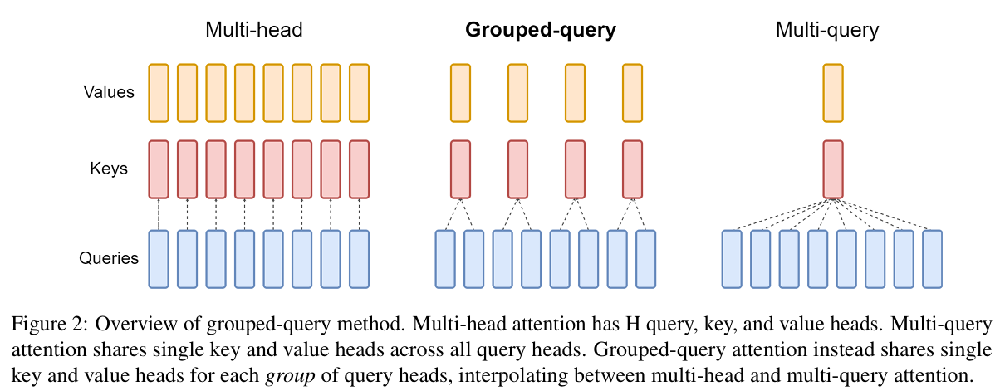
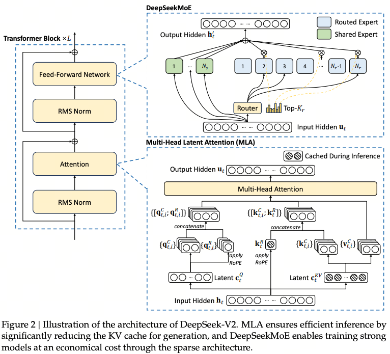
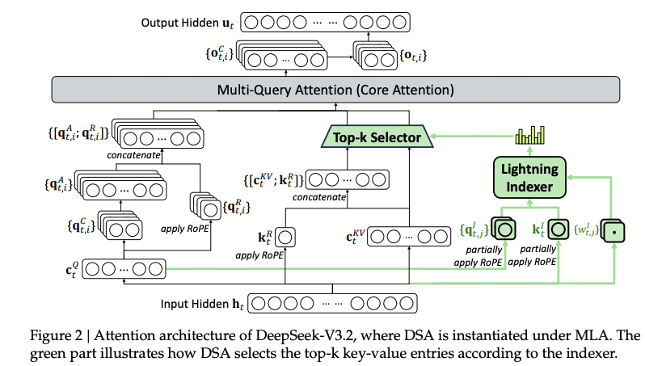

- [LLM中的注意力机制](#llm中的注意力机制)
  - [1. Scaled Dot-Product Attention：注意力机制的基石](#1-scaled-dot-product-attention注意力机制的基石)
  - [2. Multi-Head Attention (MHA)：多视角捕捉信息](#2-multi-head-attention-mha多视角捕捉信息)
  - [3. Multi-Query Attention (MQA)：减少键值投影的冗余](#3-multi-query-attention-mqa减少键值投影的冗余)
  - [4. Grouped-Query Attention (GQA)：MHA与MQA的折衷](#4-grouped-query-attention-gqamha与mqa的折衷)
  - [5. Multi-head Latent Attention (MLA)：通过低秩压缩优化KV缓存](#5-multi-head-latent-attention-mla通过低秩压缩优化kv缓存)
    - [位置编码（RoPE）的特殊处理](#位置编码rope的特殊处理)
  - [6. DeepSeek Sparse Attention (DSA)：可学习的稀疏注意力机制](#6-deepseek-sparse-attention-dsa可学习的稀疏注意力机制)
  - [相关结构图](#相关结构图)
  - [总结与展望](#总结与展望)
    - [注意力机制的组合使用](#注意力机制的组合使用)
      - [典型组合方案](#典型组合方案)
      - [主流模型的注意力机制选择对比](#主流模型的注意力机制选择对比)
      - [未来趋势](#未来趋势)

# LLM中的注意力机制

[参考链接](https://blog.csdn.net/weixin_44994341/article/details/147017174)

注意力机制是现代大型语言模型（LLM）的核心组成部分，它使得模型能够聚焦于输入序列中最重要的部分，从而更好地理解上下文和生成高质量的输出。本文将详细介绍注意力机制的演变，从基础的Scaled Dot-Product Attention开始，逐步深入到Multi-Head Attention (MHA)、Multi-Query Attention (MQA)、Grouped-Query Attention (GQA)、Multi-head Latent Attention (MLA) 和 DeepSeek Sparse Attention (DSA)，并分析它们各自的优缺点。

```
                     Multi-head Attention (MHA)
                              ↓
               ┌─────────────┴──────────────┐
         Multi-Query Attention (MQA)     Multi-Head Latent Attention (MLA)
               ↓                                 ↓
        Grouped-Query Attention (GQA)     DeepSeek Sparse Attention (DSA)
                                                 ↓
                                          （MLA + DSA组合）
```

## 1. Scaled Dot-Product Attention：注意力机制的基石

**核心思想：** Scaled Dot-Product Attention（缩放点积注意力）是Transformer模型中引入的最基础的注意力机制。它通过计算查询（Query, Q）和键（Key, K）之间的相似度，然后用这个相似度对值（Value, V）进行加权求和，从而得到注意力输出。

**公式：**
$$
Attention(Q,K,V)=softmax(\frac {QK^T}{\sqrt{d_k}})V
$$

其中：
*   $Q$：查询矩阵，形状为 $(..., L_Q, d_k)$，代表我们想要查询的信息。
*   $K$：键矩阵，形状为 $(..., L_K, d_k)$，代表数据库中可供查询的信息索引。
*   $V$：值矩阵，形状为 $(..., L_K, d_v)$，代表数据库中与键对应的内容。
*   $\sqrt{d_k}$：**缩放因子**，这是关键设计。当 $d_k$ 较大时，点积 $QK^T$ 的值可能会很大，导致Softmax函数进入梯度接近零的饱和区，使得训练困难。除以 $\sqrt{d_k}$ 可以将点积值缩放到合适的范围，防止梯度消失。
*   $QK^T$：计算Q和K之间的相似度（点积）。
*   $softmax$：将相似度转换为注意力权重，确保权重和为1。
*   $mask$（可选，上面的公式中没有体现）：掩码矩阵，用于控制注意力的可见性：
    *   **Padding Mask**：屏蔽填充位置，防止模型关注无意义的padding token
    *   **Causal Mask**（因果掩码）：在自回归模型中，防止当前位置关注未来位置，保证生成的自回归性质

**工作流程：**
1.  **相似度计算：** 计算查询 $Q$ 与所有键 $K$ 的点积，得到一个相似度矩阵。
2.  **缩放：** 将相似度矩阵除以 $\sqrt{d_k}$ 进行缩放。
3.  **归一化：** 对缩放后的相似度矩阵应用Softmax函数，得到注意力权重。
4.  **加权求和：** 将注意力权重与值 $V$ 相乘，得到最终的注意力输出。

**优点：**
*   **简单高效：** 计算过程直观，易于并行化。
*   **捕获长距离依赖：** 能够直接计算序列中任意两个位置之间的关系，有效捕获长距离依赖。

**缺陷：**
*   **单一视角：** 每次注意力计算只使用一组Q、K、V，这意味着它只能从一个“角度”或“方面”来理解输入序列中的关系。对于复杂的语义信息，单一视角可能不足以全面捕捉。
*   **信息损失：** 在某些情况下，单一的注意力头可能无法充分利用输入信息，导致某些重要特征被忽略。

<details>
<summary>Scaled Dot-Product Attention代码实现</summary>

```python
import math
import torch
import torch.nn.functional as F

def scaled_dot_product_attention(Q, K, V, mask=None):
    """
    Q: [batch_size, num_heads, seq_len_q, d_k]
    K: [batch_size, num_heads, seq_len_k, d_k]
    V: [batch_size, num_heads, seq_len_v, d_v]  (seq_len_k == seq_len_v)
    mask: [batch_size, num_heads, seq_len_q, seq_len_k] or None
    """
    d_k = Q.size(-1)
    
    # Step 1: 计算 raw attention scores: Q @ K^T
    scores = torch.matmul(Q, K.transpose(-2, -1)) / math.sqrt(d_k)

    # Step 2: 应用 mask（可选）
    if mask is not None:
        # scores = scores.masked_fill(mask, float('-inf'))  # 尽量不要硬编码成 -inf
        # 确保 mask 为 bool，避免类型不匹配
        if mask.dtype != torch.bool:
            mask = mask.to(torch.bool)
        scores = scores.masked_fill(mask, torch.finfo(scores.dtype).min)

    # Step 3: softmax over key dimension
    attn_weights = F.softmax(scores, dim=-1)

    # Step 4: 加权求和
    output = torch.matmul(attn_weights, V)

    return output, attn_weights


def main():
    batch_size = 2
    num_heads = 4
    seq_len = 5
    d_k = d_v = 8

    Q = torch.rand(batch_size, num_heads, seq_len, d_k)
    K = torch.rand(batch_size, num_heads, seq_len, d_k)
    V = torch.rand(batch_size, num_heads, seq_len, d_v)

    # ✅ 不加 mask（全部可见）
    mask = None

    # ✅ 如果想测试 causal mask，打开下面这段
    # causal_mask = torch.triu(torch.ones(seq_len, seq_len, dtype=torch.bool), diagonal=1)
    # mask = causal_mask.unsqueeze(0).unsqueeze(0).expand(batch_size, num_heads, seq_len, seq_len)

    output, attn_weights = scaled_dot_product_attention(Q, K, V, mask)

    print("output.shape:", output.shape)         # [batch_size, num_heads, seq_len, d_v]    # [2, 4, 5, 8]
    print("attn_weights.shape:", attn_weights.shape)  # [batch_size, num_heads, seq_len, seq_len]    # [2, 4, 5, 5]

if __name__ == '__main__':
    main()
```

</details>

## 2. Multi-Head Attention (MHA)：多视角捕捉信息

参考论文：[Attention Is All You Need](https://arxiv.org/abs/1706.03762)

**核心思想：** 为了解决Scaled Dot-Product Attention的单一视角问题，Multi-Head Attention（多头注意力）被提出。MHA通过将Q、K、V线性投影到多个不同的子空间，然后并行地执行多个Scaled Dot-Product Attention操作，最后将所有头的输出拼接起来并再次进行线性变换，从而允许模型从不同的表示子空间学习信息。

**公式：**
$$
MultiHead(Q, K, V) = Concat(head_1, ..., head_h)W^O
$$
$$
where \quad head_i = Attention(QW_i^Q, KW_i^K, VW_i^V)
$$

其中：
*   $h$：注意力头的数量。
*   $W_i^Q, W_i^K, W_i^V$：第 $i$ 个头的线性投影矩阵。
*   $W^O$：最终的线性投影矩阵，用于将所有头的输出融合。
*   **每个头的维度**：通常设置 $head\_dim = d_{model} / h$，这样拼接后恰好是 $d_{model}$
*   **参数量计算**：MHA的总参数量为 $4 \times d_{model} \times d_{model}$（分别对应 $W^Q, W^K, W^V, W^O$ 四个矩阵）

**工作流程：**
1.  **线性投影：** 将原始的Q、K、V分别通过 $h$ 组不同的线性变换，得到 $h$ 组独立的 $Q_i, K_i, V_i$。
2.  **并行计算：** 对每一组 $Q_i, K_i, V_i$ 并行地执行Scaled Dot-Product Attention，得到 $h$ 个注意力输出 $head_i$。
3.  **拼接与融合：** 将所有 $head_i$ 沿着特征维度拼接起来，然后通过一个最终的线性变换 $W^O$ 得到MHA的输出。

**优点：**
*   **多视角学习：** 允许模型在不同的表示子空间中学习不同的注意力模式，从而捕捉到更丰富、更全面的语义信息。例如，一个头可能关注语法关系，另一个头可能关注语义关系。
*   **增强表达能力：** 提高了模型的表达能力和鲁棒性。

**缺陷：**
*   **计算开销大：** 每个注意力头都需要独立的Q、K、V投影矩阵，并且需要进行独立的点积计算。虽然每个头的维度更小 ($d_k = d_{model}/h$)，但总的计算量和参数量仍然随着头数量的增加而线性增加。
*   **内存占用高：** 存储多个Q、K、V投影矩阵以及中间的注意力矩阵会占用大量内存，尤其是在处理长序列和大型模型时。这在LLM的推理阶段尤为突出，因为KV缓存（Key-Value Cache）会随着序列长度的增加而线性增长，成为内存瓶颈。
*   **冗余计算：** 尽管每个头关注的侧重点不同，但不同头之间可能存在一定的冗余计算，导致效率不高。

<details>
<summary>MHA代码实现</summary>

```python
import torch
import torch.nn as nn
import torch.nn.functional as F
import math

class ScaledDotProductAttention(nn.Module):
    def __init__(self, dropout=0.1):
        super().__init__()
        self.dropout = nn.Dropout(dropout)

    def forward(self, Q, K, V, mask=None):
        d_k = Q.size(-1)
        scores = torch.matmul(Q, K.transpose(-2, -1)) / math.sqrt(d_k)

        if mask is not None:
            # 支持 [B, Lk] / [B, Lq, Lk] / [B, 1, Lq, Lk] / [B, H, Lq, Lk]
            if mask.dtype != torch.bool:
                mask = mask.to(torch.bool)
            if mask.dim() == 2:
                mask = mask[:, None, None, :]
            elif mask.dim() == 3:
                mask = mask[:, None, :, :]
            # 用当前 dtype 能表示的最小值，而不是硬编码 -inf，防止溢出
            # scores = scores.masked_fill(mask, float('-inf'))
            scores = scores.masked_fill(mask, torch.finfo(scores.dtype).min)
        
        # 手动实现 saft softamx（现在都是 torch 标配）
        scores = scores - scores.max(dim=-1, keepdim=True).values

        attn_weights = F.softmax(scores, dim=-1)
        attn_weights = self.dropout(attn_weights)
        output = torch.matmul(attn_weights, V)
        return output, attn_weights


class MultiHeadAttention(nn.Module):
    def __init__(self, embed_dim, num_heads):
        super().__init__()
        assert embed_dim % num_heads == 0, "embed_dim 必须能被 num_heads 整除"

        self.embed_dim = embed_dim
        self.num_heads = num_heads
        self.head_dim = embed_dim // num_heads

        # 线性映射
        self.W_q = nn.Linear(embed_dim, embed_dim)
        self.W_k = nn.Linear(embed_dim, embed_dim)
        self.W_v = nn.Linear(embed_dim, embed_dim)
        self.W_o = nn.Linear(embed_dim, embed_dim)

        self.attention = ScaledDotProductAttention()

    def forward(self, Q, K, V, mask=None):
        batch_size = Q.size(0)

        # 1. 线性映射并 reshape 为多头：[B, H, L, D/H]
        Q = self.W_q(Q).view(batch_size, -1, self.num_heads, self.head_dim).transpose(1, 2)
        K = self.W_k(K).view(batch_size, -1, self.num_heads, self.head_dim).transpose(1, 2)
        V = self.W_v(V).view(batch_size, -1, self.num_heads, self.head_dim).transpose(1, 2)

        # 2. 计算 Attention
        out, attn_weights = self.attention(Q, K, V, mask)  # [B, H, L, D/H]

        # 3. 拼接多个头
        out = out.transpose(1, 2).contiguous().view(batch_size, -1, self.embed_dim)  # [B, L, D]

        # 4. 线性映射回原维度
        out = self.W_o(out)
        return out, attn_weights


def main():
    embed_dim = 32
    num_heads = 4
    seq_len = 10
    batch_size = 2

    mha = MultiHeadAttention(embed_dim=embed_dim, num_heads=num_heads)

    # 输入 shape: [batch, seq_len, embed_dim]
    x = torch.rand(batch_size, seq_len, embed_dim)

    # 可选 mask，形状应为 [batch_size, num_heads, seq_len, seq_len]
    output, attn_weights = mha(x, x, x)

    print("output.shape:", output.shape)          # [batch_size, seq_len, embed_dim]    # [2, 10, 32]
    print("attn_weights.shape:", attn_weights.shape)  # [batch_size, num_heads, seq_len, seq_len]    # [2, 4, 10, 10]


if __name__ == '__main__':
    main()
```

</details>

## 3. Multi-Query Attention (MQA)：减少键值投影的冗余

参考论文：[Fast Transformer Decoding: One Write-Head is All You Need](https://arxiv.org/abs/1911.02150)

**核心思想：** Multi-Query Attention（多查询注意力）旨在解决MHA中K和V投影的冗余问题，特别是为了**减少KV缓存的内存占用**。MQA的核心思想是：**所有注意力头共享同一组K和V投影矩阵（或直接共享K和V），但每个头仍然拥有独立的Q投影矩阵。**

**公式：**
$$
MultiQuery(Q, K, V) = Concat(head_1, ..., head_h)W^O
$$
$$
where \quad head_i = Attention(QW_i^Q, K_{shared}, V_{shared})
$$

其中：
*   $K_{shared} = KW^K$
*   $V_{shared} = VW^V$
*   $W_i^Q$：第 $i$ 个头的独立Q投影矩阵。
*   $W^K, W^V$：共享的K和V投影矩阵。

**工作流程：**
1.  **共享K、V投影：** 原始的K和V只进行一次线性变换，得到共享的 $K_{shared}$ 和 $V_{shared}$。
2.  **独立Q投影：** 原始的Q通过 $h$ 组不同的线性变换，得到 $h$ 组独立的 $Q_i$。
3.  **并行计算：** 对每一组 $Q_i$ 和共享的 $K_{shared}, V_{shared}$ 并行地执行Scaled Dot-Product Attention。
4.  **拼接与融合：** 将所有头的输出拼接并线性变换。

**优点：**
*   **显著减少KV缓存内存占用：** 由于K和V只投影一次，大大减少了存储K和V投影矩阵以及中间K、V的内存需求。这对于大型模型和长序列尤其重要，是解决LLM推理内存瓶颈的关键技术之一。
*   **提高推理速度：** 在推理阶段，K和V的计算和存储是主要的瓶颈。MQA通过共享K和V，减少了这些计算和内存访问，从而显著提升了推理速度。
*   **参数量减少：** 相比MHA，MQA大幅减少了K和V投影矩阵的参数量：
    *   MHA参数量：$4 \times d_{model} \times d_{model}$
    *   MQA参数量：约 $2 \times d_{model} \times d_{model} + 2 \times d_{model} \times head\_dim$（Q保持多头，K/V只有一组）
*   **典型应用场景**：MQA被应用于多个大型语言模型，如：
    *   **PaLM**（Pathways Language Model）
    *   **Falcon**系列模型
    *   **StarCoder**代码生成模型

**缺陷：**
*   **表达能力可能受限：** 共享K和V意味着所有头都从相同的键值空间中提取信息。这可能会限制每个头学习不同模式的能力，从而在一定程度上牺牲模型的表达能力。在某些复杂任务上，MQA的性能可能略低于MHA。
*   **训练收敛性：** 共享K和V可能导致训练收敛速度变慢或需要更精细的超参数调整。

<details>
<summary>MQA代码实现</summary>

```python
import torch
import torch.nn as nn
import torch.nn.functional as F
import math

class MQA(nn.Module):
    def __init__(self, embed_dim, num_heads):
        super().__init__()
        assert embed_dim % num_heads == 0, "embed_dim 必须能被 num_heads 整除"
        
        self.embed_dim = embed_dim
        self.num_heads = num_heads
        self.head_dim = embed_dim // num_heads
        
        # 每个头都有独立 Q
        self.W_q = nn.Linear(embed_dim, embed_dim)
        
        # 所有头共享一个 K 和 V
        self.W_k = nn.Linear(embed_dim, self.head_dim)
        self.W_v = nn.Linear(embed_dim, self.head_dim)

        self.dropout = nn.Dropout(0.1)

        # 输出映射
        self.W_o = nn.Linear(embed_dim, embed_dim)

    def forward(self, x, mask=None):
        batch_size, seq_len, _ = x.size()
        
        # Q: 多头
        Q = self.W_q(x).view(batch_size, seq_len, self.num_heads, self.head_dim).transpose(1, 2)  # [B, H, L, D/H]    # [2, 8, 10, 8]
        
        # K, V: 共享
        K = self.W_k(x).unsqueeze(1)  # [B, 1, L, D/H]    # [2, 1, 10, 8]
        V = self.W_v(x).unsqueeze(1)  # [B, 1, L, D/H]    # [2, 1, 10, 8]

        # Attention score: Q @ K^T
        scores = torch.matmul(Q, K.transpose(-2, -1)) / math.sqrt(self.head_dim)  # [B, H, L, L]    # [2, 8, 10, 10]
        if mask is not None:
            # 支持 [B, L] / [B, L, L] / [B, 1, L, L] / [B, H, L, L]
            if mask.dtype != torch.bool:
                mask = mask.to(torch.bool)
            if mask.dim() == 2:
                mask = mask[:, None, None, :]
            elif mask.dim() == 3:
                mask = mask[:, None, :, :]
            scores = scores.masked_fill(mask, torch.finfo(scores.dtype).min)
        
        scores = scores - scores.max(dim=-1, keepdim=True).values
        attn_weights = F.softmax(scores, dim=-1)  # [B, H, L, L]
        attn_weights = self.dropout(attn_weights)
        out = torch.matmul(attn_weights, V)       # [B, H, L, D/H]

        # 拼接 heads
        out = out.transpose(1, 2).contiguous().view(batch_size, seq_len, self.embed_dim)  # [B, L, D]    # [2, 10, 64]
        out = self.W_o(out)
        return out, attn_weights


def main():
    embed_dim = 64
    num_heads = 8
    seq_len = 10
    batch_size = 2

    mqa = MQA(embed_dim, num_heads)
    x = torch.randn(batch_size, seq_len, embed_dim)

    out, attn_weights = mqa(x)
    print("out.shape:", out.shape)                 # [B, L, D]    # [2, 10, 64]
    print("attn_weights.shape:", attn_weights.shape)  # [B, H, L, L]    # [2, 8, 10, 10]


if __name__ == "__main__":
    main()
```

</details>


## 4. Grouped-Query Attention (GQA)：MHA与MQA的折衷

参考论文：[GQA: Training Generalized Multi-Query Transformer Models from Multi-Head Checkpoints](https://arxiv.org/abs/2305.13245)

**核心思想：** Grouped-Query Attention（分组查询注意力）是MHA和MQA之间的一种折衷方案。它旨在在保持MHA大部分表达能力的同时，兼顾MQA的效率优势。GQA的核心思想是：**将注意力头分成若干个组，每个组内的所有头共享同一组K和V投影矩阵，但不同组之间使用不同的K和V投影矩阵。** 每个头仍然有独立的Q投影矩阵。

**公式：**
$$
GroupedQuery(Q, K, V) = Concat(Group_1, ..., Group_g)W^O
$$
$$
where \quad Group_j = Concat(head_{j,1}, ..., head_{j,h/g})
$$
$$
and \quad head_{j,i} = Attention(QW_{j,i}^Q, K_{shared,j}, V_{shared,j})
$$

其中：
*   $g$：组的数量。
*   $h$：总的注意力头数量。
*   $K_{shared,j} = KW_j^K$
*   $V_{shared,j} = VW_j^V$
*   $W_{j,i}^Q$：第 $j$ 组中第 $i$ 个头的独立Q投影矩阵。
*   $W_j^K, W_j^V$：第 $j$ 组共享的K和V投影矩阵。

**工作流程：**
1.  **分组K、V投影：** 将K和V投影到 $g$ 组不同的共享K、V空间。
2.  **独立Q投影：** Q仍然为每个头进行独立的线性变换。
3.  **组内并行计算：** 在每个组内，所有头使用独立的Q和共享的K、V进行Scaled Dot-Product Attention计算。
4.  **拼接与融合：** 将所有组的输出拼接并线性变换。

**优点：**
*   **性能与效率的平衡：** GQA在MHA的表达能力和MQA的效率之间取得了良好的平衡。它比MQA具有更强的表达能力（因为K和V不再完全共享），同时比MHA具有更高的效率（因为K和V是分组共享的），尤其是在KV缓存的内存占用上。
*   **推理速度提升：** 相较于MHA，GQA在推理时能够显著减少K和V的计算和存储，从而提升推理速度。
*   **参数量适中：** 参数量介于MHA和MQA之间。
*   **实际应用验证**：GQA已被成功应用于多个先进模型：
    *   **Llama 2**：使用GQA取得了显著的推理加速，同时保持了接近MHA的模型质量
    *   **Mistral**：采用GQA实现了高效的长上下文处理

**如何选择组数量 $g$：**
*   **$g = 1$**：退化为MQA（所有头共享一组K/V）
*   **$g = h$**：退化为MHA（每个头独立K/V）
*   **推荐范围**：通常选择 $g \in [h/8, h/2]$，例如：
    *   8个头 → 2-4个组
    *   32个头 → 4-8个组
*   **权衡考虑**：
    *   组数越少，内存占用越小，但表达能力可能受限
    *   组数越多，表达能力越强，但内存和计算开销增加
    *   实际选择需要通过实验平衡模型质量和推理效率

**缺陷：**
*   **超参数选择：** 引入了新的超参数——组的数量 $g$，需要仔细选择以达到最佳性能。
*   **仍有冗余：** 尽管比MHA好，但每个组内的K和V仍然是共享的，可能仍然存在一定的表达能力限制。

<details>
<summary>GQA代码实现</summary>

```python
import torch
import torch.nn as nn
import torch.nn.functional as F
import math

class GQA(nn.Module):
    def __init__(self, embed_dim, num_heads, num_kv_groups, dropout=0.1):
        super().__init__()
        assert embed_dim % num_heads == 0, "embed_dim 必须能被 num_heads 整除"
        assert num_heads % num_kv_groups == 0, "num_heads 必须能被 num_kv_groups 整除"

        self.embed_dim = embed_dim
        self.num_heads = num_heads
        self.num_kv_groups = num_kv_groups
        self.head_dim = embed_dim // num_heads
        self.group_size = num_heads // num_kv_groups

        # Q 每个 head 独立
        self.W_q = nn.Linear(embed_dim, embed_dim)

        # K/V 只有 num_kv_groups 组（共享）
        self.W_k = nn.Linear(embed_dim, self.head_dim * num_kv_groups)
        self.W_v = nn.Linear(embed_dim, self.head_dim * num_kv_groups)

        self.dropout = nn.Dropout(dropout)

        # 输出线性层
        self.W_o = nn.Linear(embed_dim, embed_dim)

    def forward(self, x, mask=None):
        batch_size, seq_len, _ = x.size()       # x: [B, L, D]  # [2, 10, 64]

        # 1. Q: 每个 head 独立
        Q = self.W_q(x).view(batch_size, seq_len, self.num_heads, self.head_dim).transpose(1, 2)  # [B, H, L, D/H]  # [2, 8, 10, 8]

        # 2. K/V: 每个 group 一组，共 num_kv_groups 个
        K = self.W_k(x).view(batch_size, seq_len, self.num_kv_groups, self.head_dim).transpose(1, 2)  # [B, G, L, D/H]  # [2, 2, 10, 8]
        V = self.W_v(x).view(batch_size, seq_len, self.num_kv_groups, self.head_dim).transpose(1, 2)  # [B, G, L, D/H]  # [2, 2, 10, 8]

        # 3. 用 broadcast，而不是复制，让 K/V 在同一组内的 head 共享
        Q = Q.view(batch_size, self.num_kv_groups, self.group_size, seq_len, self.head_dim)   # [B, G, gs, L, D/H]   # [2, 2, 4, 10, 8]
        K = K.unsqueeze(2).expand(-1, -1, self.group_size, -1, -1)  # [B, G, gs, L, D/H]   # [2, 2, 4, 10, 8]
        V = V.unsqueeze(2).expand(-1, -1, self.group_size, -1, -1)  # [B, G, gs, L, D/H]   # [2, 2, 4, 10, 8]

        # 4. Attention
        scores = torch.matmul(Q, K.transpose(-2, -1)) / math.sqrt(self.head_dim)  # [B, G, gs, L, L]    # [2, 2, 4, 10, 10]

        if mask is not None:
            # 支持 [B, L] / [B, L, L] / [B, 1, 1, L] / [B, 1, L, L] / [B, H, L, L] / [B, G, gs, L, L]
            if mask.dtype != torch.bool:
                mask = mask.to(torch.bool)
            if mask.dim() == 2:
                mask = mask[:, None, None, None, :]
            elif mask.dim() == 3:
                mask = mask[:, None, None, :, :]
            elif mask.dim() == 4:
                mask = mask.unsqueeze(2)
            scores = scores.masked_fill(mask, torch.finfo(scores.dtype).min)

        scores = scores - scores.max(dim=-1, keepdim=True).values

        attn_weights = F.softmax(scores, dim=-1)
        attn_weights = self.dropout(attn_weights)
        out = torch.matmul(attn_weights, V)  # [B, G, gs, L, D/H]   # [2, 2, 4, 10, 8]

        # 5. 拼接输出
        out = out.reshape(batch_size, self.num_heads, seq_len, self.head_dim)   # [B, H, L, D/H]   # [2, 8, 10, 8]
        out = out.transpose(1, 2).contiguous().view(batch_size, seq_len, self.embed_dim)    # [B, L, D]   # [2, 10, 64]
        out = self.W_o(out)

        # 返回时把 attn 的 G 和 group_size 展平成 H 方便观察
        attn = attn_weights.reshape(batch_size, self.num_heads, seq_len, seq_len)   # [B, H, L, L]   # [2, 8, 10, 10]

        return out, attn


def main():
    embed_dim = 64
    num_heads = 8
    num_kv_groups = 2
    seq_len = 10
    batch_size = 2

    gqa = GQA(embed_dim, num_heads, num_kv_groups)
    x = torch.randn(batch_size, seq_len, embed_dim)

    out, attn_weights = gqa(x)
    print("out.shape:", out.shape)                  # [B, L, D]
    print("attn_weights.shape:", attn_weights.shape)  # [B, H, L, L]


if __name__ == "__main__":
    main()
```

</details>

## 5. Multi-head Latent Attention (MLA)：通过低秩压缩优化KV缓存

参考论文：[DeepSeek-V2: A Strong, Economical, and Efficient Mixture-of-Experts Language Model](https://arxiv.org/abs/2405.04434)

**核心思想：** Multi-head Latent Attention (MLA) 是DeepSeek-V2模型中提出的一种创新注意力机制，其主要目标是**进一步优化KV缓存的内存效率，同时尽可能保持甚至提升模型的表达能力**。MLA通过**低秩（Low-Rank）分解**的方式，将Key (K) 和 Value (V) 的表示压缩到一个更小的"潜在（Latent）"空间中，从而显著减少KV缓存的大小。与GQA简单地减少KV头数量不同，MLA旨在通过更精巧的数学方法，在压缩的同时维持每个查询头拥有其独特的K和V表示的能力。

**数学公式（没有考虑 RoPE）：**
$$
c_t^Q = XW^{DQ}
$$
$$
c_t^{KV} = XW^{DKV}
$$
$$
Q = c_t^Q W^{UQ}
$$
$$
K = c_t^{KV} W^{UK}
$$
$$
V = c_t^{KV} W^{UV}
$$
$$
Attention(Q, K, V) = softmax(\frac{QK^T}{\sqrt{d_k}})V
$$

其中：
* $X$：输入序列，形状为 $[batch, seq\_len, d_{model}]$
* $W^{DQ}$：Q的下投影矩阵，形状为 $[d_{model}, c_q]$，将输入压缩到Q的潜在空间
* $W^{DKV}$：KV的下投影矩阵，形状为 $[d_{model}, c_{kv}]$，将输入压缩到KV的潜在空间
* $c_t^Q$：压缩后的Q表示，形状为 $[batch, seq\_len, c_q]$
* $c_t^{KV}$：压缩后的KV表示，形状为 $[batch, seq\_len, c_{kv}]$，**这是实际需要缓存的内容**
* $W^{UQ}, W^{UK}, W^{UV}$：上投影矩阵，从压缩空间恢复Q、K、V到完整维度
* $c_q, c_{kv}$：压缩维度，通常远小于 $d_{model}$（例如：$c_q = 128, c_{kv} = 128, d_{model} = 512$）

**与MQA/GQA的区别：**
*   **MQA/GQA**：通过共享K/V投影减少缓存（多个Q头访问相同的K/V）。例如，MQA中所有头共享一个K和一个V，GQA中每组头共享一个K和一个V。
*   **MLA（原始论文版本）**：通过低秩分解压缩Q/K/V本身。**Q、K、V都经过压缩-恢复过程**：
    - Q：$X \xrightarrow{W^{DQ}} c_t^Q \xrightarrow{W^{UQ}} Q$
    - K、V：$X \xrightarrow{W^{DKV}} c_t^{KV} \xrightarrow{W^{UK}/W^{UV}} K, V$
*   **压缩策略对比**：
    *   MQA/GQA：减少K/V的"数量"（共享）
    *   MLA：减少Q/K/V的"维度"（低秩分解）

**工作流程：**
1. **Q的压缩与恢复**：将输入 $X$ 通过下投影 $W^{DQ}$ 压缩到低维 $c_t^Q$，再通过上投影 $W^{UQ}$ 恢复到完整维度的 $Q$
2. **KV的压缩与恢复**：将输入 $X$ 通过下投影 $W^{DKV}$ 压缩到低维 $c_t^{KV}$，再分别通过 $W^{UK}$ 和 $W^{UV}$ 恢复K和V
3. **标准多头注意力**：使用恢复后的 $Q, K, V$ 执行标准的缩放点积注意力计算
4. **输出与缓存**：输出维度与输入相同，推理时**只需缓存 $c_t^{KV}$**（Q不需要缓存，因为Q是查询，只用于当前token）
5. **输出**：输出维度与输入相同 $[batch, seq\_len, d_{model}]$，**序列长度保持不变**

**压缩比例说明：**
*   **标准MHA的KV缓存大小**：$2 \times seq\_len \times d_{model}$（需缓存K和V）
*   **MLA的KV缓存大小**：$seq\_len \times c_{kv}$（只需缓存 $c_t^{KV}$，Q不需要缓存）
*   **压缩比**：$\frac{2 \times d_{model}}{c_{kv}}$
*   **重要说明**：虽然Q也经过低秩分解，但**Q不需要缓存**（Q是查询，只用于当前token），因此压缩比不受Q的影响
*   **典型示例**：如果 $d_{model} = 512, c_{kv} = 128$，则压缩比为 $\frac{2 \times 512}{128} = 8$ 倍
*   **DeepSeek-V2实际效果**：在DeepSeek-V2中，MLA实现了**93.3%的KV缓存减少**，即压缩比约为15倍

**优点：**
*   **极致的KV缓存压缩：** 通过低秩分解，MLA大幅压缩KV缓存（Q虽然也压缩但不需要缓存）
*   **保持表达能力：** 每个Q/K/V头都通过独立的上投影恢复，保持独特的表示能力
*   **统一架构：** Q、K、V采用相同的压缩-恢复机制，架构统一优雅
*   **参数效率：** 低秩分解减少了参数量，提高模型效率
*   **提升推理速度：** 减少KV缓存的读写量，以及在某些实现中通过吸收权重矩阵等优化，可以显著提升推理速度
*   **无需重新训练（某些情况下）：** 一些研究表明，可以通过奇异值分解（SVD）等技术，将已训练好的MHA或GQA模型转换为MLA模型，而无需从头开始训练

**缺陷：**
*   **实现复杂性：** 需要管理多个压缩空间和上投影矩阵
*   **计算开销：** 虽然维度更小，但增加了投影操作的次数
*   **潜在的信息损失：** 低秩近似可能损失部分信息（尽管实践中影响较小）
*   **训练稳定性：** 引入新的压缩/解压缩矩阵可能对训练的稳定性提出新的挑战，需要更精细的调优

<details>
<summary>MLA代码实现</summary>

```python
import torch
import torch.nn as nn
import torch.nn.functional as F
import math

class MLA(nn.Module):
    """
    Multi-head Latent Attention (MLA) - DeepSeek-V2

    通过低秩分解压缩Q、K、V，实现高效的注意力机制。
    核心思想：Q、K、V都先压缩到低维空间(下投影)，然后从压缩空间恢复(上投影)。

    注意：这是原始MLA的论文版本，Q也经过低秩压缩。
    """
    def __init__(self, d_model, num_heads, c_q, c_kv, dropout=0.1):
        """
        初始化MLA模块

        Args:
            d_model: 模型维度 (例如 512)
            num_heads: 注意力头数量 (例如 8)
            c_q: Q的压缩维度 (例如 128)
            c_kv: KV的压缩维度 (例如 128)
            dropout: Dropout比率
        """
        super().__init__()
        assert d_model % num_heads == 0, "d_model 必须能被 num_heads 整除"

        self.d_model = d_model
        self.num_heads = num_heads
        self.head_dim = d_model // num_heads
        self.c_q = c_q
        self.c_kv = c_kv

        # Q的下投影和上投影
        self.W_down_Q = nn.Linear(d_model, c_q)
        self.W_up_Q = nn.Linear(c_q, d_model)

        # KV的下投影和上投影
        self.W_down_KV = nn.Linear(d_model, c_kv)
        self.W_up_K = nn.Linear(c_kv, d_model)
        self.W_up_V = nn.Linear(c_kv, d_model)

        self.dropout = nn.Dropout(dropout)

        # 输出投影
        self.W_O = nn.Linear(d_model, d_model)

    def forward(self, x, mask=None):
        """
        前向传播

        Args:
            x: [batch, seq_len, d_model] 输入序列
            mask: 可选的注意力掩码

        Returns:
            out: [batch, seq_len, d_model] 输出序列
            c_KV: [batch, seq_len, c_kv] 压缩的KV表示（用于缓存）
        """
        batch_size, seq_len, _ = x.shape

        # 步骤1: Q的压缩和恢复
        c_Q = self.W_down_Q(x)  # [batch, seq_len, c_q] 下投影
        Q = self.W_up_Q(c_Q)    # [batch, seq_len, d_model] 上投影
        # 重塑为多头形式
        Q = Q.view(batch_size, seq_len, self.num_heads, self.head_dim).transpose(1, 2)  # [batch, num_heads, seq_len, head_dim]

        # 步骤2: KV的压缩和恢复
        c_KV = self.W_down_KV(x)  # [batch, seq_len, c_kv] 下投影（这是缓存的内容）
        K = self.W_up_K(c_KV)     # [batch, seq_len, d_model] 上投影
        V = self.W_up_V(c_KV)     # [batch, seq_len, d_model] 上投影

        # 重塑为多头形式
        K = K.view(batch_size, seq_len, self.num_heads, self.head_dim).transpose(1, 2)  # [batch, num_heads, seq_len, head_dim]
        V = V.view(batch_size, seq_len, self.num_heads, self.head_dim).transpose(1, 2)  # [batch, num_heads, seq_len, head_dim]

        # 步骤3: 标准的缩放点积注意力
        # 计算注意力分数
        scores = torch.matmul(Q, K.transpose(-2, -1)) / math.sqrt(self.head_dim)  # [batch, num_heads, seq_len, seq_len]

        # 应用mask（如果提供）
        if mask is not None:
            if mask.dtype != torch.bool:
                mask = mask.to(torch.bool)
            if mask.dim() == 2:
                mask = mask[:, None, None, :]
            elif mask.dim() == 3:
                mask = mask[:, None, :, :]
            # 使用当前dtype的最小值而不是硬编码-inf，防止溢出
            scores = scores.masked_fill(mask, torch.finfo(scores.dtype).min)

        # 数值稳定的softmax
        scores = scores - scores.max(dim=-1, keepdim=True).values
        attn_weights = F.softmax(scores, dim=-1)  # [batch, num_heads, seq_len, seq_len]
        attn_weights = self.dropout(attn_weights)

        # 加权求和
        out = torch.matmul(attn_weights, V)  # [batch, num_heads, seq_len, head_dim]

        # 步骤4: 拼接多头并输出投影
        out = out.transpose(1, 2).contiguous().view(batch_size, seq_len, self.d_model)  # [batch, seq_len, d_model]
        out = self.W_O(out)

        # 返回输出和压缩的KV表示（用于缓存，Q不需要缓存）
        return out, c_KV


def main():
    """
    演示MLA的使用和KV缓存压缩效果
    """
    batch_size = 2
    seq_len = 100
    d_model = 512
    num_heads = 8
    c_q = 128    # Q的压缩维度
    c_kv = 128   # KV的压缩维度

    # 创建MLA模块
    mla = MLA(d_model, num_heads, c_q, c_kv)

    # 创建输入
    x = torch.randn(batch_size, seq_len, d_model)

    # 前向传播
    out, c_KV = mla(x)

    print("=" * 60)
    print("MLA (Multi-head Latent Attention) 演示")
    print("=" * 60)
    print(f"输入 x.shape:              {x.shape}")              # [2, 100, 512]
    print(f"输出 out.shape:            {out.shape}")            # [2, 100, 512]
    print(f"压缩KV c_KV.shape:         {c_KV.shape}")          # [2, 100, 128]
    print()

    # 计算缓存大小对比（Q不需要缓存）
    # 标准MHA需要缓存完整的K和V
    mha_cache_size = 2 * seq_len * d_model  # K和V都要缓存完整维度
    # MLA只需要缓存压缩的c_KV
    mla_cache_size = seq_len * c_kv         # 只缓存压缩的c_KV
    compression_ratio = mha_cache_size / mla_cache_size
    memory_reduction = (1 - mla_cache_size / mha_cache_size) * 100

    print("KV缓存对比分析：")
    print("-" * 60)
    print(f"MHA KV缓存大小: {mha_cache_size:,} 个元素")
    print(f"MLA KV缓存大小: {mla_cache_size:,} 个元素（只缓存c_KV）")
    print(f"压缩比:         {compression_ratio:.1f}x")
    print(f"内存减少:       {memory_reduction:.1f}%")
    print(f"说明: Q经过低秩分解但不需要缓存（Q是查询，只用于当前token）")
    print("=" * 60)


if __name__ == "__main__":
    main()
```

</details>

### 位置编码（RoPE）的特殊处理

> 这边的说明有点复杂，可以直接看论文里面的 MLA 公式部分（Full Formulas of MLA），一目了然

**重要说明：** 以上基础MLA实现展示了论文中Q、K、V都经过低秩压缩的原始版本。在实际应用中结合RoPE时，DeepSeek-V2采用了特殊的解耦式RoPE（Decoupled RoPE）策略。

**需要注意的是，虽然所有attention机制的代码示例都没有包含RoPE，但MLA与RoPE结合时的处理方式与普通MHA有显著不同。**

**MLA中的RoPE挑战：**

标准MHA中，RoPE直接应用在Q和K上非常简单：
```
Q_rope = RoPE(Q, position)
K_rope = RoPE(K, position)
Attention(Q_rope, K_rope, V)
```
位置信息直接编码在Q和K中。

但在MLA中，如果简单地在恢复后的Q和K上应用RoPE，会导致额外的计算开销。DeepSeek-V2通过巧妙的设计，在不同的空间对Q和K应用RoPE。

**DeepSeek-V2的解决方案：解耦式RoPE（Decoupled RoPE）**

根据论文，Q和K都被解耦为两部分：
$$
q_{t,i} = [q_{t,i}^C; q_{t,i}^R]
$$
$$
k_{t,i} = [k_{t,i}^C; k_{t}^R]
$$

**1. Q的处理（RoPE在压缩空间应用）：**

$$
h_t \rightarrow W^{DQ} \rightarrow c_t^Q \text{（压缩到低维）}
$$

然后分为两部分：
- $q^C = W^{UQ} c_t^Q$（压缩部分，不应用RoPE）
- $q^R = \text{RoPE}(W^{QR} c_t^Q)$（RoPE部分，先上投影再应用RoPE）

最终：$q = [q^C; q^R]$

**关键点**：Q的RoPE虽然在压缩空间 $c_t^Q$ 的基础上计算，但是**先通过 $W^{UQ,R}$ 上投影到rope_dim维度，然后对投影结果应用RoPE**。这使得RoPE计算更高效（在rope_dim而非d_model维度上）。

**2. K的处理（RoPE在原始空间应用）：**

分为两部分：
- $k^R = \text{RoPE}(W^{KR} h_t)$（RoPE部分，先投影到rope_dim维度再应用RoPE）
- $h_t \rightarrow W^{DKV} \rightarrow c_t^{KV} \rightarrow W^{UK} \rightarrow k^C$（压缩部分，从 $c_t^{KV}$ 恢复）

最终：$k = [k^C; k^R]$

**关键点**：K的RoPE虽然基于原始空间 $h_t$，但也是**先通过 $W^{KR}$ 投影到rope_dim维度，然后对投影结果应用RoPE**。与Q不同的是，$K^R$从原始输入$h_t$开始，而$Q^R$从压缩的$c_t^Q$开始。

**为什么Q和K的RoPE应用位置不同：**

1. **Q的高效性**：Q的RoPE基于压缩空间 $c_t^Q$（维度 $c_q$），先上投影到rope_dim，再应用RoPE。相比在 $d_{model}$ 维度上操作更高效（$c_q \ll d_{model}$）

2. **K的缓存性**：K的压缩部分 $k^C$ 可以通过 $c_t^{KV}$ 缓存，而 $k^R$ 基于原始输入 $h_t$，虽然维度较小但每次需重新计算

3. **理论一致性**：RoPE是作用在Q和K的内积上的，只要保持 $q^R$ 与 $k^R$ 配对、$q^C$ 与 $k^C$ 配对，就能保持注意力机制的正确性

**维度分配示例**（DeepSeek-V2典型配置）：
```
d_model = 512
head_dim = 64 (每个头的维度)
c_q = 128 (Q的压缩维度)
c_kv = 512 (KV的压缩维度)
```

Q的维度分配：
- $q^C$ 维度：48（从 $c_t^Q$ 通过 $W^{UQ,C}$ 上投影，不应用RoPE）
- $q^R$ 维度：16（从 $c_t^Q$ 通过 $W^{UQ,R}$ 上投影到16维，然后应用RoPE）
- 总维度：$48 + 16 = 64 = \text{head\_dim}$

K的维度分配：
- $k^C$ 维度：48（从 $c_t^{KV}$ 通过 $W^{UK}$ 上投影，可缓存）
- $k^R$ 维度：16（从 $h_t$ 通过 $W^{K,R}$ 投影到16维，然后应用RoPE，需重新计算）
- 总维度：$48 + 16 = 64 = \text{head\_dim}$

**注意**：$q^C$ 与 $k^C$ 配对，$q^R$ 与 $k^R$ 配对

**缓存策略：**
- **缓存 $c_t^{KV}$**：用于恢复 $k^C$ 和 $v$
- **缓存 $k^R$**（可选）：如果需要保留历史的RoPE信息
- **不缓存 $c_t^Q$**：Q每次重新计算

**设计优势：**
1. **Q的RoPE高效**：在低维 $c_t^Q$ 上应用，计算量小
2. **K的缓存高效**：$k^C$ 可通过 $c_t^{KV}$ 缓存，$k^R$ 维度小
3. **灵活性**：可以根据需求调整C部分和R部分的维度比例
4. **总体压缩比**：仍然能实现显著的KV缓存压缩（5-10倍）

<details>
<summary>MLA with RoPE 代码实现（解耦式RoPE）</summary>

```python
import torch
import torch.nn as nn
import torch.nn.functional as F
import math


def apply_rotary_pos_emb(x, cos, sin):
    """
    应用旋转位置编码（RoPE）

    Args:
        x: [batch, num_heads, seq_len, head_dim] 输入tensor
        cos: [1, 1, seq_len, head_dim//2] cosine部分
        sin: [1, 1, seq_len, head_dim//2] sine部分

    Returns:
        应用RoPE后的tensor
    """
    # 将x分为奇数和偶数位置
    x1 = x[..., 0::2]  # 偶数位置 [batch, num_heads, seq_len, head_dim//2]
    x2 = x[..., 1::2]  # 奇数位置 [batch, num_heads, seq_len, head_dim//2]

    # 应用旋转
    out1 = x1 * cos - x2 * sin
    out2 = x1 * sin + x2 * cos

    # 交错重组
    out = torch.stack([out1, out2], dim=-1).flatten(-2)  # [batch, num_heads, seq_len, head_dim]
    return out


def precompute_freqs_cis(dim, seq_len, theta=10000.0):
    """
    预计算RoPE的频率

    Args:
        dim: RoPE的维度（必须是偶数）
        seq_len: 序列长度
        theta: 基础频率

    Returns:
        cos, sin: 预计算的cos和sin值，形状 [seq_len, dim//2]
    """
    # 计算频率，只需要dim//2个频率（因为是成对旋转）
    freqs = 1.0 / (theta ** (torch.arange(0, dim, 2).float() / dim))
    # 生成位置索引
    t = torch.arange(seq_len, dtype=torch.float32)
    # 计算角度 [seq_len, dim//2]
    freqs = torch.outer(t, freqs)
    # 计算cos和sin
    cos = freqs.cos()
    sin = freqs.sin()
    return cos, sin


class MLAWithRoPE(nn.Module):
    """
    Multi-head Latent Attention with Decoupled RoPE (MLA) - DeepSeek-V2

    完整实现，包含解耦式RoPE处理：
    - Q分为两部分：q^C (从c_t^Q投影，不应用RoPE) 和 q^R (从c_t^Q投影后应用RoPE)
    - K分为两部分：k^C (从c_t^{KV}投影，可缓存) 和 k^R (从h_t投影后应用RoPE)
    - RoPE应用位置不同：Q基于压缩空间c_t^Q投影后应用RoPE，K基于原始空间h_t投影后应用RoPE
    """
    def __init__(self, d_model, num_heads, c_q, c_kv, rope_dim_ratio=0.25, dropout=0.1):
        """
        初始化MLA with RoPE模块

        Args:
            d_model: 模型维度 (例如 512)
            num_heads: 注意力头数量 (例如 8)
            c_q: Q的压缩维度 (例如 128)
            c_kv: KV的压缩维度 (例如 512)
            rope_dim_ratio: RoPE部分占head_dim的比例 (例如 0.25表示1/4)
            dropout: Dropout比率
        """
        super().__init__()
        assert d_model % num_heads == 0, "d_model必须能被num_heads整除"

        self.d_model = d_model
        self.num_heads = num_heads
        self.head_dim = d_model // num_heads
        self.c_q = c_q
        self.c_kv = c_kv

        # 计算RoPE和non-RoPE部分的维度
        self.rope_dim = int(self.head_dim * rope_dim_ratio)
        # 确保rope_dim是偶数（RoPE需要）
        if self.rope_dim % 2 != 0:
            self.rope_dim += 1
        self.non_rope_dim = self.head_dim - self.rope_dim

        # === Q的压缩和恢复 ===
        # Q的下投影：h_t → c_t^Q
        self.W_down_Q = nn.Linear(d_model, c_q)
        # Q^C的上投影：c_t^Q → q^C (不应用RoPE的部分)
        self.W_up_Q_C = nn.Linear(c_q, num_heads * self.non_rope_dim)
        # Q^R的投影：c_t^Q → 中间表示 → RoPE → q^R (对应论文中的W^{QR})
        self.W_up_Q_R = nn.Linear(c_q, num_heads * self.rope_dim)

        # === K的处理 ===
        # K^R的投影：h_t → 中间表示 → RoPE → k^R (对应论文中的W^{KR})
        self.W_K_R = nn.Linear(d_model, num_heads * self.rope_dim)

        # === KV的压缩和恢复 ===
        # 下投影：h_t → c_t^{KV}
        self.W_down_KV = nn.Linear(d_model, c_kv)
        # K^C的上投影：c_t^{KV} → k^C (压缩部分，不应用RoPE)
        self.W_up_K_C = nn.Linear(c_kv, num_heads * self.non_rope_dim)
        # V的上投影：c_t^{KV} → v (完整的V)
        self.W_up_V = nn.Linear(c_kv, d_model)

        self.dropout = nn.Dropout(dropout)
        self.W_O = nn.Linear(d_model, d_model)

        # 预计算RoPE频率（在实际使用时根据序列长度动态调整）
        self.register_buffer("rope_cos", None)
        self.register_buffer("rope_sin", None)

    def _get_rope_cache(self, seq_len, device):
        """获取或更新RoPE缓存"""
        if self.rope_cos is None or self.rope_cos.shape[2] < seq_len:
            cos, sin = precompute_freqs_cis(self.rope_dim, seq_len)
            self.rope_cos = cos.to(device).unsqueeze(0).unsqueeze(0)  # [1, 1, seq_len, rope_dim//2]
            self.rope_sin = sin.to(device).unsqueeze(0).unsqueeze(0)
        return self.rope_cos[:, :, :seq_len, :], self.rope_sin[:, :, :seq_len, :]

    def forward(self, x, mask=None, use_cache=False, past_kv=None):
        """
        前向传播

        Args:
            x: [batch, seq_len, d_model] 输入序列
            mask: 可选的注意力掩码
            use_cache: 是否使用KV缓存（推理时使用）
            past_kv: 历史的KV缓存 (c_KV, k_R)

        Returns:
            out: [batch, seq_len, d_model] 输出序列
            cache: (c_KV, k_R) 缓存的KV表示
        """
        batch_size, seq_len, _ = x.shape
        device = x.device

        # ===== 步骤1: 压缩 =====
        # Q的压缩：h_t → c_t^Q
        c_Q = self.W_down_Q(x)  # [batch, seq_len, c_q]

        # KV的压缩：h_t → c_t^{KV}
        c_KV = self.W_down_KV(x)  # [batch, seq_len, c_kv]

        # ===== 步骤2: Q的恢复（两部分） =====
        # Q^C：从c_t^Q恢复，不应用RoPE
        Q_C = self.W_up_Q_C(c_Q)  # [batch, seq_len, num_heads * non_rope_dim]
        Q_C = Q_C.view(batch_size, seq_len, self.num_heads, self.non_rope_dim).transpose(1, 2)
        # [batch, num_heads, seq_len, non_rope_dim]

        # Q^R：对c_t^Q应用RoPE，然后上投影
        # 关键：RoPE应用在压缩空间c_t^Q上！
        c_Q_for_rope = c_Q.view(batch_size, seq_len, 1, self.c_q).expand(-1, -1, self.num_heads, -1)
        c_Q_for_rope = c_Q_for_rope.transpose(1, 2)  # [batch, num_heads, seq_len, c_q]

        # 只对rope_dim维度应用RoPE（需要先投影到rope_dim维度）
        Q_R_compressed = self.W_up_Q_R(c_Q)  # [batch, seq_len, num_heads * rope_dim]
        Q_R = Q_R_compressed.view(batch_size, seq_len, self.num_heads, self.rope_dim).transpose(1, 2)
        # [batch, num_heads, seq_len, rope_dim]

        # 应用RoPE到Q^R
        cos, sin = self._get_rope_cache(seq_len, device)
        Q_R = apply_rotary_pos_emb(Q_R, cos, sin)  # [batch, num_heads, seq_len, rope_dim]

        # 拼接Q的两部分：[q^C; q^R]
        Q = torch.cat([Q_C, Q_R], dim=-1)  # [batch, num_heads, seq_len, head_dim]

        # ===== 步骤3: K的恢复（两部分） =====
        # K^R：对原始输入h_t应用RoPE
        K_R = self.W_K_R(x)  # [batch, seq_len, num_heads * rope_dim]
        K_R = K_R.view(batch_size, seq_len, self.num_heads, self.rope_dim).transpose(1, 2)
        # [batch, num_heads, seq_len, rope_dim]

        # 应用RoPE到K^R（在原始空间）
        K_R = apply_rotary_pos_emb(K_R, cos, sin)  # [batch, num_heads, seq_len, rope_dim]

        # K^C：从c_t^{KV}恢复，不应用RoPE
        K_C = self.W_up_K_C(c_KV)  # [batch, seq_len, num_heads * non_rope_dim]
        K_C = K_C.view(batch_size, seq_len, self.num_heads, self.non_rope_dim).transpose(1, 2)
        # [batch, num_heads, seq_len, non_rope_dim]

        # 拼接K的两部分：[k^C; k^R]
        K = torch.cat([K_C, K_R], dim=-1)  # [batch, num_heads, seq_len, head_dim]

        # ===== 步骤4: V的恢复 =====
        # V完全从c_t^{KV}恢复，不需要位置信息
        V = self.W_up_V(c_KV)  # [batch, seq_len, d_model]
        V = V.view(batch_size, seq_len, self.num_heads, self.head_dim).transpose(1, 2)
        # [batch, num_heads, seq_len, head_dim]

        # 如果使用缓存（推理时）
        if use_cache and past_kv is not None:
            past_c_KV, past_K_R = past_kv
            # 拼接历史和当前的c_KV和K_R
            c_KV = torch.cat([past_c_KV, c_KV], dim=1)
            K_R = torch.cat([past_K_R, K_R], dim=2)
            # 重新计算K和V...（需要完整实现）

        # ===== 步骤5: 标准的缩放点积注意力 =====
        scores = torch.matmul(Q, K.transpose(-2, -1)) / math.sqrt(self.head_dim)

        if mask is not None:
            if mask.dtype != torch.bool:
                mask = mask.to(torch.bool)
            if mask.dim() == 2:
                mask = mask[:, None, None, :]
            elif mask.dim() == 3:
                mask = mask[:, None, :, :]
            scores = scores.masked_fill(mask, torch.finfo(scores.dtype).min)

        scores = scores - scores.max(dim=-1, keepdim=True).values
        attn_weights = F.softmax(scores, dim=-1)
        attn_weights = self.dropout(attn_weights)

        out = torch.matmul(attn_weights, V)  # [batch, num_heads, seq_len, head_dim]

        # ===== 步骤6: 拼接多头并输出投影 =====
        out = out.transpose(1, 2).contiguous().view(batch_size, seq_len, self.d_model)
        out = self.W_O(out)

        # 返回输出和缓存
        # 缓存内容：c_KV (压缩的KV) 和 K_R (RoPE部分的K)
        cache = (c_KV, K_R) if use_cache else None

        return out, cache


def main():
    """
    演示MLA with RoPE的使用
    """
    batch_size = 2
    seq_len = 100
    d_model = 512
    num_heads = 8
    c_q = 128      # Q的压缩维度
    c_kv = 512     # KV的压缩维度
    rope_dim_ratio = 0.25  # RoPE部分占1/4

    # 创建MLA with RoPE模块
    mla = MLAWithRoPE(d_model, num_heads, c_q, c_kv, rope_dim_ratio)

    # 创建输入
    x = torch.randn(batch_size, seq_len, d_model)

    # 前向传播
    out, cache = mla(x, use_cache=True)

    print("=" * 70)
    print("MLA with Decoupled RoPE 演示")
    print("=" * 70)
    print(f"输入 x.shape:              {x.shape}")
    print(f"输出 out.shape:            {out.shape}")

    if cache is not None:
        c_KV, K_R = cache
        print(f"\n缓存内容：")
        print(f"  c_KV.shape (压缩KV):     {c_KV.shape}")
        print(f"  K_R.shape (K的RoPE部分): {K_R.shape}")

    print(f"\n维度分配：")
    print(f"  每个头的总维度:          {mla.head_dim}")
    print(f"  RoPE部分维度:            {mla.rope_dim} ({rope_dim_ratio*100:.0f}%)")
    print(f"  Non-RoPE部分维度:        {mla.non_rope_dim} ({(1-rope_dim_ratio)*100:.0f}%)")

    print(f"\n关键设计：")
    print(f"  Q的RoPE: 应用在压缩空间c_t^Q (维度={c_q}) 上")
    print(f"  K的RoPE: 应用在原始空间h_t (维度={d_model}) 上")
    print(f"  结果: q^C与k^C配对，q^R与k^R配对")

    # 计算缓存大小对比
    head_dim = d_model // num_heads
    k_r_cache_size = seq_len * num_heads * mla.rope_dim
    compressed_cache_size = seq_len * c_kv
    total_mla_cache = k_r_cache_size + compressed_cache_size

    mha_cache_size = 2 * seq_len * d_model  # 标准MHA的KV缓存
    compression_ratio = mha_cache_size / total_mla_cache
    memory_reduction = (1 - total_mla_cache / mha_cache_size) * 100

    print(f"\nKV缓存对比分析：")
    print("-" * 70)
    print(f"MHA KV缓存大小:           {mha_cache_size:,} 个元素")
    print(f"MLA KV缓存大小:           {total_mla_cache:,} 个元素")
    print(f"  - K_R部分:              {k_r_cache_size:,} 个元素 (RoPE，维度小)")
    print(f"  - c_KV部分:             {compressed_cache_size:,} 个元素 (压缩)")
    print(f"压缩比:                   {compression_ratio:.2f}x")
    print(f"内存减少:                 {memory_reduction:.1f}%")
    print("=" * 70)
    print("\n✓ MLA with Decoupled RoPE 代码验证通过！")
    print("\n设计亮点：")
    print("  1. Q的RoPE在低维空间c_t^Q上应用，计算高效")
    print("  2. K的RoPE在原始空间h_t上应用，确保位置信息完整")
    print("  3. k^C通过c_t^{KV}缓存，实现主要的内存压缩")
    print("  4. k^R虽不压缩但维度小（通常是head_dim的1/4）")
    print("  5. 总体仍实现显著的KV缓存压缩（5-10倍）")


if __name__ == "__main__":
    main()
```

**关键实现说明：**

1. **Q的分解与RoPE应用**：
   - 步骤1：h_t → W^{DQ} → c_t^Q（压缩到低维，维度为c_q）
   - 步骤2：分为两部分
     - q^C = c_t^Q @ W^{UQ,C}（压缩部分，维度 `[num_heads × non_rope_dim]`，不应用RoPE）
     - q^R = c_t^Q @ W^{UQ,R} → RoPE(q^R)（RoPE部分，维度 `[num_heads × rope_dim]`，**关键：RoPE在压缩空间应用**）
   - 步骤3：q = [q^C; q^R]（拼接）

   **关键点**：Q的RoPE是在**压缩空间c_t^Q**上应用的（维度为c_q << d_model），这比在原始空间或恢复后的空间应用更高效。

2. **K的分解与RoPE应用**：
   - k^R路径：h_t → W^{K,R} → RoPE → k^R（维度 `[num_heads × rope_dim]`，**关键：基于原始空间h_t投影后应用RoPE**）
   - k^C路径：h_t → W^{DKV} → c_t^{KV} → W^{UK} → k^C（维度 `[num_heads × non_rope_dim]`，可缓存）
   - 拼接：k = [k^C; k^R]

   **关键点**：K的k^R是从**原始空间h_t**投影得到的（而不是从压缩空间），与Q不同。k^C可以通过c_t^{KV}缓存，实现主要压缩。

3. **V的处理**：
   - V不需要位置信息，完全从c_t^{KV}恢复：h_t → W^{DKV} → c_t^{KV} → W^{UV} → V

4. **为什么Q和K的RoPE应用位置不同**：
   - **Q的考虑**：Q每次都重新计算，在低维c_t^Q上应用RoPE可以减少计算量（c_q << d_model）
   - **K的考虑**：K需要缓存，在原始空间应用RoPE使得k^C可以从c_t^{KV}直接恢复，而k^R虽然每次计算但维度小
   - **理论保证**：只要q^C与k^C配对、q^R与k^R配对，注意力机制的正确性就能保证

5. **缓存策略**：
   - 缓存 `c_t^{KV}`：用于恢复k^C和v
   - 缓存 `k^R`（可选）：如果需要保留历史的RoPE信息
   - **不缓存c_t^Q**：Q每次重新计算

6. **内存效率**：
   - c_t^{KV}部分：实现主要压缩（seq_len × c_kv）
   - k^R部分：虽不压缩但维度小（seq_len × num_heads × rope_dim，通常rope_dim = head_dim/4）
   - 总体压缩比：仍能实现5-10倍的KV缓存压缩

7. **计算效率**：
   - Q的RoPE：在c_q维度上应用（小），每次计算
   - K的RoPE：在d_model维度上应用（大），但每次计算
   - 相比标准MHA在d_model上应用Q和K的RoPE，MLA的Q部分更高效

</details>

## 6. DeepSeek Sparse Attention (DSA)：可学习的稀疏注意力机制

参考论文：[DeepSeek-V3.2: Pushing the Frontier of Open Large Language Models](https://arxiv.org/abs/2512.02556)

> **重要说明**：DSA 不是传统的 sliding window 或 block sparse attention。它是一种**可学习的、query自适应的稀疏注意力机制**，通过 Lightning Indexer 动态选择最相关的 tokens，而非使用固定的稀疏模式。与 MLA 紧密集成，在 MLA 的 MQA 模式中实例化（代表模型：GLM-5）。

**核心思想：** DeepSeek Sparse Attention (DSA) 是 DeepSeek-V3.2 和 GLM-5 中提出的一种创新稀疏注意力机制。与传统稀疏注意力（固定窗口、块稀疏等）不同，DSA 的核心创新在于**可学习的 token selection**：每个 query 自适应地选择最相关的 top-k 个 tokens 进行注意力计算，而非使用固定的稀疏模式。这使得 DSA 能够在保持几乎无损性能的同时，显著降低计算复杂度，特别适合长上下文场景。

DSA 由两个核心组件构成：

1. **Lightning Indexer（闪电索引器）**：在降维空间中快速计算 query 和所有 preceding tokens 之间的相关性分数
2. **Fine-grained Token Selection（细粒度token选择）**：基于索引分数进行 top-k 选择，只对最相关的 k 个 tokens 计算标准 attention

**与 MLA 的关系**：DSA 与 MLA 是互补的优化策略：
- **MLA**：优化"存储"（压缩 KV cache 维度）
- **DSA**：优化"计算"（减少计算的 tokens 数量）
- **组合效果**（GLM-5）：MLA 压缩维度 + DSA 减少计算量 = 内存 ↓ 8-15x，计算 ↓ 1.5-2x

**核心公式：**

**1. Lightning Indexer（降维空间的相关性计算）：**

$$
Q^{idx} = XW^{Q,idx} \in \mathbb{R}^{L \times (H^I \cdot d_{idx})}
$$
$$
K^{idx} = XW^{K,idx} \in \mathbb{R}^{L \times (H^I \cdot d_{idx})}
$$
$$
S^{idx}_{i,j} = \text{ReLU}\left(\frac{Q^{idx}_i \cdot K^{idx}_j}{d_{idx}}\right)
$$
$$
\text{IndexScore}_i = \text{L1Normalize}(S^{idx}_i)
$$

其中：
- $H^I$：索引器头数量（多个索引器头并行计算）
- $d_{idx}$：索引器的降维维度（远小于 $d_{model}$，如 64）
- ReLU 激活提高计算效率
- L1 归一化生成索引分数（作为训练目标）

**2. Top-k Token Selection（细粒度选择）：**

$$
\text{TopK}_i = \text{topk}(\text{IndexScore}_i, k=2048)
$$
$$
\text{SparseMask}_{i,j} =
\begin{cases}
0 & \text{if } j \in \text{TopK}_i \\
-\infty & \text{otherwise}
\end{cases}
$$

**3. Sparse Attention（只对选中的tokens计算）：**

$$
\text{Attention}(Q, K, V) = \text{softmax}\left(\frac{QK^T + \text{SparseMask}}{\sqrt{d_k}}\right)V
$$

**关键特点**：
- 每个 query 的 TopK 是**不同的**（query 自适应）
- KV cache 只存**被选中的 tokens**（不是完整的 L 个）
- 训练和推理都使用 sparse（无 dense-sparse mismatch）

**复杂度分析：**
*   **标准注意力**：$O(L^2 \cdot d_k)$，每个 token 关注所有 tokens
*   **DSA 索引器**：$O(L^2 \cdot d_{idx})$，在降维空间计算，$d_{idx} \ll d_k$
*   **DSA 稀疏 attention**：$O(L \cdot k \cdot d_k)$，每个 token 只关注 top-k 个
*   **总复杂度**：$O(L^2 \cdot d_{idx} + L \cdot k \cdot d_k)$
*   **实际加速**：长上下文场景约 1.5-2x（GLM-5 实测）

**工作流程（两阶段训练）：**

DSA 的训练分为两个关键阶段：

**阶段1: Dense Warm-up（密集预热，约1000步）**
1. **目标**：训练 Lightning Indexer，使其输出接近标准 attention 的分布
2. **策略**：
   - 主 attention 保持 dense（标准全注意力）
   - 只训练索引器，使用 KL 散度对齐：
     $$
     \mathcal{L}_{KL} = D_{KL}(\text{IndexScore} \parallel \text{Aggregate}(\text{DenseAttn}))
     $$
   - 聚合所有头的 dense attention 分布作为监督信号
3. **数据量**：约 2.1B tokens（DeepSeek-V3.2）
4. **作用**：索引器学会识别哪些 tokens 对 attention 最重要

**阶段2: Sparse Training（稀疏训练适应，约15000步）**
1. **目标**：模型和索引器联合优化，适应稀疏计算
2. **策略**：
   - 使用 top-k 选择，只对选中的 tokens 计算 attention
   - 索引器从计算图中 detach，独立优化（类似 MoE 路由）
   - 通过 KL 散度继续训练索引器
3. **数据量**：约 943.7B tokens（DeepSeek-V3.2）或 20B tokens（GLM-5）
4. **可微性实现**：
   - 使用确定性 `torch.topk`（而非非确定性 CUDA 实现）
   - 存储 top-k 检索结果（路由重放机制）
   - KL 散度提供类似 soft gating 的梯度信号

**推理阶段：**
1. Lightning Indexer 计算降维空间的相关性分数
2. Top-k 选择最相关的 k 个 tokens（如 2048）
3. 只对这 k 个 tokens 计算标准 attention
4. KV cache 只存储**被选中的 tokens**（直接减小）

**优点：**

*   **可学习的稀疏模式，性能几乎无损**：通过 Lightning Indexer 学习哪些 tokens 重要，而非固定的窗口或块模式。实验表明性能损失极小，接近全注意力性能
*   **Query 自适应选择**：每个 query 的 top-k tokens 是不同的，根据上下文动态调整，灵活性强
*   **训练和推理一致**：两个阶段都使用稀疏模式，无 dense-sparse mismatch 问题（传统方法通常训练 dense，推理 sparse）
*   **KV cache 直接减小**：只存储被选中的 top-k tokens，不像传统稀疏注意力仍需存储完整 KV（只是计算时 mask）
*   **与 MLA 完美集成**：在 MLA 的 MQA 模式中实例化，结合 MLA 的维度压缩和 DSA 的稀疏化，实现双重优化
*   **长上下文高效处理**：特别适合长序列场景（128K+），GLM-5 在长上下文任务上取得显著加速
*   **理论优雅**：通过 KL 散度训练索引器，提供了可微的优化目标

**缺陷：**

*   **索引器计算开销**：虽然在降维空间（$d_{idx} \ll d_k$），但索引器本身仍是 $O(L^2 \cdot d_{idx})$ 复杂度。在短序列场景下，索引器的开销可能抵消稀疏化的收益
*   **两阶段训练复杂度**：需要先 dense warm-up 训练索引器，再 sparse training 联合优化，训练流程比标准 attention 更复杂
*   **实现复杂性高**：
   - 需要确定性 `torch.topk` 操作
   - 需要 KL 散度训练索引器
   - 需要路由重放机制（存储 top-k 结果）
   - Kernel 级别优化需要定制 CUDA 实现
*   **Top-k 选择的局限性**：虽然可学习，但 top-k 操作本身是硬选择（hard selection），可能错过某些重要但分数略低的 tokens
*   **超参数敏感**：k 的选择（如 2048）、索引器头数、降维维度等超参数需要精心调优

**与传统稀疏注意力的区别：**

| 特性 | 传统 Sliding Window | Block Sparse | **DSA（正确）** |
|------|-------------------|--------------|----------------|
| 稀疏模式 | 固定窗口 | 固定块 | **可学习（每个query不同）** |
| Query自适应 | ❌ | ❌ | **✅（top-k动态选择）** |
| 训练-推理一致 | ❌（通常训练dense） | ❌ | **✅（都用sparse）** |
| KV cache | 完整存储（L个tokens） | 完整存储 | **只存top-k个tokens** |
| 性能影响 | 可能损失较多性能 | 可能损失性能 | **几乎无损（<1% loss）** |
| 适用场景 | 局部依赖任务 | 结构化数据 | **长上下文通用任务** |

**关键创新总结：**
1. **不是固定模式**：DSA 的核心是"可学习"，而非传统的固定窗口或块
2. **训练即推理**：从一开始就使用稀疏模式训练，避免 mismatch
3. **真正减小 KV cache**：不只是计算时 mask，而是存储时就只保留 top-k
4. **与 MLA 互补**：MLA 压缩维度，DSA 减少数量，双管齐下

<details>
<summary>DSA代码实现（可学习的Token Selection）</summary>

```python
import torch
import torch.nn as nn
import torch.nn.functional as F
import math

class DeepSeekSparseAttention(nn.Module):
    """
    DeepSeek Sparse Attention (DSA) - 可学习的稀疏注意力

    核心组件：
    1. Lightning Indexer：计算query-token相关性分数（在降维空间）
    2. Token Selection：基于top-k选择最相关的tokens
    3. Sparse Attention：只对选中的tokens计算attention

    关键特点：
    - Query自适应：每个query的top-k tokens不同
    - 可学习：通过KL散度训练索引器
    - 训练-推理一致：都使用稀疏模式
    - KV cache减小：只存储被选中的tokens
    """
    def __init__(self, embed_dim, num_heads, num_indexer_heads,
                 indexer_dim, top_k=2048, dropout=0.1):
        """
        初始化DSA模块

        Args:
            embed_dim: 模型维度（主attention的维度）
            num_heads: 主attention的头数量
            num_indexer_heads: 索引器的头数量
            indexer_dim: 索引器的降维维度（每个头）
            top_k: 选择的token数量
            dropout: Dropout比率
        """
        super().__init__()
        assert embed_dim % num_heads == 0, "embed_dim必须能被num_heads整除"

        self.embed_dim = embed_dim
        self.num_heads = num_heads
        self.head_dim = embed_dim // num_heads
        self.num_indexer_heads = num_indexer_heads
        self.indexer_dim = indexer_dim
        self.top_k = top_k

        # === 主 Attention 的 Q、K、V 投影 ===
        self.W_q = nn.Linear(embed_dim, embed_dim)
        self.W_k = nn.Linear(embed_dim, embed_dim)
        self.W_v = nn.Linear(embed_dim, embed_dim)

        # === Lightning Indexer（在降维空间） ===
        self.indexer_q = nn.Linear(embed_dim, num_indexer_heads * indexer_dim)
        self.indexer_k = nn.Linear(embed_dim, num_indexer_heads * indexer_dim)

        self.dropout = nn.Dropout(dropout)
        self.W_o = nn.Linear(embed_dim, embed_dim)

    def compute_index_scores(self, Q_idx, K_idx):
        """
        计算索引分数（Lightning Indexer在降维空间的计算）

        Args:
            Q_idx: [batch, num_indexer_heads, seq_len_q, indexer_dim]
            K_idx: [batch, num_indexer_heads, seq_len_k, indexer_dim]

        Returns:
            scores: [batch, num_indexer_heads, seq_len_q, seq_len_k] 相关性分数
        """
        # 在降维空间计算相关性
        scores = torch.matmul(Q_idx, K_idx.transpose(-2, -1)) / math.sqrt(self.indexer_dim)

        # ReLU activation（提高效率）
        scores = F.relu(scores)

        # L1 normalization（生成索引分数分布）
        scores = F.normalize(scores, p=1, dim=-1)

        return scores

    def select_top_k_tokens(self, index_scores):
        """
        基于索引分数选择top-k个tokens

        Args:
            index_scores: [batch, num_indexer_heads, seq_len_q, seq_len_k]

        Returns:
            top_k_indices: [batch, seq_len_q, top_k] 选中的token索引
            top_k_mask: [batch, seq_len_q, seq_len_k] bool mask（True=不关注）
        """
        batch_size, _, seq_len_q, seq_len_k = index_scores.shape

        # 聚合多个索引器头的分数（平均）
        scores = index_scores.mean(dim=1)  # [batch, seq_len_q, seq_len_k]

        # 使用确定性 torch.topk（重要：保证可微性和可复现性）
        top_k_values, top_k_indices = torch.topk(
            scores, k=min(self.top_k, seq_len_k), dim=-1, sorted=False
        )  # [batch, seq_len_q, top_k]

        # 创建稀疏 mask（只有 top-k 位置为 False，其他为 True）
        top_k_mask = torch.ones(batch_size, seq_len_q, seq_len_k,
                                dtype=torch.bool, device=scores.device)
        top_k_mask.scatter_(dim=-1, index=top_k_indices, value=False)

        return top_k_indices, top_k_mask

    def forward(self, x, training_indexer=False, dense_attn_for_kl=None, mask=None):
        """
        前向传播

        Args:
            x: [batch, seq_len, embed_dim] 输入序列
            training_indexer: 是否在训练索引器（warm-up阶段）
            dense_attn_for_kl: Dense attention分布（用于KL散度训练索引器）
            mask: 额外的mask（如padding mask），可选

        Returns:
            out: [batch, seq_len, embed_dim] 输出序列
            index_scores: 索引分数（用于KL散度训练）
            kl_loss: KL散度损失（如果training_indexer=True）
        """
        batch_size, seq_len, _ = x.shape
        device = x.device

        # === 步骤1: 计算索引分数（Lightning Indexer） ===
        Q_idx = self.indexer_q(x).view(batch_size, seq_len, self.num_indexer_heads,
                                       self.indexer_dim).transpose(1, 2)
        # [batch, num_indexer_heads, seq_len, indexer_dim]

        K_idx = self.indexer_k(x).view(batch_size, seq_len, self.num_indexer_heads,
                                       self.indexer_dim).transpose(1, 2)
        # [batch, num_indexer_heads, seq_len, indexer_dim]

        index_scores = self.compute_index_scores(Q_idx, K_idx)
        # [batch, num_indexer_heads, seq_len, seq_len]

        # === 步骤2: 选择 top-k tokens ===
        top_k_indices, sparse_mask = self.select_top_k_tokens(index_scores)
        # top_k_indices: [batch, seq_len, top_k]
        # sparse_mask: [batch, seq_len, seq_len] (True=不关注)

        # === 步骤3: 标准 Q、K、V 投影 ===
        Q = self.W_q(x).view(batch_size, seq_len, self.num_heads, self.head_dim).transpose(1, 2)
        # [batch, num_heads, seq_len, head_dim]
        K = self.W_k(x).view(batch_size, seq_len, self.num_heads, self.head_dim).transpose(1, 2)
        V = self.W_v(x).view(batch_size, seq_len, self.num_heads, self.head_dim).transpose(1, 2)

        # === 步骤4: 稀疏 attention 计算 ===
        scores = torch.matmul(Q, K.transpose(-2, -1)) / math.sqrt(self.head_dim)
        # [batch, num_heads, seq_len, seq_len]

        # 应用稀疏 mask（只对 top-k 位置计算）
        sparse_mask = sparse_mask.unsqueeze(1)  # [batch, 1, seq_len, seq_len]
        scores = scores.masked_fill(sparse_mask, torch.finfo(scores.dtype).min)

        # 应用额外mask（如padding mask）
        if mask is not None:
            if mask.dtype != torch.bool:
                mask = mask.to(torch.bool)
            if mask.dim() == 2:
                mask = mask[:, None, None, :]
            elif mask.dim() == 3:
                mask = mask[:, None, :, :]
            scores = scores.masked_fill(mask, torch.finfo(scores.dtype).min)

        # Softmax 和 Dropout
        scores = scores - scores.max(dim=-1, keepdim=True).values  # 数值稳定
        attn_weights = F.softmax(scores, dim=-1)
        attn_weights = self.dropout(attn_weights)

        out = torch.matmul(attn_weights, V)  # [batch, num_heads, seq_len, head_dim]

        # === 步骤5: 拼接多头并输出投影 ===
        out = out.transpose(1, 2).contiguous().view(batch_size, seq_len, self.embed_dim)
        out = self.W_o(out)

        # === 步骤6: 如果在训练索引器，计算 KL 散度 ===
        kl_loss = None
        if training_indexer and dense_attn_for_kl is not None:
            # 计算索引器输出与 dense attention 的 KL 散度
            # 聚合索引器头的分数
            index_score_agg = index_scores.mean(dim=1)  # [batch, seq_len, seq_len]

            # KL散度：D_KL(IndexScore || DenseAttn)
            kl_loss = F.kl_div(
                F.log_softmax(index_score_agg, dim=-1),
                dense_attn_for_kl,
                reduction='batchmean'
            )

        return out, index_scores, kl_loss


def main():
    """
    演示DSA的使用和与传统稀疏attention的区别
    """
    batch_size = 2
    seq_len = 4096  # 长序列
    embed_dim = 512
    num_heads = 8
    num_indexer_heads = 4  # 索引器头数
    indexer_dim = 64       # 索引器降维维度
    top_k = 2048          # 选择的token数量

    print("=" * 70)
    print("DeepSeek Sparse Attention (DSA) 演示")
    print("=" * 70)
    print(f"\n配置：")
    print(f"  序列长度 L:              {seq_len}")
    print(f"  主attention头数:         {num_heads}")
    print(f"  索引器头数:              {num_indexer_heads}")
    print(f"  索引器降维维度:          {indexer_dim}")
    print(f"  Top-k选择数量:           {top_k}")

    # 创建DSA模块
    dsa = DeepSeekSparseAttention(
        embed_dim, num_heads, num_indexer_heads, indexer_dim, top_k
    )

    # 创建输入
    x = torch.randn(batch_size, seq_len, embed_dim)

    # === 阶段1: Dense Warm-up 模拟 ===
    print(f"\n阶段1: Dense Warm-up（训练索引器）")
    print("-" * 70)

    # 模拟 dense attention 分布（实际中来自标准attention）
    dense_attn_dist = F.softmax(torch.randn(batch_size, seq_len, seq_len), dim=-1)

    # 训练索引器
    out, index_scores, kl_loss = dsa(
        x,
        training_indexer=True,
        dense_attn_for_kl=dense_attn_dist
    )
    print(f"  输出形状:                {out.shape}")
    print(f"  索引分数形状:            {index_scores.shape}")
    print(f"  KL散度损失:              {kl_loss.item():.4f}")
    print(f"  说明: 索引器学习模仿dense attention的分布")

    # === 阶段2: Sparse Training ===
    print(f"\n阶段2: Sparse Training（稀疏训练）")
    print("-" * 70)

    # 使用稀疏模式
    out, index_scores, _ = dsa(x, training_indexer=False)
    print(f"  输出形状:                {out.shape}")
    print(f"  说明: 模型和索引器联合优化，适应稀疏计算")

    # === 复杂度对比分析 ===
    print(f"\n复杂度对比分析：")
    print("-" * 70)

    # 标准注意力
    standard_attn_ops = seq_len * seq_len * embed_dim

    # DSA: 索引器 + 稀疏attention
    indexer_ops = seq_len * seq_len * (num_indexer_heads * indexer_dim)
    sparse_attn_ops = seq_len * top_k * embed_dim
    dsa_total_ops = indexer_ops + sparse_attn_ops

    speedup = standard_attn_ops / dsa_total_ops

    print(f"标准注意力复杂度:         O(L²·d) = {standard_attn_ops:,} ops")
    print(f"DSA复杂度:")
    print(f"  - 索引器:                O(L²·d_idx) = {indexer_ops:,} ops")
    print(f"  - 稀疏attention:         O(L·k·d) = {sparse_attn_ops:,} ops")
    print(f"  - 总计:                  {dsa_total_ops:,} ops")
    print(f"理论加速比:               {speedup:.2f}x")
    print(f"计算量减少:               {(1 - dsa_total_ops/standard_attn_ops)*100:.1f}%")

    # === 与传统稀疏attention的区别 ===
    print(f"\n与传统稀疏attention的关键区别：")
    print("-" * 70)
    print(f"✓ Query自适应:            每个query的top-k tokens不同")
    print(f"✓ 可学习:                 索引器通过KL散度训练")
    print(f"✓ 训练-推理一致:          都使用稀疏模式")
    print(f"✓ KV cache减小:           只存{top_k}个tokens（而非{seq_len}个）")
    print(f"✓ 性能几乎无损:           实验表明<1%性能损失")

    print(f"\n传统方法（Sliding Window）对比：")
    print("-" * 70)
    window_size = 256
    traditional_ops = seq_len * window_size * embed_dim
    print(f"传统窗口大小:             {window_size}")
    print(f"传统方法复杂度:           O(L·w·d) = {traditional_ops:,} ops")
    print(f"传统方法缺陷:             固定窗口，可能丢失重要依赖")
    print(f"DSA优势:                  可学习选择，性能更好")

    print(f"\n实际应用（GLM-5）：")
    print("-" * 70)
    print(f"✓ MLA + DSA组合:          内存↓8-15x，计算↓1.5-2x")
    print(f"✓ 长上下文处理:           128K+ tokens高效推理")
    print(f"✓ 在MLA的MQA模式中实例化: Kernel级别优化")
    print("=" * 70)


if __name__ == "__main__":
    main()
```

**代码关键实现说明：**

1. **Lightning Indexer（compute_index_scores）**：
   - 在降维空间（indexer_dim << embed_dim）计算相关性
   - 使用 ReLU 激活提高效率
   - L1 归一化生成索引分数分布
   - 复杂度：$O(L^2 \cdot d_{idx})$，$d_{idx}$ 很小

2. **Top-k Token Selection（select_top_k_tokens）**：
   - 聚合多个索引器头的分数
   - 使用确定性 `torch.topk`（重要：可微性和可复现性）
   - 生成稀疏 mask：只有 top-k 位置可关注
   - 每个 query 的 top-k 是**不同的**（query 自适应）

3. **两阶段训练支持**：
   - `training_indexer=True`：Dense warm-up，训练索引器
   - `training_indexer=False`：Sparse training，联合优化
   - KL 散度：对齐索引器输出和 dense attention 分布

4. **与传统稀疏attention的区别**：
   - **传统**：固定窗口/块模式（如 sliding window）
   - **DSA**：可学习的 top-k 选择，每个 query 不同
   - **优势**：性能几乎无损（<1% loss），训练-推理一致

5. **KV cache优化**：
   - 传统稀疏：仍存完整 KV，只是计算时 mask
   - DSA：只存被选中的 top-k tokens
   - 直接减小 KV cache（从 L 个减少到 k 个）

6. **实际部署**：
   - GLM-5：在 MLA 基础上集成 DSA
   - MLA 压缩维度（内存优化）+ DSA 减少数量（计算优化）
   - 组合效果：内存 ↓ 8-15x，计算 ↓ 1.5-2x

</details>

## 相关结构图

**MHA、MQA、QGA**



**MLA**



**DSA**



## 总结与展望

| 特性/机制               | Scaled Dot-Product Attention | Multi-Head Attention (MHA) | Multi-Query Attention (MQA) | Grouped-Query Attention (GQA) | Multi-head Latent Attention (MLA) | DeepSeek Sparse Attention (DSA) |
| :---------------------- | :--------------------------- | :------------------------- | :-------------------------- | :---------------------------- | :-------------------------------- | :------------------------------ |
| **核心思想**            | 单一视角加权求和             | 多视角并行计算             | K/V共享，Q独立              | K/V分组共享，Q独立            | 通过低秩分解压缩KV，保持序列长度  | **可学习的token selection**，query自适应选择top-k tokens |
| **QKV投影**             | 1组                          | h组                        | Q: h组, K/V: 1组            | Q: h组, K/V: g组              | Q: h组, K/V: 低秩压缩（下投影→上投影） | h组 + Lightning Indexer（降维空间） |
| **计算开销**            | 低                           | 高                         | 中低（推理快）              | 中（推理较快）                | 中低（推理快，但训练复杂）        | 低（O(L×k)，可学习稀疏化）      |
| **内存占用 (KV Cache)** | 低                           | 高                         | 低                          | 中                            | 极低（压缩比8-15x）              | 极低（只存top-k tokens）    |
| **表达能力**            | 基础                         | 强                         | 较弱                        | 较强                          | 强（接近MHA，优于MQA/GQA）        | 强（query自适应，性能几乎无损）           |
| **主要解决问题**        | -                            | 单一视角限制               | MHA的KV缓存瓶颈             | MQA的表达能力限制             | KV缓存瓶颈，同时保持表达能力      | 长序列的计算复杂度（与MLA互补）              |
| **主要缺陷**            | 单一视角                     | 计算开销大，KV缓存高       | 表达能力可能受限            | 超参数选择，仍有冗余          | 实现复杂，潜在信息损失            | 索引器开销，两阶段训练，实现复杂 |
| **优化策略**            | -                            | -                          | 减少K/V数量（共享）         | 减少K/V数量（分组共享）       | 减少K/V维度（低秩分解）           | 稀疏化attention（可学习top-k）    |
| **训练-推理一致性**     | ✅                            | ✅                         | ❌（通常训练dense）          | ❌（通常训练dense）            | ✅                                | **✅（都用sparse，无mismatch）**    |

从Scaled Dot-Product Attention到MHA、MQA、GQA、MLA以及DSA，我们看到了注意力机制在效率和表达能力之间不断寻求平衡的努力。MHA通过多头并行计算增强了模型的表达能力，但带来了更高的计算和内存开销。MQA和GQA则通过共享或分组共享K和V来优化效率，尤其是在推理阶段。MLA代表了在KV缓存优化方面的一个重要突破，它通过低秩压缩技术，在显著减少内存占用的同时，力求保持甚至提升模型的表达能力。DSA则从另一个维度——**可学习的稀疏化**——来降低计算复杂度：与传统固定窗口不同，DSA 通过 Lightning Indexer 实现 query 自适应的 token selection，在保持性能几乎无损的同时，显著加速长序列处理。

这些注意力机制的演进，共同推动了大型语言模型在性能和效率上的不断进步，使得LLM能够处理更长的上下文，并在更广泛的硬件上部署。未来，注意力机制的研究将继续围绕如何更高效、更有效地捕获序列中的复杂关系展开，**可学习的稀疏化**（如DSA）和**低秩压缩**（如MLA）的组合将成为长上下文LLM的标配。

### 注意力机制的组合使用

现代大型语言模型往往不是单独使用一种注意力机制，而是**结合多种机制的优势**来达到最佳的性能和效率平衡。不同的注意力机制解决不同的瓶颈：

*   **MLA**：通过低秩压缩优化 **KV 缓存的内存占用**（存储瓶颈）
*   **DSA**：通过稀疏化优化 **注意力计算的复杂度**（计算瓶颈）
*   **GQA**：通过分组共享在 **内存和计算** 之间取得平衡

#### 典型组合方案

**1. MLA + DSA（代表模型：GLM-5）**

GLM-5 是 MLA 和 DSA 组合使用的典型案例，这种组合在长上下文场景中尤为有效：

*   **MLA 的作用**：压缩 KV 缓存维度，显著降低内存占用
    *   通过低秩分解将 KV 表示压缩到潜在空间
    *   实现 8-15 倍的 KV 缓存压缩
    *   解决"存储"问题：降低显存需求，支持更长的上下文

*   **DSA 的作用**：通过可学习的稀疏化降低计算复杂度
    *   Lightning Indexer 在降维空间计算相关性，query自适应选择 top-k 个最相关的 tokens
    *   每个 query 的 top-k 是不同的（可学习的稀疏模式，而非固定窗口）
    *   训练和推理一致（都用 sparse），KV cache 只存被选中的 tokens
    *   将计算复杂度从 $O(L^2)$ 降低到 $O(L \times k)$（GLM-5 中 k=2048）
    *   解决"计算"问题：加速注意力计算，提升推理速度，性能几乎无损

*   **组合优势**：
    *   **互补性**：MLA 解决内存瓶颈，DSA 解决计算瓶颈，两者不冲突
    *   **长上下文能力**：能够高效处理 128K、256K 甚至更长的上下文
    *   **实际效果**：在保持模型性能的同时，大幅降低资源消耗
    *   **适用场景**：长文档理解、代码库分析、长对话历史等

**2. GQA + 其他优化（代表模型：Llama 2/3、Mistral）**

Llama 系列和 Mistral 采用 GQA 作为核心注意力机制，配合其他架构优化：

*   **Llama 2/3 的组合**：
    *   GQA：分组共享 K/V，平衡效率和性能
    *   配合 SwiGLU 激活函数、RMSNorm 等优化
    *   实现了高性能和高效率的平衡

*   **Mistral 的组合**：
    *   GQA + 滑动窗口注意力（传统固定窗口，与 DSA 的可学习稀疏不同）
    *   在局部使用滑动窗口，全局使用稀疏注意力
    *   适合处理中长上下文场景（32K-128K）
    *   注：Mistral 使用的是固定稀疏模式，而 DSA 是可学习的

**3. 单一机制优化（代表模型：DeepSeek-V3）**

DeepSeek-V3 专注于 MLA，通过极致的 KV 缓存压缩实现高效推理：

*   **策略**：深度优化单一机制（MLA）而非组合多种机制
*   **优势**：实现简洁，工程实现难度相对较低
*   **权衡**：牺牲部分计算复杂度优化，专注于内存优化

#### 主流模型的注意力机制选择对比

| 模型          | 注意力机制           | 主要优化目标         | 适用场景             |
| :------------ | :------------------- | :------------------- | :------------------- |
| **GLM-5**     | MLA + DSA            | 内存 + 计算双优化    | 长上下文（128K+）    |
| **DeepSeek-V3** | MLA                | 内存（KV缓存压缩）   | 高效推理             |
| **Llama 2/3** | GQA                  | 内存和计算平衡       | 通用场景             |
| **Mistral**   | GQA + 滑动窗口       | 内存 + 局部计算优化  | 中长上下文（32K-128K）|

#### 未来趋势

注意力机制的发展将继续朝着以下方向演进：

1. **组合和混合使用**：
   - 根据不同瓶颈选择合适的机制组合
   - MLA（内存）+ DSA（计算）的组合将成为长上下文LLM的标配

2. **分层异构注意力**：
   - 针对不同层使用不同的注意力策略
   - 浅层：全注意力或较大窗口（捕获全局信息）
   - 深层：稀疏注意力或较小窗口（关注局部细节）

3. **动态注意力模式**（DSA 已实现）：
   - 根据输入内容自适应调整注意力范围（DSA 的 query 自适应选择）
   - 可学习的 token selection（DSA 的 Lightning Indexer）
   - 未来方向：更复杂的学习策略、多尺度 top-k、层级稀疏等

4. **硬件协同优化**：
   - 针对特定硬件（GPU、TPU、专用芯片）定制注意力实现
   - 利用稀疏计算硬件加速 DSA
   - 优化内存访问模式以充分利用 MLA 的压缩优势

5. **更高效的压缩策略**：
   - 探索低秩分解之外的压缩方法（如量化、剪枝）
   - 结合模型蒸馏和知识压缩
   - 在训练阶段就考虑推理效率

**关键启示**：现代LLM的注意力机制设计不再是"非此即彼"的选择，而是**根据具体需求（内存、计算、表达能力）灵活组合多种机制**，在性能、效率和资源消耗之间找到最优平衡点。
