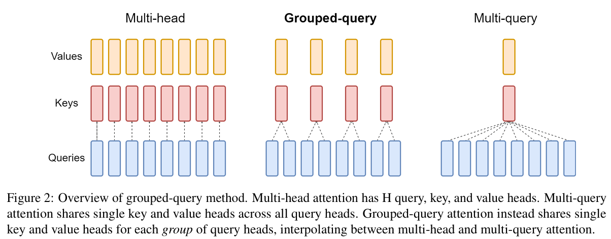

- [LLM中的注意力机制：从Scaled Dot-Product Attention到MLA](#llm中的注意力机制从scaled-dot-product-attention到mla)
  - [1. Scaled Dot-Product Attention：注意力机制的基石](#1-scaled-dot-product-attention注意力机制的基石)
  - [2. Multi-Head Attention (MHA)：多视角捕捉信息](#2-multi-head-attention-mha多视角捕捉信息)
  - [3. Multi-Query Attention (MQA)：减少键值投影的冗余](#3-multi-query-attention-mqa减少键值投影的冗余)
  - [4. Grouped-Query Attention (GQA)：MHA与MQA的折衷](#4-grouped-query-attention-gqamha与mqa的折衷)
  - [5. Multi-head Latent Attention (MLA)：通过低秩压缩优化KV缓存](#5-multi-head-latent-attention-mla通过低秩压缩优化kv缓存)
  - [总结与展望](#总结与展望)

# LLM中的注意力机制：从Scaled Dot-Product Attention到MLA

（该文档大部分由manus生成，没有经过太多校验，有可能有错误）

[参考链接](https://blog.csdn.net/weixin_44994341/article/details/147017174)

注意力机制是现代大型语言模型（LLM）的核心组成部分，它使得模型能够聚焦于输入序列中最重要的部分，从而更好地理解上下文和生成高质量的输出。本节将详细介绍注意力机制的演变，从基础的Scaled Dot-Product Attention开始，逐步深入到Multi-Head Attention (MHA)、Multi-Query Attention (MQA)、Grouped-Query Attention (GQA) 和 Multi-head Latent Attention (MLA)，并分析它们各自的优缺点。

```
                     Multi-head Attention (MHA)
                              ↓
               ┌─────────────┴──────────────┐
         Multi-Query Attention (MQA)     Multi-Head Latent Attention (MLA)
               ↓                                 ↓
        Grouped-Query Attention (GQA)     （未继续分支）
```

## 1. Scaled Dot-Product Attention：注意力机制的基石

**核心思想：** Scaled Dot-Product Attention（缩放点积注意力）是Transformer模型中引入的最基础的注意力机制。它通过计算查询（Query, Q）和键（Key, K）之间的相似度，然后用这个相似度对值（Value, V）进行加权求和，从而得到注意力输出。

**公式：**
$$
Attention(Q,K,V)=softmax(\frac {QK^T}{\sqrt{d_k}})V
$$

其中：
*   $Q$：查询矩阵，形状为 $(..., L_Q, d_k)$，代表我们想要查询的信息。
*   $K$：键矩阵，形状为 $(..., L_K, d_k)$，代表数据库中可供查询的信息索引。
*   $V$：值矩阵，形状为 $(..., L_K, d_v)$，代表数据库中与键对应的内容。
*   $d_k$：键向量的维度，用于缩放点积，防止点积结果过大导致Softmax函数进入梯度饱和区。
*   $QK^T$：计算Q和K之间的相似度（点积）。
*   $softmax$：将相似度转换为注意力权重，确保权重和为1。

**工作流程：**
1.  **相似度计算：** 计算查询 $Q$ 与所有键 $K$ 的点积，得到一个相似度矩阵。
2.  **缩放：** 将相似度矩阵除以 $\sqrt{d_k}$ 进行缩放。
3.  **归一化：** 对缩放后的相似度矩阵应用Softmax函数，得到注意力权重。
4.  **加权求和：** 将注意力权重与值 $V$ 相乘，得到最终的注意力输出。

**优点：**
*   **简单高效：** 计算过程直观，易于并行化。
*   **捕获长距离依赖：** 能够直接计算序列中任意两个位置之间的关系，有效捕获长距离依赖。

**缺陷：**
*   **单一视角：** 每次注意力计算只使用一组Q、K、V，这意味着它只能从一个“角度”或“方面”来理解输入序列中的关系。对于复杂的语义信息，单一视角可能不足以全面捕捉。
*   **信息损失：** 在某些情况下，单一的注意力头可能无法充分利用输入信息，导致某些重要特征被忽略。

<details>
<summary>Scaled Dot-Product Attention代码实现</summary>

```python
import torch
import torch.nn.functional as F

def scaled_dot_product_attention(Q, K, V, mask=None):
    """
    Q: [batch_size, num_heads, seq_len_q, d_k]
    K: [batch_size, num_heads, seq_len_k, d_k]
    V: [batch_size, num_heads, seq_len_v, d_v]  (seq_len_k == seq_len_v)
    mask: [batch_size, num_heads, seq_len_q, seq_len_k] or None
    """
    d_k = Q.size(-1)
    
    # Step 1: 计算 raw attention scores: Q @ K^T
    scores = torch.matmul(Q, K.transpose(-2, -1)) / torch.sqrt(torch.tensor(d_k, dtype=torch.float32))

    # Step 2: 应用 mask（可选）
    if mask is not None:
        scores = scores.masked_fill(mask == 0, float('-inf'))

    # Step 3: softmax over key dimension
    attn_weights = F.softmax(scores, dim=-1)

    # Step 4: 加权求和
    output = torch.matmul(attn_weights, V)

    return output, attn_weights


def main():
    batch_size = 2
    num_heads = 4
    seq_len = 5
    d_k = d_v = 8

    Q = torch.rand(batch_size, num_heads, seq_len, d_k)
    K = torch.rand(batch_size, num_heads, seq_len, d_k)
    V = torch.rand(batch_size, num_heads, seq_len, d_v)

    # mask 也可以测试下，比如让某些位置为 0
    mask = torch.ones(batch_size, num_heads, seq_len, seq_len)  # 全 1 表示没有 mask

    output, attn_weights = scaled_dot_product_attention(Q, K, V, mask)

    print("output.shape:", output.shape)         # [batch_size, num_heads, seq_len, d_v]    # [2, 4, 5, 8]
    print("attn_weights.shape:", attn_weights.shape)  # [batch_size, num_heads, seq_len, seq_len]    # [2, 4, 5, 5]

if __name__ == '__main__':
    main()
```

</details>

## 2. Multi-Head Attention (MHA)：多视角捕捉信息

**核心思想：** 为了解决Scaled Dot-Product Attention的单一视角问题，Multi-Head Attention（多头注意力）被提出。MHA通过将Q、K、V线性投影到多个不同的子空间，然后并行地执行多个Scaled Dot-Product Attention操作，最后将所有头的输出拼接起来并再次进行线性变换，从而允许模型从不同的表示子空间学习信息。

**公式：**
$$
MultiHead(Q, K, V) = Concat(head_1, ..., head_h)W^O
$$
$$
where \quad head_i = Attention(QW_i^Q, KW_i^K, VW_i^V)
$$

其中：
*   $h$：注意力头的数量。
*   $W_i^Q, W_i^K, W_i^V$：第 $i$ 个头的线性投影矩阵。
*   $W^O$：最终的线性投影矩阵，用于将所有头的输出融合。

**工作流程：**
1.  **线性投影：** 将原始的Q、K、V分别通过 $h$ 组不同的线性变换，得到 $h$ 组独立的 $Q_i, K_i, V_i$。
2.  **并行计算：** 对每一组 $Q_i, K_i, V_i$ 并行地执行Scaled Dot-Product Attention，得到 $h$ 个注意力输出 $head_i$。
3.  **拼接与融合：** 将所有 $head_i$ 沿着特征维度拼接起来，然后通过一个最终的线性变换 $W^O$ 得到MHA的输出。

**优点：**
*   **多视角学习：** 允许模型在不同的表示子空间中学习不同的注意力模式，从而捕捉到更丰富、更全面的语义信息。例如，一个头可能关注语法关系，另一个头可能关注语义关系。
*   **增强表达能力：** 提高了模型的表达能力和鲁棒性。

**缺陷：**
*   **计算开销大：** 每个注意力头都需要独立的Q、K、V投影矩阵，并且需要进行独立的点积计算。虽然每个头的维度更小 ($d_k = d_{model}/h$)，但总的计算量和参数量仍然随着头数量的增加而线性增加。
*   **内存占用高：** 存储多个Q、K、V投影矩阵以及中间的注意力矩阵会占用大量内存，尤其是在处理长序列和大型模型时。这在LLM的推理阶段尤为突出，因为KV缓存（Key-Value Cache）会随着序列长度的增加而线性增长，成为内存瓶颈。
*   **冗余计算：** 尽管每个头关注的侧重点不同，但不同头之间可能存在一定的冗余计算，导致效率不高。

<details>
<summary>MHA代码实现</summary>

```python
import torch
import torch.nn as nn
import torch.nn.functional as F
import math

class ScaledDotProductAttention(nn.Module):
    def __init__(self):
        super().__init__()

    def forward(self, Q, K, V, mask=None):
        d_k = Q.size(-1)
        scores = torch.matmul(Q, K.transpose(-2, -1)) / math.sqrt(d_k)

        if mask is not None:
            scores = scores.masked_fill(mask == 0, float('-inf'))

        attn_weights = F.softmax(scores, dim=-1)
        output = torch.matmul(attn_weights, V)
        return output, attn_weights


class MultiHeadAttention(nn.Module):
    def __init__(self, embed_dim, num_heads):
        super().__init__()
        assert embed_dim % num_heads == 0, "embed_dim 必须能被 num_heads 整除"

        self.embed_dim = embed_dim
        self.num_heads = num_heads
        self.head_dim = embed_dim // num_heads

        # 线性映射
        self.W_q = nn.Linear(embed_dim, embed_dim)
        self.W_k = nn.Linear(embed_dim, embed_dim)
        self.W_v = nn.Linear(embed_dim, embed_dim)
        self.W_o = nn.Linear(embed_dim, embed_dim)

        self.attention = ScaledDotProductAttention()

    def forward(self, Q, K, V, mask=None):
        batch_size = Q.size(0)

        # 1. 线性映射并 reshape 为多头：[B, H, L, D/H]
        Q = self.W_q(Q).view(batch_size, -1, self.num_heads, self.head_dim).transpose(1, 2)
        K = self.W_k(K).view(batch_size, -1, self.num_heads, self.head_dim).transpose(1, 2)
        V = self.W_v(V).view(batch_size, -1, self.num_heads, self.head_dim).transpose(1, 2)

        # 2. 计算 Attention
        out, attn_weights = self.attention(Q, K, V, mask)  # [B, H, L, D/H]

        # 3. 拼接多个头
        out = out.transpose(1, 2).contiguous().view(batch_size, -1, self.embed_dim)  # [B, L, D]

        # 4. 线性映射回原维度
        out = self.W_o(out)
        return out, attn_weights


def main():
    embed_dim = 32
    num_heads = 4
    seq_len = 10
    batch_size = 2

    mha = MultiHeadAttention(embed_dim=embed_dim, num_heads=num_heads)

    # 输入 shape: [batch, seq_len, embed_dim]
    x = torch.rand(batch_size, seq_len, embed_dim)

    # 可选 mask，形状应为 [batch_size, num_heads, seq_len, seq_len]，不加也行
    output, attn_weights = mha(x, x, x)

    print("output.shape:", output.shape)          # [batch_size, seq_len, embed_dim]    # [2, 10, 32]
    print("attn_weights.shape:", attn_weights.shape)  # [batch_size, num_heads, seq_len, seq_len]    # [2, 4, 10, 10]


if __name__ == '__main__':
    main()
```

</details>

## 3. Multi-Query Attention (MQA)：减少键值投影的冗余

**核心思想：** Multi-Query Attention（多查询注意力）旨在解决MHA中K和V投影的冗余问题，特别是为了**减少KV缓存的内存占用**。MQA的核心思想是：**所有注意力头共享同一组K和V投影矩阵（或直接共享K和V），但每个头仍然拥有独立的Q投影矩阵。**

**公式：**
$$
MultiQuery(Q, K, V) = Concat(head_1, ..., head_h)W^O
$$
$$
where \quad head_i = Attention(QW_i^Q, K_{shared}, V_{shared})
$$

其中：
*   $K_{shared} = KW^K$
*   $V_{shared} = VW^V$
*   $W_i^Q$：第 $i$ 个头的独立Q投影矩阵。
*   $W^K, W^V$：共享的K和V投影矩阵。

**工作流程：**
1.  **共享K、V投影：** 原始的K和V只进行一次线性变换，得到共享的 $K_{shared}$ 和 $V_{shared}$。
2.  **独立Q投影：** 原始的Q通过 $h$ 组不同的线性变换，得到 $h$ 组独立的 $Q_i$。
3.  **并行计算：** 对每一组 $Q_i$ 和共享的 $K_{shared}, V_{shared}$ 并行地执行Scaled Dot-Product Attention。
4.  **拼接与融合：** 将所有头的输出拼接并线性变换。

**优点：**
*   **显著减少KV缓存内存占用：** 由于K和V只投影一次，大大减少了存储K和V投影矩阵以及中间K、V的内存需求。这对于大型模型和长序列尤其重要，是解决LLM推理内存瓶颈的关键技术之一。
*   **提高推理速度：** 在推理阶段，K和V的计算和存储是主要的瓶颈。MQA通过共享K和V，减少了这些计算和内存访问，从而显著提升了推理速度。
*   **参数量减少：** 减少了K和V投影矩阵的参数量。

**缺陷：**
*   **表达能力可能受限：** 共享K和V意味着所有头都从相同的键值空间中提取信息。这可能会限制每个头学习不同模式的能力，从而在一定程度上牺牲模型的表达能力。在某些复杂任务上，MQA的性能可能略低于MHA。
*   **训练收敛性：** 共享K和V可能导致训练收敛速度变慢或需要更精细的超参数调整。

<details>
<summary>MQA代码实现</summary>

```python
import torch
import torch.nn as nn
import torch.nn.functional as F
import math

class MQA(nn.Module):
    def __init__(self, embed_dim, num_heads):
        super().__init__()
        assert embed_dim % num_heads == 0, "embed_dim 必须能被 num_heads 整除"
        
        self.embed_dim = embed_dim
        self.num_heads = num_heads
        self.head_dim = embed_dim // num_heads
        
        # 每个头都有独立 Q
        self.W_q = nn.Linear(embed_dim, embed_dim)
        
        # 所有头共享一个 K 和 V
        self.W_k = nn.Linear(embed_dim, self.head_dim)
        self.W_v = nn.Linear(embed_dim, self.head_dim)
        
        # 输出映射
        self.W_o = nn.Linear(embed_dim, embed_dim)

    def forward(self, x, mask=None):
        batch_size, seq_len, _ = x.size()
        
        # Q: 多头
        Q = self.W_q(x).view(batch_size, seq_len, self.num_heads, self.head_dim).transpose(1, 2)  # [B, H, L, D/H]    # [2, 8, 10, 8]
        
        # K, V: 共享
        K = self.W_k(x).unsqueeze(1)  # [B, 1, L, D/H]    # [2, 1, 10, 8]
        V = self.W_v(x).unsqueeze(1)  # [B, 1, L, D/H]    # [2, 1, 10, 8]

        # Attention score: Q @ K^T
        scores = torch.matmul(Q, K.transpose(-2, -1)) / math.sqrt(self.head_dim)  # [B, H, L, L]    # [2, 8, 10, 10]
        if mask is not None:
            scores = scores.masked_fill(mask == 0, float('-inf'))

        attn_weights = F.softmax(scores, dim=-1)  # [B, H, L, L]
        out = torch.matmul(attn_weights, V)       # [B, H, L, D/H]

        # 拼接 heads
        out = out.transpose(1, 2).contiguous().view(batch_size, seq_len, self.embed_dim)  # [B, L, D]    # [2, 10, 64]
        out = self.W_o(out)
        return out, attn_weights


def main():
    embed_dim = 64
    num_heads = 8
    seq_len = 10
    batch_size = 2

    mqa = MQA(embed_dim, num_heads)
    x = torch.randn(batch_size, seq_len, embed_dim)

    out, attn_weights = mqa(x)
    print("out.shape:", out.shape)                 # [B, L, D]    # [2, 10, 64]
    print("attn_weights.shape:", attn_weights.shape)  # [B, H, L, L]    # [2, 8, 10, 10]


if __name__ == "__main__":
    main()
```

</details>


## 4. Grouped-Query Attention (GQA)：MHA与MQA的折衷

**核心思想：** Grouped-Query Attention（分组查询注意力）是MHA和MQA之间的一种折衷方案。它旨在在保持MHA大部分表达能力的同时，兼顾MQA的效率优势。GQA的核心思想是：**将注意力头分成若干个组，每个组内的所有头共享同一组K和V投影矩阵，但不同组之间使用不同的K和V投影矩阵。** 每个头仍然有独立的Q投影矩阵。

**公式：**
$$
GroupedQuery(Q, K, V) = Concat(Group_1, ..., Group_g)W^O
$$
$$
where \quad Group_j = Concat(head_{j,1}, ..., head_{j,h/g})
$$
$$
and \quad head_{j,i} = Attention(QW_{j,i}^Q, K_{shared,j}, V_{shared,j})
$$

其中：
*   $g$：组的数量。
*   $h$：总的注意力头数量。
*   $K_{shared,j} = KW_j^K$
*   $V_{shared,j} = VW_j^V$
*   $W_{j,i}^Q$：第 $j$ 组中第 $i$ 个头的独立Q投影矩阵。
*   $W_j^K, W_j^V$：第 $j$ 组共享的K和V投影矩阵。

**工作流程：**
1.  **分组K、V投影：** 将K和V投影到 $g$ 组不同的共享K、V空间。
2.  **独立Q投影：** Q仍然为每个头进行独立的线性变换。
3.  **组内并行计算：** 在每个组内，所有头使用独立的Q和共享的K、V进行Scaled Dot-Product Attention计算。
4.  **拼接与融合：** 将所有组的输出拼接并线性变换。

**优点：**
*   **性能与效率的平衡：** GQA在MHA的表达能力和MQA的效率之间取得了良好的平衡。它比MQA具有更强的表达能力（因为K和V不再完全共享），同时比MHA具有更高的效率（因为K和V是分组共享的），尤其是在KV缓存的内存占用上。
*   **推理速度提升：** 相较于MHA，GQA在推理时能够显著减少K和V的计算和存储，从而提升推理速度。
*   **参数量适中：** 参数量介于MHA和MQA之间。

**缺陷：**
*   **超参数选择：** 引入了新的超参数——组的数量 $g$，需要仔细选择以达到最佳性能。
*   **仍有冗余：** 尽管比MHA好，但每个组内的K和V仍然是共享的，可能仍然存在一定的表达能力限制。

<details>
<summary>GQA代码实现</summary>

```python
import torch
import torch.nn as nn
import torch.nn.functional as F
import math

class GQA(nn.Module):
    def __init__(self, embed_dim, num_heads, num_kv_groups):
        super().__init__()
        assert embed_dim % num_heads == 0, "embed_dim 必须能被 num_heads 整除"
        assert num_heads % num_kv_groups == 0, "num_heads 必须能被 num_kv_groups 整除"

        self.embed_dim = embed_dim
        self.num_heads = num_heads
        self.num_kv_groups = num_kv_groups
        self.head_dim = embed_dim // num_heads
        self.group_size = num_heads // num_kv_groups

        # Q 每个 head 独立
        self.W_q = nn.Linear(embed_dim, embed_dim)

        # K/V 只有 num_kv_groups 组（共享）
        self.W_k = nn.Linear(embed_dim, self.head_dim * num_kv_groups)
        self.W_v = nn.Linear(embed_dim, self.head_dim * num_kv_groups)

        # 输出线性层
        self.W_o = nn.Linear(embed_dim, embed_dim)

    def forward(self, x, mask=None):
        batch_size, seq_len, _ = x.size()

        # 1. Q: 每个 head 独立
        Q = self.W_q(x).view(batch_size, seq_len, self.num_heads, self.head_dim).transpose(1, 2)  # [B, H, L, D/H]

        # 2. K/V: 每个 group 一组，共 num_kv_groups 个
        K = self.W_k(x).view(batch_size, seq_len, self.num_kv_groups, self.head_dim).transpose(1, 2)  # [B, G, L, D/H]  # [2, 2, 10, 8]
        V = self.W_v(x).view(batch_size, seq_len, self.num_kv_groups, self.head_dim).transpose(1, 2)  # [B, G, L, D/H]  # [2, 2, 10, 8]

        # 3. 将 K/V 按 group 复制给对应的 head
        K = K.repeat_interleave(self.group_size, dim=1)  # [B, H, L, D/H]   # [2, 8, 10, 8]
        V = V.repeat_interleave(self.group_size, dim=1)  # [B, H, L, D/H]   # [2, 8, 10, 8]

        # 4. Attention
        scores = torch.matmul(Q, K.transpose(-2, -1)) / math.sqrt(self.head_dim)  # [B, H, L, L]    # [2, 8, 10, 10]

        if mask is not None:
            scores = scores.masked_fill(mask == 0, float('-inf'))

        attn_weights = F.softmax(scores, dim=-1)
        out = torch.matmul(attn_weights, V)  # [B, H, L, D/H]   # [2, 8, 10, 8]

        # 5. 拼接输出
        out = out.transpose(1, 2).contiguous().view(batch_size, seq_len, self.embed_dim)
        out = self.W_o(out)

        return out, attn_weights


def main():
    embed_dim = 64
    num_heads = 8
    num_kv_groups = 2
    seq_len = 10
    batch_size = 2

    gqa = GQA(embed_dim, num_heads, num_kv_groups)
    x = torch.randn(batch_size, seq_len, embed_dim)

    out, attn_weights = gqa(x)
    print("out.shape:", out.shape)                  # [B, L, D]
    print("attn_weights.shape:", attn_weights.shape)  # [B, H, L, L]


if __name__ == "__main__":
    main()
```

</details>

## 5. Multi-head Latent Attention (MLA)：通过低秩压缩优化KV缓存

**核心思想：** Multi-head Latent Attention (MLA) 是DeepSeek-V2模型中提出的一种创新注意力机制，其主要目标是**进一步优化KV缓存的内存效率，同时尽可能保持甚至提升模型的表达能力**。MLA通过**低秩（Low-Rank）分解**的方式，将Key (K) 和 Value (V) 的表示压缩到一个更小的“潜在（Latent）”空间中，从而显著减少KV缓存的大小。与GQA简单地减少KV头数量不同，MLA旨在通过更精巧的数学方法，在压缩的同时维持每个查询头拥有其独特的K和V表示的能力。

**与MQA/GQA的区别：**
*   MQA/GQA通过共享K/V投影来减少KV缓存。这意味着多个Q头会访问相同的K/V信息。
*   MLA则通过**低秩压缩**K/V本身来减少KV缓存。它允许每个Q头仍然能够“访问”到其独特的K和V表示，但这些K和V是在低维潜在空间的。

**工作流程**
1. **输入映射到潜在空间**：**将输入数据通过一个映射函数投影到低维潜在空间**。这一步骤类似于提取输入数据的核心特征，丢弃一些不重要的细节。
2. **潜在空间中的多头注意力计算**：在低维潜在空间中，执行多头注意力计算。将所有注意力头的输出拼接。
3. **映射回原始空间**：将多头注意力的结果从潜在空间映射回原始空间，得到最终的输出。

**优点：**
*   **极致的KV缓存压缩：** 通过低秩分解，MLA能够将KV缓存的大小压缩到非常小的程度，甚至比GQA更小，从而显著降低内存占用。这使得LLM能够处理更长的上下文，并在有限的硬件上进行推理。
*   **保持表达能力：** 与MQA/GQA简单共享K/V不同，MLA通过低秩分解的方式，允许每个Q头仍然能够有效地“访问”到其独特的K和V信息，从而在压缩的同时尽可能地保持甚至提升模型的表达能力。DeepSeek-V2声称MLA在性能上优于GQA。
*   **提升推理速度：** 减少KV缓存的读写量，以及在某些实现中通过吸收权重矩阵等优化，可以显著提升推理速度。
*   **无需重新训练（某些情况下）：** 一些研究表明，可以通过奇异值分解（SVD）等技术，将已训练好的MHA或GQA模型转换为MLA模型，而无需从头开始训练。

**缺陷：**
*   **实现复杂性：** MLA的实现比MQA/GQA更复杂，涉及到低秩分解和潜在空间的管理。
*   **潜在的信息损失：** 尽管MLA旨在最小化信息损失，但低秩近似本质上是一种信息压缩，理论上可能存在一定的信息损失。
*   **训练稳定性：** 引入新的压缩/解压缩矩阵可能对训练的稳定性提出新的挑战，需要更精细的调优。

<details>
<summary>MLA代码实现</summary>

```python
import torch
import torch.nn as nn
import torch.nn.functional as F
import math

class MLA(nn.Module):
    def __init__(self, input_dim, latent_dim, num_latents, num_heads):
        super().__init__()
        assert latent_dim % num_heads == 0, "latent_dim 必须能被 num_heads 整除"
        self.input_dim = input_dim
        self.latent_dim = latent_dim
        self.num_latents = num_latents
        self.num_heads = num_heads
        self.head_dim = latent_dim // num_heads

        # 可学习的 latent queries
        self.latents = nn.Parameter(torch.randn(num_latents, latent_dim))

        # Q 来自 latent，K/V 来自输入
        self.W_q = nn.Linear(latent_dim, latent_dim)
        self.W_k = nn.Linear(input_dim, latent_dim)
        self.W_v = nn.Linear(input_dim, latent_dim)

        self.W_o = nn.Linear(latent_dim, latent_dim)

    def forward(self, x, mask=None):
        """
        x: [B, L, input_dim] - 输入序列（如 token embeddings）
        返回：
        latent_out: [B, num_latents, latent_dim]
        """
        B, L, _ = x.shape

        # 扩展 latent 为每个 batch 一份
        latents = self.latents.unsqueeze(0).expand(B, -1, -1)  # [B, num_latents, latent_dim]

        Q = self.W_q(latents).view(B, self.num_latents, self.num_heads, self.head_dim).transpose(1, 2)  # [B, H, num_latents, D/H]
        K = self.W_k(x).view(B, L, self.num_heads, self.head_dim).transpose(1, 2)                       # [B, H, L, D/H]
        V = self.W_v(x).view(B, L, self.num_heads, self.head_dim).transpose(1, 2)                       # [B, H, L, D/H]

        scores = torch.matmul(Q, K.transpose(-2, -1)) / math.sqrt(self.head_dim)  # [B, H, num_latents, L]
        if mask is not None:
            scores = scores.masked_fill(mask == 0, float('-inf'))

        attn_weights = F.softmax(scores, dim=-1)                   # [B, H, num_latents, L]
        latent_out = torch.matmul(attn_weights, V)                # [B, H, num_latents, D/H]

        # 拼接多个 head
        latent_out = latent_out.transpose(1, 2).contiguous().view(B, self.num_latents, self.latent_dim)
        latent_out = self.W_o(latent_out)                         # [B, num_latents, latent_dim]

        return latent_out, attn_weights


def main():
    batch_size = 2
    seq_len = 100
    input_dim = 128
    latent_dim = 256
    num_latents = 16
    num_heads = 8

    mla = MLA(input_dim, latent_dim, num_latents, num_heads)
    x = torch.randn(batch_size, seq_len, input_dim)

    latent_out, attn_weights = mla(x)
    print("latent_out.shape:", latent_out.shape)         # [B, num_latents, latent_dim]
    print("attn_weights.shape:", attn_weights.shape)     # [B, H, num_latents, L]


if __name__ == "__main__":
    main()
```

</details>

## 总结与展望

| 特性/机制               | Scaled Dot-Product Attention | Multi-Head Attention (MHA) | Multi-Query Attention (MQA) | Grouped-Query Attention (GQA) | Multi-head Latent Attention (MLA) |
| :---------------------- | :--------------------------- | :------------------------- | :-------------------------- | :---------------------------- | :-------------------------------- |
| **核心思想**            | 单一视角加权求和             | 多视角并行计算             | K/V共享，Q独立              | K/V分组共享，Q独立            | K/V低秩压缩到潜在空间             |
| **QKV投影**             | 1组                          | h组                        | Q: h组, K/V: 1组            | Q: h组, K/V: g组              | Q: h组, K/V: 压缩/解压缩          |
| **计算开销**            | 低                           | 高                         | 中低（推理快）              | 中（推理较快）                | 中低（推理快，但训练复杂）        |
| **内存占用 (KV Cache)** | 低                           | 高                         | 低                          | 中                            | 极低                              |
| **表达能力**            | 基础                         | 强                         | 较弱                        | 较强                          | 强（接近MHA，优于MQA/GQA）        |
| **主要解决问题**        | -                            | 单一视角限制               | MHA的KV缓存瓶颈             | MQA的表达能力限制             | KV缓存瓶颈，同时保持表达能力      |
| **主要缺陷**            | 单一视角                     | 计算开销大，KV缓存高       | 表达能力可能受限            | 超参数选择，仍有冗余          | 实现复杂，潜在信息损失            |

MHA、MQA、QGA如图：



从Scaled Dot-Product Attention到MHA、MQA、GQA，我们看到了注意力机制在效率和表达能力之间不断寻求平衡的努力。MHA通过多头并行计算增强了模型的表达能力，但带来了更高的计算和内存开销。MQA和GQA则通过共享或分组共享K和V来优化效率，尤其是在推理阶段。而MLA则代表了在KV缓存优化方面的一个重要突破，它通过低秩压缩技术，在显著减少内存占用的同时，力求保持甚至提升模型的表达能力。

这些注意力机制的演进，共同推动了大型语言模型在性能和效率上的不断进步，使得LLM能够处理更长的上下文，并在更广泛的硬件上部署。未来，注意力机制的研究将继续围绕如何更高效、更有效地捕获序列中的复杂关系展开。
