- [简介](#简介)
- [mcp server 格式说明 (\*)](#mcp-server-格式说明-)
  - [npx 系列 —— npm 上的 MCP Server](#npx-系列--npm-上的-mcp-server)
  - [uvx / uv run 系列 —— Python MCP Server](#uvx--uv-run-系列--python-mcp-server)
  - [mcp-remote 系列 —— 远程托管的 MCP](#mcp-remote-系列--远程托管的-mcp)
  - [smithery 系列 —— MCP 工具集市（最常见）](#smithery-系列--mcp-工具集市最常见)
  - [SSE-only server（无需安装，直接 URL）](#sse-only-server无需安装直接-url)
- [cline 使用 mcp](#cline-使用-mcp)
  - [使用他人制作的 mcp server: uvx 部分](#使用他人制作的-mcp-server-uvx-部分)
  - [使用他人制作的 mcp server: npx 部分](#使用他人制作的-mcp-server-npx-部分)
  - [创建自己的 mcp server](#创建自己的-mcp-server)
- [MCP 底层协议分析的原理与方法](#mcp-底层协议分析的原理与方法)
- [使用 MCP 底层协议直接与 MCP Server 交互](#使用-mcp-底层协议直接与-mcp-server-交互)
- [MCP host 与 LLM 的交互协议](#mcp-host-与-llm-的交互协议)


[参考链接：https://www.bilibili.com/video/BV1uronYREWR](https://www.bilibili.com/video/BV1uronYREWR)

# 简介

MCP(Model Context Protocol) 统一标准，由 Anthropic 牵头制定。

它允许不同的工具 (Tools) 作为独立的 MCP Server 运行，通过标准协议向 LLM 暴露工具能力。

[mcp 官方说明文档](https://modelcontextprotocol.io/docs/getting-started/intro)

在这之前要提前安装几个需要的包或者插件：
1. [安装 nvm](../../../dev_related/op_and_cmd.md) 来使用 `npm` 与 `mpx`
2. [安装 uv](https://github.com/astral-sh/uv) 来使用 `uv run` 与 `uvx`
3. 安装 vscode/cursor 的 `cline` 插件
4. 安装 vscode 的 `mcp inspector` 插件
5. 使用 [openrouter](https://openrouter.ai/) 提供的大模型服务。将 openrouter 获得的 key 配置到 cline 中

几个可以查看或者搜索 mcp server 的网址：
1. [mcp.so](https://mcp.so/)
2. [mcpmarket](https://mcpmarket.com/zh)
3. [Smithery](https://smithery.ai/skills)
4. [Model Context Protocol 官方仓库列表](https://github.com/modelcontextprotocol/servers)
5. [npm](https://www.npmjs.com/)
6. [PyPI](https://pypi.org/)


# mcp server 格式说明 (*)

mcp server 有不同类型的包，以下分别说明。

## npx 系列 —— npm 上的 MCP Server

```shell
"mcp-deepwiki": {
    "command": "npx",
    "args": [
        "-y",
        "mcp-deepwiki@latest"
    ]
}
```

MCP 是 server 模式运行的，调用方式通常是：

```shell
npx -y mcp-deepwiki@latest
```

有些包运行完是没有 log 的，只能接受 client 连接，或者直接交互（具体见[使用-mcp-底层协议直接与-mcp-server-交互](#使用-mcp-底层协议直接与-mcp-server-交互)）。

可以使用 vscode 的插件 mcp inspector 来查看具体这个 mcp 有哪些 tools

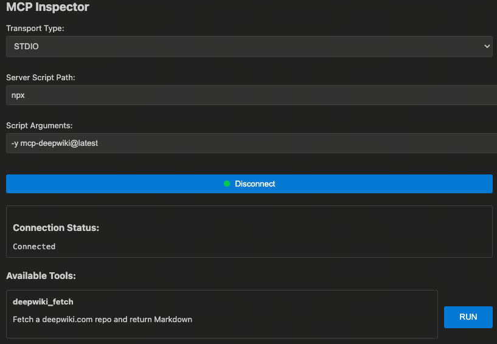

## uvx / uv run 系列 —— Python MCP Server

```shell
"weibo": {
    "command": "uvx",
    "args": [
        "mcp-server-weibo"
    ]
}
```

python 的 mcp server 跟 npm 的有点不一样。可以使用以下命令查看可执行文件：

```shell
# (dev) zhengnairong@xxxxxx Downloads % uvx --with mcp-server-weibo python - << 'EOF'
# import sysconfig, os
# scripts = sysconfig.get_path("scripts")
# print("Scripts path:", scripts)
# print("Files:", os.listdir(scripts))
# EOF
# Scripts path: /Users/zhengnairong/.cache/uv/archive-v0/BeseviwOD5TzY_kiJTEPJ/bin
# Files: ['activate.bat', 'rst2html', 'activate.ps1', 'dotenv', 'python3', 'typer', 'rst2xml', 'docutils', 'python', 'rst2man', 'activate.fish', 'rst2odt', 'fastmcp', 'websockets', 'python3.11', 'pydoc.bat', 'mcp', 'activate_this.py', 'cyclopts', 'httpx', 'jsonschema', 'markdown-it', 'pygmentize', 'rst2xetex', 'rst2latex', 'uvicorn', 'rst2html4', 'activate', 'mcp-server-weibo', 'rst2s5', 'activate.nu', 'normalizer', 'rst2html5', 'deactivate.bat', 'rst2pseudoxml', 'email_validator', 'activate.csh']
# (dev) zhengnairong@xxxxxx Downloads %
```

可以看到其中的 mcp-server-weibo 是可执行文件，所以在命令行使用：

```shell
uvx --with mcp-server-weibo mcp-server-weibo
```

该例子就会出现下图：

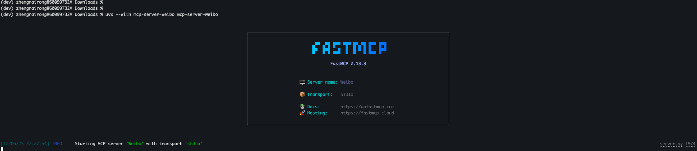

## mcp-remote 系列 —— 远程托管的 MCP

```shell
"berlin-transport": {
    "command": "npx",
    "args": [
        "mcp-remote",
        "https://berlin-transport.mcp-tools.app/sse"
    ]
}
```

可以在命令行运行命令查看：

```shell
npx mcp-remote https://berlin-transport.mcp-tools.app/sse

# 结果如下：

# (dev) zhengnairong@xxxxxx Downloads % npx mcp-remote https://berlin-transport.mcp-tools.app/sse
# [26830] Using automatically selected callback port: 6245
# [26830] [26830] Connecting to remote server: https://berlin-transport.mcp-tools.app/sse
# [26830] Using transport strategy: http-first
# [26830] Received error: Error POSTing to endpoint (HTTP 404): Not Found
# [26830] Recursively reconnecting for reason: falling-back-to-alternate-transport
# [26830] [26830] Connecting to remote server: https://berlin-transport.mcp-tools.app/sse
# [26830] Using transport strategy: sse-only
# [26830] Connected to remote server using SSEClientTransport
# [26830] Local STDIO server running
# [26830] Proxy established successfully between local STDIO and remote SSEClientTransport
# [26830] Press Ctrl+C to exit
```

也可以在插件中查看：

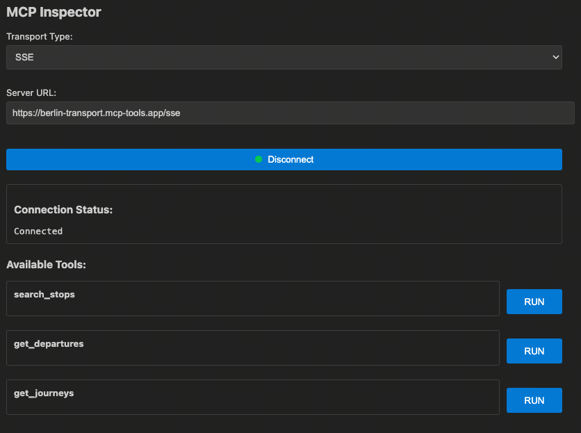

## smithery 系列 —— MCP 工具集市（最常见）

```shell
"Office-PowerPoint-MCP-Server": {
    "command": "npx",
    "args": [
        "-y",
        "@smithery/cli@latest",
        "run",
        "@GongRzhe/Office-PowerPoint-MCP-Server",
        "--key",
        "${SMITHERY_API_KEY}"
    ]
}
```

调用方式统一：

```shell
npx @smithery/cli run <package-name> --key <api-key> [args...]

# 例如：
# (dev) zhengnairong@xxxxxx Downloads % npx @smithery/cli run @GongRzhe/Office-PowerPoint-MCP-Server --key <my_key>
# 2025-12-05T14:43:39.447Z [Runner] Connecting to server: {"id":"@GongRzhe/Office-PowerPoint-MCP-Server","connectionTypes":["http"]}
# 2025-12-05T14:43:39.449Z [Runner] Connecting to Streamable HTTP endpoint: https://server.smithery.ai/@GongRzhe/Office-PowerPoint-MCP-Server/mcp
# 2025-12-05T14:43:39.449Z [Runner] Streamable HTTP connection initiated
# 2025-12-05T14:43:39.449Z [Runner] Streamable HTTP connection established
```

## SSE-only server（无需安装，直接 URL）

```shell
"3rd_party_mcp_server_shuidi": {
    "url": "https://mcp.shuidi.cn/sse",
    "prefer_sse": true
}
```

也可以使用插件查看：

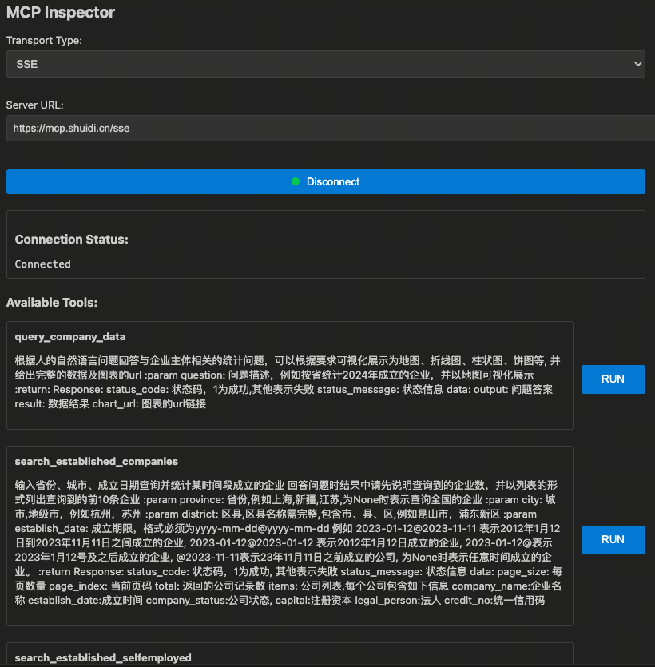

</details>


# cline 使用 mcp

mcp 交互流程：

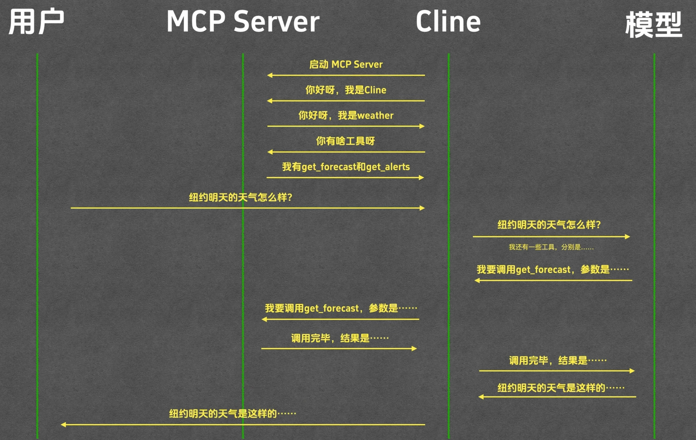

下面举例说明如何用 cline 使用 mcp。

跟随参考视频，使用的是 [openrouter](https://openrouter.ai/) 提供的 key 来给 cline 调用 LLM。

配置参考如下：

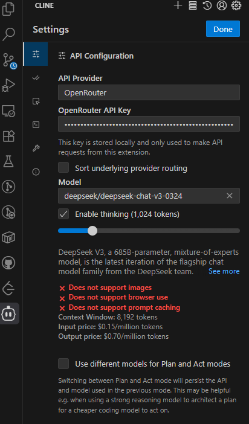

## 使用他人制作的 mcp server: uvx 部分

**配置**

MCP Servers -> Configure -> Configure MCP Servers 打开 cline_mcp_settings.json 来配置 MCP Servers

可以去 [mcp.so](https://mcp.so/) 搜 fetch 这个 mcp，上面就有他的配置方式：

```shell
"fetch": {
    "command": "uvx",
    "args": [
        "mcp-server-fetch"
    ]
}
```
配置完之后，等待一定时间（时间太久超时就先去终端运行一遍），cline 就会识别到这个 mcp。然后就可以使用：

在对话框输入以下文本：

```text
请抓取下面这个网页的内容，并将其转换为 markdown 后放到项目目录里面的 guides.md 文件中：https://docs.astral.sh/uv/guides/install-python/ 
```

此时 cline 就会调用 刚刚配置好的 fetch 这个 mcp 来完成任务。如图：

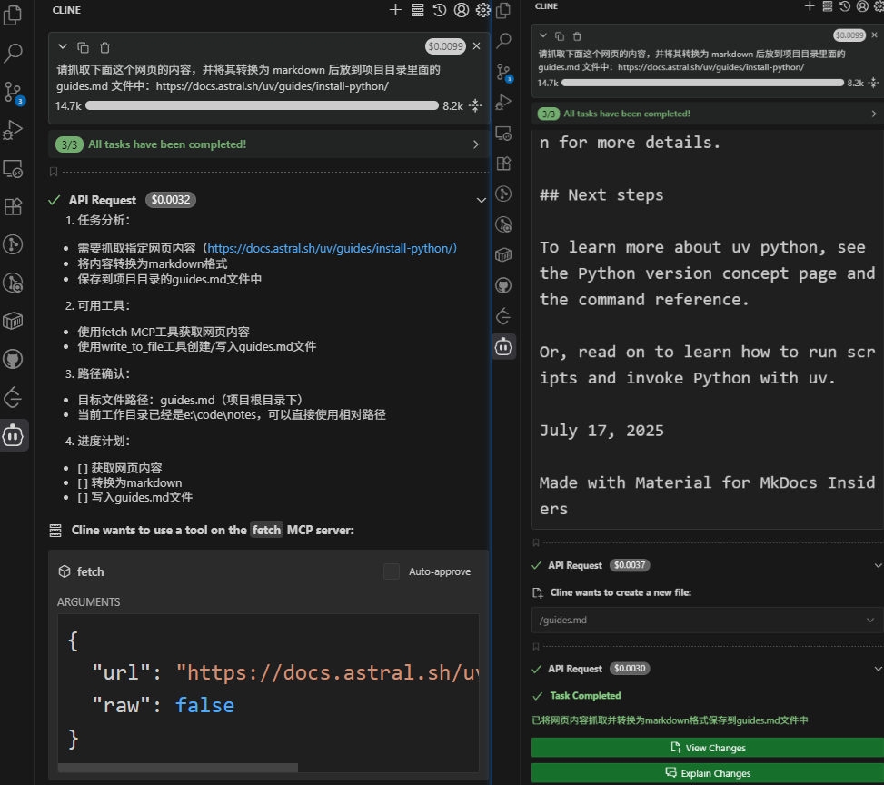

## 使用他人制作的 mcp server: npx 部分

去 [mcpmarket](https://mcpmarket.com/zh) 搜索 hotnews 这个 mcp，上面也有他的配置方式（如果用 windows 的话加 `-y` 会有问题？我后来用了 wsl）：

```shell
"mcp-server-hotnews": {
    "command": "npx",
    "args": [
        "-y",
        "@wopal/mcp-server-hotnews"
    ]
}
```

等待启动之后，输入以下文本：

```text
获取今天最火的科技新闻
```

结果如下图所示：

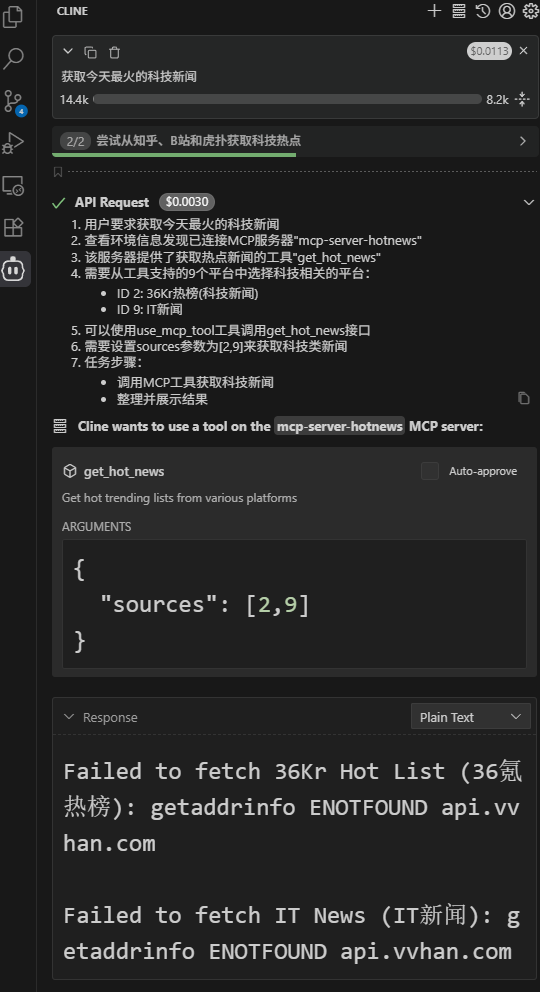

## 创建自己的 mcp server

这边是以 [mcp 官网的例子](https://modelcontextprotocol.io/docs/develop/build-server)来讲解的：


```shell
cd <repo_root>/ai_related/LLM/mcp

# Create a new directory for our project
uv init weather
cd weather

# Create virtual environment and activate it
uv venv
source .venv/bin/activate

# Install dependencies
uv add "mcp[cli]" httpx

# Create our server file
touch weather.py
```

然后在 [weather.py](./mcp/weather/weather.py) 中添加好代码。

然后就可以在 cline 的配置文件中添加（注意其中的路径要填对，建议用绝对路径）：

```shell
"weather": {
    "command": "uv",
    "args": [
        "--directory",
        "E:/code/notes/ai_related/LLM/mcp/weather",
        "run",
        "weather.py"
    ],
    "transportType": "stdio"
}
```

启动之后如下图所示：

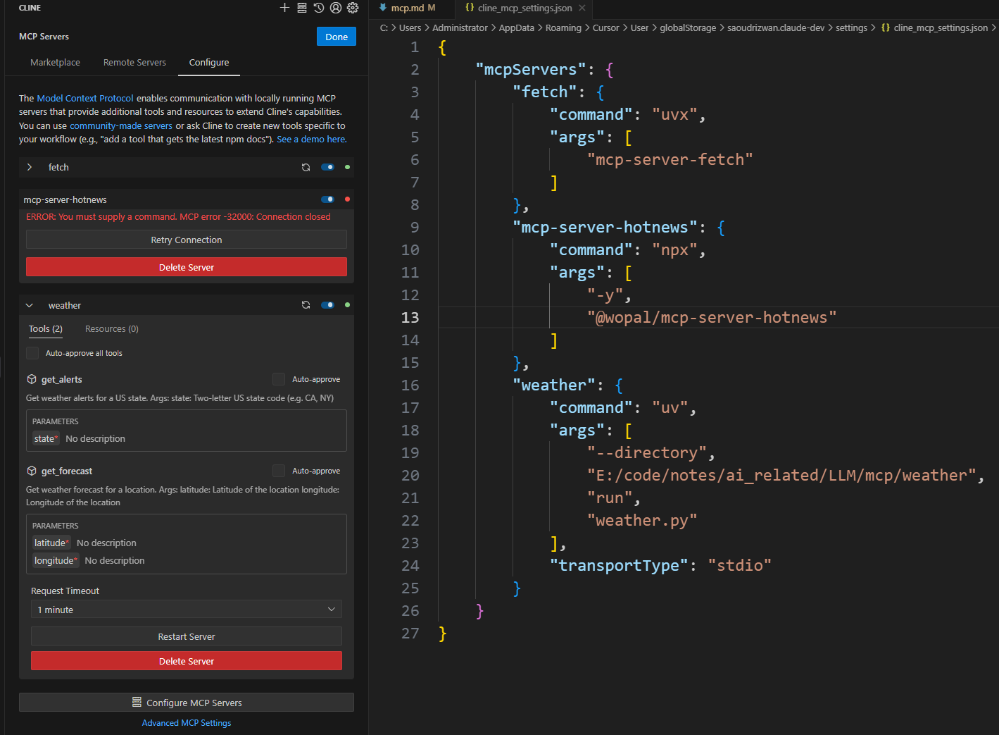

（上面的 npx 我之前是在 wsl 运行的，所以这边 windows 启动失败了）

等待启动之后，输入以下文本：

```text
纽约明天的天气怎么样
```

结果见下图：

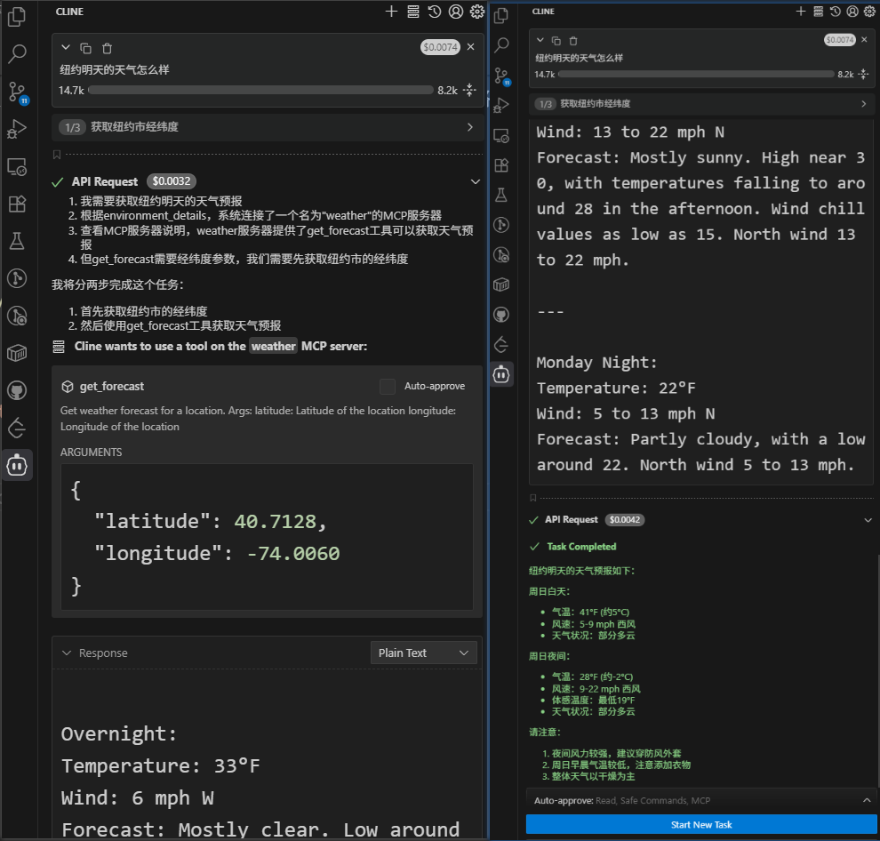


# MCP 底层协议分析的原理与方法

上面的例子是 cline 调用 mcp server 完成任务，并且自己写的 server 也是使用 mcp 这个包来完成的，很多中间的协议和输入输出并不了解。

写一个[截取输入输出的脚本](./weather/mpc_logger.py)来帮助理解。

**1. mcpserver 注册/建立连接**

将配置改成如下，使用一个 logger 来截取输入输出查看具体交互过程：

```shell
"weather": {
    "command": "python",
    "args": [
        "E:/code/notes/ai_related/LLM/mcp/weather/mpc_logger.py",
        "uv",
        "--directory",
        "E:/code/notes/ai_related/LLM/mcp/weather",
        "run",
        "weather.py"
    ],
    "transportType": "stdio"
}
```

建立连接之后，就会把日志写到 [mcp_io.log](./weather/mcp_io.log) 里。

配置好，建立连接的时候就已经有以下日志了（发生在注册的一瞬间，有点像握手）：

```shell
# 输入：cline -> mcpserver: cline 告诉 mcp server 自己的版本号等信息
输入: {"method":"initialize","params":{"protocolVersion":"2025-06-18","capabilities":{},"clientInfo":{"name":"Cline","version":"3.40.1"}},"jsonrpc":"2.0","id":0}
# 输出：mcpserver -> cline: mcp server 告诉 cline 自己的版本号等信息，以及哪些功能不支持等
输出: {"jsonrpc":"2.0","id":0,"result":{"protocolVersion":"2025-06-18","capabilities":{"experimental":{},"prompts":{"listChanged":false},"resources":{"subscribe":false,"listChanged":false},"tools":{"listChanged":false}},"serverInfo":{"name":"weather","version":"1.23.1"}}}

# 输入：cline -> mcpserver: cline 告诉 mcp server “收到”
输入: {"method":"notifications/initialized","jsonrpc":"2.0"}
# 输入：cline -> mcpserver: cline 紧接着马上问 mcp server 有哪些工具可以使用
输入: {"method":"tools/list","jsonrpc":"2.0","id":1}
# 输出：mcpserver -> cline: mcp server 恢复目前有哪些工具可以使用，分别是怎么定义的，有什么参数（从函数的注释，即 docstring 中提取的）。里面的 inputSchema 就是入参，是 @mcp.tool() 从函数定义中提取出来的
输出: {"jsonrpc":"2.0","id":1,"result":{"tools":[{"name":"get_alerts","description":"Get weather alerts for a US state.\n\n    Args:\n        state: Two-letter US state code (e.g. CA, NY)\n    ","inputSchema":{"properties":{"state":{"title":"State","type":"string"}},"required":["state"],"title":"get_alertsArguments","type":"object"},"outputSchema":{"properties":{"result":{"title":"Result","type":"string"}},"required":["result"],"title":"get_alertsOutput","type":"object"}},{"name":"get_forecast","description":"Get weather forecast for a location.\n\n    Args:\n        latitude: Latitude of the location\n        longitude: Longitude of the location\n    ","inputSchema":{"properties":{"latitude":{"title":"Latitude","type":"number"},"longitude":{"title":"Longitude","type":"number"}},"required":["latitude","longitude"],"title":"get_forecastArguments","type":"object"},"outputSchema":{"properties":{"result":{"title":"Result","type":"string"}},"required":["result"],"title":"get_forecastOutput","type":"object"}}]}}

# 下面就是 cline 在询问 mcpserver 有没有资源跟资源模板可以用
输入: {"method":"resources/list","jsonrpc":"2.0","id":2}
输出: {"jsonrpc":"2.0","id":2,"result":{"resources":[]}}

输入: {"method":"resources/templates/list","jsonrpc":"2.0","id":3}
输出: {"jsonrpc":"2.0","id":3,"result":{"resourceTemplates":[]}}
```

**2. 发送消息**

然后开启一个对话，同样询问以下问题：

```text
纽约明天的天气怎么样
```

此时，log 里面会新增以下内容：

```shell
# 输入：cline -> mcpserver: cline 向 mcp server 请求调用 tool
输入: {"method":"tools/call","params":{"name":"get_forecast","arguments":{"latitude":40.7128,"longitude":-74.006}},"jsonrpc":"2.0","id":4}
# 输出：mcpserver -> cline: mcp server 回复cline 工具调用的结果
输出: {"jsonrpc":"2.0","id":4,"result":{"content":[{"type":"text","text":"\nToday:\nTemperature: 42°F\nWind: 5 to 9 mph W\nForecast: Partly sunny. High near 42, with temperatures falling to around 40 in the afternoon. West wind 5 to 9 mph.\n\n---\n\nTonight:\nTemperature: 28°F\nWind: 9 to 22 mph W\nForecast: Partly cloudy. Low around 28, with temperatures rising to around 32 overnight. Wind chill values as low as 19. West wind 9 to 22 mph.\n\n---\n\nMonday:\nTemperature: 30°F\nWind: 13 to 22 mph N\nForecast: Mostly sunny. High near 30, with temperatures falling to around 28 in the afternoon. Wind chill values as low as 15. North wind 13 to 22 mph.\n\n---\n\nMonday Night:\nTemperature: 22°F\nWind: 5 to 13 mph N\nForecast: Partly cloudy, with a low around 22. Wind chill values as low as 17. North wind 5 to 13 mph.\n\n---\n\nTuesday:\nTemperature: 38°F\nWind: 5 to 12 mph SW\nForecast: Mostly sunny. High near 38, with temperatures falling to around 36 in the afternoon. Southwest wind 5 to 12 mph.\n"}],"structuredContent":{"result":"\nToday:\nTemperature: 42°F\nWind: 5 to 9 mph W\nForecast: Partly sunny. High near 42, with temperatures falling to around 40 in the afternoon. West wind 5 to 9 mph.\n\n---\n\nTonight:\nTemperature: 28°F\nWind: 9 to 22 mph W\nForecast: Partly cloudy. Low around 28, with temperatures rising to around 32 overnight. Wind chill values as low as 19. West wind 9 to 22 mph.\n\n---\n\nMonday:\nTemperature: 30°F\nWind: 13 to 22 mph N\nForecast: Mostly sunny. High near 30, with temperatures falling to around 28 in the afternoon. Wind chill values as low as 15. North wind 13 to 22 mph.\n\n---\n\nMonday Night:\nTemperature: 22°F\nWind: 5 to 13 mph N\nForecast: Partly cloudy, with a low around 22. Wind chill values as low as 17. North wind 5 to 13 mph.\n\n---\n\nTuesday:\nTemperature: 38°F\nWind: 5 to 12 mph SW\nForecast: Mostly sunny. High near 38, with temperatures falling to around 36 in the afternoon. Southwest wind 5 to 12 mph.\n"},"isError":false}}
```

# 使用 MCP 底层协议直接与 MCP Server 交互

知道了 mcp 底层协议的原理之后，甚至都不需要 cline 这样的 mcp host 就可以跟 mcp server 进行沟通，只需要使用正确的格式跟 mcp server 进行交互即可。

在终端运行以下命令：

```shell
uv --directory E:/code/notes/ai_related/LLM/mcp/weather run weather.py
```

运行之后会发现终端“卡住”了，其实这时候是交互模式，可以跟 mcp server 进行交互了。采用上面 log 类似的格式就可以一步步进行交互了。

一步步输入以下命令交互（所有的 mcp server 都可以用类似的方式来交互，只要发送的数据符合协议要求）：

```shell
# 1. 建立连接/打招呼（换个名字）
{"method":"initialize","params":{"protocolVersion":"2025-06-18","capabilities":{},"clientInfo":{"name":"damonzheng","version":"1.1.0"}},"jsonrpc":"2.0","id":0}

# 这时候 mcp server 会回复一条消息

# 2. 握手表示收到消息（mcp server 不会回复这条的，这跟日志表现也是一样的）
{"method":"notifications/initialized","jsonrpc":"2.0"}


# 3. 请求一下工具列表
{"method":"tools/list","jsonrpc":"2.0","id":1}

# 这时候 mcp server 会回复现在有什么工具

# 4. 请求工具调用
{"method":"tools/call","params":{"name":"get_forecast","arguments":{"latitude":40.7128,"longitude":-74.006}},"jsonrpc":"2.0","id":4}

# 这时候mcp server 会返回工具调用的结果
```

整个终端交互的流程如下图所示（红框是我发送的内容，下面的是 mcp server 的回复）：

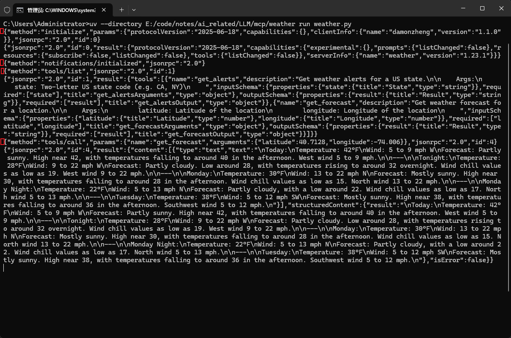


这是再回去看看最上面的交互图，就发现，里面的每个交互都可以在日志中找到！

可见，mcp 服务主要规定的是（总结为“函数的注册与使用”）：
1. 每个 mcp server 的函数列表
2. 每个函数的调用方法
3. （有些还有资源等）

**mcp 并没有规定如何与模型进行交互！**

**mcp 就是用来让模型感知外部环境的一个协议。**

# MCP host 与 LLM 的交互协议

由上可知，mcp 只是规定了“函数的注册与使用”，并不规定怎么与模型交互。因此，不同的 mcp host 可能会用不同的格式来与模型进行沟通。后续的内容不赘述，可以看[参考视频的这个部分](https://www.bilibili.com/video/BV1v9V5zSEHA)。

流程图：

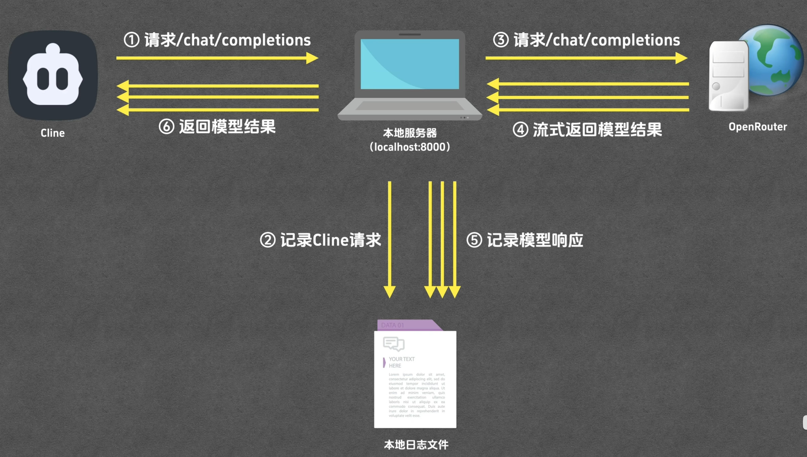

后续的内容就省略啦。可以直接去看参考视频。讲的非常好。

就是怎么调用 LLM，有点像 template 相关的部分，dddd。

