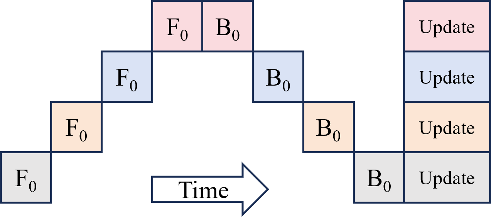
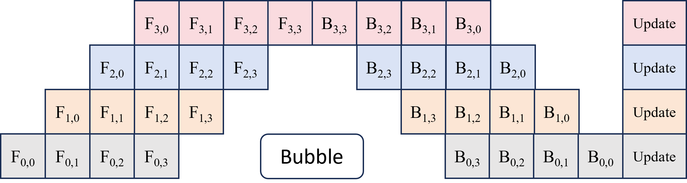
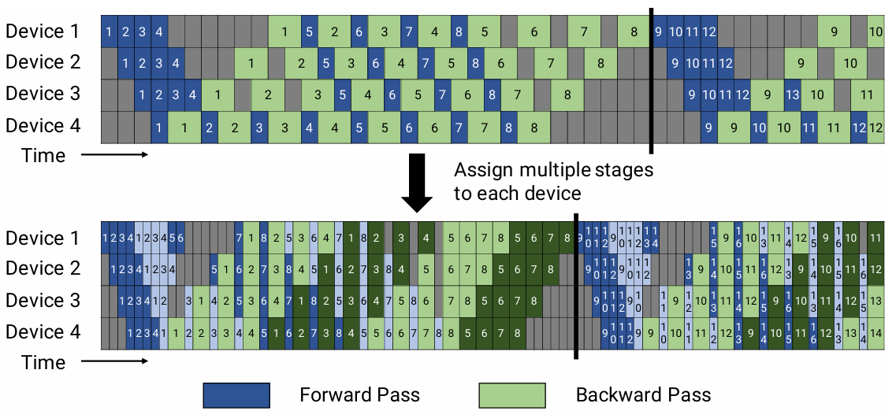
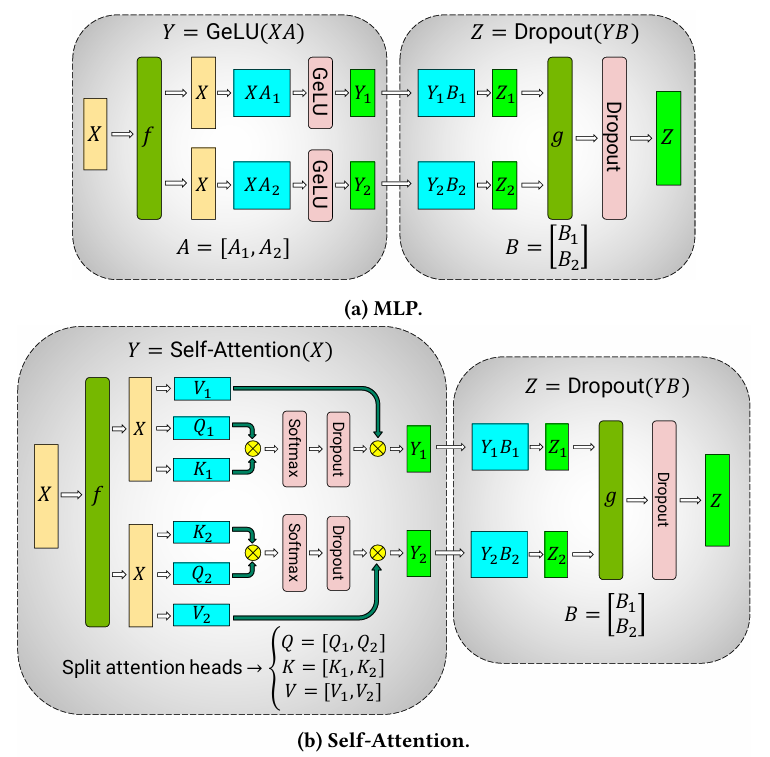
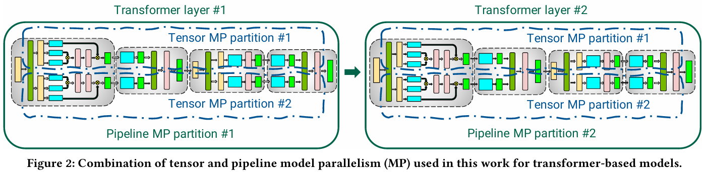
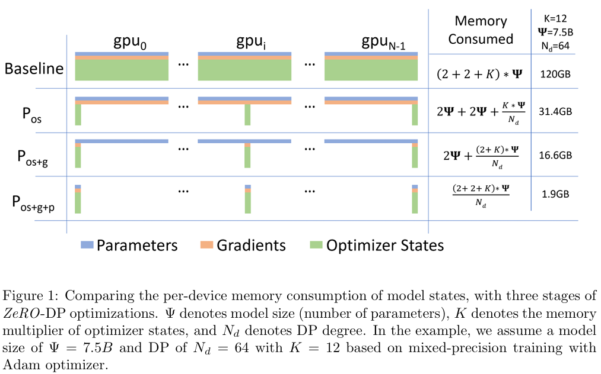

- [分布式训练一些概念](#分布式训练一些概念)
  - [变量解释](#变量解释)
  - [python代码示例](#python代码示例)
  - [启动方式](#启动方式)
- [无并行训练](#无并行训练)
- [Data Parallelism](#data-parallelism)
  - [DP: Data Parallel](#dp-data-parallel)
  - [DDP: Distributed Data Parallel](#ddp-distributed-data-parallel)
  - [DP 与 DDP 训练 GPU 示例](#dp-与-ddp-训练-gpu-示例)
- [Model Parallelism](#model-parallelism)
- [Pipeline Parallelism](#pipeline-parallelism)
- [Tensor Parallelism](#tensor-parallelism)
- [3D Parallelism](#3d-parallelism)
- [ZeRO 零冗余优化器](#zero-零冗余优化器)
  - [Baseline](#baseline)
  - [ZeRO1: 优化器状态分布存储](#zero1-优化器状态分布存储)
  - [ZeRO2: +梯度分布存储](#zero2-梯度分布存储)
  - [ZeRO3: +模型参数分布存储](#zero3-模型参数分布存储)
  - [小结](#小结)


**[参考连接：https://www.bilibili.com/video/BV1UPLqzuENB](https://www.bilibili.com/video/BV1UPLqzuENB)**


# 分布式训练一些概念

## 变量解释

| 变量名      | 含义                     | 通俗理解                     |
| ----------- | ------------------------ | ---------------------------- |
| WORLD_SIZE  | 总进程数（全局 GPU 数）  | 一共有多少个“训练进程”在协作 |
| RANK        | 当前进程的全局编号       | 我是第几个进程（从 0 开始）  |
| LOCAL_RANK  | 当前节点（机器）内的编号 | 我在当前机器的第几个 GPU 上  |
| MASTER_ADDR | 主节点 IP 地址           | 负责初始化通信的“主控节点”   |
| MASTER_PORT | 主节点端口               | 进程间通信的端口             |
| NODE_RANK   | 当前节点编号             | 当前机器在集群中的序号       |


假设有 2 台机器，每台 4 张 GPU：

| 机器编号 | GPU 数 | 启动进程数 | NODE_RANK | 对应 RANK 范围 |
| -------- | ------ | ---------- | --------- | -------------- |
| node0    | 4      | 4          | 0         | 0, 1, 2, 3     |
| node1    | 4      | 4          | 1         | 4, 5, 6, 7     |

那么 `WORLD_SIZE=2*4=8`

每个进程会有自己的一组环境变量：

| 机器  | GPU  | RANK | LOCAL_RANK | NODE_RANK |
| ----- | ---- | ---- | ---------- | --------- |
| node0 | GPU0 | 0    | 0          | 0         |
| node0 | GPU1 | 1    | 1          | 0         |
| node0 | GPU2 | 2    | 2          | 0         |
| node0 | GPU3 | 3    | 3          | 0         |
| node1 | GPU0 | 4    | 0          | 1         |
| node1 | GPU1 | 5    | 1          | 1         |
| node1 | GPU2 | 6    | 2          | 1         |
| node1 | GPU3 | 7    | 3          | 1         |

## python代码示例

给一个代码示例：

```python
import torch.distributed as dist

dist.init_process_group(backend="nccl")

world_size = dist.get_world_size()  # 全局进程数
rank = dist.get_rank()              # 当前进程编号
local_rank = int(os.environ["LOCAL_RANK"])  # 当前节点内编号
```

## 启动方式

**典型的启动方式**

用torchrun：

```shell
# 2台机器，每台有4张卡，当前是编号node_rank为0的机器（主机）的启动命令
# 第二台的启动命令就是 --node_rank=1 这个参数改一下即可
CUDA_VISIBLE_DEVICES=0,1,2,3 \
torchrun --nproc_per_node=4 --nnodes=2 \
         --node_rank=0 --master_addr=10.0.0.1 --master_port=29500 \
         train.py
# # 自动生成的变量：
# WORLD_SIZE=8
# NODE_RANK=0
# LOCAL_RANK=0..3
# RANK=0..3
# MASTER_ADDR=10.0.0.1
# MASTER_PORT=29500
```

用slurm/集群调度系统：

```shell
srun -N 2 -n 8 python train.py --launcher slurm
# slurm会自动分配8个任务到2台机器上，通常是前4张卡一台，后4张卡一台，除非设置了 GPU binding 策略
# 自己不用再指定 CUDA_VISIBLE_DEVICES，slurm会自动绑定GPU
```

# 无并行训练

> 场景1: 模型在 1 个 GPU 上能装得下，时间充裕，慢慢训（单机单卡）

```shell

        数据 0-n           数据 0-n             模型
硬盘  ----------->  CPU  ----------->  GPU  ----------->  梯度
```

# Data Parallelism

> 场景2: 模型在 1 个 GPU 上能装得下，时间紧张，要加快整体训练速度

数据并行：其核心思想是**将相同的模型复制到多个计算设备上，每个设备独立处理不同的数据子集**，然后在每次迭代结束后**聚合各设备的梯度更新参数**，确保模型的一致性。

## DP: Data Parallel

```shell
                                                  数据1 & 模型                梯度
                                              ------------------>  GPU 1  ---------->
        数据0-n            数据0-n     数据0   |   数据2 & 模型                梯度   |
硬盘  ----------->  CPU  ----------->  GPU 0  ------------------>  GPU 2  ---------->
                                        |     |   数据3 & 模型                梯度   |
                                        |     ------------------>  GPU 3  ---------->
                                        |                                           |
                                        <-------------------------------------------
```
**过程**：
1. GPU 0 负责读取数据，并将其分发给其他 GPU
2. GPU 0 会将最新的模型复制到其他 GPU 上
3. 每个 GPU 会独立地执行一次前向传播，然后将他们的输出结果发送回 GPU 0，由 GPU 0 统一计算损失
4. 损失值再从 GPU 0 分发给其他 GPU，用于执行反向传播
5. 最后，各个 GPU 会将他们计算得到的梯度传回 GPU 0，GPU 0 对所有梯度进行平均处理

**存在问题**：
1. GPU 0 干的事情太多了，通信开销大，成为瓶颈。且多个 GPU 之间不平等
2. 所有训练只在一个线程中进行，整体是主线程主导的，存在调度和同步开销
3. 最多只能单机多卡（单进程多线程，只能利用一个 CPU 核），无法支持多机训练

## DDP: Distributed Data Parallel

```shell
# Ring-AllReduce
                                                                                 <----|
                                            数据0 & 模型                         |     |
                                         ------------------->  GPU 0  ------>  梯度
                                        |   数据1 & 模型                         |     |
                                        | ------------------>  GPU 1  ------>  梯度
        数据0-n               数据0-n    |   数据2 & 模型                         |     |
硬盘  ----------->  CPU  ----------------|------------------>  GPU 2  ------>  梯度
                                        |   数据3 & 模型                         |     |
                                        |------------------>  GPU 3   ------>  梯度
                                                                                |     |
                                                                                 ----->
```
**过程**：
1. 主进程会将模型复制到每一张 GPU 上
2. 每张 GPU 都会直接处理一部分数据
3. 在反向传播过程中，每张 GPU 本地计算出的梯度会在所有 GPU 之间进行平均。
4. **没有总控逻辑，通过 Ring-Reduce操作完成。最大限度利用上行和下行的带宽。**

**Ring-AllReduce**：通俗来讲，也就是每张卡都知道了其他卡上的梯度信息，计算平均之后，每张卡上的梯度信息就一致了，**因此可以直接在每张卡上自己来更新模型参数了，时刻保证每张卡上的模型都是一样的，不需要再有一个总控的 GPU 了。**

## DP 与 DDP 训练 GPU 示例

**DP**：
1. PID 都一样
2. GPU 利用率明显可以看到 GPU 0 的压力大，与其他 GPU 开销不平等

```shell
+------------------------------------------------------------------+
| Processes:                                                       |
|  GPU   GI   CI        PID     Type   Process name    GPU Memory  |
|        ID   ID                                       Usage       |
|==================================================================|
|    0   N/A  N/A      58306      C    python            39418MiB  |
|    1   N/A  N/A      58306      C    python            14366MiB  |
|    2   N/A  N/A      58306      C    python            14366MiB  |
|    3   N/A  N/A      58306      C    python            14366MiB  |
|    4   N/A  N/A      58306      C    python            14366MiB  |
|    5   N/A  N/A      58306      C    python            14366MiB  |
|    6   N/A  N/A      58306      C    python            14366MiB  |
|    7   N/A  N/A      58306      C    python            14222MiB  |
```

**DDP**：
1. PID 不一样
2. 各个 GPU 负载差不多，利用率高

```shell
+------------------------------------------------------------------+
| Processes:                                                       |
|  GPU   GI   CI        PID     Type   Process name    GPU Memory  |
|        ID   ID                                       Usage       |
|==================================================================|
|    0   N/A  N/A      15263      C    python            39400MiB  |
|    1   N/A  N/A      15264      C    python            39548MiB  |
|    2   N/A  N/A      15265      C    python            39868MiB  |
|    3   N/A  N/A      15266      C    python            39638MiB  |
|    4   N/A  N/A      15267      C    python            39596MiB  |
|    5   N/A  N/A      15268      C    python            39482MiB  |
|    6   N/A  N/A      15269      C    python            39548MiB  |
|    7   N/A  N/A      15270      C    python            39558MiB  |
```

# Model Parallelism

> 场景3: 模型在 1 个 GPU 装不下，把模型**按层拆分**，将一个大模型的不同层分布在多个设备上。每个设备负责前向和反向传播中的一部分。

```shell
        数据0-n           数据0-n & 模型   模型层0   数据0-n   模型层1   数据0-n   模型层2   数据0-n   模型层3
硬盘  ----------->  CPU  --------------->  GPU 0  --------->  GPU 1  --------->  GPU 2  --------->  GPU 3  ----|
                                                                                                               |
                                           梯度   <---------  梯度   <---------   梯度  <---------    梯度  <---|
```

**过程**：
1. 将模型按层（单层/多层）切分，分布到不同的 GPU 上
2. 所有数据以此经过这些 GPU 进行前向和反向传播

**存在问题**：
1. 通信成本高：层与层之间频繁通信
2. 后面的层要等前面的层，造成 GPU 之间的空闲等待和不均衡



# Pipeline Parallelism

不想让 GPU 空闲等待，想办法提高 GPU 利用率，可以使用 Pipeline 并行

**Pipeline 并行 ≈ 改进版的模型并行**，通过**微批处理 micro-batching** 减少 GPU 空闲时间，提升并行效率。



**过程**：
1. 把一个大批次的数据拆成多个**小批次 micro-barch**
2. 当第一个小批次在第一个 GPU 上处理完之后，就立刻交给第二个 GPU 继续处理
3. 同时第一个 GPU 就可以开始处理第二个小批次了
4. 这样每个 GPU 就可以同时在处理不同的小批次，不用互相等，从而提高效率

**存在问题**：
1. 会比较复杂，需要把模型改写成一段一段的结构（比如用`nn.Sequential`）
2. 无法完全消除空闲时间，因为在最后一个小批次的前向传播结束粥，还必须等它的反向传播也做完，才能完成整个训练过程

pipeline 并行，还有更多的进阶优化版本，通过调整计算顺序和层的顺序，降低 Bubble



# Tensor Parallelism

> 场景4: 进行了模型并行后，模型的某一个层仍然在一个 GPU 中装不下怎么办？很简单，继续拆分！（张量并行由 NVIDIA 在 [Megatron-LM 论文](https://arxiv.org/abs/2104.04473)中提出）

如下图的 (a)：
1. X 复制两份
2. A 进行了列分块
3. B 进行了行分块



**张量并行算法上无非就是数学上的矩阵分块技巧罢了**。
- 把一大块张量分成几部分，分给多个 GPU 一起计算。
- 这些张量可以横着切，也可以竖着且，每个 GPU 负责其中一片。
- 每个 GPU 单独处理自己的那片张量，最后把结果汇总起来，拼成完整的输出。

**存在问题**：
1. **多个 GPU 之间需要经常通信**，比如交换中间结果，这会带来一定的性能开销。

# 3D Parallelism

$$
\text{3D Parallelism = Data Parallelism + Tensor Parallelism + Pipeline Parallelism}
$$

比如：
- 将 Transformer 的两个层分布在 2 个 GPU 上，执行 Pipeline Parallelism
- 将每个层进一步拆分到 2 个 GPU 上，执行 Tensor Parallelism
- 所以总共需要 4 块 GPU



# ZeRO 零冗余优化器

> 场景5: 模型在 1 个 GPU 中装得下，但是在训练时，在加载数据之后或者在训练过程中显存就承受不住 OOM 了，怎么办？
> - 因为训练过程中不止是模型参数占用显存，还有其他数据更加消耗显存
> - 还可以在另外的维度上进行显存开销的优化
> - 分散存储，用的时候再组装，也就是“按需聚合，用后即弃”的策略

**简介**（[ZeRO论文](https://arxiv.org/abs/1910.02054)）：
- 数据并行 DP 算得快、传得快，但很费内存
- 模型并行 MP 虽然省内存，但可能算得慢、通信效率也不高
- 把**模型的参数**、**优化器的状态信息**，以及**反向传播中产生的梯度**，切分后分不到不同的 GPU 上进行处理，从而节省内存并提高训练效率。**零冗余是说没有任何信息是重复存储的。**
- ZeRO 是一种数据并行 DP 方法，全称叫 ZeRO-DP（但 ZeRO3 更接近模型并行）



**后面的说明都基于这张图！！！！**

## Baseline

在没有使用 ZeRO 的情况下：
- 每个 GPU 上处理的**数据是不同的**
- 每个 GPU 上存储的模型参数是相同的，是**全部的模型参数**
- 每个 GPU 上存储的梯度信息是相同的，是**同步后的全部的梯度信息**
- 每个 GPU 上存储的优化器状态的相同的，是**全部的优化器状态**
- 只有数据不同，其余都是全部信息，因此都是相同的

**训练过程**：
1. 每张卡得到自己的一份训练数据
2. 每张卡进行独立的前向传播
3. 每张卡独立得到自己的 loss 值
4. 每张卡进行独立的反向传播，得到每张卡自己的梯度值
5. **梯度信息在每张卡之间同步信息，保证每张卡得到的同样的梯度信息**
6. 利用同步之后的梯度信息，计算优化器装填，每张卡上优化器状态都一样
7. 结合计算的优化器状态和同步后的梯度进行参数更新，保证每张卡上的模型参数都是一致的

## ZeRO1: 优化器状态分布存储

在使用 ZeRO1 的情况下：
- 每个 GPU 上处理的数据是不同的
- 每个 GPU 上存储的模型参数是相同的，是**全部的模型参数**
- 每个 GPU 上存储的梯度信息是相同的，是**同步后的全部的梯度信息**
- 每个 GPU 上存储的**优化器状态是不同的**，**每个 GPU 只存储部分优化器状态**
- **每个 GPU 只利用自己的部分优化器状态更新部分模型参数，然后所有卡之间同步模型参数**

**训练过程**：
1. 每张卡得到自己的一份训练数据
2. 每张卡进行独立的前向传播
3. 每张卡独立得到自己的 loss 值
4. 每张卡进行独立的反向传播，得到每张卡自己的梯度值
5. 梯度信息在每张卡之间同步信息，保证每张卡都得到的同样的梯度信息
6. **每张卡使用同步后的梯度信息，只计算自己对应部分的优化器状态，每张卡的优化器状态都不一样每张卡结合计算得到的全局梯度和部分优化器状态，只更新对应的部分模型参数**
7. 每张卡结合计算得到的全局梯度和部分优化器状态，**只更新对应的部分模型参数**
8. 所有卡之间同步更新后的模型参数

## ZeRO2: +梯度分布存储

- 每个 GPU 上处理的数据是不同的
- 每个 GPU 上存储的模型参数是相同的，是**全部的模型参数**
- 每个 GPU 上存储的梯度信息是不同的，是**同步后的部分梯度信息**
- 每个 GPU 上存储的优化器状态是不同的，**每个 GPU 只存储部分优化器状态**
- **每个 GPU 只利用自己的部分优化器状态和部分梯度更新部分模型参数，然后所有卡之间同步模型参数**

**训练过程**：

1. 每张卡得到自己的一份训练数据
2. 每张卡进行独立的前向传播
3. 每张卡独立得到自己的 loss 值
4. **每张卡进行独立的反向传播，只存储部分的度值**
5. **部分梯度信息在每张卡之间同步信息，注意每张卡只同步其他卡上自己那部分梯度信息**
6. 每张卡使用同步后的梯度信息，只计算自己对应部分的优化器状态，每张卡的优化器状态都不一样
7. 每张卡结合计算得到的部分梯度和部分优化器状态，**只更新对应的部分模型参数**
8. 所有卡之间同步更新后的模型参数

## ZeRO3: +模型参数分布存储

- 每个 GPU 上处理的数据是不同的
- 每个 GPU 上存储的模型参数是不同的，是**部分模型参数**
- 每个 GPU 上存储的梯度信息是不同的，是**同步后的部分梯度信息**
- 每个 GPU 上存储的优化器状态是不同的，**每个GPU只存储部分优化器状态**
- **每个 GPU 只利用自己的部分优化器状态和部分梯度更新部分模型参数，然后所有卡之间同步模型参数**

**训练过程**：
1. 每张卡得到自己的一份训练数据
2. **每张卡相互之间同步参数信息，进行前向传播**
3. 每张卡独立得到自己的 loss 值
4. **每张卡相互之间同步信息进行反向传播，只得到部分的梯度值**
5. 部分梯度信息在每张卡之间同步信息，注意每张卡只同步其他卡上自己那部分梯度信息
6. 每张卡使用同步后的梯度信息，只计算自己对应部分的优化器状态，每张卡的优化器状态都不一样
7. 每张卡结合计算得到的全局梯度和部分优化器状态，只更新对应的部分模型参数
8. 所有卡之间同步更新后的模型参数

## 小结

1. ZeRO 的核心机制：**在需要时通信+在用完后释放**，也就是“按需聚合，用后即弃”的策略
2. ZeRO 的优化效果：（推荐使用到stage2）
   1. Stage1：在保持和 DP 通信开销相同的前提下，显存降低 4 倍
   2. Stage2：在保持和 DP 通信开销相同的前提下，显存降低 8 倍
   3. Stage3：在增加 50% 通信开销的前提下，显存的降低和 GPU 的数量成比例关系。(64 个 GPU 就降低 64 倍显存占用)
3. ZeRO 是一种并行算法，有两种具体实现:
   1. FSDP(ZeRO3)
   2. DeepSpeed(ZeRO1/2/3)


----

<details>

<summary>原来的记录</summary>

\# 数据并行（Data Parallel）

**核心思想**

- 每张 GPU 拥有一份完整模型副本，
- 处理不同的数据 batch，
- 训练过程中定期同步梯度，使所有模型保持一致。

**工作流程**

1. 模型复制：每个 GPU 拥有相同的模型参数副本。
2. 数据分片：数据集被均匀分割，每张卡处理一部分。
3. 前向传播：每张卡独立计算自己的 loss。
4. 反向传播：每张卡计算自己的梯度。
5. 梯度同步（AllReduce）：
   1. 各 GPU 之间通过 AllReduce 操作交换梯度；
   2. 将所有梯度求平均（或求和）。
6. 参数更新：每张卡用相同的平均梯度更新参数，保证模型完全一致。

**同步时机**

梯度同步在 每个 batch 完成反向传播后 自动执行；
不是每个 epoch；（不然每一步都在朝着不同的方向更新，到最后每个卡的模型权重可能会严重漂移，没办法平均）
保证每步更新后，所有模型权重保持一致。

**通信机制**

使用 AllReduce 操作：每个 GPU 都会与其他 GPU 交换梯度并取平均；
通信库通常使用 NCCL（NVIDIA 集群通信库），支持高速 GPU 直连。

**优缺点**

| 优点                              | 缺点                           |
| --------------------------------- | ------------------------------ |
| 简单易实现（torchrun / DDP 即可） | 模型需能放进单卡显存           |
| 扩展性强，几乎线性加速            | 通信成本较高（每步 AllReduce） |
| 所有模型参数完全一致              | 无法训练超大模型（显存瓶颈）   |

\# 混合并行（Hybird Parallel）

**结构组成**

| 并行维度                  | 含义                             | 通信内容               |
| ------------------------- | -------------------------------- | ---------------------- |
| 模型并行 (Model Parallel) | 将模型拆成多部分，分布在多张卡上 | 激活和反向梯度         |
| 数据并行 (Data Parallel)  | 多组模型副本同时训练不同数据     | 梯度 AllReduce（平均） |

**工作原理**

假设模型太大，需要两张 GPU 才能放下：
我们可以用 4 张 GPU，组成两组模型副本：

| 组   | GPU     | 模型分片            | 处理数据 |
| ---- | ------- | ------------------- | -------- |
| 组 A | GPU 0–1 | 模型的一半 + 另一半 | batch_1  |
| 组 B | GPU 2–3 | 模型的一半 + 另一半 | batch_2  |

**训练过程**：

1. **组内通信（模型并行）**
   1. GPU0 计算前半层，输出激活给 GPU1；
   2. GPU1 继续前向传播；
   3. 反向传播时，GPU1 将梯度传回 GPU0；
   4. 组内 GPU 共享激活与梯度，不需要梯度平均。
2. **组间通信（数据并行）**
   1. 每组完成 backward 后，各自得到局部梯度；
   2. 组与组之间做 AllReduce（平均梯度）；
   3. 保证所有模型副本（不同数据组）更新后参数一致。

**通信总结**

| 通信层级             | 通信内容        | 说明           |
| -------------------- | --------------- | -------------- |
| 组内通信（模型内部） | 激活 & 局部梯度 | 用于前后层传递 |
| 组间通信（模型副本） | 梯度 AllReduce  | 确保副本一致   |

**优缺点**

| 优点                              | 缺点                     |
| --------------------------------- | ------------------------ |
| 能训练超大模型（分布存储）        | 通信复杂度高（两层通信） |
| 模型和数据都能扩展                | 代码实现复杂             |
| 可以结合流水线/张量并行进一步扩展 | 调优难度高               |

</details>
