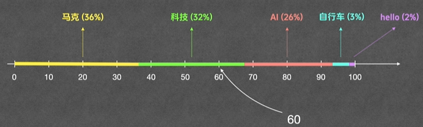
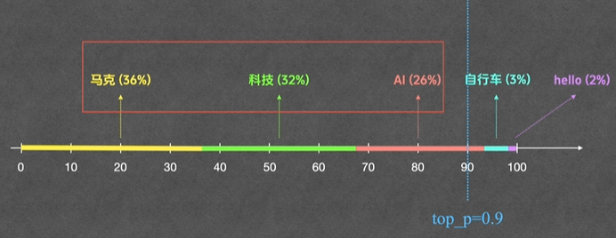
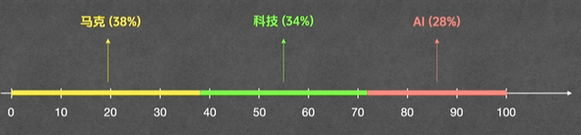

- [大模型原理](#大模型原理)
  - [生成分数](#生成分数)
  - [转换概率](#转换概率)
  - [加权采样](#加权采样)
- [Temperature（低温稳定，高温活跃）](#temperature低温稳定高温活跃)
- [top\_p](#top_p)
- [总结](#总结)


[参考视频：https://www.bilibili.com/video/BV1taSFBNEG4](https://www.bilibili.com/video/BV1taSFBNEG4)


**学习参考视频记录的笔记。所以里面用到的例子都是参考视频里的。**

# 大模型原理

大模型的原理可以简单概括为：

```shell
-------------大模型原理-----------------
|  生成分数  ->  转换概率  -> 加权采样  |    -> Temperature  ->  top_p
---------------------------------------
```

## 生成分数

```shell
# question: 推荐一个讲 AI 的技术频道

# 大模型会给他认识的所有词打分，这边假设只有这 5 个，或者只拿分数最高的这 5 个
# 假设大模型打分如下（logits）：

马克        4.2
科技        4.1
AI          3.9
自行车      1.8
hello       1.4

# 拿到当前步的结果之后，继续打分，继续拿下一步的结果，直到模型拿到结束标志。
```

## 转换概率

如果谁分高就选谁的话，那么大模型的输出就几乎没有随机性。

所以需要把分数转成概率。让模型根据概率来预测下一个词。

使用 softmax 函数：

$$
\text{Softmax}(z_i)=\frac{e^{z_i}}{\sum_{j=1}^K e^{z_j}}
$$

其中：
- $e^{z_i}$: 第 i 个词的分数
- K: 词的总量

假设整个词库只有上面的 5 个词，那么可以有以下结果：

```text
词          分数        概率

马克        4.2         36%
科技        4.1         32%
AI          3.9         26%
自行车      1.8         3%
hello       1.4         2%
```

## 加权采样

有了概率就可以根据概率来输出下一个词，即加权采样。
- 根据每个词的概率分配了对等的区间。
- 然后生成一个随机数。
- 随机数落在哪个区间，就输出哪个区间的值。
- 这样回答就多种多样。

如下图所示：




这样，**就能给每个词分配与其概率相等的机会采样**。每个词都有可能成为输出。

# Temperature（低温稳定，高温活跃）

而 softmax 函数的完整版本其实是：

$$
\text{Softmax}(z_i)=\frac{e^{z_i/T}}{\sum_{j=1}^K e^{z_j/T}}
$$

这里面的 T 就是 Temperature

下面演示 T 变大变小的结果
| 词     | z_i | z_i/T <br> T=0.1 | softmax |     | 词     | z_i | z_i/T <br> T=1 | softmax |     | 词     | z_i | z_i/T <br> T=2 | softmax |
| ------ | --- | ---------------- | ------- | --- | ------ | --- | -------------- | ------- | --- | ------ | --- | -------------- | ------- |
| 马 克  | 4.2 | 42               | 71%     |     | 马克   | 4.2 | 4.2            | 36%     |     | 马克   | 4.2 | 2.1            | 30%     |
| 科 技  | 4.1 | 41               | 26%     |     | 科技   | 4.1 | 4.1            | 32%     |     | 科 技  | 4.1 | 2.05           | 28%     |
| A   I  | 3.9 | 39               | 4%      |     | AI     | 3.9 | 3.9            | 26%     |     | A   I  | 3.9 | 1.95           | 26%     |
| 自行车 | 1.8 | 18               | 0%      |     | 自行车 | 1.8 | 1.8            | 3%      |     | 自行车 | 1.8 | 0.9            | 9%      |
| hello  | 1.4 | 14               | 0%      |     | hello  | 1.4 | 1.4            | 2%      |     | hello  | 1.4 | 0.7            | 7%      |

说明：**低温稳定，高温活跃**
1. **$T$ 调小之后，差距拉大，模型输出越单一**。（$T$ 调小之后，$z_i$ 差距变大，再经过 $e$ 的非线性放大，就可以把原本的差距进一步拉大。）
2. **$T$ 调大之后，差距变小，模型输出某词的机会越均等，输出越多样化**。（$T$ 调大之后，$z_i$ 差距变小，再经过 $e$ 的非线性放大，就可以把原本的差距进一步变小。）

# top_p

回顾加权采样：
- 根据每个词的概率分配了对等的区间。
- 然后生成一个随机数。
- 随机数落在哪个区间，就输出哪个区间的值。
- 这样回答就多种多样。

隐患：
- 有些不相关的词（**长尾词**/垃圾词），虽然概率低，但只要试的次数足够多，就有可能被采样到，而输出奇怪的结果。

**top_p**: Top Cumulative Probability (最高累加概率)

- 从概率最高的词开始往下累加概率
- 直到累加到 top_p 这个值，后续的词，不管有多少个直接抛弃
- 这样就避免了长尾词的干扰

假如 top_p=0.9：



会将后面的词丢弃掉。（如果 top_p=0.6，则会把 “AI” 也过滤掉。以此类推）

丢弃掉之后，会将剩下的词**按比例重新放大**，让他们累加为 100%，然后再进行采样。




# 总结

| 变量        | 控制内容         | 调低               | 调高               |
| ----------- | ---------------- | ------------------ | ------------------ |
| Temperature | 不同词的概率差距 | 拉大差距，输出稳定 | 缩小差距，输出多样 |
| Top_p       | 长尾词的概率阈值 | 去掉长尾，输出稳定 | 放宽门槛，输出多样 |

