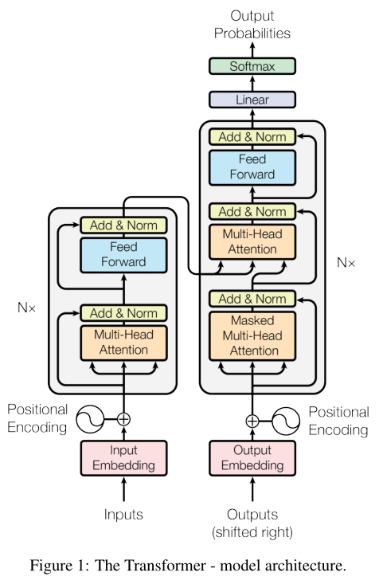

1. 为什么需要位置编码，位置编码方法的发展，优缺点
2. QKV 的直观理解
3. 计算 QK 相似度的时候为什么用点积，可不可以用欧式距离或者余弦相似度，为什么
4. 为什么 QKV 的时候要除以根号dk，softmax公式是什么？softmax 遇到很大的值怎么办，指数直接导致数值溢出，现在的 softmax 都是怎么做的
5. 注意力机制，现在有哪几种主流的注意力改进
6. 为什么用多头注意力，有什么好处
7. 原始 transformer 中为什么有两个 attention 不需要 mask，有一个需要 mask，mask是怎么做的？
8. 前馈层的原理是什么，有什么作用
9.  layer normalization 原理是什么，跟 batch normalization 的区别

- [transformer](#transformer)
  - [tokenize 分词](#tokenize-分词)
    - [BPE 分词](#bpe-分词)
    - [BBPE 分词 (Byte-level Byte-Pair Encoding)](#bbpe-分词-byte-level-byte-pair-encoding)
  - [Embedding](#embedding)
    - [检索场景下的 Embedding](#检索场景下的-embedding)


# transformer



## tokenize 分词

参考链接：[https://www.bilibili.com/video/BV1N9zyBYE6F](https://www.bilibili.com/video/BV1N9zyBYE6F)

transformer 的输入是向量，是由`句子-> 分词->词嵌入`这么来的，所以第一步分词，介绍几个常见的分词方法：


### BPE 分词

**BPE 分词流程举例：**

```shell
# 假设现在有这些词：(只有 newest lower widest low 其他都是重复的)
newest lower widest low newest newest widest low 
newest low widest newest lower low low newest
```

**1. 统计词频**

```shell
low         5
lower       2
newest      6
widest      3
```

**2. 将每个词按空格拆解成一个个的单词的字符序列并添加一个特殊符号表示单词的结束**

```shell
# 原始语料
n e w e s t </w> l o w e r </w> w i d e s t </w> l o w </w>
n e w e s t </w> n e w e s t </w> w i d e s t </w> l o w </w> 
n e w e s t </w> l o w </w> w i d e s t </w> n e w e s t </w>
l o w e r </w> l o w </w> l o w </w> n e w e s t </w>
# 词频
l o w </w>              5
l o w e r </w>          2
n e w e s t </w>        6
w i d e s t </w>        3
```

**3. 将每个字符组成初始词表**

```shell
# 初始词表
l, i, s, t, e, w, n, r, o, </w>, d
```

**4. 每轮找出出现频率最高的相邻字符，然后将其合并**

```shell
# 通过逐行对比，发现 e 和 s 在一起的频率最高，为 6+3=9 次，将其组合并添加到词表

# 词表变为：
l, i, s, t, e, w, n, r, o, </w>, d, es
# 原始语料就变为：
n e w es t </w> l o w e r </w> w i d es t </w> l o w </w>
n e w es t </w> n e w es t </w> w i d es t </w> l o w </w> 
n e w es t </w> l o w </w> w i d es t </w> n e w es t </w>
l o w e r </w> l o w </w> l o w </w> n e w es t </w>
# 词频表变为：
l o w </w>              5
l o w e r </w>          2
n e w es t </w>         6
w i d es t </w>         3
```

**5. 重复以上步骤**

```shell
# 词表变为：
l, i, s, t, e, w, n, r, o, </w>, d, es, est
# 词频表变为：
l o w </w>              5
l o w e r </w>          2
n e w est </w>          6
w i d est </w>          3
```

**6. 若干轮后**

```shell
# 词表变为：
l, i, s, t, e, w, n, r, o, </w>, d, es, est, est</w>, lo, low,
ne, new, newest</w>, low</w>, wi
# 词频表变为：
low</w>              5
low e r </w>         2
newest </w>          6
wi d est </w>        3
```

**7. 停止条件**

```shell
1. 达到指定的最大合并次数
2. 达到指定词表大小
3. 达到指定最小字符对出现频率
```

<details>
<summary>代码</summary>

```python
from collections import defaultdict

# ===================== 训练数据（词频形式） =====================
word_freq = {
    "low": 5,
    "lower": 2,
    "newest": 6,
    "widest": 3
}

def init_vocab(word_freq):
    """初始化词表，将每个单词分解为字符，并添加结束符 </w> 以标记单词结尾"""
    vocab = {}
    for word, freq in word_freq.items():
        chars = list(word) + ["</w>"]
        vocab[tuple(chars)] = freq
    return vocab

def get_pair_stats(vocab):
    """统计词表中相邻 pair 的频率"""
    pairs = defaultdict(int)
    for symbols, freq in vocab.items():
        for i in range(len(symbols) - 1):
            pairs[(symbols[i], symbols[i + 1])] += freq
    return pairs

def merge_pair(pair, vocab):
    """合并词表中出现的最高频 pair"""
    new_vocab = {}
    bigram = pair
    replacement = "".join(pair)

    for symbols, freq in vocab.items():
        new_symbols = []
        i = 0
        while i < len(symbols):
            if i < len(symbols) - 1 and (symbols[i], symbols[i + 1]) == bigram:
                new_symbols.append(replacement)
                i += 2
            else:
                new_symbols.append(symbols[i])
                i += 1
        new_vocab[tuple(new_symbols)] = freq

    return new_vocab

def train_bpe(word_freq, num_merges=10):
    """BPE 训练主流程"""
    vocab = init_vocab(word_freq)
    merges = []

    print("===== BPE 训练开始 =====")
    for i in range(num_merges):
        pairs = get_pair_stats(vocab)
        if not pairs:
            break

        best_pair = max(pairs, key=pairs.get)
        best_freq = pairs[best_pair]

        print(f"第 {i+1:02d} 轮合并: {best_pair} -> {''.join(best_pair)}  (频率={best_freq})")

        vocab = merge_pair(best_pair, vocab)
        merges.append(best_pair)

    print("===== BPE 训练结束 =====\n")
    return merges

def apply_bpe(word, merges):
    """使用学到的 merges 规则进行分词"""
    tokens = list(word) + ["</w>"]

    for pair in merges:
        i = 0
        while i < len(tokens) - 1:
            if (tokens[i], tokens[i + 1]) == pair:
                tokens[i:i + 2] = ["".join(pair)]
            else:
                i += 1

    return tokens

if __name__ == "__main__":
    merges = train_bpe(word_freq, num_merges=10)

    print("最终学习到的 merges 规则：")
    for m in merges:
        print(m)

    print("\n===== 分词测试 =====")
    test_words = ["newest", "lower", "widest", "low"]
    for w in test_words:
        print(f"{w} -> {apply_bpe(w, merges)}")
```
</details>

### BBPE 分词 (Byte-level Byte-Pair Encoding)

BPE 只针对英文单词，遇到中文或者表情的时候，就不好使了，这时候可以用 BBPE

BBPE 采用 UTF-8 来进行分词

**BBPE 分词流程举例**

```shell
# 每个汉字在 UTF-8 中用三个字节表示
# 比如 坤->E59DA4
# 假设现在：

# 原始语料
好好学习, day day up
# 字节语料
E5 A5 BD E5 A5 BD E5 AD A6 E4 B9 A0 EF BC 8C 64 61 79 20 64 61 79 20 75 70
# 跟 BPE 的区别就是，BBPE是分字节，BPE 是分字母
```

**1. 统计词频**

```shell
# 统计频率最高的相邻字节
E5      2
A5      2
BD      2
...
# 词表
E5, A5, BD, E5, A5, BD, E5, AD, A6, E4, B9, A0, EF,
BC, 8C, 64, 61, 79, 20, 64, 61, 79, 20, 75, 70
# 这里不需要加 </w> 来表示空格，因为 BBPE 中空格也是可以表示参与计算的，这里的 20 就是空格
```

**2. 后面就跟 BPE 一个原理了**

## Embedding

一句话理解：

- Tokenizer：文字 -> 编号
- Embedding：编号 -> 向量

**不同场景下的 Embedding**

1. LLM 里的 embedding：本质是一个可训练的大矩阵，属于 Transformer 模型的一部分。它的训练目标是服务“语言建模/生成”。
2. 检索场景里的 embedding：在 RAG / 向量检索（如 ElasticSearch）中，embedding 的目标是把语义相近的内容映射到相近的向量空间中，强调“相似度可比”。

### 检索场景下的 Embedding

LLM 里的 Embedding 是模型的一部分，不赘述，这边介绍下检索的 Embedding 怎么训练的

**核心思想**：拉近正样本、推远负样本。

```text
# 典型样本形式
- (问题, 正确答案) -> 拉近
- (问题, 随机文本) -> 推远
- (句子A, 改写句子A) -> 拉近
- (句子A, 不相关句子) -> 推远

# 常见损失函数
- Cosine similarity loss
- Triplet loss
- InfoNCE loss
```
**常见训练数据来源**

| 数据来源     | 用途                   |
| ------------ | ---------------------- |
| 问答对（QA） | 问题和答案语义接近     |
| 相似句对     | 同义改写               |
| 搜索点击日志 | 用户点击结果作为正样本 |
| 翻译句对     | 跨语言对齐             |

**常见检索向量模型（示例）**

| 模型                   | 说明                          | 语言          |
| ---------------------- | ----------------------------- | ------------- |
| text-embedding-3-large | OpenAI 新版 embedding，效果强 | 通用英文      |
| bge-large-en           | 开源强模型，BAAI 出品         | 通用英文      |
| e5-large               | 微软检索模型                  | 通用英文      |
| bge-large-zh           | 中文检索效果好                | 中文 / 多语言 |
| bge-m3                 | 多语言 + 多功能（检索/排序）  | 中文 / 多语言 |
| e5-multilingual        | 多语言通用                    | 中文 / 多语言 |

**为什么检索 embedding “更懂相似度”**

以 BGE / E5 为例，通常两阶段训练：

1. 第一阶段：大规模弱监督
   1. 标题 ↔ 正文
   2. 问题 ↔ 页面
   3. 搜索词 ↔ 点击文档
2. 第二阶段：人工标注精调
   1. query → 哪个文档更相关

通过排序损失优化，让模型学会“哪个更像答案”。

**总结**

- LLM embedding：服务“生成语言”。
- 检索 embedding：服务“衡量语义相似度”。
- 结构相似（都基于 Transformer），但**训练目标与用途完全不同**。