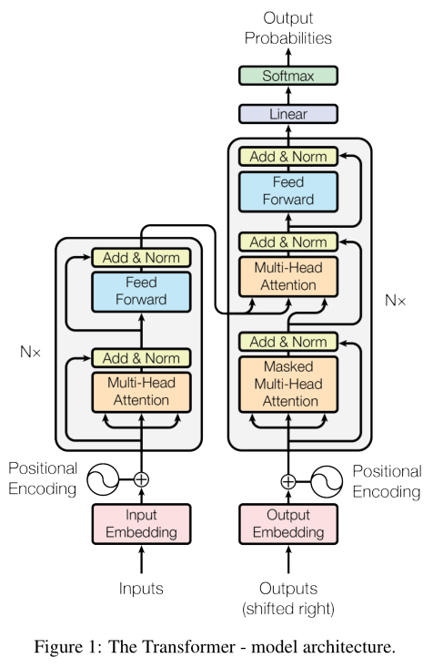

5. 前馈层的原理是什么，有什么作用
6.  layer normalization 原理是什么，跟 batch normalization 的区别

- [transformer](#transformer)
  - [tokenize 分词](#tokenize-分词)
    - [BPE 分词](#bpe-分词)
    - [BBPE 分词 (Byte-level Byte-Pair Encoding)](#bbpe-分词-byte-level-byte-pair-encoding)
  - [Embedding](#embedding)
    - [检索场景下的 Embedding](#检索场景下的-embedding)
  - [位置编码](#位置编码)
    - [正余弦位置编码](#正余弦位置编码)
    - [旋转位置编码 RoPE](#旋转位置编码-rope)
  - [MHA 多头注意力](#mha-多头注意力)
    - ["QKV" 直观理解](#qkv-直观理解)
    - [注意力](#注意力)
    - [其他注意力](#其他注意力)


# transformer



以下根据该图进行分块讲解。

## tokenize 分词

参考链接：[https://www.bilibili.com/video/BV1N9zyBYE6F](https://www.bilibili.com/video/BV1N9zyBYE6F)

transformer 的输入是向量，是由`句子-> 分词->词嵌入`这么来的，所以第一步分词，介绍几个常见的分词方法：


### BPE 分词

**BPE 分词流程举例：**

```shell
# 假设现在有这些词：(只有 newest lower widest low 其他都是重复的)
newest lower widest low newest newest widest low 
newest low widest newest lower low low newest
```

**1. 统计词频**

```shell
low         5
lower       2
newest      6
widest      3
```

**2. 将每个词按空格拆解成一个个的单词的字符序列并添加一个特殊符号表示单词的结束**

```shell
# 原始语料
n e w e s t </w> l o w e r </w> w i d e s t </w> l o w </w>
n e w e s t </w> n e w e s t </w> w i d e s t </w> l o w </w> 
n e w e s t </w> l o w </w> w i d e s t </w> n e w e s t </w>
l o w e r </w> l o w </w> l o w </w> n e w e s t </w>
# 词频
l o w </w>              5
l o w e r </w>          2
n e w e s t </w>        6
w i d e s t </w>        3
```

**3. 将每个字符组成初始词表**

```shell
# 初始词表
l, i, s, t, e, w, n, r, o, </w>, d
```

**4. 每轮找出出现频率最高的相邻字符，然后将其合并**

```shell
# 通过逐行对比，发现 e 和 s 在一起的频率最高，为 6+3=9 次，将其组合并添加到词表

# 词表变为：
l, i, s, t, e, w, n, r, o, </w>, d, es
# 原始语料就变为：
n e w es t </w> l o w e r </w> w i d es t </w> l o w </w>
n e w es t </w> n e w es t </w> w i d es t </w> l o w </w> 
n e w es t </w> l o w </w> w i d es t </w> n e w es t </w>
l o w e r </w> l o w </w> l o w </w> n e w es t </w>
# 词频表变为：
l o w </w>              5
l o w e r </w>          2
n e w es t </w>         6
w i d es t </w>         3
```

**5. 重复以上步骤**

```shell
# 词表变为：
l, i, s, t, e, w, n, r, o, </w>, d, es, est
# 词频表变为：
l o w </w>              5
l o w e r </w>          2
n e w est </w>          6
w i d est </w>          3
```

**6. 若干轮后**

```shell
# 词表变为：
l, i, s, t, e, w, n, r, o, </w>, d, es, est, est</w>, lo, low,
ne, new, newest</w>, low</w>, wi
# 词频表变为：
low</w>              5
low e r </w>         2
newest </w>          6
wi d est </w>        3
```

**7. 停止条件**

```shell
1. 达到指定的最大合并次数
2. 达到指定词表大小
3. 达到指定最小字符对出现频率
```

<details>
<summary>代码</summary>

```python
from collections import defaultdict

# ===================== 训练数据（词频形式） =====================
word_freq = {
    "low": 5,
    "lower": 2,
    "newest": 6,
    "widest": 3
}

def init_vocab(word_freq):
    """初始化词表，将每个单词分解为字符，并添加结束符 </w> 以标记单词结尾"""
    vocab = {}
    for word, freq in word_freq.items():
        chars = list(word) + ["</w>"]
        vocab[tuple(chars)] = freq
    return vocab

def get_pair_stats(vocab):
    """统计词表中相邻 pair 的频率"""
    pairs = defaultdict(int)
    for symbols, freq in vocab.items():
        for i in range(len(symbols) - 1):
            pairs[(symbols[i], symbols[i + 1])] += freq
    return pairs

def merge_pair(pair, vocab):
    """合并词表中出现的最高频 pair"""
    new_vocab = {}
    bigram = pair
    replacement = "".join(pair)

    for symbols, freq in vocab.items():
        new_symbols = []
        i = 0
        while i < len(symbols):
            if i < len(symbols) - 1 and (symbols[i], symbols[i + 1]) == bigram:
                new_symbols.append(replacement)
                i += 2
            else:
                new_symbols.append(symbols[i])
                i += 1
        new_vocab[tuple(new_symbols)] = freq

    return new_vocab

def train_bpe(word_freq, num_merges=10):
    """BPE 训练主流程"""
    vocab = init_vocab(word_freq)
    merges = []

    print("===== BPE 训练开始 =====")
    for i in range(num_merges):
        pairs = get_pair_stats(vocab)
        if not pairs:
            break

        best_pair = max(pairs, key=pairs.get)
        best_freq = pairs[best_pair]

        print(f"第 {i+1:02d} 轮合并: {best_pair} -> {''.join(best_pair)}  (频率={best_freq})")

        vocab = merge_pair(best_pair, vocab)
        merges.append(best_pair)

    print("===== BPE 训练结束 =====\n")
    return merges

def apply_bpe(word, merges):
    """使用学到的 merges 规则进行分词"""
    tokens = list(word) + ["</w>"]

    for pair in merges:
        i = 0
        while i < len(tokens) - 1:
            if (tokens[i], tokens[i + 1]) == pair:
                tokens[i:i + 2] = ["".join(pair)]
            else:
                i += 1

    return tokens

if __name__ == "__main__":
    merges = train_bpe(word_freq, num_merges=10)

    print("最终学习到的 merges 规则：")
    for m in merges:
        print(m)

    print("\n===== 分词测试 =====")
    test_words = ["newest", "lower", "widest", "low"]
    for w in test_words:
        print(f"{w} -> {apply_bpe(w, merges)}")
```
</details>

### BBPE 分词 (Byte-level Byte-Pair Encoding)

BPE 只针对英文单词，遇到中文或者表情的时候，就不好使了，这时候可以用 BBPE

BBPE 采用 UTF-8 来进行分词

**BBPE 分词流程举例**

```shell
# 每个汉字在 UTF-8 中用三个字节表示
# 比如 坤->E59DA4
# 假设现在：

# 原始语料
好好学习, day day up
# 字节语料
E5 A5 BD E5 A5 BD E5 AD A6 E4 B9 A0 EF BC 8C 64 61 79 20 64 61 79 20 75 70
# 跟 BPE 的区别就是，BBPE是分字节，BPE 是分字母
```

**1. 统计词频**

```shell
# 统计频率最高的相邻字节
E5      2
A5      2
BD      2
...
# 词表
E5, A5, BD, E5, A5, BD, E5, AD, A6, E4, B9, A0, EF,
BC, 8C, 64, 61, 79, 20, 64, 61, 79, 20, 75, 70
# 这里不需要加 </w> 来表示空格，因为 BBPE 中空格也是可以表示参与计算的，这里的 20 就是空格
```

**2. 后面就跟 BPE 一个原理了**

## Embedding

一句话理解：

- Tokenizer：文字 -> 编号
- Embedding：编号 -> 向量

**不同场景下的 Embedding**

1. LLM 里的 embedding：本质是一个可训练的大矩阵，属于 Transformer 模型的一部分。它的训练目标是服务“语言建模/生成”。
2. 检索场景里的 embedding：在 RAG / 向量检索（如 ElasticSearch）中，embedding 的目标是把语义相近的内容映射到相近的向量空间中，强调“相似度可比”。

### 检索场景下的 Embedding

LLM 里的 Embedding 是模型的一部分，不赘述，这边介绍下检索的 Embedding 怎么训练的

**核心思想**：拉近正样本、推远负样本。

```text
# 典型样本形式
- (问题, 正确答案) -> 拉近
- (问题, 随机文本) -> 推远
- (句子A, 改写句子A) -> 拉近
- (句子A, 不相关句子) -> 推远

# 常见损失函数
- Cosine similarity loss
- Triplet loss
- InfoNCE loss
```
**常见训练数据来源**

| 数据来源     | 用途                   |
| ------------ | ---------------------- |
| 问答对（QA） | 问题和答案语义接近     |
| 相似句对     | 同义改写               |
| 搜索点击日志 | 用户点击结果作为正样本 |
| 翻译句对     | 跨语言对齐             |

**常见检索向量模型（示例）**

| 模型                   | 说明                          | 语言          |
| ---------------------- | ----------------------------- | ------------- |
| text-embedding-3-large | OpenAI 新版 embedding，效果强 | 通用英文      |
| bge-large-en           | 开源强模型，BAAI 出品         | 通用英文      |
| e5-large               | 微软检索模型                  | 通用英文      |
| bge-large-zh           | 中文检索效果好                | 中文 / 多语言 |
| bge-m3                 | 多语言 + 多功能（检索/排序）  | 中文 / 多语言 |
| e5-multilingual        | 多语言通用                    | 中文 / 多语言 |

**为什么检索 embedding “更懂相似度”**

以 BGE / E5 为例，通常两阶段训练：

1. 第一阶段：大规模弱监督
   1. 标题 ↔ 正文
   2. 问题 ↔ 页面
   3. 搜索词 ↔ 点击文档
2. 第二阶段：人工标注精调
   1. query → 哪个文档更相关

通过排序损失优化，让模型学会“哪个更像答案”。

**总结**

- LLM embedding：服务“生成语言”。
- 检索 embedding：服务“衡量语义相似度”。
- 结构相似（都基于 Transformer），但**训练目标与用途完全不同**。

## 位置编码

**为什么需要位置编码**

查看计算注意力的公式，会发现其中并没有在意每个词的位置关系。如果没有位置编码，模型理解“我爱你”跟“你爱我”是一样的。

所以要让模型正确理解整个句子，就要让模型知道每个字的前后位置关系。


**为什么不用简单一点的，如固定数字的位置编码， 如 01234...**

1. 破坏词向量的分布，影响模型训练的稳定性。在词向量加上 `0-1-2-...-1024-...`，方差太大了，破坏了词向量分布。
2. 只能固定表达若干长度，模型泛化能力差。

### 正余弦位置编码

维度偶数项：

$$
PE(pos,2i)=\sin (\frac{pos}{10000^{\frac{2i}{d_{model}}}})
$$

维度奇数项：

$$
PE(pos,2i+1)=\cos (\frac{pos}{10000^{\frac{2i}{d_{model}}}})
$$

其中：
- $pos$: 单词在序列中的位置
- $d_{model}$: 词向量的维度（固定值）
- $i$: 位置编码向量中的维度索引，范围在 $[0, \frac{d_{model}}{2}-1]$

**为什么这两个公式包含相对位置信息呢？**

> **任意位置 $pos+k$ 可以由位置 $pos$ 线性表示得到。**（公式推导省略）
> 
> $$
> PE(pos+k)=T\times PE(pos)
> $$
>
> 所以这两个公式包含了相对位置关系。

**相比于01234有什么别的好处**

> 1. 可以自然扩展，长度不固定，模型泛化能力强
> 2. 01234只能表示一个维度的相对位置信息。而正余弦编码：
>    1. 低维度可以表示局部位置信息
>    2. 高纬度可以表示全局位置信息
>    3. 使每个词里既可以表示跟前后词的关系，也可以带有跟前后段落的关系

**那么它有什么缺点呢？**

> 1. （下面的 RoPE 一开始会提到）
> 2. 会引入噪声。放到注意力中用公式理解：
> 
> $$
> Q=W_q(X_m+P_m) \\
> K=W_k(X_n+P_n)
> $$
> 
> 计算注意力矩阵：
> 
> $$
> \begin{align*}
> score& =(X_m+P_m)(X_n+P_n)^T \\
> & =(X_m+P_m)(X_n^T+P_n^T) \\
> & =X_mX_n^T+X_mP_n^T+P_mX_n^T+P_mP_n^T
> \end{align*}
> $$
> 
> 其中：
> - 第一项是纯语义信息
> - 最后一场是纯相对位置
> - 中间两项语义跟位置相乘是什么？属于**交叉噪声**

### 旋转位置编码 RoPE

参考链接1：[https://www.bilibili.com/video/BV1FjrCBdESo](https://www.bilibili.com/video/BV1FjrCBdESo)

参考链接2：[https://www.bilibili.com/video/BV1F1421B7iv](https://www.bilibili.com/video/BV1F1421B7iv)

正余弦位置编码（假设如下）：

```shell
词向量      位置向量     新词向量
0.3         0.8         1.1
0.92        0.21        1.13
-1.23   +   0.6    =   -0.63
0.4         0.32        0.72
0.21        0.98        1.19
-0.9        0.12        -0.78
```

> 直接将位置向量加到词向量中**会有以下问题**：
> 1. 新词向量模长变了
> 2. 新词向量方向乱了
> 3. 破坏语义信息。新词向量中的数值哪部分表示原来的词向量，哪部分表示位置向量
> 
> **虽然位置被标记了，但是原本的词也被污染了。**

RoPE 放弃加法，采用旋转。

旋转矩阵：

$$
R(\theta)=
\begin{pmatrix}
\cos \theta & -\sin \theta \\
\sin \theta & \cos \theta
\end{pmatrix}
$$

根据一些数学公式有：

$$
R(\theta_1)R(\theta_2)=R(\theta_1+\theta_2)
$$

$$
R(\theta)^T=R(-\theta)
$$

RoPE 的思想：
- 第 $m$ 个词就逆时针旋转 $m$ 个 $\theta$ 角度
- 第 $n$ 个词就逆时针旋转 $n$ 个 $\theta$ 角度
- 这里的 $\theta$ 是一个基本角度，比如 $20°$、$30°$ 等

注意力计算中的 QKV 就可以有如下：

> 原本（没有位置信息）：
> 
> $$
> attention(q,k)=q\cdot k=qk^T
> $$
> 
> 加入旋转位置编码（带有相对位置信息，$\theta$ 懒得打，比较好看）：
> 
> $$
> \begin{align*}
> qR(m)\cdot kR(n) &=qR(m)R(n)^Tk^T \\
> & =qR(m)R(-n)k^T \\
> & =qR(m-n)k^T
> \end{align*}
> $$
>
> 可见，旋转位置编码加入的相对位置信息是非常干净纯粹的。

**但是旋转矩阵只有两维，怎么办？**

> 采用分治方法！假如有 4096 的长度，就两两一组拆成 2048 对，各转各的。
> 
> 就会变成类似这样，互相之间不会影响到：
> 
> $$
> \begin{bmatrix}
> \cos \theta & -\sin \theta & 0 & 0 & ... & 0 & 0 \\
> \sin \theta & \cos \theta & 0 & 0 & ... & 0 & 0 \\
> 0 & 0 & \cos \theta & -\sin \theta & ... & 0 & 0 \\
> 0 & 0 & \sin \theta & \cos \theta & ... & 0 & 0 \\
> ... & ... & ... & ... & ... & ... & ... \\
> 0 & 0 & 0 & 0 & ... & \cos \theta & -\sin \theta \\
> 0 & 0 & 0 & 0 & ... & \sin \theta & \cos \theta \\
> \end{bmatrix}
> $$

**不同维度角度会重叠怎么办？比如怎么区分 $10°$ 跟 $370°$？**

> RoPE 让每一组的 $\theta$ 都不一样，公式如下（跟正余弦位置编码的很像）
> 
> $$
> \theta_i=10000^{-\frac{2(i-1)}{d_{model}}}, i\in [1, 2, ..., \frac{d}{2}]
> $$
> 
> - 组的维数越低，$\theta$ 越大，转的越快
> - 组的维数越高，$\theta$ 越小，转的越慢

**总结**

> 旋转位置编码跟正余弦编码的公式可以很明显发现：
> - 旋转位置编码不会改变词向量的模长
> - 旋转位置编码不会改变词向量的相对角度
> - 旋转位置编码不会引入交叉噪声

## MHA 多头注意力

参考链接1：[https://www.bilibili.com/video/BV1G4iMBeEWH](https://www.bilibili.com/video/BV1G4iMBeEWH)

参考链接2：[https://www.bilibili.com/video/BV1nJynBKEvY](https://www.bilibili.com/video/BV1nJynBKEvY)

### "QKV" 直观理解

拿参考链接1的例子：翻译 **“货拉拉拉不拉拉布拉多”**

```shell
# 整个过程可以理解成“查询数据库”，如下：

query  ｜                 拉不拉                ｜    # 查询 query

       ｜--------------------------------------｜
key    ｜  货拉拉      拉不拉          拉布拉多   ｜     # 键 key：就是数据本身
       ｜--------------------------------------｜
       ｜  货车        拉货            宠物      ｜
value  ｜  名词        动词            名词      ｜     # 值 value：就是数据背后的含义
       ｜  搬家        拉扯            狗        ｜
       ｜--------------------------------------｜

# 计算机在理解“拉不拉”时，应该重点关注哪些词
# 就可以抽象为拿着“拉不拉”这个词去数据库里挨个遍历一遍，看哪些词对“拉不拉”的参考价值更大
```

### 注意力

每个词（Query）都去“问”一遍所有词（Key），得到相关性权重（就是所谓的“注意力矩阵”），再用这些权重对所有词的语义（Value）做加权求和。

注意力主要需要了解几个相关的问题。

**计算 QK 相似度的时候为什么用点积，可不可以用欧式距离或者余弦相似度，为什么？**

> 参考链接：[https://www.bilibili.com/video/BV19Sy6BjEZ4](https://www.bilibili.com/video/BV19Sy6BjEZ4)
> 
> **1、余弦相似度**（点积除以模长相乘，复杂度`6N`）：
> 
> $$
> \frac{\sum_{i=1}^n A_iB_i}{\sqrt{\sum_{i=1}^n A_i^2} \times \sqrt{\sum_{i=1}^n B_i^2}}
> $$
> 
> 余弦相似度只关注两个向量的方向，而不关注向量的模长。（除以模长相乘就归一化了嘛）
> 
> **一个词的频率和语义的强烈程度是会体现在模长上的**。
> 
> **2、欧式距离**（复杂度`3N`）：
> 
> $$
> \sqrt{\sum_{i=1}^n (A_i-B_i)^2}
> $$
> 
> 欧式距离只关注两个向量的距离，而忽略了他们的方向性。（平方求和就消除了方向）
> 
> 而**方向性又是语义相似度非常重要的表示方式**。
> 
> 而且欧式距离在高纬空间还可能出现维度灾难，计算会变得不稳定且不准确。
> 
> **3、点积**（复杂度`2N`）：
> 
> $$
> \sum_i^n A_iB_i
> $$
> 
> **点积既考虑了向量的方向又考虑到了模长，并且计算简单**。

**为什么 QKV 的时候要除以$\sqrt{d_k}$**

> 点积的期望和方差会随 $d_k$ 变大而变大。若不缩放，$QK^T$ 的数值会偏大，导致 softmax 进入饱和区，从而梯度消失。
> 
> 直观理解：假设 $q_i,k_i$ 独立同分布且均值为 0、方差为 1，则点积 $\sum_{i=1}^{d_k} q_i k_i$ 的方差与 $d_k$ 成正比。除以 $\sqrt{d_k}$ 可让方差恢复到 $O(1)$。

**softmax公式是什么？softmax 遇到很大的值时，取指数直接导致数值溢出怎么办？**

> softmax 公式：
> 
> $$
> {softmax}(x_i)=\frac{e^{x_i}}{\sum_j e^{x_j}}
> $$
> 
> `safe softmax`数值稳定做法（减最大值）：
> 
> $$
> {softmax}(x_i)_{safe}=\frac{e^{x_i-\max(x)}}{\sum_j e^{x_j-\max(x)}}
> $$
> 
> **减去最大值计算出来的结果跟原来一样吗？**
> 
> 当然一样，我们关心的是各个元素之间的相对关系，并不关心他们的绝对大小。这样不会改变结果，但可避免指数溢出。完美～
> 
> **为什么要减去最大值？如果值分布比较极端如 [1, 2, 1000] 会怎样？**
> 
> 该例子中，减去最大值后，变为`[-999, -998, 0]`，指数函数在 x 很小的时候趋近于零，并不会“爆炸”，所以没有任何问题。
> 
> （现在 pytorch 都是用 safe softmax 来实现的。）

**为什么用多头注意力，有什么好处？**

> 多头注意力把 $d_{model}$ 拆成多个子空间并行计算：
> 
> 1. **关注不同关系**：不同头可分别关注语义、句法、位置或局部/全局依赖。
> 2. **提升表达能力**：单头只能在一个子空间做匹配，多头等价于在多个“视角”做匹配再融合。
> 3. **稳定训练**：多头分摊了单个注意力的负担，减少单头过拟合某种模式。
> 
> 最终通过 concat + 线性映射把多头信息融合回 $d_{model}$。

**原始 transformer 中为什么有两个 attention 不需要 mask，有一个需要 mask？mask 是怎么做的？**

> 原始 Transformer（Encoder–Decoder 结构）里一共有 三处 Attention：
> 
> **Encoder Self-Attention（编码器自注意力）——不需要 Mask**
> 
> - 编码器的输入是完整的源语言句子（如“我爱你”）。无论在训练还是推理阶段，这个句子都是一次性提供给模型的。
> - 编码器的目标是：让每个词都能理解整个句子的上下文语义
> - 因此：每个 token 都可以看到句子中所有其他 token
> - 不存在“未来信息泄露”的问题，所以 不需要因果 Mask
> - （但实际工程中通常会有 Padding Mask，用来忽略 `<pad>` 位置，而不是因果 mask）
> 
> **Decoder Self-Attention（解码器自注意力）——必须使用 Mask**
> 
> - 生成 “I love you” 的过程是：`I -> I love -> I love you`
> - 当模型在预测当前位置词时，例如预测 love：只能看到之前生成的词 I，不能看到未来词 you，否则就等于“偷看答案”，训练和推理过程不一致。
> - 因此需要加 Causal Mask（因果掩码），保证第 i 个位置只能关注 ≤ i 的 token
> 
> **Encoder–Decoder Cross-Attention（交叉注意力）——不需要因果 Mask**
> 
> - 这一层发生在解码器中：**Query 来自 Decoder 当前状态，Key / Value 来自 Encoder 输出（整句中文）**
> - 解码器在生成每个英文词时，都可以查看完整的中文句子表示，这是合理的：翻译时，本来就应该随时参考完整原文。
> - 这里不存在“未来泄露”问题，因为源句是已知的。所以不需要因果 Mask
> - 同样，实际实现中仍可能有 Padding Mask，防止注意到源句中的 <pad> 位置
> 
> 
> **mask 做法**：在 $QK^T$ 上加一个矩阵 $M$：
> 
> $$
> \hat{S}=\frac{QK^T}{\sqrt{d_k}}+M
> $$
> 
> 其中需要屏蔽的位置（矩阵上三角）取 $-\infty$（实现里是一个很大的负数），softmax 后权重近似为 0。


### 其他注意力

由 MHA 还引出了很多 Attention 的优化，详见：[Attention.md](../Attention.md)