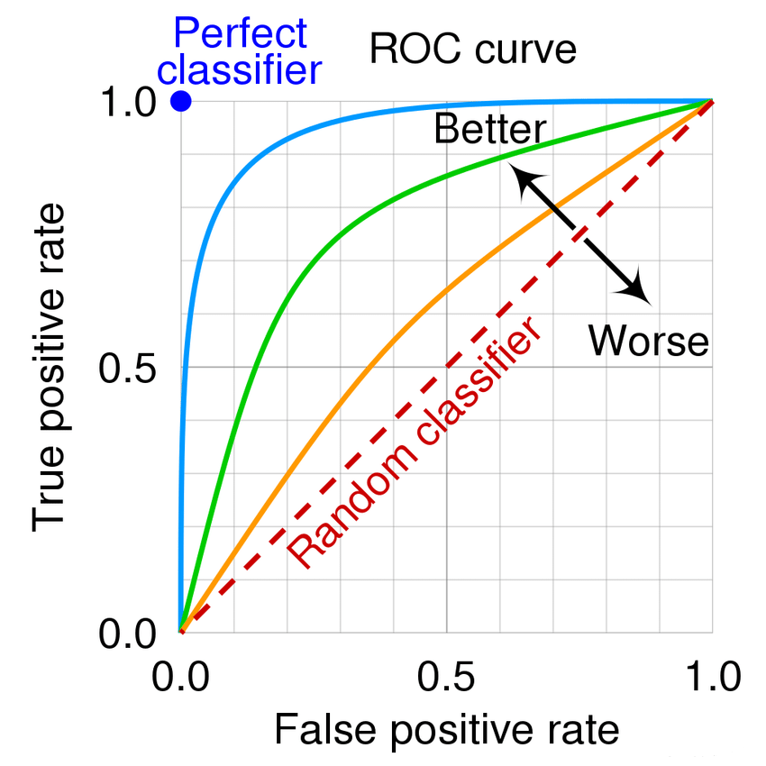
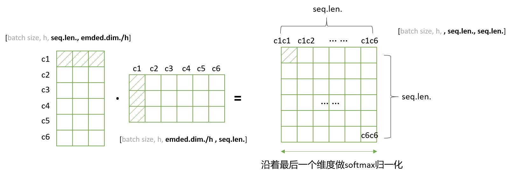

- [计算机基础](#计算机基础)
- [深度学习基础](#深度学习基础)
- [强化学习相关](#强化学习相关)
- [大模型相关](#大模型相关)
- [RAG相关](#rag相关)
- [Agent相关](#agent相关)


## 计算机基础

<details>
<summary>进程、线程、协程</summary>

<br>

**基本定义**

> | 名称              | 定义                                                                                                                 |
> | ----------------- | -------------------------------------------------------------------------------------------------------------------- |
> | 进程（Process）   | 操作系统资源分配的基本单位，是一个运行中的程序。**每个进程拥有独立的内存空间、文件描述符等资源**。                   |
> | 线程（Thread）    | 操作系统调度的基本单位。一个进程可以有多个线程，它们**共享内存、文件等资源**，但各有**独立的执行栈、程序计数器**等。 |
> | 协程（Coroutine） | **用户态的轻量线程**，由程序（非操作系统）调度。可以在函数之间主动切换，不涉及内核切换，切换开销非常小。             |

**主要区别**

> | 对比项             | 进程                      | 线程                 | 协程                           |
> | ------------------ | ------------------------- | -------------------- | ------------------------------ |
> | 调度者             | 操作系统                  | 操作系统             | 程序自身（用户态调度）         |
> | 切换开销           | 大（上下文+地址空间切换） | 中等（共享地址空间） | 极小（仅栈切换）               |
> | **内存空间**       | 独立                      | 共享进程空间         | 共享线程空间（通常）           |
> | **通信方式**       | 进程间通信（IPC）         | 共享内存或信号量     | 通常通过共享变量、channel 等   |
> | 创建/销毁开销      | 大                        | 小                   | 极小                           |
> | 并发能力           | 支持（一般）              | 支持（好）           | 支持（极好，但通常不是真并行） |
> | 是否依赖 OS   支持 | 是                        | 是                   | 否（用户级实现）               |

**举个现实比喻**

> | 名称 | 比喻                                                           |
> | ---- | -------------------------------------------------------------- |
> | 进程 | 是一家公司，有自己楼房（内存空间）和员工（线程）               |
> | 线程 | 是公司的员工，共享办公资源（内存），但可以独立干活             |
> | 协程 | 是员工的多项任务清单，在自己安排下轮流做事情（非操作系统强制） |

**适用场景**

> | 类型 | 适合场景                                                              |
> | ---- | --------------------------------------------------------------------- |
> | 进程 | 安全隔离强、独立部署（如浏览器标签页、服务进程）                      |
> | 线程 | 需要高并发但共享状态，如 Web 服务器                                   |
> | 协程 | 需要大量高并发、IO 密集的任务，如爬虫、异步网络服务（如 Go、Node.js） |

</details>


## 深度学习基础

<details>
<summary>查全率、查准率、PR曲线、ROC曲线</summary>

<br>

**各种指标介绍**

> <table>
>     <tr align='center'>
>         <th rowspan ='2'>真实情况</th>
>         <th colspan ='2'>预测结果</th>
>     </tr>
>     <tr align='center'>
>         <th colspan ='1'>正例</th>
>         <th colspan ='1'>反例</th>
>     </tr>
>     <tr  align='center'>
>         <td>正例</td>
> 		<td>TP(真正例)</td>
>         <td>FN(假反例)</td>
>     </tr>
>     <tr  align='center'>
>         <td>反例</td>
> 		<td>FP(假正例)</td>
>         <td>TN(真反例)</td>
>     </tr>
> </table>
> 
> - **准确率（Accuracy）**：对于给定的测试数据集，分类正确的样本数与总样本数之比
>   
> $$
> \frac{TP+TN}{总样本数}
> $$
> 
> - **精确率/查准率（Precision）**：预测为正的样本中，又多少是真正的正样本（说人话：预测是True的到底多少是True）
> 
> $$
> \frac{TP}{TP+FP}
> $$
> 
> - **召回率/查全率（Recall）**：样本中有多少正例被预测正确了（说人话：有没有漏掉True）
> 
> $$
> \frac{TP}{TP+FN}
> $$
> 
> 
> **查准率和查全率是一对矛盾的度量**。

**PR曲线**

> PR曲线（Precision-Recall Curve）：以查准率为纵轴、查全率为横轴作图 ，就得到了查准率-查全率曲线。（**PR 曲线关注的是正类的识别质量**）
> 
> PR曲线的面积代表：模型在不同阈值下，Precision 和 Recall 之间的平均权衡性能。越接近 1，模型越好。
> 
> 

**ROC曲线**

> ROC曲线：以​​假正率（FPR）​​为横轴，​​真正率（TPR）​​为纵轴，反映模型在不同阈值下的分类性能。（见下图，来源csdn）
> 
> ROC曲线的含义：曲线越靠近左上角，模型性能越好。（**更关心整体区分能力**）
> 
> AUC（Area Under Curve）：ROC 曲线下的面积，AUC 越接近 1，模型越好；0.5 表示完全随机。
> 
> 

**PR曲线与ROC曲线对比**

> | 维度​       | ​​PR曲线​​                          | ​​​ROC曲线​                      |
> | ----------- | ----------------------------------- | -------------------------------- |
> | ​横轴​​​​   | 召回率（Recall）                    | 假正率（FPR）                    |
> | ​纵轴​​​    | 精确率（Precision）                 | ​真正率（TPR）​​                 |
> | ​敏感度​​​  | 对类别不平衡数据更敏感              | 对类别平衡数据更敏感​​           |
> | 适合场景    | 正负样本极度不均衡时更合适          | 正负样本比例均衡的情况           |
> | ​典型场景​​ | ​​ 欺诈检测、推荐系统（正样本极少） | 医疗诊断、金融风控（平衡数据）​​ |
> | ​AUC意义​​  | ​​ PR-AUC越高，正样本识别能力越强   | ROC-AUC越高，整体分类性能越好​​  |
> | 解读重点    | 找出的正样本中有多少的真的          | 能不能将正负样本分得开           |

</details>

<details>

<summary>损失函数</summary>

<br>

**回归问题常用损失函数-均方误差**

> 均方误差（MSE, Mean Squared Error）
> 
> $$
> Loss_{MSE}=\frac{1}{n} \sum_{n=1}^n (y_i-\hat{y_i})^2
> $$
> 
> - 用途：最常见的回归损失
> - 特点：
>   - 强调大误差（因为平方），对异常值敏感
>   - 可导，计算简单

**分类问题常用损失函数**

> **交叉熵损失（Cross Entropy Loss）**
> 
> 对于二分类（Binary）：
> 
> $$
> Loss_{BCE}=-[y\log{(\hat{y})} + (1-y)\log{(1-\hat{y})}]
> $$
> 
> 对于多分类（Multi-class）：
> 
> $$
> Loss_{CE}=-\sum_{i=1}^C y_i \log{(\hat{y_i})}
> $$
> 
> - 用途：分类任务中最常用
> - 特点：
>   - 与 softmax 联用效果最佳
>   - 本质上是最大似然估计（MLE）
> 
> **KL 散度（Kullback–Leibler Divergence）**
> 
> $$
> Loss_{KL}(P||Q)=\sum_i{P(i)\log{\frac{P(i)}{Q(i)}}}
> $$
> 
> - 用途：衡量两个概率分布的差异
> - 应用：知识蒸馏、语言模型对齐等
> 
> **Focal Loss（用于不平衡类别）**
> 
> $$
> Loss_{focal}=-\alpha_t(1-p_t)^{\gamma}\log{p_t}
> $$
> 
> - 用途：目标检测、处理类别不均衡
> - 特点：
>   - 减少易分类样本的损失
>   - 关注困难样本

</details>


<details>
<summary>激活函数</summary>

<br>

**Sigmoid 函数（S 型函数）**

> $$
> \sigma(x)=\frac{1}{1+e^{-x}}
> $$
> 
> - 输出范围：$(0, 1)$
> - 优点：
>   - 可解释为概率
>   - 平滑、连续、可导
> - 缺点：
>   - **梯度消失**（对大正/负值梯度接近 0）
>   - 非零中心（输出总是正的，导致更新不均衡）

**Softmax（分类输出层专用）**

> $$
> softmax=\frac{e^{x_i}}{\sum_{j=1}^{n}{e^{x_j}}}
> $$
> 
> - 作用：将输出向量转换为概率分布
> - 常用于：分类网络最后一层

**sigmoid跟softmax何时用**

> **先理解本质：Softmax 和 Sigmoid 的区别**
> | 属性         | Sigmoid                    | Softmax                                      |
> | ------------ | -------------------------- | -------------------------------------------- |
> | 输出范围     | (0, 1)                     | 每个值在 (0, 1)，总和为 1                    |
> | 输出解读     | 单个输出是“属于某类”的概率 | 多个输出合起来表示“分别属于每一类”的概率分布 |
> | 是否相互竞争 | 否（每个输出互不影响）     | 是（一个类别概率变大，其他自动变小）         |
> 
> **Sigmoid 适合二分类的原因**
> 
> 用在二分类时（例如“是猫” vs “不是猫”）：
> - 网络输出层只有一个神经元，输出一个值$x$
> - 使用 sigmoid 函数把这个值压缩到$(0,1)$
> - 可以解释为“样本属于正类的概率”
> 
> 例如：
> 
> ```python
> logits = model(x)  # 输出一个标量，如 2.1
> prob = sigmoid(logits)  # 转换为概率，例如 0.89
> ```
> 
> 常搭配的损失函数：`Binary Cross Entropy（BCE）`，用于衡量预测概率与真实标签（0 或 1）的差异。
> 
> **Softmax 适合多分类的原因**
> 
> 多分类场景（例如“猫/狗/马”）：
> - 输出层有多个神经元（等于类别数），比如 3 个
> - 每个输出代表对应类别的“打分”
> - 使用 softmax 把这些打分转为概率分布，总和为 1
> 
> 例如：
> 
> ```python
> logits = model(x)  # 输出 [2.0, 0.5, -1.2]
> probs = softmax(logits)  # 输出 [0.75, 0.20, 0.05]，属于“猫”的概率最高
> ```
> 
> 常搭配的损失函数：`CrossEntropyLoss`（即 softmax + log + NLLLoss 的组合），自动将预测值转成概率并对比真实标签的 one-hot 编码。
> 
> **总结：何时用哪一个？**
> 
> | 任务类型   | 输出结构                | 激活函数 | 损失函数             |
> | ---------- | ----------------------- | -------- | -------------------- |
> | 二分类     | 一个输出（logit）       | Sigmoid  | Binary Cross Entropy |
> | 多分类     | N 个输出（类别数）      | Softmax  | Cross Entropy Loss   |
> | 多标签分类 | N 个输出，每类独立  0/1 | Sigmoid  | Binary Cross Entropy |
> 
> **类比理解（直觉）**
> 
> - Sigmoid：像在问“这个东西是不是 A？” 只关心一个维度
> - Softmax：像在问“这个东西到底是 A 还是 B 还是 C？” 每个输出互相竞争

</details>


<details>
<summary>反向传播与梯度下降</summary>

<br>

**神经网络训练流程与反向传播的核心目标**

> **神经网络训练流程**：
> 1. 前向传播（Forward Pass）：从输入层开始逐层计算输出
> 2. 计算损失（Loss）：用输出和真实标签计算损失
> 3. 反向传播（Backward Pass）：根据损失对每一层参数计算梯度
> 4. 参数更新（Gradient Descent）：使用梯度更新参数
> 
> **反向传播核心目标**：计算损失函数对所有参数的梯度，用于梯度下降更新权重。

**反向传播的核心工具：链式法则**

> 链式法则（Chain Rule）是反向传播的数学基础：
> 
> $$
> \frac{dL}{dW}=\frac{dL}{da} · \frac{da}{dz} · \frac{dz}{dW}
> $$
> 
> 每一层只需“局部”计算自己的导数，然后乘上传来的“梯度链”。

**基本梯度下降**

> $$
> \theta \leftarrow \theta - \eta \frac{\partial{L}}{\partial{\theta}}
> $$
> 
> 其中：
> - $\theta$：一个参数，比如$W$
> - $\eta$：学习率，控制每次更新的步长
> - $\frac{\partial{L}}{\partial{\theta}}$：反向传播得到的梯度
> - 梯度下降就是用梯度告诉我们“往哪走能让损失更小”，然后我们每次沿那个方向“走一小步”，直到找到最小值。

**示例：数值举例**

> **设定**：
> - 输入：$x=2.0$
> - 权重：$W=1.0$
> - 偏置：$b=0$
> - 标签：$y=0$
> - 激活函数：恒等函数（线性激活）$\hat{y}=z=Wx+b$（演示而已，不给太复杂的）
> - 损失函数：均方误差（MSE）：$Loss=\frac{1}{2}(\hat{y}-y)^2$
> - 学习率：$0.1$
> 
> **前向传播**：
> $$
> \begin{gather*}
>     z=Wx+b=1.0\times2.0+0=2.0 \\
>     \hat{y}=z=2.0 \\
>     Loss=\frac{1}{2}(2.0-0)^2=2.0
> \end{gather*}
> $$
> 
> **反向传播计算导数**：
> 
> 使用链式法则：
> 
> $$
> \begin{align*}
>     \frac{dL}{dW}&=\frac{dL}{d\hat{y}} · \frac{d\hat{y}}{dz} · \frac{dz}{dW} \\
>     &=(\hat{y}-y) · 1 · x \\
>     &=2.0 · 1 · 2.0 \\
>     &=4.0
> \end{align*}
> $$
> 
> **使用这个梯度更新 W**
> 
> $$
> W_{new}=W-\eta · \frac{\partial{L}}{\partial{W}}=1.0-0.1 · 4.0=0.6
> $$


</details>

<details>
<summary>梯度下降与优化器</summary>

<br>

**基本梯度下降**

> $$
> \theta \leftarrow \theta - \eta \frac{\partial{L}}{\partial{\theta}}
> $$
> 
> 其中：
> - $\theta$：一个参数，比如$W$
> - $\eta$：学习率，控制每次更新的步长
> - $\frac{\partial{L}}{\partial{\theta}}$：反向传播得到的梯度
> - 梯度下降就是用梯度告诉我们“往哪走能让损失更小”，然后我们每次沿那个方向“走一小步”，直到找到最小值。

**Batch Gradient Descent（BGD 批量梯度下降）**

> - 每轮迭代**用全部训练数据计算梯度**。
> - 更新稳定，但每次计算开销大，不适合大数据集。
> 
> $$
> \theta \leftarrow \theta - \eta · \frac{1}{N} \sum_{i=1}^N \nabla_\theta L(x_i,y_i) \\
> \theta \leftarrow \theta - \eta · \frac{1}{N} \sum_{i=1}^N \frac{\partial L^{(i)}}{\partial \theta} \\
> $$
> 
> 其中：
> - $\eta$：学习率（learning rate）
> - $N$：样本总数
> - $L^{(i)}$：第$i$个样本的损失函数
> 
> 优点：更新方向精确、收敛平稳
> 缺点：内存占用高，速度慢

**Stochastic Gradient Descent（SGD）**

> - 每次迭代只使用一个样本计算梯度
> 
> $$
> \theta \leftarrow \theta - \eta · \nabla_\theta L(x_i,y_i) \\
> \theta \leftarrow \theta - \eta · \frac{\partial L^{(i)}}{\partial \theta} \\
> $$
> 
> 优点：迭代快，适合大数据、在线学习
> 缺点：波动大、不稳定、可能收敛到局部最优

**Mini-batch Gradient Descent（小批量梯度下降）**

> - 每次迭代用一个小批量（如 32 或 64）样本：
> 
> $$
> \theta \leftarrow \theta - \eta · \frac{1}{m} \sum_{i=1}^m \nabla_\theta L(x_i,y_i) \\
> \theta \leftarrow \theta - \eta · \frac{1}{m} \sum_{i=1}^m \frac{\partial L^{(i)}}{\partial \theta} \\
> $$
> 
> 优点：比 batch 快，且比 SGD 稳定，GPU 上更高效（张量并行）。现代神经网络中最常用的形式

**为什么不直接用最基础的梯度下降？**
> 
> | 问题               | 原因                           |
> | ------------------ | ------------------------------ |
> | 震荡、收敛慢       | 学习率固定且对所有参数一样     |
> | 陷入局部最优       | 梯度方向不够准确或变化太大     |
> | 稀疏数据难以处理   | 学习率不能针对每个参数单独调整 |
> | 学习率难以手动调好 | 手动调参难，收敛不稳定         |

**Momentum（动量法）**

> - 类似物理中“惯性”的概念。给参数一个速度变量v
> - 先更新动量，再更新参数
> 
> $$
> v_t=\gamma v_{t-1}+\eta · \nabla_\theta L(\theta) \\
> \theta_t \leftarrow \theta_{t-1} - v_t
> $$
> 
> - **让参数更新沿着长期一致的下降方向加速，避免被局部波动干扰**
> - 在“平坦区”加快收敛，减少摆动，整体收敛更快更稳定

**Adaptive Gradient Algorithm（AdaGrad 自适应梯度算法）**

> **核心理念**：给每个参数一个自适应的学习率，让更新频繁的参数学习率变小，更新不频繁的参数保持较大学习率。
> 
> $$
> G_{t,i}=G_{t-1,i}+(\nabla_{\theta_i} L(\theta))^2 \\
> \theta_i \leftarrow \theta_i - \frac{\eta}{\sqrt{G_{t,i}}+\epsilon} · \nabla_{\theta_i} L(\theta)
> $$
> 
> - 对于每个参数$\theta_i$，我们记录其历史所有梯度的平方和（只对该参数维度）。
> - $G_{t,i}$是标量，表示$\theta_i$在迄今为止每一轮的梯度平方的累计值。
> - 随着训练进行，$G_{t,i}$会越来越大（或保持不变）。
> - 每个参数$\theta$拥有自己专属的学习率$\frac{\eta}{\sqrt{G_{t,i}}+\epsilon}$
>   - 如果某个参数的梯度一直很大，$G_{t,i}$增长很快，则学习率下降得很快。
>   - 如果某个参数的梯度一直很小，$G_{t,i}$增长缓慢，则学习率下降得慢。
> 
> **利用历史梯度自动调整每个参数的学习率**：
> - 频繁更新的参数 -> 学习率自动变小（趋于稳定）
> - 更新较少的参数 -> 学习率保持较大（继续探索）
> 
> 优点：对稀疏特征（如 NLP）特别有效
> 缺点：$G_{t,i}$是累计和，训练时间长后会很大，导致学习率不断变小，甚至趋近于 0；

**RMSProp（Root Mean Square Propagation）**

> 改进点：不要累加所有历史梯度平方，而是使用指数衰减平均（EMA）来控制“历史的记忆长度”。
> 
> - 改进 AdaGrad 的“过早衰减”问题
> - 使用指数衰减平均
> 
> $$
> E[g^2]_t=\gamma E[g^2]_{t-1}+(1-\gamma) · (\nabla_\theta L)^2 \\
> \theta_i \leftarrow \theta_i - \frac{\eta}{\sqrt{E[g^2]_t}+\epsilon} · \nabla_{\theta} L
> $$
> 
> 其中：
> - $\gamma$：衰减率（典型值：0.9）
> - 当前梯度平方被加入历史梯度平方的加权平均中，权重递减
> 
> 梯度变化剧烈 -> $E[g^2]_t$大 -> 更新幅度减小（更稳定）
> 梯度变化平缓 -> $E[g^2]_t$小 -> 更新幅度保留（更敏感）

**Adam（Adaptive Moment Estimation）**

> 当前最常用优化器！结合了 Momentum + RMSProp 的优点：
> - Momentum（动量法）：缓解震荡、加速收敛；
> - RMSProp：自适应地缩放每个参数的学习率。
> 
> Adam 为每个参数维护两个 一阶矩（平均梯度） 和 二阶矩（平均平方梯度） 的估计：
> - 一阶矩估计：动量思想（梯度的滑动平均）
> - 二阶矩估计：RMSProp 思想（梯度平方的滑动平均）
> - 然后通过这些估计动态调整学习率。
> 
> $$
> 初始化：m_0=0,v_0=0,t=0 \\
> 更新一阶矩估计（类似动量）：m_t=\beta_1 · m_{t-1}+(1-\beta_1) · g_t \\
> 更新二阶矩估计（类似RMSProp）：v_t=\beta_2 · v_{t-1}+(1-\beta_2) · g_t^2 \\
> 计算偏差修正项：\hat{m_t}=\frac{m_t}{1-\beta_1^t},\hat{v_t}=\frac{v_t}{1-\beta_2^t} \\
> 更新参数：\theta_t \leftarrow \theta_{t-1} - \eta · \frac{\hat{m_t}}{\sqrt{\hat{v_t}}+\epsilon}
> $$

</details>


<details>
<summary>正则化</summary>

<br>

**正则化简介**

> 在深度学习中，正则化（Regularization） 是防止模型过拟合的重要方法。其**核心思想**是：
> 
> > 在优化原始损失的同时，限制模型复杂度，使其具有更好的泛化能力。
> 
> 没有正则化时，梯度更新是：
> 
> $$
> \theta \leftarrow \theta - \eta · \frac{\partial L_0}{\partial \theta}
> $$

**L1正则化**

> 原理：在损失函数中加入所有参数的绝对值之和：
> 
> $$
> L=L_0+\lambda \sum_i|w_i|
> $$
> 
> 特点：
> - 会使部分权重变为 0，具有特征选择能力；
> - 可以产生稀疏模型；
> - 适用于高维数据（特征维度远大于样本数）；
> - 梯度不连续，在 0 点有“尖角”。
> 
> 此时梯度更新变成了：
> 
> $$
> \theta \leftarrow \theta - \eta (\frac{\partial L_0}{\partial \theta}+\lambda · sign(\theta))
> $$

**L2正则化**

> 原理：在损失函数中加入所有参数的平方和：
> 
> $$
> L=L_0+\lambda \sum_i w_i^2
> $$
> 
> 特点：
> - 会让参数变小，但不为零；
> - 对权重惩罚更平滑，收敛稳定；
> - 适合大多数深度学习场景；
> - 常用于与 SGD 搭配。
> 
> 此时梯度更新变成了：
> 
> $$
> \theta \leftarrow \theta - \eta (\frac{\partial L_0}{\partial \theta}+\lambda · 2\theta)
> $$
> 
> 这就相当于：
> - 除了“让损失更小”的方向，还加了一个“**让参数变小**”的力，小的参数通常表示“更简单的模型”，而简单的模型更不容易过拟合，泛化能力更强。
> - 所以正则化会在训练过程中持续影响参数的大小。

**λ（正则化强度）怎么选？**

> - $\lambda$越大，正则化越强，模型越简单，可能欠拟合；
> - $\lambda$越小，正则化越弱，模型越复杂，可能过拟合；
> - 通常通过交叉验证（Cross Validation）来调节$\lambda$；
> - 在深度学习中，也可以通过学习率调度器或 weight decay 来间接调控。

**Dropout 正则化（非参数化）**

> Dropout 是一种随机性的正则化方法：
> - 在训练时随机将神经元“丢弃”；
> - 相当于对不同子网络进行集成学习；
> - 流行于深度神经网络，尤其是卷积网络和全连接层；
> - 不需要修改损失函数，仅改变前向传播/反向传播过程。
> 
> Dropout 能有效减少 co-adaptation（协同适应：神经网络中多个神经元彼此过度依赖），提升泛化性能。

**L1跟L2正则化在统计学上的意义可以看看[概率论部分](../basic/probability_theory.md#l1l2正则化的统计学意义)**

</details>


## 强化学习相关

强化学习相关的也可以去看看[强化学习](../RL/强化学习.md)、[白话强化学习笔记](../RL/白话强化学习笔记.md)或者[slaythespire_AI](../RL/slaythespire_AI.md)

<details>
<summary>强化学习的两种优化方法</summary>

<br>

**基于值函数（Value Function）的优化方法**

> **直观理解**
> 
> 想象一只老鼠，在迷宫中寻找奶酪。
> - 会给每个位置和行为一个“评分”（比如：在这个位置往上走可能会得到高分）。
> - 这些“评分”就是所谓的 Q值，也就是「在状态s下采取动作a能获得的预期总奖励」。
> - 不断尝试走不同的路线，观察哪条路最终会带你到奶酪（获得奖励最多），然后更新对各个选择的评分。
> 
> **优化方式**
> 
> - 学习一个函数$Q(s,a)$：在状态$s$下选择动作$a$的预期收益
> - 每次尝试后根据新的经验调整$Q$值，比如`Qlearning`：
> 
> $$
> Q(s,a){\leftarrow} Q(s,a)+\alpha[r+{\gamma} \mathop{\max}\limits_{a'} Q(s',a')-Q(s,a)]
> $$
> 
> - 目标是学到一个好用的$Q$函数，之后只要“贪心”地选$Q$值最大的动作即可。
> 
> **特点总结**
> 
> | 特性         | 描述                                          |
> | ------------ | --------------------------------------------- |
> | 优化对象     | 值函数（Value/Q-Function）                    |
> | 策略间接学习 | 通过值函数推导出最优策略                      |
> | 算法代表     | Q-Learning、SARSA、DQN（深度Q网络）           |
> | 适合场景     | 状态/动作空间不太大，或可用神经网络近似值函数 |

**基于策略（Policy）的优化方法**

> **直观理解**
> 
> 还是老鼠找奶酪的故事。
> - 这次老鼠不再记录每个动作的评分，而是直接“学习一种习惯”。
> - 比如：它学会了“见到岔路口，70% 向右走，30% 向上走”，这个就是它的“**策略**”。
> - 如果这套习惯让它经常找到奶酪，就加强这个习惯；否则就调整策略。
> 
> **优化方式**
> 
> - 直接学习一个策略函数$\pi (a|s;\theta)$，输出某状态下采取各个动作的概率。
> - 用“策略梯度”算法来优化参数$\theta$，让高奖励的动作概率变大。例如：
> 
> $$
> \nabla_\theta J(\theta)=E[\nabla_\theta\log {\pi_{\theta}(a|s)}·R]
> $$
> 
> - 调整参数方向，使得带来高奖励的动作更有可能被选中。
> 
> **特点总结**
> 
> | 特性         | 描述                                 |
> | ------------ | ------------------------------------ |
> | 优化对象     | 策略本身（Policy）                   |
> | 策略直接学习 | 不依赖值函数，直接优化决策策略       |
> | 算法代表     | Policy Gradient、REINFORCE、PPO、A2C |
> | 适合场景     | 连续动作空间、策略难以从值函数推导时 |

</details>


<details>
<summary>on-policy与off-policy</summary>

<br>

**on-policy**

> 想象你是一个打游戏的 AI 学徒：
> - 你自己操控角色，打一局后回看录像总结哪里做得不好，然后优化自己的操作方式。
> - 自己打的局，自己学；
> - 每一局用的是“你现在的策略”，从中学习也是为了改进这个策略；
> - 比如：SARSA、PPO、REINFORCE。
> 
> | 特性       | 描述                                                          |
> | ---------- | ------------------------------------------------------------- |
> | 策略一致性 | 收集数据用的策略 == 学习/更新的策略                           |
> | 样本利用率 | 一般只能用一次（不适合重放）                                  |
> | 探索方式   | 通常要有策略自带的随机性（比如 epsilon-greedy，或者策略分布） |
> | 优点       | 理论收敛性强，学得稳定                                        |
> | 缺点       | 样本效率低，不能重复利用数据                                  |

**off-policy**

> 还是一个打游戏的 AI 学徒：
> - 你在旁边看大神打游戏（或者过去自己老版本的录像），从他们的操作中提取经验并优化自己的策略。
> - 用的是别人的经验，训练的是自己的策略；
> - 比如 Q-learning 中你可以随便探索（比如随机行动），但训练时总是更新“最优策略”对应的 Q 值；
> - DQN、Q-Learning、DDPG 都是 off-policy 算法。
> 
> | 特性       | 描述                                           |
> | ---------- | ---------------------------------------------- |
> | 策略不一致 | 收集数据的策略 ≠ 学习优化的策略                |
> | 样本利用率 | 可以反复使用历史数据（比如经验回放）           |
> | 探索方式   | 数据可以来自随机策略或旧策略                   |
> | 优点       | 样本效率高，能用“离线数据”训练                 |
> | 缺点       | 学习不稳定，尤其当行为策略与目标策略差别太大时 |

**总结**

> | 对比维度         | On-Policy                  | Off-Policy                     |
> | ---------------- | -------------------------- | ------------------------------ |
> | 数据收集策略     | 当前正在优化的策略         | 可以是旧的、随机的或别人的策略 |
> | 数据使用效率     | 每条数据用一次             | 可以反复使用、经验回放         |
> | 是否需要探索机制 | 是，需要策略有随机性       | 不一定，行为策略可以另设       |
> | 学习的稳定性     | 稳定但效率低               | 效率高但容易发散               |
> | 应用例子         | PPO、REINFORCE、A2C、SARSA | DQN、Q-Learning、DDPG、SAC     |

</details>


<details>
<summary>PPO (Proximal Policy Optimization, 近端策略优化)</summary>

<br>

**背景：为什么要 PPO？**

> 在策略梯度方法（如 REINFORCE）中，直接优化期望回报：
> 
> $$
> J(\theta)=E_{\tau \sim \pi_{\theta}}[\sum_t\log\pi_{\theta}(a_t|s_t)·A_t]
> $$
> 
> 这些方法的基本思想是：通过采样和优化，使策略参数$\theta$让策略$\pi_{\theta}(a|s)$更倾向于带来高回报的动作。
> 
> 当我们对策略进行更新时，如果步长（learning rate）或梯度本身太大，就可能导致 策略突然发生巨大变化。具体原因解释如下：
> 
> **原因1：策略是概率分布，稍微调整参数就可能完全改变行为**
> 
> - 假设当前策略（旧），在某个状态 s： 动作 a1 的概率是 0.9，动作 a2 的概率是 0.1
> - 更新后策略（新）：a1 的概率变成 0.1，a2 的概率变成 0.9
> - 策略在同一个状态下的行为 翻转了，这就是剧烈变化。
> 
> **原因2：REINFORCE / A2C 的目标函数是无约束的**
> 
> - REINFORCE 要最大化：$E_{\tau \sim \pi_{\theta}}[\sum_t\log\pi_{\theta}(a_t|s_t)·A_t]$
> - 这个目标函数没有限制策略变化的幅度，所以在更新参数的时候，哪怕变化很大，也不会受到惩罚。
> 
> **原因3：剧烈变化导致不稳定训练**
> 
> - 如果策略变动太大，当前策略和生成经验的旧策略差距太大；
> - 会导致估计的梯度方向不准确；
> - 一步导致学习“崩掉”或震荡。

**PPO 的核心**

> **PPO 的核心思想**：不让策略每次更新跳太远，采用“剪切（Clipping）”技术做约束。
> 
> **PPO 的核心目标函数**：
> 
> $$
> L_{CLIP}(\theta)=E_t[\min(r_t(\theta)·A_t,clip(r_t(\theta),1-\epsilon,1+\epsilon)·A_t)]
> $$
> 
> 其中：
> - $r_t(\theta)=\frac{\pi_{\theta}(a_t|s_t)}{\pi_{\theta_{old}}(a_t|s_t)}$：新旧策略的概率比
> - $A_t$：优势函数（估计当前行为是否优于平均）
> - clip 约束策略变化在$[1-\epsilon,1+\epsilon]$内
> 
> 这种方式能有效防止策略更新“越界”，让学习更稳定。

**PPO 相比其他方法的优化点（不止一个）**

> **优化1：策略更新幅度控制（Clip）**
> 
> 这是 PPO 的最核心创新点。
> - 以前（如 REINFORCE）策略每次更新可能大幅度波动，训练不稳定；
> - PPO 使用 clip 函数控制策略新旧概率比，保持在合理范围；
> - 优点：稳定、简单、高效，训练不会“崩”。
> 
> **优化2：支持多步轨迹采样（采样效率更高）**
> 
> - 比如 A2C 是每一步交互就更新一次参数（每步都同步）；
> - PPO 可以一次收集一整个 batch（完整或部分 episode），然后统一优化；
> - 好处：减少同步成本，提升样本利用效率。
> 
> **优化3：可以使用广义优势估计（GAE）**
> 
> GAE（Generalized Advantage Estimation）是一种对 Advantage 函数的更稳定估计方式；
> PPO 支持这种估计方法，更准确、更稳定；
> 
> $$
> A_t^{GAE}=\sum_{l=0}^{\infty}(\gamma\lambda)^l\delta_{t+l}
> $$
> 
> 其中：$\delta_t=r_t+\gamma V(s_{t+1})-V(s_t)$
> 
> **优化4：可以结合多个损失项一起训练（Actor-Critic）**
> 
> PPO 通常使用两个损失函数并行训练：
> - 策略损失（用剪切策略比控制更新）；
> - 值函数损失（预测 V 值）；
> - 有时还加上 entropy loss 促进探索。
> 
> PPO 总损失函数一般如下：
> 
> $$
> L=L_{policy}^{CLIP}+c_1·L_{value}-c_2·Entropy
> $$
> 
> **总结**
> 
> | 优化点                | 是否是 PPO 核心     |
> | --------------------- | ------------------- |
> | 策略 clip 限制更新    | ✅ 绝对核心          |
> | 支持 batch+多步采样   | ✅ 提升效率          |
> | 使用 GAE 增强稳定性   | ✅ 常用搭配          |
> | 值函数 + 策略联合训练 | ✅ Actor-Critic 标配 |
> | 轻量实现（相比 TRPO） | ✅ 实用性极强        |

**PPO是on-policy还是off-policy**

> **PPO 为什么是 on-policy？**
> 
> PPO 是一个策略优化器，它优化的是当前策略$\pi_\theta$
> 
> 虽然它“缓解”了 on-policy 的一些缺点，但它本质仍然是 on-policy，因为：
> - 它的经验采集仍然依赖当前策略$\pi$；
> - 策略更新仍基于当前$\pi$与旧策略$\pi_{old}$的比值；
> - 即使允许小幅偏离，也不允许用完全无关的旧数据。
> 
> **那 PPO 为什么样本效率高？哪来的？**
> 
> > PPO 提高样本效率，主要靠以下机制：
> > 
> > **机制1：重复使用旧数据（小范围）——“软”on-policy**
> > 
> > 虽然 PPO 是 on-policy，但它使用了一个$\pi_{old}$机制：$r_t(\theta)=\frac{\pi_{\theta}(a_t|s_t)}{\pi_{\theta_{old}}(a_t|s_t)}$
> > 
> > - 它允许我们用 多个 epoch 重复利用同一批样本；
> > - 只要保证$\pi$与$\pi_{old}$不偏差太大，就不会影响训练质量；
> > - 这种策略更新方式叫做 “trust region” 近似。
> > 
> > **机制2：Clip 策略让“轻微 off-policy”（容忍策略漂移）安全可行**
> > 
> > - PPO 的 clip 限制保证了即便策略发生了一点变化，学习目标依然是可信的；
> > - 这让它能容忍轻微偏离 on-policy，在保证稳定的前提下使用更多数据。
> > - 轻微 off-policy 并非真正 off-policy，是设计上具备一定的**策略漂移容忍度**（policy shift tolerance），这是其样本利用率提升的核心机制之一。
> > 
> > **机制3：GAE（优势估计）+ 批量轨迹更新**
> > 
> > - PPO 允许收集一整个 batch（可能包含多个 episode）的轨迹；
> > - 用 GAE 估计优势后，一次性进行多轮优化；
> > - 所以样本“利用率”高于 REINFORCE / A2C（这些一次用一次就扔）；
> 
> **PPO 是否是完全的 on-policy？**
> 
> 严格意义上讲：
> - PPO 是 近似 on-policy 或称 soft on-policy 方法；
> - 它介于传统 on-policy 和 off-policy 之间；
> - 但它仍不能使用完全离线的数据或完全旧的策略轨迹；
> - 如果把旧经验存到 replay buffer、持续用很久，那就彻底违反 on-policy 假设了（比如 DQN 才这么干）。

</details>


<details>
<summary>loss不断下降，但reward一直震荡，是什么原因</summary>

<br>

**情况 1：模型在过拟合 Critic，但策略没变好**

> Loss 下降是因为模型在拟合 value function（比如 TD 误差），但策略本身并没有学到更多有价值的行为。
> 
> Loss 是对某个目标的优化，而不是直接最大化 reward
> - 常见 loss（如 policy gradient、value loss）优化的是 估计值（如动作概率、Q 值等），而不是直接优化环境返回的 reward。
> - 训练过程中 loss 降低，表示模型更 confident、收敛性更好，但策略是否更优还需看 reward。
> 
> **解决方法**：
> - 观察 policy 的变化（如 action 分布、熵 entropy）是否真的在改变。
> - 增加 entropy bonus 权重（鼓励 exploration）
> - 用 advantage normalization，避免大 advantage 推动过强的梯度更新。

**情况 2：策略陷入局部最优 / 探索不足**

> 训练过程中 loss 下降但 policy 不再探索，reward 停滞或震荡。
> 
> **解决方法**：
> - 调大 entropy regularization 项（鼓励更多探索）
> - 使用 ε-greedy 或 Gumbel noise 加入随机性
> - 如果是 PPO，尝试调大 clip_epsilon 以避免过度收敛。

**情况 3：环境 reward 本身就 noisy / 非平稳**

> 不是模型的问题，是 reward 天然震荡，比如：
> - 游戏有很多随机性（敌人行为随机）
> - reward sparse（只有达成任务才给分）
> 
> **解决方法**：
> - 平滑 reward 曲线（如滑动平均）来更准确评估变化趋势
> - 分析是否是环境随机性主导而非策略退化
> - 多运行几条 trajectory 看 reward 的 方差是否高

</details>


## 大模型相关

[大模型微调](../LLM/大模型微调.md)

[RLHF](../RL/RLHF.md)


<details>
<summary>DPO (Direct Preference Optimization, 直接偏好优化)</summary>

<br>

**背景回顾**

> 传统 RLHF 三步骤：
> - SFT（Supervised Fine-Tuning）：用高质量数据监督微调基础模型。
> - RM（Reward Model）训练：基于人类选择 A 优于 B 的对比数据训练奖励模型。
> - PPO 强化学习：用奖励模型优化语言模型，强化“人类喜欢的输出”。
> 
> 存在问题：
> - RM + PPO 很复杂，训练难调
> - PPO 不稳定，样本效率低
> - 架构复杂，训练耗时

**DPO 的工作流程**

> **核心思想**：绕过奖励模型，直接优化原模型使其符合人类偏好
> 
> 它是RLHF的一种替代方案，但不需要强化学习，不用什么奖励模型，**只用监督学习方式**就能搞定。
> 
> **第一步：准备数据（成对偏好数据）**
> 
> - Prompt: “介绍一下猫和狗的区别。”
> - 回答 A（chosen）：猫和狗都是常见的宠物，猫通常独立，狗更黏人。
> - 回答 B（rejected）：狗是动物，猫不是狗。
> - 很明显，人更喜欢回答 A
> 
> 那么就记录一个三元组：`[prompt, chosen_response=A, rejected_response=B]`
> 
> **第二步：准备两个模型**
> 
> - 当前模型 $\pi$（要训练的模型）
> - 参考模型 $\pi_{ref}$（固定的，不训练，用来当参照物）
> 
> **第三步：给两个回答打分（模型算概率）**
> 
> 得到了 4 个数字：
> 
> ```bash
> log π(chosen | prompt)
> log π(rejected | prompt)
> log π_ref(chosen | prompt)
> log π_ref(rejected | prompt)
> ```
> 
> **第四步：计算“谁更好”的损失函数**
> 
> $$
> L=-\log \sigma (\beta · [\log \pi (y^+) - \log \pi (y^-) - (\log \pi_{ref} (y^+) - \log \pi_{ref} (y^-))])
> $$

**DPO 损失函数详解**

> **第一步：比较两个答案的概率差**
> 
> 用 log-prob（对数概率）来表示模型对两个回答的倾向：
> 
> $$
> \Delta_{\pi}=\log \pi (y^+) - \log \pi (y^-)
> $$
> 
> 如果这个值越大，说明模型越偏向好回答。
> 
> **第二步：减去参考模型的偏好差**
> 
> 如果我们有一个参考模型（比如 SFT 模型 $\pi_{ref}$），我们可以只优化“比参考模型更好的那部分”：
> 
> $$
> \Delta_{diff}=\Delta_{\pi} - \Delta_{\pi_{ref}}
> $$
> 
> **第三步：放进 sigmoid + log 中变成分类损失**
> 
> $$
> L=-\log \sigma (\beta · (\Delta_{\pi} - \Delta_{\pi_{ref}}))
> $$
> 
> 其中：
> - $\sigma(z) = \frac{1}{1 + e^{-z}}$是 sigmoid 函数；
> - $\beta$ 是一个温度参数，控制 sharpness（一般取 1.0）。
> 
> 所以最后就是：
> 
> $$
> L=-\log \sigma (\beta · [\log \pi (y^+) - \log \pi (y^-) - (\log \pi_{ref} (y^+) - \log \pi_{ref} (y^-))])
> $$
> 
> 也可以用softmax的形式表示：
> 
> $$
> L=-\log (\frac{e^{\beta (\log \pi (y^+) - \log \pi_{ref} (y^+))}}{e^{\beta (\log \pi (y^+) - \log \pi_{ref} (y^+))} + e^{\beta (\log \pi (y^-) - \log \pi_{ref} (y^-))}})
> $$

**DPO 相对于 RLHF 的优点总结**

> 1. 无需奖励模型（Reward Model）
>    1. RLHF：需要先训练一个奖励模型（Reward Model, RM）来估计人类偏好，然后再通过 PPO 等算法微调策略模型。
>    2. DPO：直接使用人类偏好数据进行优化，不需要显式训练奖励模型，省去一个步骤，减少误差传播。
> 2. 更稳定、更简单的训练过程
>    1. RLHF（如 PPO）：是基于强化学习的复杂优化过程，需要价值函数估计、advantage 计算、clip 等技巧，训练过程不稳定，调参困难。
>    2. DPO：是一个纯监督学习形式（logistic loss），没有 RL 的不稳定性，更容易训练和复现。
> 3. 无策略偏移（Policy Misalignment）问题
>    1. PPO 优化的是 reward，而不是人类真实偏好，有可能导致策略漂移。
>    2. DPO 明确建模偏好概率分布，优化的目标是让模型产生更偏好的人类答案，目标更贴近实际偏好数据。
> 4. 更强的可解释性
>    1. DPO 的 loss 是一个有明确意义的对数偏好概率（log-sigmoid），结果更易解释；
>    2. RLHF 的 reward 是间接学习到的，缺乏可解释性。

</details>


<details>
<summary>TRPO (Trust Region Policy Optimization, 信赖域策略优化)</summary>
<br>

**背景：为什么要 TRPO？**

> 在传统的策略梯度方法（如 REINFORCE、Vanilla Policy Gradient）中，策略更新步长过大时，容易导致策略发生剧烈变化，训练过程不稳定，甚至性能退化。
>
> - 问题1：策略更新“跳太远”
>   - 策略是概率分布，参数稍微变化就可能导致行为完全不同。
>   - 大步长更新可能让策略“崩掉”。
> - 问题2：目标函数无约束
>   - 传统方法直接最大化期望回报，没有限制策略变化幅度。
> - 问题3：训练不稳定
>   - 策略更新过大，导致采样分布和目标分布差异过大，梯度估计不准确，训练容易发散。

**TRPO 的核心思想**

> TRPO 的核心思想：每次更新策略时，限制新旧策略之间的“距离”不超过一个信赖域（trust region），保证策略变化平稳，训练更稳定。
>
> - 用 KL 散度（Kullback-Leibler Divergence）度量新旧策略的差异。
> - 通过约束 KL 散度，确保每次策略更新不会“跳太远”。
> - 本质上是“在保证安全的范围内，尽可能提升策略性能”。

**TRPO 的算法流程**

> 1. 采样：用当前策略$\pi_{old}$与环境交互，收集一批轨迹（state, action, reward）。
> 2. 估计优势函数：用 GAE（Generalized Advantage Estimation）等方法估算每个动作的优势$A_t$。
> 3. 构建目标函数：最大化新旧策略概率比加权的优势期望。
> 4. 信赖域约束：约束新旧策略的平均 KL 散度不超过$\delta$（如 0.01）。
> 5. 求解优化问题：用二阶优化（如共轭梯度法）近似求解带约束的最大化问题，得到新的策略参数。
> 6. 更新策略：用新参数替换旧策略，进入下一轮。

**TRPO 的目标函数**

> TRPO 的优化目标是：
>
> $$
> \max_{\theta} \ \mathbb{E}{s,a \sim \pi{\text{old}}} \left[ \frac{\pi_{\theta}(a|s)}{\pi_{\text{old}}(a|s)} A^{\pi_{\text{old}}}(s,a) \right]
> $$
>
> 同时约束新旧策略的平均 KL 散度不超过阈值$\delta$：
>
> $$
> \text{subject to} \ \mathbb{E}{s \sim \pi{\text{old}}} \left[ D_{KL}(\pi_{\text{old}}(\cdot|s) \| \pi_{\theta}(\cdot|s)) \right] \leq \delta
> $$
>
> - 其中 $A^{\pi_{\text{old}}}(s,a)$ 是优势函数。
> - $D_{KL}$ 是 KL 散度，衡量新旧策略的“距离”。
> - δ 是一个超参数，控制每次更新的最大幅度。

**TRPO 的优缺点总结**

> | 优点 | 说明 |
> |------------------------------|--------------------------------------------------------------|
> | 更新稳定 | 通过 KL 散度约束，防止策略剧烈变化，训练过程更平滑 |
> | 理论收敛性好 | 有严格的理论保证，更新不会导致性能下降 |
> | 支持大步长 | 可以安全地使用较大的步长，提升优化效率 |
> | 适合高维、复杂策略 | 在大规模神经网络策略中表现良好 |
>
> | 缺点 | 说明 |
> |------------------------------|--------------------------------------------------------------|
> | 实现复杂，计算量大 | 需要二阶优化（如共轭梯度法、Hessian 向量积），实现较复杂 |
> | 计算资源消耗高 | 每次更新涉及大量矩阵运算，训练速度慢于 PPO |
> | 不易扩展到大规模分布式场景 | 二阶优化和全局 KL 约束难以高效并行化 |
> | 实践中常被 PPO 替代 | PPO 用剪切近似代替 KL 约束，效果相近但实现更简单，效率更高 |

**TRPO 与 PPO 的对比**

> - TRPO：严格的 KL 散度约束，二阶优化，理论保证强，计算复杂。
> - PPO：PPO中的 KL 散度只是加在损失函数后的类似于“正则项”的操作，并不是严格约束，而是“软KL惩罚”！

其中KL散度相关的部分可以查看[概率论部分](../basic/probability_theory.md#kl散度kullback-leibler-divergence)

</details>


<details>

<summary>GRPO (Group Relative Policy Optimization)</summary>

<br>

**从PPO到GRPO**

> PPO通过引入**裁剪（Clipping）**和**KL散度约束**来限制策略更新的幅度，从而在保证训练稳定性的同时，尽可能大地利用样本。
> 
> PPO的核心思想是：在每次迭代中，新策略与旧策略之间的差异不能太大，以避免策略的剧烈波动导致训练不稳定。
> 
> PPO的成功在于其在稳定性、样本效率和实现复杂度之间取得了良好的平衡，使其成为目前应用最广泛的强化学习算法之一。
> 
> 然而，PPO以及其他许多策略梯度算法，通常依赖于一个**价值网络**（Value Network）来估计状态的价值（或优势函数）。**价值网络的作用是为策略网络的更新提供一个基准，帮助策略网络判断当前动作的好坏**。虽然价值网络在一定程度上降低了策略梯度的方差，但它也带来了新的问题：
> 
> 1.  **计算开销和内存占用：** 价值网络本身是一个神经网络，其训练需要额外的计算资源和内存。在大规模模型（如大型语言模型）的训练中，这会成为一个显著的瓶颈。
> 2.  **价值估计的准确性：** 价值网络的训练也可能不稳定，其估计的准确性直接影响策略更新的质量。如果价值估计不准确，可能会导致策略更新的方向错误，甚至使训练过程发散。
> 3.  **超参数调优：** 价值网络的训练引入了额外的超参数，增加了算法的复杂性和调优难度。
> 
> 这些挑战促使研究者们探索新的策略优化方法，旨在在保持训练稳定性的同时，减少对价值网络的依赖，提高计算效率和样本效率。正是在这样的背景下，**组相对策略优化**（Group Relative Policy Optimization, GRPO）应运而生。

**GRPO核心思想与流程**

> GRPO的核心思想是：**通过在“组”内比较不同动作的相对奖励，直接估计优势函数，从而完全摒弃对价值网络的依赖。**
> 
> 这种方法更加直接和高效，尤其适用于那些生成式任务，例如大型语言模型（LLMs）的微调，因为LLMs通常会生成多个候选序列。
> 
> GRPO的算法流程可以概括为以下几个步骤：
> 
> 1. **数据收集（Rollout）：** 使用当前策略（旧策略）在环境中进行采样，收集一系列轨迹（状态-动作-奖励序列）。
> 2. **组内采样与生成：** 对于每个状态，不只生成一个动作，而是生成一组（K个）候选动作序列。
> 3. **奖励计算与归一化：** 对这K个候选动作序列分别计算其累积奖励。然后，对这些奖励进行归一化处理，得到相对优势。
> 4. **策略更新：** 利用计算出的相对优势，结合KL散度约束，更新策略网络。

**GRPO核心技术：分组相对优势**

> GRPO的数据结构与传统强化学习有所不同。它不再是简单的`(state, action, reward)`三元组，而是针对每个状态，拥有一组`(动作序列_i, 奖励_i)`的对。（下面用LLM来举例）
> 
> **1. 分组机制（Grouping）**
> 
> 对同一提示（prompt）生成K个响应构成一个组：
> 
> $$
> G=((y_1,r_1),(y_2,r_2),...,(y_K,r_K))
> $$
> 
> 其中，$r_i=R(y_i|x)$为响应$y_i$的奖励值
> 
> **2. 相对优势计算**
> 
> 组内标准化优势函数：
> 
> $$
> \tilde{A_i}=\frac{r_i-\mu_G}{\sigma_G}
> $$
> 
> 其中：
> - $\mu_G=\frac{1}{K}\sum_{j=i}^K r_j$为组内平均奖励
> - $\sigma_G=\sqrt{\frac{1}{K}\sum_{j=1}^K (r_j-\mu_G)^2}$为组内标准差
> 
> 相对排名优势：
> 
> $$
> A_i^{rank}=\frac{rank(r_i)-(K+1)/2}{K/2}
> $$
> 
> 其中，$rank(r_i)$为$r_i$在组内的排名（1到K）
> 
> **3. 混合优势函数**
> 
> 最终优势函数为标准化优势与排名优势的加权和：
> 
> $$
> A_i^{GRPO}=\lambda \tilde{A_i}+(1-\lambda)A_i^{rank}
> $$
> 
> （实验表明$\lambda=0.7$效果最佳）

**GRPO目标函数设计**

> GRPO的损失函数与PPO类似，也包含一个**策略比率（Policy Ratio）**和**KL散度约束**。
> 
> 策略比率 $r_t(\theta) = \frac{\pi_{\theta}(a_t|s_t)}{\pi_{\theta_{old}}(a_t|s_t)}$。
> 
> GRPO的损失函数可以表示为：
> 
> $L(\theta) = \mathbb{E}_{s, a \sim \pi_{\theta_{old}}} \left[ \min(r_t(\theta) A_t, \text{clip}(r_t(\theta), 1-\epsilon, 1+\epsilon) A_t) - \beta \text{KL}(\pi_{\theta_{old}}(\cdot|s_t), \pi_{\theta}(\cdot|s_t)) \right]$
> 
> 其中：
> - $A_t$ 是通过组内采样计算得到的优势函数。
> - $\epsilon$ 是裁剪参数，用于限制策略更新的幅度。
> - $\beta$ 是KL散度项的权重，用于控制新旧策略之间的距离。
> 
> 这个损失函数的目标是最大化相对优势，同时通过裁剪和KL散度约束来确保策略更新的稳定性。

**GRPO创新点与解决的问题**

> 1.  **摒弃价值网络：**
>     *   **创新点：** 这是GRPO最显著的创新。它不再需要训练一个独立的价值网络来估计状态价值或优势函数。
>     *   **解决的问题：**
>         *   **计算效率：** 大幅减少了训练所需的计算资源和内存占用，使得GRPO在大规模模型训练中更具可行性。
>         *   **训练稳定性：** 消除了价值网络训练可能带来的不稳定性和误差传播，简化了算法的整体训练流程。
>         *   **超参数简化：** 减少了需要调优的超参数数量，降低了算法的复杂性。
> 
> 2.  **组内相对优势估计：**
>     *   **创新点：** 通过在同一状态下采样多个动作序列，并计算它们之间的相对奖励来直接估计优势。
>     *   **解决的问题：**
>         *   **优势估计的直接性：** 避免了通过复杂的函数逼近来估计优势，使得优势估计更加直接和鲁棒。
>         *   **样本效率：** 在一定程度上提高了样本效率，因为每次策略更新都利用了同一状态下的多个样本信息。
> 
> 3.  **适用于生成式任务：**
>     *   **创新点：** GRPO的“组”概念与生成式任务（如文本生成）中模型可以生成多个候选输出的特性天然契合。
>     *   **解决的问题：**
>         *   **LLMs微调：** 为大型语言模型（LLMs）的强化学习微调提供了一种高效且稳定的方法。在LLMs中，模型可以生成多个响应，GRPO可以利用这些响应的相对质量来指导模型学习。
> 
> 4.  **KL散度约束的保留：**
>     *   **创新点：** 虽然摒弃了价值网络，但GRPO依然保留了PPO中有效的KL散度约束。
>     *   **解决的问题：**
>         *   **策略稳定性：** 确保了策略更新的幅度得到有效控制，防止策略发生剧烈变化，从而保持训练的稳定性。
>         *   **收敛性：** 有助于算法的收敛，避免策略在训练过程中发散。

**GRPO的优势总结**

> *   **高效性：** 无需价值网络，显著降低计算和内存开销。
> *   **稳定性：** 通过组内相对优势和KL散度约束，确保策略更新的稳定。
> *   **样本效率：** 利用组内采样，更有效地利用数据。
> *   **适用性广：** 特别适用于生成式任务，如大型语言模型的微调。

</details>


<details>
<summary>大模型幻觉</summary>

<br>

**大模型幻觉的定义**

> 大模型生成的内容在语法上合理、语言上流畅，但在事实层面是错误的、不存在的、虚构的。
> 比如：
> 
> - 编造一个不存在的学术引用或论文标题；
> - 虚构一个 API 函数或参数；
> - 错误地归因某个概念；
> - 给出不存在的历史事件。
> 
> 这些看似“有根有据”的内容，其实完全是语言生成模型自我联想出来的产物。

**大模型产生幻觉的根本原因**

> 1. 预测下一个词，而非理解世界
>    1. 大语言模型的核心训练目标是：**最大化下一个词的预测概率，而不是最大化“事实正确性”**。
>    2. 这意味着：模型学到的是“给定上下文，什么词更可能出现”，不是“什么词真实存在”。
>    3. 所以它会倾向于生成“语言上合理”的内容，而不是“客观上正确”的内容。
> 2. 没有访问真实世界的机制
>    1. 语言模型在推理时**并不访问知识库或数据库**，它所有的**信息来自预训练语料内部的统计关系**。
>    2. 如果在训练数据中看到“爱因斯坦是物理学家”很多次，它会记住这个模式。
>    3. 但如果被问“爱因斯坦出生在哪个城市”，训练数据没有明确出现，它就会“推测”一个听起来合理的答案，比如“柏林”或“法兰克福”，即使是错误的。
> 3. 缺乏事实验证机制
>     1. 人类说话时会主动校验知识的真伪（或查询资料），而语言模型并不会“怀疑自己”，不知道“自己不知道”，也**没有机制去查证信息**。这就导致它有时“自信地胡说八道”。
> 4. 语言模型的泛化能力 ≠ 事实归纳能力
>    1. 语言模型具有很强的“模式泛化”能力。
>    2. 但它泛化的结果可能在形式上合理、在内容上却是编造的。
>    3. 这种幻觉本质上来自于它**在语言空间中“走捷径”模拟真实语境，但忽略了事实基础**。
> 5. 训练数据本身可能含有错误或矛盾
>    1. 模型的知识来源（如互联网语料）中可能包含伪科学、虚假信息、语义歧义、讽刺或误传。
>    2. 模型并不会区分“真假”，而是学习“出现频率高、上下文自然”的内容。
>    3. 这也会进一步导致幻觉。
> 
> | 根本原因     | 说明                                         |
> | ------------ | -------------------------------------------- |
> | 目标错位     | 模型训练目标是“语言流畅性”，不是“事实正确性” |
> | 缺乏世界模型 | 模型没有知识图谱或物理世界的真实建模         |
> | 无检索能力   | 推理时不能动态查询真实信息，靠“记忆”瞎猜     |
> | 不具备“意识” | 不知道自己何时知道或不知道（缺乏元认知能力） |
> | 数据噪声     | 训练数据本身就可能包含错误和模糊信息         |

**如何缓解幻觉**

> 虽然幻觉无法彻底消除，但以下技术可以显著缓解：
> 
> - RAG（检索增强生成）：先查资料再回答
> - 指令微调（SFT）：用高质量、指令数据微调模型
> - 知识注入（KNN-LM、LoRA + 专业知识）
> - 校验模块：在后处理时进行事实校验与剔除
> - 限制生成范围：如有限选项、多轮对话确认
> - 训练阶段优化：使用 RLHF（人类反馈强化学习）减少幻觉


</details>

<details>
<summary>transformer 中为什么使用 layer normalization 而不是用 batch normalization</summary>

<br>

> 1. 对批次大小的敏感性​​
>    1. ​批归一化（BN）​​：依赖于当前批次的统计量（均值和方差），​**在​小批次或批次大小变化时​​表现不稳定**。例如，在自然语言处理（NLP）任务中，由于**句子长度不同**，常需动态填充（padding）或截断，导致批次内有效样本数不一致，影响BN的统计量计算。
>    2. ​层归一化（LN）​​：对​**​单个样本的所有特征维度​​计算统计量**，与批次无关。无论批次大小如何，LN始终能稳定归一化，更适合Transformer中变长序列和动态批次的场景。
>    3. 大模型训练时，多机多卡情况下，BN还有通信消耗。
> 2. Transformer处理的是​**​​序列数据​**​​（如文本中的单词），其自注意力机制使得​**每个位置的输出依赖于所有其他位置​**。此时：
>    1. ​BN的缺陷​​：若对整个批次的不同位置计算统计量，​**不同样本间的依赖关系可能引入噪声，破坏局部模式​**。
>    2. ​LN的优势​​：对同一序列内的所有位置独立归一化，​**保留序列内部的一致性​**，避免跨样本的信息干扰。
> 3. 训练与推理的一致性​​
>    1. ​​​BN在推理阶段​需要维护全局的移动平均统计量，而​​**​训练阶段的批次统计量可能与推理阶段分布不同​**​​（尤其在小批次或在线学习时），导致不一致。
>    2. ​LN无此问题​​：归一化仅依赖当前样本的特征，训练与推理行为完全一致，简化了部署流程。
> 4. 位置编码的兼容性​​
>    1. Transformer依赖位置编码（Positional Encoding）注入序列顺序信息。若使用BN，不同位置的统计量可能被混合，削弱位置信息的作用；而​**​LN仅在单个序列内操作，保留了位置编码的独立性​**​。
> 
> | 特性                | 层归一化（LN）                       | 批归一化（BN）                  |
> | ------------------- | ------------------------------------ | ------------------------------- |
> | ​统计量计算范围​​   | 单个样本的所有特征                   | 当前批次的所有样本的同一特征    |
> | ​依赖批次大小​​     | 否                                   | 是                              |
> | ​处理变长序列​​     | 更稳定                               | 需填充/掩码，可能引入噪声       |
> | ​训练与推理一致性​​ | 完全一致                             | 需维护移动平均，可能不一致      |
> | ​适用场景​​         | 序列模型（Transformer、RNN）、小批次 | 图像模型（CNN）、大批次稳定场景 |

</details>

<details>
<summary>multi-head self-attention（及transformer代码）</summary>

<br>

**self-attention**

Q：查询矩阵（理解：搜索栏中输入的查询内容）

$$
Q=XW^Q
$$

K：键矩阵（理解：数据库中与Q相关的一组关键字）

$$
K=XW^K
$$

V：值矩阵（理解：系统通过计算，展示最匹配K的所对应的内容V）

$$
V=XW^V
$$

总的公式：

$$
Attention(Q,K,V)=softmax(\frac {QK^T}{\sqrt{d_k}})V
$$

Attention 就是将想要查询的 Q 与数据库中的 K 进行比较，一对一地测量它们之间的相似度，并最终从最高相似度顺序向下依次并排列索引到的 V。所以，也可以理解 Attention 为一个数据库查表的过程。


拿出一组多头自注意力来解释流程：



1. 先计算 Q 与 K 的转置的点积。
2. 点积的结果就是生成注意力矩阵（**上图**）。
3. 然后用SoftMax进行归一化，这样每个字跟其他所有字的注意力权重的和为1。注意力矩阵的第一行就是第一个字c1与这六个字分别的相关程度（**这个理解很关键**）。
4. 接着用注意力矩阵给V加权，就可以找到最相关的值。

**multi-head**

> 多头注意力机制就是对同一个输入，使用**不同的** Q、K、V 权重**进行多组注意力计算**，得到多个结果后拼接起来，再通过**线性变换融合为最终输出**。

举个例子：

```bash
# 假设有一句话：I LOVE AI。
# 在输入 Transformer 之前，首先每个词（token）会被嵌入（embedding）成一个向量，比如（可见上图）：
# "I" → [0.2, -1.1, ..., 0.5]
# "love" → [1.3, 0.8, ..., -0.4]
# "AI" → [0.7, -0.9, ..., 1.2]
# 这个向量的长度就是 d_model，比如 512，那就是每个词用一个 512维的向量表示。就类似于CV中卷积完的“通道”维度。
# 假如 head 的个数为 8，那么就是每个头处理 64 个“通道”。
```


| 问题                     | 答案                                                                                                                                                                  |
| ------------------------ | --------------------------------------------------------------------------------------------------------------------------------------------------------------------- |
| 多头注意力计算量是否更大 | 是，确实增加了计算量，因为有h组QKV计算而不是一组<br>每一组都要做一次完整的 attention 运算<br>最后还要做一次拼接与线性映射                                             |
| 为什么计算量“增加但没炸” | 虽然用了多个 attention head，但**每个 head 的维度更小**，从而控制住了总计算量。<br>没有重复计算整份，每个 head 只负责**分工处理**一个低维空间，而不是全维度重复处理。 |
| 多头比单头效果更好       | 是，能捕捉多种语义关系，提升表达能力                                                                                                                                  |
| 多头效率低，难以训练     | 否，框架优化良好，都会对 multi-head attention 做高效并行化处理                                                                                                        |

<br>

**softmax**：

$$
softmax=\frac{e^{z_i}}{\sum_{j=1}^{n}{e^{z_j}}}
$$

**code**

```python
import torch
import torch.nn as nn
import math

# 1. Scaled Dot-Product Attention
class ScaledDotProductAttention(nn.Module):
    def __init__(self):
        super().__init__()
    
    def forward(self, Q, K, V, mask=None):
        d_k = Q.size(-1)
        scores = Q @ K.transpose(-2, -1) / math.sqrt(d_k)
        if mask is not None:
            scores = scores.masked_fill(mask == 0, float('-inf'))
        attn = torch.softmax(scores, dim=-1)
        return attn @ V, attn

# 2. Multi-Head Attention
class MultiHeadAttention(nn.Module):
    def __init__(self, d_model, num_heads):
        super().__init__()
        assert d_model % num_heads == 0
        self.d_k = d_model // num_heads
        self.num_heads = num_heads

        self.W_q = nn.Linear(d_model, d_model)
        self.W_k = nn.Linear(d_model, d_model)
        self.W_v = nn.Linear(d_model, d_model)
        self.fc = nn.Linear(d_model, d_model)
        self.attn = ScaledDotProductAttention()

    def forward(self, x, mask=None):
        B, L, D = x.size()
        Q = self.W_q(x).view(B, L, self.num_heads, self.d_k).transpose(1, 2) # transpose之后：(batch_size, num_heads, length, d_k)
        K = self.W_k(x).view(B, L, self.num_heads, self.d_k).transpose(1, 2) # 同上
        V = self.W_v(x).view(B, L, self.num_heads, self.d_k).transpose(1, 2) # 同上

        out, attn = self.attn(Q, K, V, mask)
        out = out.transpose(1, 2).contiguous().view(B, L, D)
        return self.fc(out)

# 3. Position-wise Feedforward
class FeedForward(nn.Module):
    def __init__(self, d_model, d_ff):
        super().__init__()
        self.linear1 = nn.Linear(d_model, d_ff)
        self.linear2 = nn.Linear(d_ff, d_model)

    def forward(self, x):
        return self.linear2(torch.relu(self.linear1(x)))

# 4. Positional Encoding
class PositionalEncoding(nn.Module):
    def __init__(self, d_model, max_len=5000):
        super().__init__()
        pe = torch.zeros(max_len, d_model)
        pos = torch.arange(0, max_len).unsqueeze(1).float()
        div_term = torch.exp(torch.arange(0, d_model, 2).float() * (-math.log(10000.0) / d_model))
        pe[:, 0::2] = torch.sin(pos * div_term)
        pe[:, 1::2] = torch.cos(pos * div_term)
        self.pe = pe.unsqueeze(0)  # shape: (1, max_len, d_model)

    def forward(self, x):
        return x + self.pe[:, :x.size(1)].to(x.device)

# 5. Transformer Encoder Layer
class TransformerEncoderLayer(nn.Module):
    def __init__(self, d_model, num_heads, d_ff, dropout=0.1):
        super().__init__()
        self.attn = MultiHeadAttention(d_model, num_heads)
        self.ffn = FeedForward(d_model, d_ff)
        self.norm1 = nn.LayerNorm(d_model)
        self.norm2 = nn.LayerNorm(d_model)
        self.dropout = nn.Dropout(dropout)

    def forward(self, x, mask=None):
        x = self.norm1(x + self.dropout(self.attn(x, mask)))
        x = self.norm2(x + self.dropout(self.ffn(x)))
        return x

# 6. Full Transformer Encoder
class TransformerEncoder(nn.Module):
    def __init__(self, vocab_size, d_model=512, num_heads=8, d_ff=2048, num_layers=6, max_len=512):
        super().__init__()
        self.embedding = nn.Embedding(vocab_size, d_model)
        self.pos_encoding = PositionalEncoding(d_model, max_len)
        self.layers = nn.ModuleList([
            TransformerEncoderLayer(d_model, num_heads, d_ff) for _ in range(num_layers)
        ])
        self.norm = nn.LayerNorm(d_model)

    def forward(self, src, mask=None):
        x = self.embedding(src) * math.sqrt(self.embedding.embedding_dim)
        x = self.pos_encoding(x)
        for layer in self.layers:
            x = layer(x, mask)
        return self.norm(x)
```

</details>


<details>
<summary>位置编码相关</summary>

<br>

**为什么transformer需要位置编码**

> - transformer本身不具备对序列中位置信息的天然捕捉能力，而位置信息对于理解和处理序列数据非常重要。
> - transformer在经过多头注意力之后，虽然保留了 token 顺序在输入排列中，但其核心注意力机制**完全不理解“第几个”**，它只看内容相关性（Query 和 Key 的匹配），所以**必须注入显式的位置信息**。

**为什么用正余弦函数做绝对位置编码**

> - 周期性 + 多频率，能表达多尺度的位置关系。使用不同频率的正余弦函数，能让模型同时看到：
>   - 粗粒度（低频）的位置变化（如 token 之间的长距离关系）
>   - 细粒度（高频）的位置变化（如短距离关系）
> - 可泛化到未见过的位置（外推能力）：
>   - 正余弦是连续且无限扩展的函数，不像词嵌入那样只能训练固定位置。
>   - 这使得模型能**泛化到比训练时更长的输入序列**（位置编码值是函数计算，不需要词表）
> - 内积保留相对位置信息：
>   - 两个位置编码的点积值随着相对距离变化是可预测的，方便模型感知相对位置。
> - 为什么不用别的函数：
>   - 正余弦函数具有良好的数学结构（傅里叶分析），能被神经网络有效学习、稳定训练。
>   - 用别的函数可能会导致：不可微、不平滑；不具备周期性和可推广性；不支持推理时生成新位置的编码

**为什么使用相对位置编码（绝对位置编码对长文本建模能力不足）**

> - 位置不再具有区分度：
>   - 在较长的文本中，远距离位置的正余弦编码值**趋于平滑或重叠**。
>   - 比如输入是 10000 长的序列，对于位置 500 和位置 502，它们编码差异很小。很多位置编码会“模糊在一起”，模型难以识别远距离结构。
> - 绝对位置编码只是告诉模型 token 处在第几位，并不告诉模型“我距离你多远”。在长文本中，这种**缺乏相对偏差的信息**，使得模型难以准确处理长距离依赖。
> - 不能跨上下文对齐（不支持滑动窗口）：
>   - 在长文本切分成段处理时，**绝对位置不具有平移不变性**，无法对齐 token 的上下文。

**ROPE 为什么能表示位置信息？旋转 QK 向量和“位置”有什么关系？**

> **ROPE 的核心思想**是：用二维向量的“旋转角度”来编码 token 所处的位置，并且这种角度变化能够影响 attention 的结果。
> 
> 怎么理解：
> 
> - 假设每个向量都是二维平面上的点，如 (x,y)
> - 给位置 1 的 token 转一个角度α，位置 2 的 token 转角度β。
> - 计算 QK 的点积时，这个旋转角度会影响它们的相关性（因为旋转后的向量方向不同）。
> 
> 数学一点：
> 
> 将 Q 和 K 的每一对维度当成一个二维向量，乘以一个旋转矩阵：
> 
> $$
> R(\theta)=
> \begin{bmatrix}
> cos\theta & -sin\theta \\
> sin\theta & cos\theta
> \end{bmatrix}
> $$
> 
> 这样，每个位置的向量就像顺时针旋转一定角度，而这个角度是基于其位置 `p` 和频率 `f` 设定的。
> 结果，注意力中的 Query 和 Key 相乘时，就带上了相对位置信息。
> 模型可以从这种“旋转差异”中学习相对距离，而不是像绝对编码那样只看“你在第几位”。

</details>

<details>
<summary>transformer在softmax中为什么要除以根号d_k</summary>

<br>

**注意力回顾**

> 在Transformer的自注意力（Self-Attention）机制中，计算注意力分数时有如下公式：
> 
> $$
> \text{Attention}(Q, K, V) = \text{softmax}\left(\frac{QK^T}{\sqrt{d_k}}\right)V
> $$
> 
> 其中，$Q$（Query）、$K$（Key）、$V$（Value）是通过输入和参数矩阵线性变换得到的，$d_k$是Key向量的维度。

**如果不除，会发生什么？**

> 设 $Q$ 和 $K$ 是随机初始化的，元素是独立的零均值高斯变量，维度为 $d_k$，则它们的点积 $Q \cdot K$ 的期望和方差如下：
> 期望：$E[Q \cdot K] = 0$
> 方差：$\text{Var}[Q \cdot K] = d_k$
> 也就是说：维度越高，点积值就越大（方差正比于 $d_k$）。
> 结果是：
> - 点积过大 -> softmax 输出变成 one-hot
> - 梯度传播变得不稳定（几乎只对一个位置有梯度）
> - 模型训练困难，学习缓慢甚至不收敛

**为什么除以 $\sqrt{d_k}$ 有用？**

> 这是为了把 $Q \cdot K^T$ 的值“标准化”到一个比较稳定的范围。
> 如果点积期望方差为 $d_k$，那么除以 $\sqrt{d_k}$ 后：
> - 方差变成 $\text{Var}[Q \cdot K] / d_k = 1$（随机变量 $X$ 除以常数 $c$，其 方差变化为：$\text{Var}(X / c) = \text{Var}(X) / c^2$）
> - 保证 softmax 输入值的尺度稳定在一个合理区间（比如 -4 到 +4）
> - softmax 输出更平滑，不至于极端化，利于训练

**举个极端例子（数值说明）**

> 假设没有除以 $\sqrt{d_k}$，某一对 $QK$ 点积值为 50，而其他值为 1：
> - $softmax([50, 1, 1, 1]) ≈ [~1, 0, 0, 0]$ -> 几乎 one-hot
> - 梯度集中在一个位置，模型变得不稳定
> 
> 而如果我们除以 $\sqrt{d_k}$（比如 $\sqrt{64} = 8$），点积值变成 6.25，softmax 输出就会更加平滑。

</details>


<details>
<summary>LoRA (Low-Rank Adaptation of Large Language Models)</summary>

<br>

在[大模型微调](../LLM/大模型微调.md)里面有详细介绍。

</details>

<details>
<summary>模型在训练和推理时的显存占用如何估算？</summary>

<br>

**显存消耗的组成部分**

> | 类型                                  | 说明                                                 | 是否训练阶段特有     |
> | ------------------------------------- | ---------------------------------------------------- | -------------------- |
> | 模型参数                              | 存储模型权重本身（如 Linear 层的权重矩阵）           | 否                   |
> | 参数梯度                              | 每个参数的梯度，训练时需要                           | ✅ 是                 |
> | 优化器状态                            | Adam 优化器需要记录每个参数的动量等状态              | ✅ 是                 |
> | 激活值（中间特征）                    | Transformer 每一层前向传播结果，训练时为反向传播保留 | ✅ 是（推理保留极少） |
> | 临时缓存（临时变量、LayerNorm缓存等） | 推理和训练都需要                                     | 否                   |
> | 显存碎片/其他系统开销                 | CUDA 系统、库分配的一些空间                          | 否                   |

**显存与模型参数量的关系**

> 以 `7B` 模型，参数精度 `fp16` 为例：
> 
> $$
> 显存 = 参数数量 \times 精度(bytes) = 7 \times 10^9 \times 2 bytes = 14 GB（模型权重）
> $$
> 
> **如果是训练，还需要加上**：
> 
> - 参数梯度（同样大小）：14 GB
> - Adam 优化器状态（通常是 2 × 参数大小）：28 GB（1 倍 动量m（momentum）内存，1 倍 动量v（RMS）内存）
> 
> **训练总共：~56 GB（不含激活）**

**显存与批次大小（Batch Size）的关系**

> 批次大小对显存的影响：
> 
> - 激活值（Activation）缓存增加：
>   - 每个输入样本在经过模型的每一层时都会产生中间结果（激活值），训练时这些> 激活值需要缓存，用于反向传播。
>   - 如果 batch size 是 1，就缓存 1 个样本的激活值；
>   - 如果 batch size 是 64，就缓存 64 个样本的激活值；
>   - 所以激活值缓存随 batch size **线性增长**。
> - 注意力矩阵缓存增加：
>   - 注意力权重矩阵的维度是 `[B,n_heads,seq_len,seq_len]`
>   - 所以显存中要存储的注意力矩阵量也会随着 batch size 增加而**线性增长**。
> 
> 因此显存占用大致与 batch size 成线性关系：
> 
> $$
> 显存 \propto BatchSize
> $$

**显存与序列长度（seq_len）的关系**

> 序列长度影响：
> 
> - 激活缓存量（如上所示）
> - 注意力矩阵大小：`[batch_size, n_heads, seq_len, seq_len]`
> 
> 因此注意力的显存增长为**平方级别**：
> 
> $$
> 显存 \propto {SeqLen}^2
> $$

</details>


<details>
<summary>Seq2Seq模型的核心组件是什么？Encoder-Decoder结构如何解决长程依赖问题？输入序列过长，如何解决计算量问题？</summary>

<br>

**Seq2Seq 模型的核心组件**

> Seq2Seq（Sequence-to-Sequence）是一类**将一个序列映射到另一个序列**的模型架构，广泛应用于：
> 
> - 机器翻译（如英文到法文）
> - 文本摘要
> - 问答系统
> - 语音识别等
> 
> 核心组件：
> 
> 1. Encoder：负责接收输入序列，并将其编码为一个向量（或一组向量）表示输入的语义信息
> 2. Decoder：接收 Encoder 的输出，并逐步生成目标序列（一个 token 一个 token 地预测）
> 3. Attention（可选）：提高模型对长序列的处理能力，允许 Decoder 在每一步关注输入序列的不同部分

**Encoder-Decoder 是如何解决长程依赖问题的？**

> 最初的 Seq2Seq 模型（无 Attention）的问题：
> 
> - Encoder 把整个输入序列**压缩成一个固定大小的向量**（称为上下文向量 context），再传给 Decoder。
> - 如果输入序列很长，固定向量无法承载全部信息 → **信息丢失，长程依赖难以建模**。
> 
> 引入 Attention 机制后的改进：
> 
> - Attention 机制让 Decoder 在生成每个词时动态地关注 Encoder 的输出中的不同位置。
> - 不再依赖一个固定向量，而是每个时间步都能参考整个输入序列。
> 
> 现代 Transformer 架构下的 Seq2Seq：
> 
> - 完全抛弃 RNN，用**自注意力（Self-Attention）+ 多头注意力**实现 Encoder 和 Decoder。
> - 每个位置可以直接访问序列中所有其他位置，**天然支持长程依赖**。
>
> **总结一句话**：Encoder-Decoder 架构通过引入 Attention 机制，让 Decoder 在生成序列时可以灵活关注输入序列的不同部分，从而有效解决长程依赖问题。

**如果输入序列很长，注意力矩阵的计算量和显存占用会迅速膨胀，如何解决计算量问题？**

> 注意力矩阵的维度是：`[batch_size,n_heads,seq_len,seq_len]`
> 计算复杂度：$O(SeqLen^2)$
> 
> 解决方法（**减少计算量/减少精度两种方式**）：
> 
> 1. **稀疏注意力**：复杂度从 $O(n^2)$ 降低到 $O(n \cdot \sqrt{n})$ 或 $O(n \cdot \log n)$
>    1. Longformer：局部窗口 + 全局 token 关注机制
>    2. BigBird：局部 + 稀疏跳跃 + 全局 token，理论上具备 Transformer 表达能力
>    3. Sparse Transformer：使用规则设计的稀疏注意力模式
>    4. Reformer：使用 LSH（局部敏感哈希）减少注意力计算
> 2. **线性注意力**：复杂度降为 $O(n)$，但可能会损失精度
>    1. Performer：利用核函数重写注意力为线性形式
>    2. Linformer：假设注意力矩阵是低秩的，对 K/V 做降维
>    3. Linear Transformer：修改注意力定义为线性形式
> 3. **分块输入（Chunking）或滑动窗口**：
>    1. 把长序列拆成多个短块，分别计算注意力，再用跨块机制（如 sliding window）进行上下文传播。
> 4. **使用低精度**：
>    1. 虽然不减少计算复杂度，但可以降低显存占用，让长序列训练更现实。

</details>


<details>
<summary>MoE（专家混合模型，Mixture of Experts）</summary>

**基本原理与优势**

> MoE（专家混合模型，Mixture of Experts）是一种深度学习模型结构，旨在通过引入多个“专家”子网络和一个“门控”机制，实现模型参数的高效利用和推理加速。MoE在大规模模型（如NLP中的大语言模型）中尤为流行，因为它能在不显著增加推理成本的情况下提升模型容量。
> 
> **基本原理**
> 
> - **专家（Experts）**：每个专家通常是一个独立的神经网络（如MLP），专注于处理输入空间的某一部分。
> - **门控网络（Gate）**：门控网络根据输入内容，动态选择最合适的一个或几个专家进行激活和计算，**其余专家不参与本次前向传播**。
> - **稀疏激活**：每次只激活少量专家（如Top-1或Top-2），大大减少了实际计算量。
> 
> **主要优势**
> 
> 1. **参数高效扩展**：可以在不增加推理计算量的前提下，极大地增加模型参数量（如Switch Transformer、GLaM等）。
> 2. **推理加速**：由于每次只激活部分专家，推理速度远快于同等参数量的全连接大模型。
> 3. **模型多样性**：不同专家可以学习输入空间的不同特征，提高模型泛化能力。
> 
> **典型结构**
> 
> 以Transformer中的MoE层为例，通常在Feed Forward部分插入MoE结构：
> 
> 1. 输入经过门控网络，计算每个专家的权重（通常用softmax）。
> 2. 选择Top-k个专家（如Top-1或Top-2），只将输入分配给这几个专家。
> 3. 专家输出加权求和，作为MoE层的输出。


**MoE常见问题及解决方案**

> **1. 专家负载不均衡（Load Imbalance）**
> 
> **问题描述**：门控网络可能会偏向某些专家，导致部分专家过载，部分专家几乎不被激活，影响训练效率和模型效果。
> 
> **解决方法**：
> - **负载均衡损失（Load Balancing Loss）**：在总损失中加入负载均衡项，鼓励门控网络均匀分配输入到各个专家。
> - **噪声门控（Noisy Gating）**：在门控分数中加入噪声，增加探索性，防止陷入局部最优。
> - **专家容量限制（Capacity Constraint）**：限制每个专家每次最多接收多少输入，超出部分丢弃或分配到其他专家。
> 
> **2. 通信和并行效率问题**
> 
> **问题描述**：大规模MoE模型通常需要跨多卡/多机分布式训练，专家之间的数据交换和同步会带来通信瓶颈。
> 
> **解决方法**：
> - **专家并行（Expert Parallelism）**：将不同专家分布到不同设备上，利用分布式框架（如DeepSpeed、FairScale）优化通信。
> - **局部专家分组（Local Expert Grouping）**：将专家分组，每组只在本地设备内通信，减少全局通信量。
> - **稀疏调度优化**：只传递被激活的专家数据，减少无用通信。
> 
> **3. 门控网络训练不稳定**
> 
> **问题描述**：门控网络如果训练不充分，可能导致专家选择不合理，影响模型性能。
> 
> **解决方法**：
> - **门控网络预热（Warm-up）**：训练初期对门控网络参数进行预热，或采用更平滑的激活策略。
> - **正则化**：对门控输出加正则项，防止过度偏向某些专家。
> - **温度调整（Temperature Scaling）**：调整softmax温度，控制门控分布的平滑度。
> 
> **4. 专家漂移（Expert Drift）**
> 
> **问题描述**：部分专家长期不被激活，导致参数更新缓慢甚至“死亡”。
> 
> **解决方法**：
> - **周期性重置专家**：定期重置长期未被激活的专家参数。
> - **专家激活监控**：监控每个专家的激活频率，动态调整门控策略。

**代码实现**

```python
import torch
import torch.nn as nn
import torch.nn.functional as F

class Expert(nn.Module):
    def __init__(self, d_model, d_ff):
        super().__init__()
        self.net = nn.Sequential(
            nn.Linear(d_model, d_ff),
            nn.ReLU(),
            nn.Linear(d_ff, d_model)
        )

    def forward(self, x):
        return self.net(x)

class Top1Gate(nn.Module):
    def __init__(self, d_model, num_experts):
        super().__init__()
        self.gate = nn.Linear(d_model, num_experts)

    def forward(self, x):
        # x: [batch, d_model]
        logits = self.gate(x)  # [batch, num_experts]
        gate_scores = F.softmax(logits, dim=-1)
        top1_idx = torch.argmax(gate_scores, dim=-1)  # [batch]
        one_hot = F.one_hot(top1_idx, num_classes=gate_scores.size(-1)).float()
        mask = one_hot  # [batch, num_experts]
        return mask, gate_scores

class MoE(nn.Module):
    def __init__(self, d_model, d_ff, num_experts):
        super().__init__()
        self.experts = nn.ModuleList([Expert(d_model, d_ff) for _ in range(num_experts)])
        self.gate = Top1Gate(d_model, num_experts)

    def forward(self, x):
        # x: [batch, d_model]
        mask, gate_scores = self.gate(x)  # mask: [batch, num_experts]

        expert_outputs = torch.stack([expert(x) for expert in self.experts], dim=1)  # [batch, num_experts, d_model]

        # 只取 top1 的输出（可以修改成 top-k）
        mask = mask.unsqueeze(-1)  # [batch, num_experts, 1]
        out = torch.sum(mask * expert_outputs, dim=1)  # [batch, d_model]

        return out
```

</details>

## RAG相关

<details>
<summary>RAG（检索增强生成，Retrieval-Augmented Generation）技术</summary>

<br>

**RAG 是什么**

> RAG是一种将外部知识检索（Retrieval）与文本生成模型（如 GPT、BERT 等）结合的架构。
> **核心思想**：与其让大模型“死记硬背”所有知识，不如让它在生成时“查资料”！
> 它的目标是**增强语言模型的知识覆盖和实时性**，尤其在问答、聊天、摘要等任务中，**避免模型“胡编”或“知识过时”**。

**RAG 的完整链路包含哪些步骤**

> RAG 的链路分为两个阶段：
> 
> 1. 检索（Retrieval）阶段：找到相关知识
> 2. 生成（Generation）阶段：基于知识回答问题
> 
> 可以将其细化为以下步骤：
> 
> 1. 用户输入 Query：用户给出一个问题、指令或待补全文本。
> 2. Query 编码成向量（Query Embedding）：使用一个编码器（如 BERT、MiniLM、sentence-transformer）将 query 编码为一个向量，表示其语义含义。
> 3. 向量检索（Dense Retrieval）或关键词检索（Sparse Retrieval）：
>    1. 在一个大型文档数据库中（如企业知识库、PDF、网页等），**使用 Q 向量去检索与其最相似的 K 条文本（top-K 文档）**
>    2. 常用方式：向量检索：基于 FAISS、Milvus 等 ANN 引擎；稀疏检索：如 BM25
>    3. 如果是 hybrid retrieval（混合检索），会结合向量 + 关键词两个角度。
> 4. 构建上下文：将检索到的多个段落拼接成一个 Prompt context，准备作为语言模型的输入。
> 5. 输入到大模型进行生成：将拼接后的上下文作为 prompt 输给大语言模型（如 GPT-3.5/4、LLaMA、Claude），生成最终回答。

**为什么 RAG 能提升生成质量**

> 1. **提升事实性和准确率**：大模型训练截止时间有限（如 GPT-4 截止到 2023/2024），知识会过时。而 RAG 可以实时检索 最新的、权威的数据源，显著降低“胡编乱造”风险。
> 2. **提升知识覆盖范围（知识外推）**：即使是 1T 参数的大模型也不可能记住所有知识，比如一些公司内部的手册等。**RAG 让语言模型具备外部知识接入口，不再局限于训练数据**。
> 3. **增强模型解释能力和引用能力**：很多 RAG 系统（如 Bing Chat、Perplexity.ai）会直接在回答中标注引用来源，让用户能验证事实来源，增加可追溯性和透明性。
> 4. **对长文档、长上下文任务更友好**：通过 chunk 分段检索和语义匹配，**RAG 可以让模型“聚焦”在相关段落**，不受最大 token 长度的限制（相比直接输入长 prompt 更高效、准确）。
> 5. **灵活性强，易更新，不需要微调大模型**：RAG 只需更新文档库，或更新向量索引，无需重新训练语言模型。这比重新训练 GPT 等模型成本低很多。

</details>


<details>
<summary>RAG 过程中的 Query 改写技术</summary>

<br>

**为什么要改写 Query？**

> 在 RAG（Retrieval-Augmented Generation）过程中，对用户 query 进行改写（Query Rewriting）可以大幅提升检索质量，特别是在多轮对话或用户输入模糊、简略的情况下。
> 
> 用户原始 query 可能存在以下问题：
> 
> | 问题类型 | 示例 | 问题描述 |
> |---------|------|----------|
> | 语义不完整 | "他是谁？" | 缺少上下文，难以检索 |
> | 用词模糊 | "资料" | 不清楚是技术资料、背景资料还是什么 |
> | 多轮省略 | "这个公司在哪？" | 无法明确是哪一个"公司" |
> | 检索不精确 | "请介绍一下GPT的应用" | 太宽泛，不利于定位相关 chunk |

**Query 改写的方式（4类）**

> RAG 系统中的 Query 改写主要分为四种类型，每种针对不同的场景和问题：
> 
> **1. 上下文增强型改写（Contextual Rewriting）**
> 
> 用于多轮对话，明确代词、指代、省略等。结合历史对话记录，生成清晰的检索 query。
> 
> **示例：**
> - 原始输入： "他是谁？"
> - 改写后： "乔布斯是谁？"（假设上一轮提到乔布斯）
> 
> **适合工具/模型：**
> - T5、ChatGPT、FLAN 微调模型
> - 特定训练的 query-rewriting 模型，如 QReCC 数据集
> 
> **2. 多子问题拆分（Decomposition）**
> 
> 将复杂 query 拆分成多个检索子问题，适合开放问答或复杂 reasoning 的场景。
> 
> **示例：**
> - 原始输入： "介绍一下 GPT-4 的原理和历史发展"
> - 改写为两个 query：
>   - "GPT-4 的原理是什么？"
>   - "GPT 模型的发展历史是怎样的？"
> 
> **适合工具/模型：**
> - AutoDecompose
> - ReACT + RAG
> - LangChain、LlamaIndex 的高级 routing 组件
> 
> **3. 关键词抽取 / 扩展型（Keyword Extraction / Expansion）**
> 
> 从 query 中提取实体、关键短语、术语，或加入同义词、上下义词增强 recall。
> 
> **示例：**
> - 原始输入： "怎么用 Milvus 做相似度检索？"
> - 改写后： "Milvus 向量数据库 相似度搜索 示例 实现方法"
> 
> **实现方式：**
> - 使用 keyBERT、spaCy、TextRank 抽取关键词
> - 使用 word embedding / embedding similarity 扩展术语
> 
> **4. 基于 Prompt 的语义重写（LLM Rewrite）**
> 
> 用大语言模型直接用 prompt 生成改写 query。
> 
> **示例 Prompt：**
> ```
> 请将以下查询改写成适合用于知识库检索的清晰问题：
> 原始问题：他是谁？
> 背景对话：上一轮用户问的是乔布斯
> 输出：
> 乔布斯是谁？
> ```
> 
> **提示工程技巧：**
> - 加入 Instruction（改写为清晰问题）
> - 结合上下文 history
> - 控制输出风格（如简洁 / 多样 / 多个候选）

**实际系统中的改写流程（RAG 前处理）**

```
[用户 query]
     ↓
[Query Rewriter 模块] ← (可选:历史对话)
     ↓
[向量化检索引擎]（如 FAISS、Milvus）
     ↓
[文档 chunk 召回]
     ↓
[LLM + Prompt + RAG 生成答案]
```

**常用的 Query Rewrite 工具/模块**

> | 名称/方法 | 说明 |
> |----------|------|
> | QReCC | 微调数据集，多轮问答改写 |
> | LlamaIndex QueryTransformer | 插件式 query 改写模块 |
> | LangChain ConversationalRetrievalChain | 自动接管历史对话 + 改写 |
> | ChatGPT / GPT-4 | 提示生成清晰检索语句 |
> | R2R、T5-QReCC | 微调后的 Seq2Seq 模型用于改写 |

**总结**

> | 目标 | 方法 |
> |------|------|
> | 解决多轮省略 / 指代 | 上下文重写（Context Rewriting） |
> | 提高 recall | 关键词扩展 / embedding 近义词 |
> | 提高 precision | prompt 精炼查询 / 子问题拆解 |
> | 易用性 | LLM prompt 即时改写或微调模型调用 |

</details>

## Agent相关

<details>
<summary>Agent中的tool use</summary>

<br>

**tool use定义、常见tool及流程**

> **定义**：Tool Use 是指 Agent 在推理过程中调用外部工具（function, API, module）来增强能力的机制。
> 
> **Tool Use 的常见类别**
> 
> | 类型                  | 说明                         | 示例                                   |
> | --------------------- | ---------------------------- | -------------------------------------- |
> | 检索工具              | 从外部知识库或文档中查询信息 | 向量数据库检索、RAG、Wikipedia Search  |
> | 计算工具              | 执行数学或逻辑计算           | Calculator、Math Solver、Python 执行器 |
> | API 调用工具          | 访问 Web 或第三方 API        | 查询天气、股票、商品价格               |
> | 搜索工具              | 实时搜索互联网信息           | Google/Bing Search Tool                |
> | 数据库工具            | 查询数据库内容               | SQL 查询器、GraphQL 工具               |
> | 文件操作工具          | 读写文件、处理本地内容       | 文件上传下载、PDF 阅读器               |
> | 代码执行器            | 编写、运行代码并查看结果     | Jupyter 执行、Python runner            |
> | 多模态工具            | 调用图像、音频、视频模型     | 图像识别、语音识别、视频分析           |
> | 调用子 Agent          | 工具本身是另一个 Agent       | 调用另一个专用 Agent 来分工协作        |
> | 任务规划器（Planner） | 工具用于分解和计划任务       | BabyAGI、AutoGPT 的任务分解模块        |
> 
> **Tool Use 的决策逻辑（推理 + 执行）**
> 
> 一个典型的 tool-use agent 的工作流程如下：
> 
> - 用户输入任务
> - Agent 分析输入 -> 判断是否需要调用工具
> - 选择合适的工具（如 calculator、search）
> - 调用工具，获取结果
> - 将工具结果继续用于下轮推理
> - 最终得出答案并返回
> 
> 这种交替过程也称为 ReAct（Reasoning + Acting） 模式。

**要怎么告诉 Agent 有哪些 Tool**

> 有两种主流方式，具体取决于你用的是哪种 Agent 框架（LangChain、OpenAI Function Calling、Autogen、Transformers Agent 等）：
> 
> **方式一：OpenAI Function Calling 风格（结构化 JSON 描述）**
> 
> 你需要给出工具的 函数签名（name, parameters, description），让语言模型知道：
> - 这个工具叫什么
> - 它能干什么（通过 description）
> - 它怎么用（通过 parameters 的结构）
> 
> ```bash
> # 示例（OpenAI 风格）
> {
>   "name": "get_weather",
>   "description": "获取指定城市的实时天气信息",
>   "parameters": {
>     "type": "object",
>     "properties": {
>       "city": {
>         "type": "string",
>         "description": "要查询天气的城市名，如 Beijing"
>       }
>     },
>     "required": ["city"]
>   }
> }
> ```
> 
> 你把这个作为 tool 的 metadata 提供给 Agent，Agent 会在推理时判断是否要使用该工具，并正确构造调用。
> 
> **方式二：LangChain 风格（Python 函数 + @tool 装饰器）**
> 
> 你定义 Python 函数，并提供函数名与 docstring（描述），LangChain 会将其转为结构化工具，语言模型通过 Prompt 理解这些描述：
> 
> ```python
> from langchain.tools import tool
> 
> @tool
> def get_weather(city: str) -> str:
>     """获取指定城市的天气"""
>     return f"{city} 今日天气晴，26°C"
> ```
> 
> LangChain 会把这个函数转成一段 Prompt，告诉语言模型它能用这个工具。

**Agent 是怎么“知道”怎么用这些工具的？**

> **通过 Prompt（自然语言）和 Schema（函数签名）**
> 
> Agent 的 prompt（系统提示词）里，通常会包含类似：
> 
> > 你有以下可用工具：
> > - get_weather(city: str): 获取城市天气
> > - search_web(query: str): 用搜索引擎查询问题
> 
> 模型通过这段 Prompt + 函数描述来“理解工具用途”。
> 
> 并且：
> - 模型会在内部判断是否要调用工具（例如：识别到“天气”关键词）
> - **模型会输出 tool name + 参数（如 JSON）**
> 
> **交互流程总结（以 Function Calling 为例）**
> 
> 1. 你通过代码注册工具（含描述和参数结构）
> 2. 这些信息被加到系统提示词中（或者直接以工具 JSON Schema 提供）
> 3. 模型理解这些工具的用途和参数格式
> 4. 当判断任务需要工具时，它会输出一个工具调用：
> 
> ```bash
> {
>   "function_call": {
>     "name": "get_weather",
>     "arguments": "{\"city\": \"Beijing\"}"
>   }
> }
> ```
> 
> 5. 系统接收到后真正调用函数（实际 API、代码等）
> 6. 返回结果给模型继续推理或回答用户

**举个完整例子（OpenAI 风格多轮工具调用）**

> **用户问**： “请告诉我北京天气，并用计算器告诉我温度换算成华氏度。”
> 
> 系统提供两个工具：
> - get_weather(city: str) → 返回 "今天 30°C"
> - calculator(expression: str) → 你可以传入 '30 * 9/5 + 32'
> 
> 流程：
> - Agent 调用 get_weather("Beijing")，得到 Observation: "30°C"
> - Agent 继续调用 calculator("30 * 9/5 + 32")，得到 Observation: "86"
> - 最后 Agent 汇总回答：“北京今天 30°C，也就是 86°F”

</details>


<details>
<summary>Agent/LLM 输出质量评估方法</summary>

<br>

**评估 Agent 或 LLM 回答的通用思路**

> | 维度 | 描述 |
> |------|------|
> | 正确性 / 准确性 | 是否给出了正确答案？是否事实无误？（factuality） |
> | 相关性 / 针对性 | 是否真正回答了用户的问题？是否跑题？ |
> | 完整性 / 覆盖度 | 回答是否漏掉了重要信息？是否覆盖了 query 的多个方面？ |
> | 简洁性 / 表达 | 是否表达清晰？冗余多不多？结构是否合理？ |
> | 连贯性 / 逻辑性 | 多轮对话/推理任务中逻辑链条是否通顺？ |
> | 可控性 / 可执行性 | 对 Agent 来说，是否输出了符合预期结构、格式、动作等的可执行指令？ |

**评估方式分类**

> **1. 人工评估（Gold Standard）**
> 
> 适合：小规模评估、建立标注集
> 
> **常见流程：**
> - 设置打分维度（正确性、简洁性、逻辑性…）
> - 每条结果由1~3名标注人员打分（1-5分或标签，如"好 / 中 / 差"）
> - 可结合对照输出（如人类回答 vs LLM回答）
> 
> **优点：** 可信度高  
> **缺点：** 耗时耗力，难以规模化
> 
> **2. 基于规则/指标的自动评估**
> 
> 适合：结构化任务、QA系统、Agent执行类任务
> 
> | 任务类型 | 自动评估方式示例 |
> |----------|------------------|
> | 文本QA | Exact Match / F1 score / BLEU / ROUGE |
> | Agent 执行任务 | 检查是否按预期执行动作、任务完成率、错误率 |
> | 结构化输出 | 校验 JSON 格式、Key 覆盖率、字段合理性 |
> | 对话任务 | 是否准确引用知识片段、是否满足意图 |
> 
> **3. 基于 LLM 的自动评估（LLM-as-a-Judge）**
> 
> 适合：生成文本质量、长文本问答、Agent合理性评估
> 
> **示例 Prompt：**
> ```
> 请作为评审员，评估以下 LLM 对用户问题的回答质量。
> 
> 用户问题：
> {{question}}
> 
> LLM 回答：
> {{answer}}
> 
> 请你从准确性、相关性、简洁性等方面进行打分（满分10分）并说明理由。
> ```
> 
> **结构化评分输出：**
> ```json
> {
>   "accuracy": 8,
>   "relevance": 9,
>   "completeness": 7,
>   "fluency": 9,
>   "overall": 8.5,
>   "reason": "回答基本正确，但略有遗漏"
> }
> ```
> 
> **可用于：**
> - 自动评估 QA、摘要、Agent输出等
> - 多模型 A/B 测试比较
> - 训练 RLHF / DPO 时的 reward score 生成
> 
> **4. 任务完成度评估（Task Success Rate）**
> 
> 适合：Agent / Tool-Use 系统
> 
> **关键问题：**
> - 是否完成了用户的目标任务？
> - 是否调用了正确的工具？
> - 是否返回了用户满意的结果？
> 
> **任务完成判断逻辑：**
> ```
> - 是否找到了正确的知识片段
> - 是否调用了搜索工具
> - 最终输出是否满足任务目标
> ```

**Agent/LLM 评估实践指南**

> **建议搭建的评估机制：**
> 
> | 模块 | 方法 |
> |------|------|
> | 离线评估数据集 | 制作或采集问题 → 标准答案对 → 存储为测试集 |
> | 多维评分体系 | 手动或 LLM 生成准确性 / 完整性 / 简洁性评分 |
> | 自动结构校验 | 对 Agent 输出做 schema 校验、函数调用正确性检查等 |
> | LLM-as-a-Judge 评估 | Prompt 化评分流程，统一生成评分/理由，支持大规模自动评估 |
> | 用户反馈闭环（可选） | 加入用户打分、点赞、是否追问作为间接信号 |
> 
> **示例评估框架：**
> ```
>                          ┌────────────────────┐
>                          │   用户问题集合      │
>                          └────────┬───────────┘
>                                   ↓
>                          ┌────────────────────┐
>                          │    LLM / Agent      │
>                          └────────┬───────────┘
>                                   ↓
>                          ┌────────────────────┐
>                          │  评估模块：         │
>                          │  1. LLM评分          │
>                          │  2. 结构校验          │
>                          │  3. 用户任务完成率    │
>                          └────────┬───────────┘
>                                   ↓
>                          ┌────────────────────┐
>                          │   汇总评估报告      │
>                          └────────────────────┘
> ```

**补充工具推荐**

> - **OpenAI GPT-4 / Claude：** 可做高质量自动评分
> - **TruLens：** 可集成 LLM judge + metadata logging
> - **LangSmith：** LangChain 的可观测评估平台
> - **Ragas：** RAG 专用评估框架，支持多个指标（faithfulness、context precision 等）

</details>


