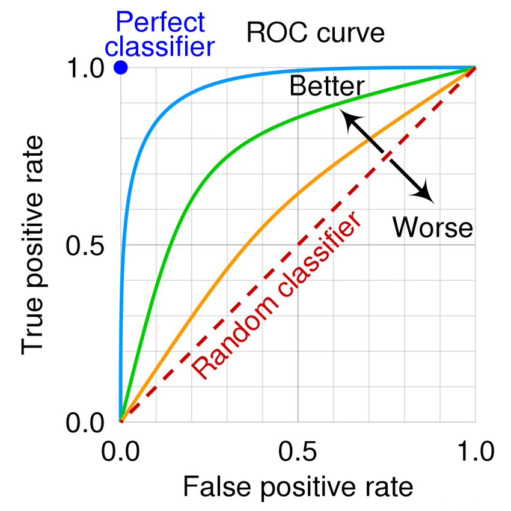

## 深度学习基础

<details>
<summary>查全率、查准率、PR曲线、ROC曲线</summary>

<br>

**各种指标介绍**

> <table>
>     <tr align='center'>
>         <th rowspan ='2'>真实情况</th>
>         <th colspan ='2'>预测结果</th>
>     </tr>
>     <tr align='center'>
>         <th colspan ='1'>正例</th>
>         <th colspan ='1'>反例</th>
>     </tr>
>     <tr  align='center'>
>         <td>正例</td>
> 		<td>TP(真正例)</td>
>         <td>FN(假反例)</td>
>     </tr>
>     <tr  align='center'>
>         <td>反例</td>
> 		<td>FP(假正例)</td>
>         <td>TN(真反例)</td>
>     </tr>
> </table>
> 
> - **准确率（Accuracy）**：对于给定的测试数据集，分类正确的样本数与总样本数之比
>   
> $$
> \frac{TP+TN}{总样本数}
> $$
> 
> - **精确率/查准率（Precision）**：预测为正的样本中，又多少是真正的正样本（说人话：预测是True的到底多少是True）
> 
> $$
> \frac{TP}{TP+FP}
> $$
> 
> - **召回率/查全率（Recall）**：样本中有多少正例被预测正确了（说人话：有没有漏掉True）
> 
> $$
> \frac{TP}{TP+FN}
> $$
> 
> 
> **查准率和查全率是一对矛盾的度量**。

**PR曲线**

> PR曲线（Precision-Recall Curve）：以查准率为纵轴、查全率为横轴作图 ，就得到了查准率-查全率曲线。（**PR 曲线关注的是正类的识别质量**）
> 
> PR曲线的面积代表：模型在不同阈值下，Precision 和 Recall 之间的平均权衡性能。越接近 1，模型越好。
> 
> 

**ROC曲线**

> ROC曲线：以​​假正率（FPR）​​为横轴，​​真正率（TPR）​​为纵轴，反映模型在不同阈值下的分类性能。（见下图，来源csdn）
> 
> ROC曲线的含义：曲线越靠近左上角，模型性能越好。（**更关心整体区分能力**）
> 
> AUC（Area Under Curve）：ROC 曲线下的面积，AUC 越接近 1，模型越好；0.5 表示完全随机。
> 
> 

**PR曲线与ROC曲线对比**

> | 维度​       | ​​PR曲线​​                          | ​​​ROC曲线​                      |
> | ----------- | ----------------------------------- | -------------------------------- |
> | ​横轴​​​​   | 召回率（Recall）                    | 假正率（FPR）                    |
> | ​纵轴​​​    | 精确率（Precision）                 | ​真正率（TPR）​​                 |
> | ​敏感度​​​  | 对类别不平衡数据更敏感              | 对类别平衡数据更敏感​​           |
> | 适合场景    | 正负样本极度不均衡时更合适          | 正负样本比例均衡的情况           |
> | ​典型场景​​ | ​​ 欺诈检测、推荐系统（正样本极少） | 医疗诊断、金融风控（平衡数据）​​ |
> | ​AUC意义​​  | ​​ PR-AUC越高，正样本识别能力越强   | ROC-AUC越高，整体分类性能越好​​  |
> | 解读重点    | 找出的正样本中有多少的真的          | 能不能将正负样本分得开           |

</details>

<details>

<summary>损失函数</summary>

<br>

**回归问题常用损失函数-均方误差**

> 均方误差（MSE, Mean Squared Error）
> 
> $$
> Loss_{MSE}=\frac{1}{n} \sum_{n=1}^n (y_i-\hat{y_i})^2
> $$
> 
> - 用途：最常见的回归损失
> - 特点：
>   - 强调大误差（因为平方），对异常值敏感
>   - 可导，计算简单

**分类问题常用损失函数**

> **交叉熵损失（Cross Entropy Loss）**
> 
> 对于二分类（Binary）：
> 
> $$
> Loss_{BCE}=-[y\log{(\hat{y})} + (1-y)\log{(1-\hat{y})}]
> $$
> 
> 对于多分类（Multi-class）：
> 
> $$
> Loss_{CE}=-\sum_{i=1}^C y_i \log{(\hat{y_i})}
> $$
> 
> - 用途：分类任务中最常用
> - 特点：
>   - 与 softmax 联用效果最佳
>   - 本质上是最大似然估计（MLE）
> 
> **KL 散度（Kullback–Leibler Divergence）**
> 
> $$
> Loss_{KL}(P||Q)=\sum_i{P(i)\log{\frac{P(i)}{Q(i)}}}
> $$
> 
> - 用途：衡量两个概率分布的差异
> - 应用：知识蒸馏、语言模型对齐等
> 
> **Focal Loss（用于不平衡类别）**
> 
> $$
> Loss_{focal}=-\alpha_t(1-p_t)^{\gamma}\log{p_t}
> $$
> 
> - 用途：目标检测、处理类别不均衡
> - 特点：
>   - 减少易分类样本的损失
>   - 关注困难样本

</details>


<details>
<summary>激活函数</summary>

<br>

**Sigmoid 函数（S 型函数）**

> $$
> \sigma(x)=\frac{1}{1+e^{-x}}
> $$
> 
> - 输出范围：$(0, 1)$
> - 优点：
>   - 可解释为概率
>   - 平滑、连续、可导
> - 缺点：
>   - **梯度消失**（对大正/负值梯度接近 0）
>   - 非零中心（输出总是正的，导致更新不均衡）

**Softmax（分类输出层专用）**

> $$
> softmax=\frac{e^{x_i}}{\sum_{j=1}^{n}{e^{x_j}}}
> $$
> 
> - 作用：将输出向量转换为概率分布
> - 常用于：分类网络最后一层

**sigmoid跟softmax何时用**

> **先理解本质：Softmax 和 Sigmoid 的区别**
> | 属性         | Sigmoid                    | Softmax                                      |
> | ------------ | -------------------------- | -------------------------------------------- |
> | 输出范围     | (0, 1)                     | 每个值在 (0, 1)，总和为 1                    |
> | 输出解读     | 单个输出是“属于某类”的概率 | 多个输出合起来表示“分别属于每一类”的概率分布 |
> | 是否相互竞争 | 否（每个输出互不影响）     | 是（一个类别概率变大，其他自动变小）         |
> 
> **Sigmoid 适合二分类的原因**
> 
> 用在二分类时（例如“是猫” vs “不是猫”）：
> - 网络输出层只有一个神经元，输出一个值$x$
> - 使用 sigmoid 函数把这个值压缩到$(0,1)$
> - 可以解释为“样本属于正类的概率”
> 
> 例如：
> 
> ```python
> logits = model(x)  # 输出一个标量，如 2.1
> prob = sigmoid(logits)  # 转换为概率，例如 0.89
> ```
> 
> 常搭配的损失函数：`Binary Cross Entropy（BCE）`，用于衡量预测概率与真实标签（0 或 1）的差异。
> 
> **Softmax 适合多分类的原因**
> 
> 多分类场景（例如“猫/狗/马”）：
> - 输出层有多个神经元（等于类别数），比如 3 个
> - 每个输出代表对应类别的“打分”
> - 使用 softmax 把这些打分转为概率分布，总和为 1
> 
> 例如：
> 
> ```python
> logits = model(x)  # 输出 [2.0, 0.5, -1.2]
> probs = softmax(logits)  # 输出 [0.75, 0.20, 0.05]，属于“猫”的概率最高
> ```
> 
> 常搭配的损失函数：`CrossEntropyLoss`（即 softmax + log + NLLLoss 的组合），自动将预测值转成概率并对比真实标签的 one-hot 编码。
> 
> **总结：何时用哪一个？**
> 
> | 任务类型   | 输出结构                | 激活函数 | 损失函数             |
> | ---------- | ----------------------- | -------- | -------------------- |
> | 二分类     | 一个输出（logit）       | Sigmoid  | Binary Cross Entropy |
> | 多分类     | N 个输出（类别数）      | Softmax  | Cross Entropy Loss   |
> | 多标签分类 | N 个输出，每类独立  0/1 | Sigmoid  | Binary Cross Entropy |
> 
> **类比理解（直觉）**
> 
> - Sigmoid：像在问“这个东西是不是 A？” 只关心一个维度
> - Softmax：像在问“这个东西到底是 A 还是 B 还是 C？” 每个输出互相竞争

</details>


<details>
<summary>反向传播与梯度下降</summary>

<br>

**神经网络训练流程与反向传播的核心目标**

> **神经网络训练流程**：
> 1. 前向传播（Forward Pass）：从输入层开始逐层计算输出
> 2. 计算损失（Loss）：用输出和真实标签计算损失
> 3. 反向传播（Backward Pass）：根据损失对每一层参数计算梯度
> 4. 参数更新（Gradient Descent）：使用梯度更新参数
> 
> **反向传播核心目标**：计算损失函数对所有参数的梯度，用于梯度下降更新权重。

**反向传播的核心工具：链式法则**

> 链式法则（Chain Rule）是反向传播的数学基础：
> 
> $$
> \frac{dL}{dW}=\frac{dL}{da} · \frac{da}{dz} · \frac{dz}{dW}
> $$
> 
> 每一层只需“局部”计算自己的导数，然后乘上传来的“梯度链”。

**基本梯度下降**

> $$
> \theta \leftarrow \theta - \eta \frac{\partial{L}}{\partial{\theta}}
> $$
> 
> 其中：
> - $\theta$：一个参数，比如$W$
> - $\eta$：学习率，控制每次更新的步长
> - $\frac{\partial{L}}{\partial{\theta}}$：反向传播得到的梯度
> - 梯度下降就是用梯度告诉我们“往哪走能让损失更小”，然后我们每次沿那个方向“走一小步”，直到找到最小值。

**示例：数值举例**

> **设定**：
> - 输入：$x=2.0$
> - 权重：$W=1.0$
> - 偏置：$b=0$
> - 标签：$y=0$
> - 激活函数：恒等函数（线性激活）$\hat{y}=z=Wx+b$（演示而已，不给太复杂的）
> - 损失函数：均方误差（MSE）：$Loss=\frac{1}{2}(\hat{y}-y)^2$
> - 学习率：$0.1$
> 
> **前向传播**：
> $$
> \begin{gather*}
>     z=Wx+b=1.0\times2.0+0=2.0 \\
>     \hat{y}=z=2.0 \\
>     Loss=\frac{1}{2}(2.0-0)^2=2.0
> \end{gather*}
> $$
> 
> **反向传播计算导数**：
> 
> 使用链式法则：
> 
> $$
> \begin{align*}
>     \frac{dL}{dW}&=\frac{dL}{d\hat{y}} · \frac{d\hat{y}}{dz} · \frac{dz}{dW} \\
>     &=(\hat{y}-y) · 1 · x \\
>     &=2.0 · 1 · 2.0 \\
>     &=4.0
> \end{align*}
> $$
> 
> **使用这个梯度更新 W**
> 
> $$
> W_{new}=W-\eta · \frac{\partial{L}}{\partial{W}}=1.0-0.1 · 4.0=0.6
> $$


</details>

<details>
<summary>梯度下降与优化器</summary>

<br>

**基本梯度下降**

> $$
> \theta \leftarrow \theta - \eta \frac{\partial{L}}{\partial{\theta}}
> $$
> 
> 其中：
> - $\theta$：一个参数，比如$W$
> - $\eta$：学习率，控制每次更新的步长
> - $\frac{\partial{L}}{\partial{\theta}}$：反向传播得到的梯度
> - 梯度下降就是用梯度告诉我们“往哪走能让损失更小”，然后我们每次沿那个方向“走一小步”，直到找到最小值。

**Batch Gradient Descent（BGD 批量梯度下降）**

> - 每轮迭代**用全部训练数据计算梯度**。
> - 更新稳定，但每次计算开销大，不适合大数据集。
> 
> $$
> \theta \leftarrow \theta - \eta · \frac{1}{N} \sum_{i=1}^N \nabla_\theta L(x_i,y_i) \\
> \theta \leftarrow \theta - \eta · \frac{1}{N} \sum_{i=1}^N \frac{\partial L^{(i)}}{\partial \theta} \\
> $$
> 
> 其中：
> - $\eta$：学习率（learning rate）
> - $N$：样本总数
> - $L^{(i)}$：第$i$个样本的损失函数
> 
> 优点：更新方向精确、收敛平稳
> 缺点：内存占用高，速度慢

**Stochastic Gradient Descent（SGD）**

> - 每次迭代只使用一个样本计算梯度
> 
> $$
> \theta \leftarrow \theta - \eta · \nabla_\theta L(x_i,y_i) \\
> \theta \leftarrow \theta - \eta · \frac{\partial L^{(i)}}{\partial \theta} \\
> $$
> 
> 优点：迭代快，适合大数据、在线学习
> 缺点：波动大、不稳定、可能收敛到局部最优

**Mini-batch Gradient Descent（小批量梯度下降）**

> - 每次迭代用一个小批量（如 32 或 64）样本：
> 
> $$
> \theta \leftarrow \theta - \eta · \frac{1}{m} \sum_{i=1}^m \nabla_\theta L(x_i,y_i) \\
> \theta \leftarrow \theta - \eta · \frac{1}{m} \sum_{i=1}^m \frac{\partial L^{(i)}}{\partial \theta} \\
> $$
> 
> 优点：比 batch 快，且比 SGD 稳定，GPU 上更高效（张量并行）。现代神经网络中最常用的形式

**为什么不直接用最基础的梯度下降？**
> 
> | 问题               | 原因                           |
> | ------------------ | ------------------------------ |
> | 震荡、收敛慢       | 学习率固定且对所有参数一样     |
> | 陷入局部最优       | 梯度方向不够准确或变化太大     |
> | 稀疏数据难以处理   | 学习率不能针对每个参数单独调整 |
> | 学习率难以手动调好 | 手动调参难，收敛不稳定         |

**Momentum（动量法）**

> - 类似物理中“惯性”的概念。给参数一个速度变量v
> - 先更新动量，再更新参数
> 
> $$
> v_t=\gamma v_{t-1}+\eta · \nabla_\theta L(\theta) \\
> \theta_t \leftarrow \theta_{t-1} - v_t
> $$
> 
> - **让参数更新沿着长期一致的下降方向加速，避免被局部波动干扰**
> - 在“平坦区”加快收敛，减少摆动，整体收敛更快更稳定

**Adaptive Gradient Algorithm（AdaGrad 自适应梯度算法）**

> **核心理念**：给每个参数一个自适应的学习率，让更新频繁的参数学习率变小，更新不频繁的参数保持较大学习率。
> 
> $$
> G_{t,i}=G_{t-1,i}+(\nabla_{\theta_i} L(\theta))^2 \\
> \theta_i \leftarrow \theta_i - \frac{\eta}{\sqrt{G_{t,i}}+\epsilon} · \nabla_{\theta_i} L(\theta)
> $$
> 
> - 对于每个参数$\theta_i$，我们记录其历史所有梯度的平方和（只对该参数维度）。
> - $G_{t,i}$是标量，表示$\theta_i$在迄今为止每一轮的梯度平方的累计值。
> - 随着训练进行，$G_{t,i}$会越来越大（或保持不变）。
> - 每个参数$\theta$拥有自己专属的学习率$\frac{\eta}{\sqrt{G_{t,i}}+\epsilon}$
>   - 如果某个参数的梯度一直很大，$G_{t,i}$增长很快，则学习率下降得很快。
>   - 如果某个参数的梯度一直很小，$G_{t,i}$增长缓慢，则学习率下降得慢。
> 
> **利用历史梯度自动调整每个参数的学习率**：
> - 频繁更新的参数 -> 学习率自动变小（趋于稳定）
> - 更新较少的参数 -> 学习率保持较大（继续探索）
> 
> 优点：对稀疏特征（如 NLP）特别有效
> 缺点：$G_{t,i}$是累计和，训练时间长后会很大，导致学习率不断变小，甚至趋近于 0；

**RMSProp（Root Mean Square Propagation）**

> 改进点：不要累加所有历史梯度平方，而是使用指数衰减平均（EMA）来控制“历史的记忆长度”。
> 
> - 改进 AdaGrad 的“过早衰减”问题
> - 使用指数衰减平均
> 
> $$
> E[g^2]_t=\gamma E[g^2]_{t-1}+(1-\gamma) · (\nabla_\theta L)^2 \\
> \theta_i \leftarrow \theta_i - \frac{\eta}{\sqrt{E[g^2]_t}+\epsilon} · \nabla_{\theta} L
> $$
> 
> 其中：
> - $\gamma$：衰减率（典型值：0.9）
> - 当前梯度平方被加入历史梯度平方的加权平均中，权重递减
> 
> 梯度变化剧烈 -> $E[g^2]_t$大 -> 更新幅度减小（更稳定）
> 梯度变化平缓 -> $E[g^2]_t$小 -> 更新幅度保留（更敏感）

**Adam（Adaptive Moment Estimation）**

> 当前最常用优化器！结合了 Momentum + RMSProp 的优点：
> - Momentum（动量法）：缓解震荡、加速收敛；
> - RMSProp：自适应地缩放每个参数的学习率。
> 
> Adam 为每个参数维护两个 一阶矩（平均梯度） 和 二阶矩（平均平方梯度） 的估计：
> - 一阶矩估计：动量思想（梯度的滑动平均）
> - 二阶矩估计：RMSProp 思想（梯度平方的滑动平均）
> - 然后通过这些估计动态调整学习率。
> 
> $$
> 初始化：m_0=0,v_0=0,t=0 \\
> 更新一阶矩估计（类似动量）：m_t=\beta_1 · m_{t-1}+(1-\beta_1) · g_t \\
> 更新二阶矩估计（类似RMSProp）：v_t=\beta_2 · v_{t-1}+(1-\beta_2) · g_t^2 \\
> 计算偏差修正项：\hat{m_t}=\frac{m_t}{1-\beta_1^t},\hat{v_t}=\frac{v_t}{1-\beta_2^t} \\
> 更新参数：\theta_t \leftarrow \theta_{t-1} - \eta · \frac{\hat{m_t}}{\sqrt{\hat{v_t}}+\epsilon}
> $$

</details>


<details>
<summary>正则化</summary>

<br>

**正则化简介**

> 在深度学习中，正则化（Regularization） 是防止模型过拟合的重要方法。其**核心思想**是：
> 
> > 在优化原始损失的同时，限制模型复杂度，使其具有更好的泛化能力。
> 
> 没有正则化时，梯度更新是：
> 
> $$
> \theta \leftarrow \theta - \eta · \frac{\partial L_0}{\partial \theta}
> $$

**L1正则化**

> 原理：在损失函数中加入所有参数的绝对值之和：
> 
> $$
> L=L_0+\lambda \sum_i|w_i|
> $$
> 
> 特点：
> - 会使部分权重变为 0，具有特征选择能力；
> - 可以产生稀疏模型；
> - 适用于高维数据（特征维度远大于样本数）；
> - 梯度不连续，在 0 点有“尖角”。
> 
> 此时梯度更新变成了：
> 
> $$
> \theta \leftarrow \theta - \eta (\frac{\partial L_0}{\partial \theta}+\lambda · sign(\theta))
> $$

**L2正则化**

> 原理：在损失函数中加入所有参数的平方和：
> 
> $$
> L=L_0+\lambda \sum_i w_i^2
> $$
> 
> 特点：
> - 会让参数变小，但不为零；
> - 对权重惩罚更平滑，收敛稳定；
> - 适合大多数深度学习场景；
> - 常用于与 SGD 搭配。
> 
> 此时梯度更新变成了：
> 
> $$
> \theta \leftarrow \theta - \eta (\frac{\partial L_0}{\partial \theta}+\lambda · 2\theta)
> $$
> 
> 这就相当于：
> - 除了“让损失更小”的方向，还加了一个“**让参数变小**”的力，小的参数通常表示“更简单的模型”，而简单的模型更不容易过拟合，泛化能力更强。
> - 所以正则化会在训练过程中持续影响参数的大小。

**λ（正则化强度）怎么选？**

> - $\lambda$越大，正则化越强，模型越简单，可能欠拟合；
> - $\lambda$越小，正则化越弱，模型越复杂，可能过拟合；
> - 通常通过交叉验证（Cross Validation）来调节$\lambda$；
> - 在深度学习中，也可以通过学习率调度器或 weight decay 来间接调控。

**Dropout 正则化（非参数化）**

> Dropout 是一种随机性的正则化方法：
> - 在训练时随机将神经元“丢弃”；
> - 相当于对不同子网络进行集成学习；
> - 流行于深度神经网络，尤其是卷积网络和全连接层；
> - 不需要修改损失函数，仅改变前向传播/反向传播过程。
> 
> Dropout 能有效减少 co-adaptation（协同适应：神经网络中多个神经元彼此过度依赖），提升泛化性能。

**L1跟L2正则化在统计学上的意义可以看看[概率论部分](../basic/probability_theory.md#l1l2正则化的统计学意义)**

</details>
