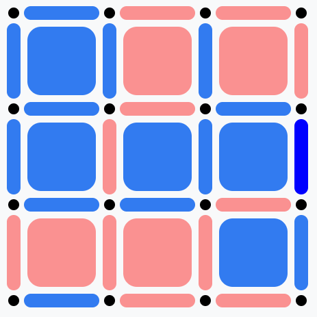

- [乱讲轻喷](#乱讲轻喷)
- [夹带私货](#夹带私货)
  - [slay the spire](#slay-the-spire)
    - [玩法简介](#玩法简介)
    - [简单分析](#简单分析)
  - [骰子浪游者](#骰子浪游者)
- [完美信息博弈](#完美信息博弈)
  - [棋盘游戏](#棋盘游戏)
  - [AlphaGo与AlphaZero](#alphago与alphazero)
    - [AlphaGo](#alphago)
    - [AlphaZero](#alphazero)
    - [区别与联系](#区别与联系)
  - [蒙特卡洛树搜索算法](#蒙特卡洛树搜索算法)
    - [选择](#选择)
    - [扩展](#扩展)
    - [模拟](#模拟)
    - [反向传播](#反向传播)
- [非完美信息博弈](#非完美信息博弈)
  - [博弈状态定义](#博弈状态定义)
  - [策略的定义](#策略的定义)
  - [纳什均衡](#纳什均衡)
  - [遗憾最小化（Regret Minimization）](#遗憾最小化regret-minimization)
  - [Counterfactual Regret Minimization](#counterfactual-regret-minimization)
  - [TODO](#todo)
- [不忘初心](#不忘初心)
- [强化学习基础](#强化学习基础)
    - [V值](#v值)
    - [Q值](#q值)
    - [从V到V](#从v到v)
    - [蒙特卡罗MC更新公式](#蒙特卡罗mc更新公式)
    - [时序差分TD估算状态V值](#时序差分td估算状态v值)
    - [SARSA](#sarsa)
    - [Qlearning](#qlearning)
    - [策略梯度（Policy Gradient）](#策略梯度policy-gradient)
    - [AC?](#ac)
    - [PPO](#ppo)

# 乱讲轻喷

完美信息博弈：所有参与者在每个决策点都能清楚地了解**此前所有已经发生的事件和对手的所有选择**。（围棋、象棋、**slay the spire**）
非完美信息博弈[^1]：博弈的参与者在决策时无法完全掌握所有相关信息，如对手的隐藏策略、私密状态。（石头简单布、德州扑克、斗地主、lol、金铲铲）

# 夹带私货
## slay the spire
### 玩法简介
<div style="display: flex; flex-wrap: wrap; gap: 50px; justify-content: center;">
    
</div>
<br>
<br>
<div style="display: flex; flex-wrap: wrap; gap: 50px; justify-content: center;">
    
</div>
<br>
<br>
<div style="display: flex; flex-wrap: wrap; gap: 50px; justify-content: center;">
    
    
</div>
<br>
<br>

### 简单分析
**一、卡组设计**[^2][^3]
<div style="display: flex; flex-wrap: wrap; gap: 50px; justify-content: center;">
    
    
</div>
<br>

1. **策略广度**：卡组有丰富的构筑方式，并且每一种玩法都有独特的体验。（防御流、力量流、运转流、...）
2. **策略深度**：对于游戏玩法，玩家需要进行的思考过程的复杂程度。对于策略游戏，玩家的核心体验就来源于**玩家的思考过程**以及玩家**计划实现后的成就感**。当然也并不是游戏的玩法越复杂越好，而是说，玩家的体验始终保持在**挑战适当难度的困难**和**发挥自身技巧**两者之间。（动态构建卡组）
3. **能力维度**：
   1. 防御维度：和游戏**失败条件**直接挂钩的维度，是最重要的维度。
   2. 攻击维度：和游戏**成功条件**直接挂钩的维度，是次重要的维度。
   3. 发育维度：加强防御和攻击维度的维度，属于**辅助**维度。
   4. slay the spire会考验玩家牌组的每一个维度。如第一层中的三个精英怪：乐加、地精小红、哨卫三柱，就分别考验防御维度、攻击维度、发育维度的能力
4. **卡牌平衡**：每张卡牌都是标准值上进行某种偏移得到的，偏移方式有3种
   1. 增加正面效果，减少资源价值。<span style="color: #BACEDA;">如顺劈斩资源价值为1费打7，小于标准值1费打11，原因是增加了正面效果：对敌方全体生效。</span>
   2. 增加负面效果，提高资源价值。<span style="color: #BACEDA;">如硬撑资源价值为1费叠15，高于1费叠9的标准值，但会向牌组里增加两张伤口，污染牌库。</span>
   3. 增加触发条件，提高资源价值。<span style="color: #BACEDA;">如交锋资源价值为0费打14，甚至高于了1费的标准值。但其的触发条件“手中每张都是攻击牌时才可打出”，使玩家若想打出这种手牌，需要进行一定的布局。</span>

<div style="display: flex; flex-wrap: wrap; gap: 50px; justify-content: center;">
    
</div>

<br>

5. **协同效应**：由于严格的平衡控制，slay the spire中的大多数单卡的强度都被控制在标准值附近。**相似的强度很容易使玩家缺失成长感，甚至会减少策略性——毕竟都差不多，随便选就好了**。如果说为了卡牌平衡进行的标准值偏移是**上锁**，那么协同效应就是对应的**解锁**。（**正向叠加、反向互补**）
   1. 抵消卡牌的负面效果：<span style="color: #BACEDA;">如坚毅的负面效果“消耗一张手牌”，和硬撑的负面效果“伤口”，就可以相互抵消。从而完全吃到标准值偏移时提高资源价值的红利，使卡牌强度超出标准值。</span>
   2. 达到卡牌的触发条件：<span style="color: #BACEDA;">如撕裂的增益需要由主动扣血来触发，而御血术就是最一个主动扣血的卡牌。因此，可以使用御血术来触发撕裂，使卡牌强度超出标准值。</span>
   3. 放大卡牌的正面效果：<span style="color: #BACEDA;">如重刃的正面增益“受到力量的加成*3”, 使得其可以与任何提供力量的卡牌形成协同效应，从而放大正面增益，使卡牌强度超出标准值。</span>

<div style="display: flex; flex-wrap: wrap; gap: 50px; justify-content: center;">
    
</div>
<br>
<div style="display: flex; flex-wrap: wrap; gap: 50px; justify-content: center;">
    
</div>
<br>
这样的设计大大增加了牌组构筑的灵活度，同样也降低了游戏的运气成分，让玩家几乎不可能凑不出协同效应，区别只在于强度。

**二、地图、房间、路线设计**
<div style="display: flex; flex-wrap: wrap; gap: 50px; justify-content: center;">
    
</div>

1. 房间类型、房间数量、路线设计、随机性与均衡性
2. **数值循环**：
   1. 战斗系统的循环：战斗——卡牌奖励——提升——...
   2. 经济系统的循环：战斗——金币奖励——商店消费提升——...
   3. 战斗内循环：回合开始（**能量**恢复）、抽牌、打牌（消耗能量）、结束回合
3. **价值与难度曲线**：
   1. 能量？=格挡？=**血量**？=攻击？
   2. 0费——抽牌位——机会成本——> != 0费
   3. 地图的随机与均衡、路线的选择多样性

## 骰子浪游者
<div style="display: flex; flex-wrap: wrap; gap: 50px; justify-content: center;">
    
</div>


# 完美信息博弈
## 棋盘游戏
在1997年5月，计算机击败了当时的国际象棋冠军——Garry Kasparov。这一类计算机系统由以下三个组件构成[^4][^10]：
1. **人为定义的评价函数**：评价函数会将棋盘盘面作为输入并输出该盘面的“价值”。高价值表示当前玩家处于非常有利的位置。
2. **博弈树搜索算法**（如Minimax）：在**所有**可能的走棋中进行搜索，寻找那些能够确保得到高价值棋盘盘面的路径。对于那些已经明知不可能有效的路径可以直接放弃搜索，从而使算法变得更有效率。
3. **极为强悍的硬件设备**。

存在问题：
1. 经验丰富的棋手**人为地精心调制**这些评价函数。
2. 依赖于一本本记录着最佳走棋的开局棋谱。
3. 游戏中局，用到评价函数，且对其进行进一步的优化调整。


<div style="display: flex; flex-wrap: wrap; gap: 50px; justify-content: center;">
    
    
</div>

评价函数设计难点：
- 一个合理而直接的选择就是**得分**的正向差值越大，游戏盘面就对我们越有利。
- 然而，最佳的走法可能需要牺牲短期利益来换取长期利益。
- 有时最好不要急于得分并获得额外先手，相反，要迫使对手走某一步棋。因此，必须考虑大量复杂场景并精心调制评价函数！

结果一：
<div style="display: flex; flex-wrap: wrap; gap: 50px; justify-content: center;">
    
    
    
</div>


结果二：
<div style="display: flex; flex-wrap: wrap; gap: 10px; justify-content: center;">
    
    
    
    
</div>

## AlphaGo与AlphaZero

### AlphaGo

**一、AlphaGo总体流程：**[^5][^6]
1. **输入棋盘状态**：将当前的棋盘状态输入到神经网络。
2. **策略网络预测落子概率**：策略网络输出每个位置作为下一步的概率分布。
3. **价值网络评估棋局胜率**：价值网络对当前棋盘状态进行评估，预测当前玩家的胜率。
4. **蒙特卡洛树搜索（MCTS）优化决策**：结合策略网络提供的先验概率和价值网络的评估，扩展和模拟棋局，并选择最佳落子点。
5. **落子并更新棋盘**：根据计算结果落子，进入下一回合。

**二、AlphaGo特征（输入棋盘状态）：**
- 执子颜色：当前执子方、对手
- 全1
- 全0
- 明智度：动作是否合法、是否会填补当前棋手的眼
- 动作回合数：一个动作落子离现在有多少回合
- 气数
- ......

**三、策略网络（Policy Network）：**
- 功能：预测每个可能落子的概率分布，用于指导搜索过程。
- 输入为当前棋盘状态，输出为棋盘上每个位置的概率。
- 训练方式：
  - 第一阶段（初始阶段）：通过人类棋谱进行**有监督学习**，拟合职业棋手的落子分布，让其初步具备落子能力。
  - 第二阶段（**自我对弈**阶段）：结合强化学习，通过策略梯度方法进一步优化。

**四、价值网络（Value Network）：**
- 功能：评估当前棋盘状态的胜率，为蒙特卡洛树搜索提供剪枝依据。
- 输入为当前棋盘状态，输出为一个标量，表示当前玩家的胜率。
- 训练方式：**自我对弈**过程中，记录每局棋盘状态和最终胜负结果，用于回归训练。

**五、蒙特卡洛树搜索（MCTS）：**
- 功能：结合策略网络和价值网络的输出，搜索最优解。

**六、联合训练与优化：**
- 策略网络和价值网络在初期是分开训练的。
- 随着训练的进行，自我对弈生成的新数据会同时用于优化策略网络和价值网络。
- 最后通过自我对弈，策略网络和价值网络一起优化以达到协同提升。


### AlphaZero
**一、AlphaZero总体流程：**[^5][^6]
1. **初始化**: AlphaZero通过随机初始化策略网络和价值网络的参数开始训练。初始时，网络对局面的评估几乎没有知识。
2. **自我对弈**: AlphaZero会通过自我对弈的方式进行学习。在每一局游戏中，AlphaZero使用策略网络来选择动作，并通过蒙特卡洛树搜索（MCTS）来决定最优动作路径。
3. **蒙特卡洛树搜索(MCTS)**: 在自我对弈过程中，AlphaZero通过MCTS进行搜索。MCTS利用当前策略网络和价值网络的输出，来探索最可能的游戏发展路径，并根据这些路径的预期胜率来选择最佳行动。
4. **更新网络（ResNet）**: 每局游戏结束后，AlphaZero会根据游戏结果（胜利/失败/平局）来更新策略网络和价值网络。游戏结果被作为目标值，回传到网络中，网络通过反向传播算法进行参数更新。


### 区别与联系
二者的区别与联系[^5]：
| 特性     | AlphaGo                  | AlphaZero                                |
| -------- | ------------------------ | ---------------------------------------- |
| 数据来源 | 人类棋谱 + 自我对弈      | 仅自我对弈                               |
| 学习方式 | 监督学习 + 强化学习      | 纯强化学习                               |
| 网络结构 | 独立的策略网络和价值网络 | 单一网络同时输出策略和价值               |
| 搜索方式 | MCTS（结合人类经验）     | MCTS（完全依赖自我学习）                 |
| 适用范围 | 专注于围棋               | 通用于围棋、国际象棋、将棋等多种棋类游戏 |
| 复杂性   | 依赖大量数据和阶段性训练 | 流程简化，依赖自我对弈循环优化           |


## 蒙特卡洛树搜索算法
蒙特卡洛树搜索算法[^7]
探索与利用：Exploration and Exploitation
UCB：Upper Confidence Bounds（一种探索与利用算法）
$$
v_{i}+C\times{\sqrt{\frac{\ln{N}}{n_i}}}
$$

其中：
- $v_i$：节点估计的值（比如胜率）
- $n_i$：节点被访问次数
- $N$：父节点已经被访问的次数
- $C$：可调整参数

前者代表经验，而后者代表勇气。“勇气”的值越大，代表着相对父节点的访问，我们访问当前这个子节点的次数偏少，因此要多多关注它，反之，则正好相反。

### 选择
从根节点开始，选择采用UCB计算得到的最大的值的孩子节点，如此向下搜索，直到来到树的底部的叶子节点，等待下一步操作。
```python
def getBestChild(self, node, explorationValue):
    bestValue = float("-inf")
    bestNodes = []
    for child in node.children.values():
        nodeValue = child.totalReward / child.numVisits + explorationValue * math.sqrt(
            2 * math.log(node.numVisits) / child.numVisits) # UCB公式
        if nodeValue > bestValue:
            bestValue = nodeValue
            bestNodes = [child]
        elif nodeValue == bestValue:
            bestNodes.append(child)
    return random.choice(bestNodes)  # 如果有多个节点值相等，从中随机选择一个。
```

### 扩展
到达叶子节点后，如果还没有到达终止状态（比如五子棋的五子连星），那么就要对这个节点进行扩展，扩展出一个或多个节点（也就是进行一个可能的action然后进入下一个状态）。
```python
def expand(self, node):
    actions = node.state.getPossibleActions()
    for action in actions:
        if action not in node.children:
            newNode = treeNode(node.state.takeAction(action), node)
            node.children[action] = newNode
            if len(actions) == len(node.children):
                node.isFullyExpanded = True
            return newNode

    raise Exception("Should never reach here")
```

### 模拟
基于目前的这个状态，根据某一种策略（例如random policy）进行模拟，直到游戏结束为止，产生结果，比如胜利或者失败。
```python
def search(self, initialState):
    self.root = treeNode(initialState, None)

    if self.limitType == 'time':
        timeLimit = time.time() + self.timeLimit / 1000
        while time.time() < timeLimit:
            self.executeRound()
    else:
        for i in range(self.searchLimit):
            self.executeRound()

    bestChild = self.getBestChild(self.root, 0)
    return self.getAction(self.root, bestChild)

def executeRound(self):
    node = self.selectNode(self.root)
    reward = self.rollout(node.state)
    self.backpropogate(node, reward)

def selectNode(self, node):
    while not node.isTerminal:
        if node.isFullyExpanded:
            node = self.getBestChild(node, self.explorationConstant)
        else:
            return self.expand(node)
    return node
```

### 反向传播
根据模拟的结果，自底向上，反向更新所有节点的信息。
```python
def backpropogate(self, node, reward):
    while node is not None:
        node.numVisits += 1
        node.totalReward += reward
        node = node.parent
```


# 非完美信息博弈

在非完美信息博弈中，由于无法观测到对手私有信息，玩家无法区分具有相同公共信息和玩家私有信息的历史，从而不同玩家视角下的博弈树是不同的。

## 博弈状态定义
博弈状态定义[^9]：
- 假设有有限$N$个玩家
- 博弈进行过程中的所有历史动作，记录在有限集合$H$中。因为在博弈进行过程中，动作会组成一个序列，所以$H$是这种序列的集合。
- 博弈过程中的终止状态记作$Z$
- 在某一个非终止状态$h\in{H}$下，能够采用的动作集合记作$A(h)=\{a:(h,a)\in{H}\}$
- $P(h)$来表示在状态$h\in{H}$下，该轮到哪个玩家进行操作；其中$P(h)\in{N\bigcup{\{c\}}}$，其中多出来一个元素$c$，这表示当前状态下会随机产生一个动作（而不由玩家决定），例如德扑中的翻牌或者斗地主的最后三张。
- 对于上面的特殊情况$c$，还需要为其定义随机采取动作的概率分布$f_c(a|h)$
- 对于不同的玩家各自需要进行操作的状态$\{h\in{H}:P(h)=i\}$，在这些状态上进一步进行划分，划分成$\mathcal{I}_i$，并且划分里的每个子集里，**每个状态的动作空间应该是一致的**，即$A(h)=A(h')$
- 实际上，上面描述的划分里的元素是一个重要的概念：信息集合(Information set)，$I_i\in{\mathcal{I}_i}$，这里有一个非常重要的性质：**信息集合里的元素不能被当前所有的信息给区分开**（例如上一条描述的，动作空间要一致）。或者可以这么理解，已知我的手牌，对手手牌的所有可能就是一个信息集合。
- 最后每个玩家的都会有一个收益函数$u_i$。其将状态映射到收益。并且这里定义$\Delta_{u,i}=\max_z{u_i(z)}-\min_z{u_i(z)}$来表示一个玩家的最终收益的变化范围。

## 策略的定义
- 用$\sigma_i\in{\Sigma_i}$来表示每个玩家的策略，所有玩家的策略用$\sigma$表示，另外用$\sigma_{-i}$来表示除了玩家$i$的其它玩家的策略。
- 之前定义了状态，那么假如所有玩家都按照策略$\sigma$来执行动作，那么每个状态出现的概率为$\pi^{\sigma}(h)$
- 显然可以按照不同的玩家对该概率做分解：$\pi{^{\sigma}}(h)=\prod_{i\in{N\bigcup{\{c\}}}}{\pi_i^{\sigma}(h)}$
- 另外我们可以将其它所有玩家的概率乘积简记为：$\pi_{-i}^{\sigma}(h)$
- 对于一个信息集合出现的概率为：$\pi{^{\sigma}}(I)=\sum_{h\in{I}}{\pi^{\sigma}(h)}$
- 那么一个玩家按照策略$\sigma$执行操作，最后的收益为$u_i(\sigma)=\sum_{h\in{Z}}{u_i(h)\pi^{\sigma}{(h)}}$


## 纳什均衡
纳什均衡表示一种**策略组合**，在这种组合中，每个玩家的策略是其他玩家策略的最优回应，即**在给定其他玩家策略的情况下，任何一个玩家都无法通过单方面改变自己的策略来获得更好的结果**。

对于一个$n$人博弈，假设第$i$个玩家的策略集合是$S_i$，收益函数是$u_i(s_1,s_2,...,s_n)$，其中$s_i\in{S_i}$

一个策略组合$(s_1^*,s_2^*,...,s_i^*,...,s_n^*)$是一个纳什均衡，当且仅当对所有的玩家$i$都满足：
$$
u_i(s_1^*,s_2^*,...,s_i^*,...,s_n^*)\ge{u_i(s_1^*,s_2^*,...,s_i,...,s_n^*)}, \forall{s_i\in{S_i}}
$$
即，任何一个玩家单独改变自己的策略都不会带来更高的收益。

例子：囚徒困境[^8]
|               | **坦白（B）** | **沉默（S）** |
| ------------- | ------------- | ------------- |
| **坦白（B）** | -5, -5        | 0, -10        |
| **沉默（S）** | -10, 0        | -1, -1        |

1. 为何双坦白（B, B）是纳什均衡：
   1. 玩家一：无论玩家二选择坦白还是沉默，玩家一的最优策略都是坦白。
   2. 玩家二：同理。
   3. 所以二者都坦白是纳什均衡。(但不是最优解)
2. 为什么双沉默（S, S）不是纳什均衡：
   1. 玩家一若改变策略为坦白，其刑期从1年降为0年，有动力改变策略。
   2. 玩家二同理。
   3. 因此，（S, S）不符合纳什均衡条件，因为玩家有动机单方面改变策略。

## 遗憾最小化（Regret Minimization）
遗憾：在过去的决策中，未选择最佳策略所导致的收益损失。
遗憾最小化：是一种在线学习算法，用于通过迭代优化策略，将累计“遗憾值”降低到最小，从而接近最优策略。

对于每个策略$a$在第$t$轮的累计遗憾$R_t(a)$：
$$
R_t(a)=\sum_{i=1}^t[u(a)-u(a_i)]
$$
其中：
- $u(a)$：在策略$a$下的收益
- $u(a_i)$：在第$i$轮实际采取的策略的收益

目标：最小化$正遗憾$：
$$
R_t^+=\max{0,R_t(a)}
$$
通过最小化遗憾，算法会逐步逼近一个纳什均衡
例子：
- 假设玩家A和玩家B在进行石头剪刀布游戏，获胜+1分，失败-1分，平局为0分。
- 第一局，玩家A出石头，玩家B出布。此时玩家A收益为$\mu_{A}(R,P)=-1$，玩家B收益为$\mu_{B}(P,R)=1$
- 对于玩家A来说，在玩家B出布这个策略情况下，玩家A选择布或者剪刀的收益为$\mu_{A}(P,P)=0$或者$\mu_{A}(S,P)=1$

所以第一局结束之后，玩家A没有出布的遗憾值为：$\mu_{A}(P,P)-\mu_{A}(R,P)=0-(-1)=1$
玩家A没有出剪刀的遗憾值为：$\mu_{A}(S,P)-\mu_{A}(R,P)=1-(-1)=2$
所以在第二局中，玩家选择石头、剪刀和布这三个策略的概率分别为$0$、$\frac{2}{3}$、$\frac{1}{3}$。**因此，玩家趋向于在第二局中选择出剪刀这个策略**。
加入在第二局中，玩家A选择剪刀，玩家B选择石头。那么玩家A每一轮遗憾值及累加值如下：

| 每轮遗憾值\策略 | 石头 | 剪刀 | 布  |
| --------------- | ---- | ---- | --- |
| 第一轮遗憾值    | 0    | 2    | 1   |
| 第二轮遗憾值    | 1    | 0    | 2   |
| 累加            | 1    | 2    | 3   |

从上表可知：
- 从上表可知，在第三局时，玩家A选择石头、剪刀和布的概率分别为$\frac{1}{6}$、$\frac{2}{6}$、$\frac{3}{6}$
- 在实际使用中，可以通过多次模拟迭代累加遗憾值找到每个玩家在每一轮次的最优策略。
- **但是当博弈状态空间呈指数增长时，对一个规模巨大的博弈树无法采用最小遗憾算法**。

## Counterfactual Regret Minimization
虚拟遗憾最小化/反现实遗憾最小化[^9]

## TODO
......[^11]

# 不忘初心
参考视频[^12]

特征组成：
1. 玩家状态：当前生命值、能量、buff、手牌数量、牌堆（抽牌堆、弃牌堆、消耗牌堆）的组成。
2. 敌人状态：每个敌人的生命值、护甲值、预计下一轮行动（如攻击、强化等）。
3. 战斗状态：当前层数、房间类型（战斗、商店、休息）、已选择的遗物和药水。
4. 牌信息：每张牌的类型（攻击、技能、能力等），消耗、效果等。
5. 遗物效果：所有遗物的具体加成效果，是否生效。

奖励和惩罚：
1. 正向奖励：
   1. 击败敌人：击杀敌人或BOSS时给予正奖励，奖励可以按敌人血量权重计算。
   2. 闯过一层：每成功通过一层给予额外奖励。
   3. 造成伤害：按每次攻击造成的伤害给予适量奖励。
2. 负向惩罚：
   1. 玩家受伤：受到伤害时给予负奖励，伤害越大惩罚越高。
   2. 回合超时：若模型无法合理结束战斗（如跳过回合），施加负奖励。
3. 其他：
   1. 将长期奖励分解为局部奖励，如通过估算当前回合对最终胜利的贡献。
   2. ...


# 强化学习基础
### V值
**一个状态的V值，就是这个状态下的所有动作的Q值，在策略下的期望**。
$$
v_{\pi}(s)=\sum_{a\in{A}}\pi(a|s)q_{\pi}(s,a)
$$

- $v_{\pi}(s)$：$V$值
- $\pi(a|s)$：策略
- $q_{\pi}(s,a)$：$Q$值


### Q值
$$
q_{\pi}(s,a)=R_s^a+\gamma\sum_{s'}P_{ss^,}^av_{\pi}(s')
$$

- $q_{\pi}(s,a)$：$Q$值
- $R_s^a$：奖励
- $\gamma$：折扣率
- $P_{ss^,}^a$：状态转移概率
- $v_{\pi}(s^,)$：$V$值
- 这里不需要关注策略，这里是**环境的状态转移概率**决定的。
- 当选择A，并转移到新的状态时，就能获得奖励，必须把这个**奖励也算上！**

### 从V到V

把公式代进去就可以了。
$$
v_{\pi}(s)=\sum_{a\in{A}}\pi(a|s)(R_s^a+\gamma\sum_{s^,\in{S}}P_{ss'}^av_{\pi}(s'))
$$

### 蒙特卡罗MC更新公式

$$
V(S_t){\leftarrow}V(S_t)+\alpha[G_t-V(S_t)]
$$

- $G_t$：新来的$G$
- 右边的$V(S_t)$：原来的平均值

蒙特卡罗有一些缺点：

- 相对动态规划，会有点不那么准。因为蒙特卡罗每一次的路径都是不一样的。
- 如果环境的状态空间非常大，或者最终状态只有非常小的概率达到。那么蒙特卡罗算法将会很难处理。

### 时序差分TD估算状态V值

$$
V(S_t){\leftarrow}V(S_t)+\alpha[R_{t+1}+{\gamma}V(S_{t+1})-V(S_t)]
$$

与MC的区别：

- MC公式里更新目标是$G_t$。
- TD公式里更新目标换成$R_{t+1}+{\gamma}V(S_{t+1})$。

TD更厉害的是，在很多时候，并不需要一直到最后，可以先用后面的估算，然后调整当前状态。

### SARSA
在**相同策略**下产生的动作$A_{t+1}$
$$
Q(S,A){\leftarrow}Q(S,A)+\alpha[R+{\gamma}Q(S',A')-Q(S,A)]
$$
注意，这里的$A_{t+1}$是在同一策略产生的。也就是说，$S_t$选$A_t$的策略和$S_{t+1}$选$A_{t+1}$是同一个策略。**这也是SARSA和Qlearning的唯一区别**。

### Qlearning

$$
Q(S,A){\leftarrow} Q(S,A)+\alpha[R+{\gamma} \mathop{\max}\limits_{\alpha} Q(S',A')-Q(S,A)]
$$

道理其实也很简单：因为需要找的是能获得最多奖励的动作，Q值就代表我们能够获得今后奖励的期望值。所以我们只会选择Q值最大的，也只有最大Q值能够代表V值。


### 策略梯度（Policy Gradient）

期望[^13]：$E(x)_{x\sim{p(x)}}=\sum\limits_x{x*p(x)}\approx{\frac{1}{n}\sum\limits_{i=1}^{n}{x}\quad{_{x\sim{p(x)}}}}$
目标：训练一个Policy神经网络$\pi$，在所有trajectory中，得到的Reward/Return最大。$E(R(\tau))_{\tau\sim{P_{\theta}(\tau)}}=\sum\limits_{\tau}R(\tau)P_{\theta}(\tau)$

搞个推导：

$$
\begin{align*}
\nabla{E(R(\tau))_{\tau\sim{P_{\theta}(\tau)}}} &= \nabla{\sum\limits_{\tau}R(\tau)P_{\theta}(\tau)} \\
&= \sum\limits_{\tau}R(\tau)\nabla{P_{\theta}(\tau)} \\
&= \sum\limits_{\tau}R(\tau)\nabla{P_{\theta}(\tau)}\frac{P_{\theta}(\tau)}{P_{\theta}(\tau)} \\
&= \textcolor{#8C98DC}{\sum\limits_{\tau}P_{\theta}(\tau)}R(\tau)\frac{\nabla{P_{\theta}(\tau)}}{P_{\theta}(\tau)} \\
&\approx{\frac{1}{N}\sum\limits_{n=1}^N{R(\tau^n)}\frac{\nabla{P_{\theta}(\tau^n)}}{P_{\theta}(\tau^n)}} \\
&= \frac{1}{N}\sum\limits_{n=1}^N{R(\tau^n)} \nabla\log{P_{\theta}(\tau^n)} \quad{\tau\sim{P_{\theta}(\tau)}} \\
&= {\frac{1}{N}} {\sum\limits_{n=1}^N} {R(\tau^n)} {\nabla\log} {\prod\limits_{t=1}^{T_n} {P_{\theta} (a_n^t|s_n^t)}} \\
&= {\frac{1}{N}} {\sum\limits_{n=1}^N} {R(\tau^n)} {\sum\limits_{t=1}^{T_n}} {\nabla\log} {P_{\theta} (a_n^t|s_n^t)} \\
&= {\frac{1}{N}} {\sum\limits_{n=1}^N} {\sum\limits_{t=1}^{T_n}} {R(\tau^n)} {\nabla\log} {P_{\theta} (a_n^t|s_n^t)}
\end{align*}
$$

去掉求导：

$$
{\frac{1}{N}} {\sum\limits_{n=1}^N} {\sum\limits_{t=1}^{T_n}} {R(\tau^n)} {\log} {P_{\theta} (a_n^t|s_n^t)}
$$

由两部分构成：

- ${R(\tau^n)}$：trajectory得到的return
- ${\log} {P_{\theta} (a_n^t|s_n^t)}$：每一步根据当前state做出action的概率然后求对数

由于$\log$函数单调递增，所以上面的表达式的意义是：
- 如果一个trajectory得到的return是大于0的，那么就增大这个trajectory里所有状态下采取当前action的概率
- 如果一个trajectory得到的return是小于0的，那么就减小这个trajectory里所有状态下采取当前action的概率

定义loss如下：
$$
Loss={-\frac{1}{N}} {\sum\limits_{n=1}^N} {\sum\limits_{t=1}^{T_n}} \textcolor{#8C98DC}{R(\tau^n)} {\log} \textcolor{#D26D6D}{P_{\theta} (a_n^t|s_n^t)}
$$

### AC?

**上面推导最后的公式有可以改进的地方**：
- 是否增大或减少在状态$s$下做动作$a$的概率，应该看做了这个动作之后到游戏结束累积的reward，而不是整个trajectory累积的reward。因为一个动作只能影响它之后的reward而不能影响它之前的reward。
- 但是可能只影响后面几步，也就是有衰减。

$$
\begin{align*}
&= {\frac{1}{N}} {\sum\limits_{n=1}^N} {\sum\limits_{t=1}^{T_n}} \textcolor{#8C98DC}{R(\tau^n)} {\nabla\log} {P_{\theta} (a_n^t|s_n^t)} {\quad} \textcolor{#8C98DC}{{R(\tau^n)} {\rightarrow} {\sum\limits_{t'=t}^{T_n}} {\gamma^{t'-t}} {r_{t'}^n}=R_t^n} \\
&= {\frac{1}{N}} {\sum\limits_{n=1}^N} {\sum\limits_{t=1}^{T_n}} \textcolor{#8C98DC}{R_t^n} {\nabla\log} {P_{\theta} (a_n^t|s_n^t)} \\
&= {\frac{1}{N}} {\sum\limits_{n=1}^N} {\sum\limits_{t=1}^{T_n}} {({R_t^n}-\textcolor{red}{B(s_n^t)})} {\nabla\log} {P_{\theta} (a_n^t|s_n^t)} \quad\text{(缓解正值陷阱)} \\
\end{align*}
$$


### PPO

${R_t^n}$每次都是一次随机采样，方差很大，训练不稳定。
动作-价值函数：$Q_{\theta}(s,a)$，在state s下，做出Action a，期望的回报。
状态-价值函数：$V_{\theta}(s)$，在state s下，期望的回报。
**优势函数**：${A_{\theta}(s,a)}=Q_{\theta}(s,a)-V_{\theta}(s)$，在state s下，做出Action a，比其他动作能带来多少优势。

最后公式就变成：
$$
{\frac{1}{N}} {\sum\limits_{n=1}^N} {\sum\limits_{t=1}^{T_n}} {{A_{\theta}(s_n^t,a_n^t)}} {\nabla\log} {P_{\theta} (a_n^t|s_n^t)}
$$

优势函数怎么计算？

$$
\begin{align*}
A_{\theta}(s_t,a) &= \textcolor{#8C98DC}{Q_{\theta}(s_t,a)}-V_{\theta}(s_t) \\
&= \textcolor{#8C98DC}{{r_t}+\gamma*{V_{\theta}(S_{t+1})}}-V_{\theta}(s_t) \\
\end{align*}
$$

可以有多步采样，一般采用GAE采样[^13]
GAE通过给优势函数进行一次采样，两次采样，...，并分配不同权重，将他们的和表示最终的优势函数。

$$
\begin{align*}
A_{\theta}^{GAE}(s_t,a) &= (1-{\lambda})({A_{\theta}^1}+{\lambda}*{A_{\theta}^2}+{\lambda}*{A_{\theta}^3}+...) \\
&= ... \\
&= \sum\limits_{b=0}^{\infty}{(\gamma\lambda)^b}{\delta_{t+b}^V}
\end{align*}
$$


**现在，公式变成**：
$$
{\frac{1}{N}} {\sum\limits_{n=1}^N} {\sum\limits_{t=1}^{T_n}} {{A_{\theta}^{GAE}(s_n^t,a_n^t)}} {\nabla\log} {P_{\theta} (a_n^t|s_n^t)}
$$


重要性采样：
$$
\begin{align*}
E(f(x))_{x\sim{p(x)}} &= {\sum\limits_x} {f(x)*p(x)} \\
&= {\sum\limits_x} {f(x)*p(x)} \frac{q(x)}{q(x)} \\
&= {\sum\limits_x} f(x) \frac{p(x)}{q(x)} q(x) \\
&= E(f(x)\frac{p(x)}{q(x)})_{x\sim{q(x)}} \\
&\approx \frac{1}{N} \sum\limits_{n=1}^N {f(x)\frac{p(x)}{q(x)}} _{x\sim{q(x)}}
\end{align*}
$$

on-policy变成off-policy：
$$
\begin{align*}
&= {\frac{1}{N}} {\sum\limits_{n=1}^N} {\sum\limits_{t=1}^{T_n}} {{A_{\theta}^{GAE}(s_n^t,a_n^t)}} {\nabla\log} {P_{\theta} (a_n^t|s_n^t)} \\
&= {\frac{1}{N}} {\sum\limits_{n=1}^N} {\sum\limits_{t=1}^{T_n}} {{A_{\theta'}^{GAE}(s_n^t,a_n^t)}} \frac{P_{\theta} (a_n^t|s_n^t)}{P_{\theta'} (a_n^t|s_n^t)} {\nabla\log} {P_{\theta} (a_n^t|s_n^t)} \\
&= {\frac{1}{N}} {\sum\limits_{n=1}^N} {\sum\limits_{t=1}^{T_n}} {{A_{\theta'}^{GAE}(s_n^t,a_n^t)}} \frac{{\nabla} {P_{\theta} (a_n^t|s_n^t)}}{P_{\theta'} (a_n^t|s_n^t)} \\
\end{align*}
$$

**所以PPO的Loss**为：
$$
Loss=-{\frac{1}{N}} {\sum\limits_{n=1}^N} {\sum\limits_{t=1}^{T_n}} {{A_{\theta'}^{GAE}(s_n^t,a_n^t)}} \frac{{P_{\theta} (a_n^t|s_n^t)}}{P_{\theta'} (a_n^t|s_n^t)}
$$


为了避免分布相差太大，可以加上KL散度或者用clip

$$
\begin{align*}
Loss_{ppo} &= -{\frac{1}{N}} {\sum\limits_{n=1}^N} {\sum\limits_{t=1}^{T_n}} {{A_{\theta'}^{GAE}(s_n^t,a_n^t)}} \frac{{P_{\theta} (a_n^t|s_n^t)}}{P_{\theta'} (a_n^t|s_n^t)} + \textcolor{#8C98DC}{\beta{KL}(P_{\theta},P_{\theta'})} \\
Loss_{ppo2} &= -{\frac{1}{N}} {\sum\limits_{n=1}^N} {\sum\limits_{t=1}^{T_n}} \min (\textcolor{#D26D6D}{{{A_{\theta'}^{GAE}(s_n^t,a_n^t)}} \frac{{P_{\theta} (a_n^t|s_n^t)}}{P_{\theta'} (a_n^t|s_n^t)}},\textcolor{#8C98DC}{clip(\frac{{P_{\theta} (a_n^t|s_n^t)}}{P_{\theta'} (a_n^t|s_n^t)},1-\epsilon,1+\epsilon){A_{\theta'}^{GAE}(s_n^t,a_n^t)}})
\end{align*}
$$


PPO小总结：
虽然是基于PG，但是通过多种技术设计有效提升了探索效率，不需要等到每次走到终止状态才更新策略。以下是PPO如何解决这个问题的关键点：
1. 使用Advantage估计：
   1. 引入了优势函数，而不是直接依赖完整的回报$G_t$。优势函数可以通过时间差分（TD）方法估计
   2. 这种方法仅需要从一部分时间步中采样，而不需要完整地走到终止状态。
2. 分批采样 (Batch Sampling)：
   1. PPO使用分批采样（Mini-Batch Sampling），从多个并行环境中收集片段（Trajectories），而不是一次性采集完整的回合。
   2. 比如，可以设置一个时间步限制（如trajectory_len=128步），在达到该步数时就开始进行更新，而不需要等到所有环境都到达终止状态。
3. 经验回放与重复更新：
   1. PPO不像Vanilla Policy Gradient（VPG）那样只使用采样到的数据进行一次更新，而是对同一批数据进行多次更新。这种数据重用的方式显著提高了采样效率。
   2. 一般采用K次更新循环（如 4 次），每次对小批量数据进行更新。
4. 多环境并行采样：
   1. PPO通常结合多线程或多进程架构，通过多个环境并行运行，快速收集大量样本。
   2. 通过分布式采样大幅提高探索效率，同时减少单环境中的探索偏差。
5. Clip 技术提升稳定性：
   1. PPO的Clip策略保证了每次更新策略不会偏离原始策略太多，减少了过大的策略变动可能导致的不稳定性。
   2. 这种稳定性允许PPO更高效地使用采样数据进行策略更新，而不必完全依赖于长时间的终止探索。


[^1]: 余超,刘宗凯,胡超豪,等.非完美信息博弈综述:对抗求解方法与对比分析[J].计算机学报,2024,47(09):2211-2246.
[^2]: [https://www.everlovegames.cn/article/slaythespire](https://www.everlovegames.cn/article/slaythespire)
[^3]: [https://zhuanlan.zhihu.com/p/639686443](https://zhuanlan.zhihu.com/p/639686443)
[^4]: [https://zhuanlan.zhihu.com/p/325865136](https://zhuanlan.zhihu.com/p/325865136)
[^5]: [https://chatgpt.com/](https://chatgpt.com/)
[^6]: [https://www.cnblogs.com/pinard/p/10609228.html](https://www.cnblogs.com/pinard/p/10609228.html)
[^7]: [https://blog.csdn.net/caozixuan98724/article/details/103213795](https://blog.csdn.net/caozixuan98724/article/details/103213795)
[^8]: [囚徒困境](https://www.zhihu.com/tardis/zm/art/411598508)（非常有意思）
[^9]: [https://zhuanlan.zhihu.com/p/422005082](https://zhuanlan.zhihu.com/p/422005082)
[^10]: Silver D, Schrittwieser J, Simonyan K, et al. Mastering the game of go without human knowledge[J]. nature, 2017, 550(7676): 354-359.
[^11]: Vinyals O, Babuschkin I, Czarnecki W M, et al. Grandmaster level in StarCraft II using multi-agent reinforcement learning[J]. nature, 2019, 575(7782): 350-354.
[^12]: [https://www.youtube.com/watch?v=ARzK4XSH2Qc](https://www.youtube.com/watch?v=ARzK4XSH2Qc)
[^13]: [PG、PPO](https://www.bilibili.com/video/BV1iz421h7gb)