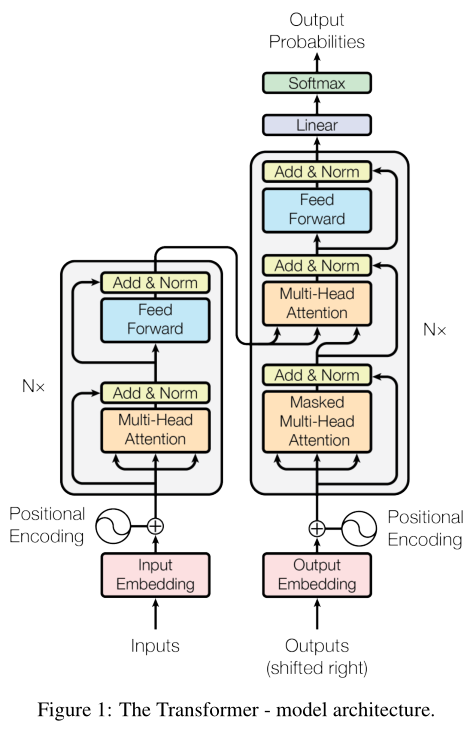

<font color='green' size=4> edited by nrzheng，2021.11.27</font>
[参考视频1](https://www.bilibili.com/video/BV1Uu411o7oY?spm_id_from=333.999.0.0)
[参考视频2](https://www.bilibili.com/video/BV1Uu411o7oY?p=2)
[参考链接](https://github.com/DA-southampton/TRM_tutorial/tree/main/VIT%E8%AE%BA%E6%96%87%E4%BB%A3%E7%A0%81%E4%BB%8E%E9%9B%B6%E8%A7%A3%E8%AF%BB)
# Vision Transformer (ViT)
## 1. 回顾Transformer (TRM)
transformer网络结构如下图所示：


1. 左半部分为编码端；右半部分为解码端。（假设汉字翻译成英文）（括号内对应上图操作）。
2. 编码端输入汉字。转化为数字 (Inputs)，再转化为 token embedding (Input Embedding)，也就是词向量。
3. 把 token embedding 和对应的 (positional encoding) 相加组成了最终的输入。
4. 然后流经多头自注意力层 (MHA) 然后流经前馈神经网络 (FF) 。
5. 这个操作是 $\times$n 的，就是有个一样的块堆叠起来的。
6. 解码端也是相同的操作
7. 要注意一开始的多头注意力层是有 Masked 的。
8. 同时，要注意其中的交互注意力层，Q 来自于Decoder，K、V 来自于 Encoder。
9. Decoder 也是$\times$n 的。

## 2. ViT
**ViT中用到的只有TRM中的编码端**
### 2.1. 输入处理
现在的问题就是，vision 中输入的是图片，但是 TRM 是用来处理自然语言的，**那么要怎么把图片融入到 TRM 的 Encoder 中呢？也就是，图片要怎么处理，才可以当作 TRM 的输入？**
最简单的方式，就是把图片转化成 NLP 中一个一个的 token，那么怎么转化呢？
1. 最容易想到的是，把每个像素点拿出来，每个像素点作为一个 token。然后再转化为 token embedding，再和对应的位置编码相加，这样就解决输入了。
2. 但是会有一个很大的问题（就是复杂度的问题），图片很大的，假设图片是 224 $\times$ 244，那输入就变成 50176 的大小，太大了。我们知道，在 NLP 中，一般词向量就是 512 长而已，这样图片相当于 NLP 的 100 倍，长度太大了，那么对应的参数量就会太大，计算机没办法承受。

这个问题是它会随着图片的长宽成平方级增长（图片是 h $\times$ w 的嘛）。
**如何处理复杂度问题？**：本质上是去解决随着像素增加，复杂度平方级增长的问题。
有很多种改进方式：
1. 局部注意力机制
2. 改进 attention 公式
3. ......

但是上面的方式还是太麻烦，所以一个简单的改进方式：图像化整为零，切分 patch 。
**也就是说，原来是一个像素点代表一个 token，现在是一大块的 patch 作为一个 token。**
以下就是 ViT 的网络结构：


1. 图片切分为 patch 
2. patch 转化为 token embedding
3. token embedding 和对应的 position embedding 相加
4. 输入到 TRM 模型的 Encoder 中
5. CLS 输出做多分类任务

好了，步骤就是这么些步骤了，有问题吗？没有问题。

### 2.2. patch embedding（结构图的2）
**那么问题来了**。第二步中，patch 怎么转化成 token embedding 的？？？
其实第二步又分为两个小步骤：


- 假设每个 patch 的大小是 16 $\times$ 16，假设TRM 规定的输入维度是728。
- 第一小步就是把每个 patch 展平成 256。
- 但是 256 和TRM规定输入 728 之间是有一个 gap 的。
- 所以第二小步就是这边需要一个 linear 层，把 256 映射到 728。就是把展平的维度映射到规定的输入维度。

<font color='red' size=4>重点来咯！</font>
**这里 256 映射到 728 用的是 linear 线性层做映射。其实也可以使用一个 16 $\times$ 16，步长是 16 的卷积来操作这个，只要把卷积核的个数设置为 728，那么输出的维度就是 728。**

想象一下（还是假设一个 patch 是 16 $\times$ 16）。线性变化是 (256--->728)，用卷积操作的话也是 (256--->728)，因为一个 patch 是 16 $\times$ 16，卷积核大小也是 16 $\times$ 16，卷出来就是 1 个数，那么有 728 个卷积核，就是 728 个数了。就相当于把 256 映射到 728 了呗。

（ViT在说的是它不需要使用卷积操作，所以用的是 linear，其实这里用卷积是可以的）

### 2.3. CLS 和位置编码（结构图的3）
<font color='red'>好了，重点又来了！</font>
其中的第三个步骤，又要分为几个小步骤，第三个步骤图拿下来：


第三步又可以分为三个小步骤（**看图看图看图，注意 * 号 和 0 那一块，不是从第二步来的哦！**）：

- 生成 CLS 符号的 token embedding（就是那个 * ）
- 生成所有序列（所有的 patch 和 *）的位置编码
- token + 位置编码

**为什么要加入一个 CLS 符号？**
原文中表述如下：
>In order to stay as close as possible to the original Transformer model, we made use of an additional [class] token, which is taken as image representation.

简单的意思就是减少对原始 TRM 模型的更改。（不是很懂，好像 BERT 有提到）（后面实验好像表明了，加 CLS 还是不加，效果都是差不多的）

**为什么需要位置编码？**
transformer 中讲过了。对应到图像中，就是告诉模型，哪个 patch 是在前面的，哪个 patch 是在后面的

- 如果是一维的，就是：1, 2, 3, 4, ...
- 如果是二维的，就是：[1, 1], [1, 2], ...
- 还有一种相对位置信息（此处略）


使用的一维位置编码，因为二维跟相对的都比较复杂，一维也没有差很多，所以使用的是一维位置编码。（没有用 TRM 中那种正余弦的方法哦）

**注意，这里说的 1, 2, 3, 4, ... 只是索引，其实使用的是这些索引对应的值，这些值是可以学习的。**

### 2.4. Encoder（结构图的4）
ViT 中使用的 Encoder 其实和原始 TRM 中的 Encoder 是不太一样的，ViT中的 Encoder 如下图所示：


- 把Norm位置提前了
- 没有 pad 符号

这边，如果输入的图像大小是不一样的，可以采用 resize 的方法弄到一样，所以序列的长度会是一样的，也就没有使用 pad 符号了。（没有 pad 符号在实现的时候就很简单了，同时 SoftMax 的时候，不就不需要对 pad 的部分额外操作了吗，就简单了很多）

### 2.5. 总结
- 分 patch
- 拉平，然后线性映射到 Encoder 需要的输入长度
- 生成 CLS，然后对所有的 patch 和 CLS 都生成位置编码
- 然后把 patch embedding ( token embedding ) 和位置编码相加，得到最终的输入
- 进入 Encoder ( LN--->MHA---> 残差--->LN--->FF--->残差 ) $\times$ n
- **最后把 CLS 拿出来做一个多分类任务（就是5）**
- 如果前面是没有加 CLS 的话，最后需要用一个 avg_pooling 来做多分类任务


## 3. 代码

```python
import torch
from torch import nn

from einops import rearrange, repeat
from einops.layers.torch import Rearrange

# helpers

def pair(t):
    return t if isinstance(t, tuple) else (t, t)

# classes

class PreNorm(nn.Module):
    def __init__(self, dim, fn):
        super().__init__()
        self.norm = nn.LayerNorm(dim)
        self.fn = fn
    def forward(self, x, **kwargs):
        return self.fn(self.norm(x), **kwargs)

class FeedForward(nn.Module):
    def __init__(self, dim, hidden_dim, dropout = 0.):
        super().__init__()
        self.net = nn.Sequential(
            nn.Linear(dim, hidden_dim),
            nn.GELU(),
            nn.Dropout(dropout),
            nn.Linear(hidden_dim, dim),
            nn.Dropout(dropout)
        )
    def forward(self, x):
        return self.net(x)

class Attention(nn.Module):
    def __init__(self, dim, heads = 8, dim_head = 64, dropout = 0.):
        super().__init__()
        inner_dim = dim_head *  heads
        project_out = not (heads == 1 and dim_head == dim)

        self.heads = heads
        self.scale = dim_head ** -0.5

        self.attend = nn.Softmax(dim = -1)
        self.to_qkv = nn.Linear(dim, inner_dim * 3, bias = False)

        self.to_out = nn.Sequential(
            nn.Linear(inner_dim, dim),
            nn.Dropout(dropout)
        ) if project_out else nn.Identity()

    def forward(self, x):           # 197是196个patch加上一个cls
        qkv = self.to_qkv(x).chunk(3, dim = -1)## 对tensor张量分块 x :1 197 1024   qkv 最后是一个元祖，tuple，长度是3，每个元素形状：1 197 1024。
        # 原始的TRM是分别过了三个linear层，这边是过了一个再拆开。这是因为原始的TRM是有Decoder的，要跟Encoder做交互，所以要分开写，这里不需要解码，所以不用
        q, k, v = map(lambda t: rearrange(t, 'b n (h d) -> b h n d', h = self.heads), qkv)

        dots = torch.matmul(q, k.transpose(-1, -2)) * self.scale

        attn = self.attend(dots)

        out = torch.matmul(attn, v)
        out = rearrange(out, 'b h n d -> b n (h d)')
        return self.to_out(out)

class Transformer(nn.Module):
    def __init__(self, dim, depth, heads, dim_head, mlp_dim, dropout = 0.):
        super().__init__()
        self.layers = nn.ModuleList([])
        for _ in range(depth):              # 注意这里的LN是在At和FF之前做的，不是TRM原始的后面做的
            self.layers.append(nn.ModuleList([
                PreNorm(dim, Attention(dim, heads = heads, dim_head = dim_head, dropout = dropout)),
                PreNorm(dim, FeedForward(dim, mlp_dim, dropout = dropout))
            ]))
    def forward(self, x):
        for attn, ff in self.layers:
            x = attn(x) + x
            x = ff(x) + x
        return x

class ViT(nn.Module):
    def __init__(self, *, image_size, patch_size, num_classes, dim, depth, heads, mlp_dim, pool = 'cls', channels = 3, dim_head = 64, dropout = 0., emb_dropout = 0.):
        super().__init__()
        image_height, image_width = pair(image_size) ## 224*224
        patch_height, patch_width = pair(patch_size)## 16 * 16

        assert image_height % patch_height == 0 and image_width % patch_width == 0, 'Image dimensions must be divisible by the patch size.'

        num_patches = (image_height // patch_height) * (image_width // patch_width)
        patch_dim = channels * patch_height * patch_width
        assert pool in {'cls', 'mean'}, 'pool type must be either cls (cls token) or mean (mean pooling)'

        self.to_patch_embedding = nn.Sequential(
            Rearrange('b c (h p1) (w p2) -> b (h w) (p1 p2 c)', p1 = patch_height, p2 = patch_width),
            nn.Linear(patch_dim, dim),
        )

        self.pos_embedding = nn.Parameter(torch.randn(1, num_patches + 1, dim))     # 这边+1是因为有一个cls
        self.cls_token = nn.Parameter(torch.randn(1, 1, dim))                       # 先初始化一个cls
        self.dropout = nn.Dropout(emb_dropout)

        self.transformer = Transformer(dim, depth, heads, dim_head, mlp_dim, dropout)

        self.pool = pool
        self.to_latent = nn.Identity()

        self.mlp_head = nn.Sequential(                  # 这是cls出来怎么来分类的
            nn.LayerNorm(dim),
            nn.Linear(dim, num_classes)
        )

    def forward(self, img):
        x = self.to_patch_embedding(img) ## img 1 3 224 224  输出形状x : 1 196 1024 
        b, n, _ = x.shape ## 

        cls_tokens = repeat(self.cls_token, '() n d -> b n d', b = b)       # 复制了b份，就是batch里面每个都要加cls
        x = torch.cat((cls_tokens, x), dim=1)       # cls和patch embedding拼接
        x += self.pos_embedding[:, :(n + 1)]        # 总的进行position embedding
        x = self.dropout(x)

        x = self.transformer(x)

        x = x.mean(dim = 1) if self.pool == 'mean' else x[:, 0]

        x = self.to_latent(x)
        return self.mlp_head(x)

v = ViT(
    image_size = 224,
    patch_size = 16,
    num_classes = 1000,
    dim = 1024,
    depth = 6,
    heads = 16,
    mlp_dim = 2048,
    dropout = 0.1,
    emb_dropout = 0.1
)

img = torch.randn(1, 3, 224, 224)

preds = v(img) # (1, 1000)
```

