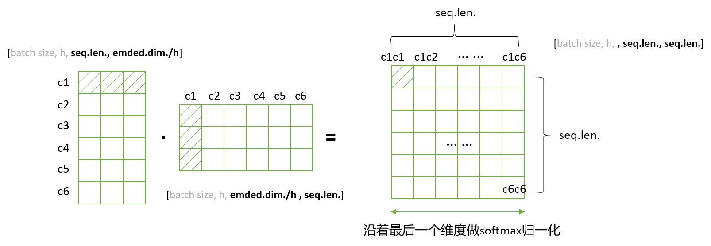
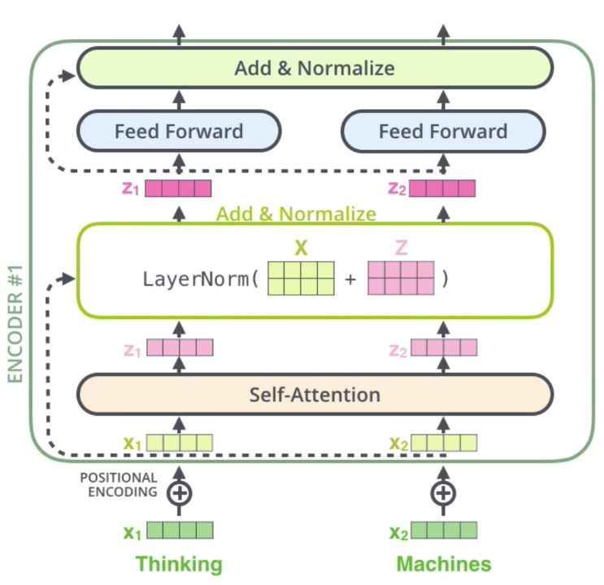

<font face='Time New Roman' color=green size=4>**edited by nrzheng，2021.11.25**</font>

------

[参考视频](https://www.bilibili.com/video/BV1dR4y1E7aL?spm_id_from=333.999.0.0)

[参考链接](https://github.com/aespresso/a_journey_into_math_of_ml/blob/master/03_transformer_tutorial_1st_part/transformer_1.ipynb)

# transformer

## 1. 概述

### 1.1. 网络整体结构

transformer网络结构如下图所示：


- 注意！！！！！！！！！！
- transformer的输入是有两个的，一个在Encoder， 一个在Decoder（机器翻译是这样）


### 1.2. 网络结构大致解析

从全局角度先看看，transformer在做一个什么事：

TRM一开始是在机器翻译中被提出的，整个过程可以概括为下图：


不用管里面怎么做，总之经过TRM这个黑盒的操作，“我爱你”就变成了“I LOVE YOU”。


然后我们细化TRM的操作，一步一步细化。

1. 输入没有发生变化，输出也没有发生变化，把TRM分成两个部分，Encoders和Decoders：


- 也就是说“我爱你”作为输入，经过Encoders，然后Encoders输出再作为Decoders的输入，流出来，就变成“I LOVE YOU”


2. Encoders和Decoders就是由n个Encoder和n个Decoder组成的：


- 也就是流经多个Encoder和多个Decoder，就可以把“我爱你”变成“I LOVE YOU”
- 上图二者的个数都是6，这个数字可以自己定
- 需要注意的是，6个Encoder的结构是完全相同的，6个Decoder的结构也是完全相同的
- 但是，**只是结构相同，参数是不一样的**，都在训练
- Encoder和Decoder是不一样的
- 这个其实就是1.1中的那个网络结构图了，里面不是有*n嘛。（可以上去翻看看）
- （这里的每一小个Encoder就是1.1网络结构图的左半部分，每个Decoder就是右半部分）


3. 需要注意的是：

- Encoder和Decoder架构是不一样的
  - 多了一层交互层
  - Decoder中的多了一个“Masked”


## 2. Encoder

### 2.1. Encoder概况

Encoder可以划分为三部分，如下图所示：


### 2.2. 输入部分

输入部分分为两个，一个是Embedding，一个是位置嵌入

#### 2.2.1. Embedding

Embedding是NLP里面简单的入门知识

比如我们的输入句子是“我爱你......”，一共12个字，我们按字切分，每个字定义为一个512维度的字向量。这个字向量可以使用**随机初始化**或者**word2vector**

- 可以理解成图像中，用(255, 0, 0)代表红色，然后再用0代表(255, 0, 0)，然后再onehot，用000001之类的代表0
- 就是把一个字，用计算机能理解的语言代替


#### 2.2.2. 位置嵌入 / 位置编码

1. 为什么需要位置编码？这里从RNN引出举例


- U：RNN的输入参数，W：隐层参数，V：输出参数。对于RNN的所有time step都共享同一套参数。就是说，有100个词，都是用这么一套参数
- 按照时间线展开（上图右），可以看到其中的U，W，V都是一样的，没有上下标，就是一套参数
- （插）RNN的梯度消失是怎么来的？
  - 和普通网络的梯度消失含义不一样，它的梯度是总的梯度和
  - **它的梯度消失不是变为0，而是说总梯度被近距离梯度阻挡，被远距离梯度忽略不计**

所以说RNN这种结构对于处理天然的时序关系的东西很符合。就是说先处理一个东西，再处理另一个东西。

但是对于transformer来说，它是有多头注意力的，也就是说，是一下子读了好多词进去。不是像RNN，输入一个“我”，等处理完，再处理“爱”。它是一起处理的

**这样做增快了速度，但是忽略了单词之间的先后关系**，所以说transformer想比于RNN就缺少了某种东西，告诉模型，某些单词是在前面还是后面

**所以需要位置编码**


2. 位置编码

位置编码的公式如下所示：
$$
\large{
PE_{(pos,2i)}=sin(pos/10000^{2i/d_{model}})\\

PE_{(pos,2i+1)}=cos(pos/10000^{2i/d_{model}})\tag{1}
}
$$

- pos指的是position
- 2i就是偶数位，2i+1就是奇数位
- 在位置2i处，使用sin；在位置2i+1处，使用cos


3. 得到位置编码之后，把位置编码和Embedding相加，得到一个512维的向量，作为整个transformer中Encoder的输入


4. 为什么位置编码会有用？

借助上述公式，我们可以得到一个特定位置的$d_{model}$维的位置向量，并且借助三角函数的性质：
$$
\large
\begin{cases}
sin(\alpha+\beta)=sin\alpha cos\beta+cos\alpha sin\beta\\
cos(\alpha+\beta)=cos\alpha cos\beta+sin\alpha sin\beta
\end{cases}
\tag{2}
$$

我们可以得到：
$$
\large
\begin{cases}
PE(pos+k,2i)=PE(pos,2i) \times PE(k,2i+1)+PE(pos,2i+1) \times PE(k,2i) \\
PE(pos+k,2i+1)=PE(pos,2i+1) \times PE(k,2i+1)-PE(pos,2i) \times PE(k,2i)
\end{cases}
\tag{3}
$$
可以看出，对于$pos+k$位置的位置向量某一维$2i$或$2i+1$而言，可以表示为，$pos$位置与$k$位置的位置向量的$2i$与$2i+1$维的线性组合，**这样的线性组合意味着位置向量（绝对位置）中蕴含了相对位置信息**。但是这种相对位置信息会在注意力机制那里消失。

*（正弦和余弦函数具有周期性，对于固定长度偏差k（类似于周期），post+k位置的PE可以表示成关于pos位置PE的一个线性变化（存在线性关系），这样可以方便模型学习词与词之间的一个相对位置关系）*

### 2.3. 注意力机制

$$
\large
Attention(Q,K,V)=softmax(\frac {QK^T}{\sqrt k})V \tag{4}
$$


#### 2.3.1 注意力

（用一个婴儿在看一张报纸的图片举例，图片就不放了）


- 左上、左下、右上、右下、V1、V2、V3、V4、婴儿。都是拿来举例的，就是QKV，向量
- 婴儿分别个左上、左下、右上、右下，做点乘。**得到的数值越大，说明距离越近，越相似，越关注，就是越相关呗。**
- 然后再和V相乘，就**相当于是加权**。

（详见下图解析）


- 把Q和K1、K2、K3、K4做F函数变换。也就是“爱”和“我”，“不”，“爱”，“你”做F函数变换
- F函数变换可以有几种操作，一般用点乘
- 得到S1、S2、S3、S4结果，再做SoftMax得到a1、a2、a3、a4。这四个相加是等于一的（假设是[0.1, 0.1, 0.7, 0.1]）
- 然后和Value值相乘，再相加，就是加权。
- 除以$\sqrt{d_k}$是因为QK相乘的值很大，这样SoftMax之后，梯度就会很小（为什么很小，看看SoftMax函数就知道了）。除以$\sqrt{d_k}$而不是别的数，是为了控制方差为1
- 在实际操作用，使用矩阵，方便并行。

#### 2.3.2 多头的操作

假设现在有一些句子X，X的维度是$[batch\ size, sequence\ length]$。

在2.2之后，我们有了transformer的输入，也就是Embedding和位置编码的和。可以得到$X_{embedding}\in[batch\ size,\ sequence\ length,\ embedding\ dimension]$。为了学到多重含义的表达，对$X_{embedding}$做线性映射，也就是分配三个权重：
$$
\large
W_Q,W_K,W_V\in\Re^{embed.dim.\times embed.dim.}
\tag{5}
$$
线性映射之后形成三个矩阵，为Q，K，V，和线性变化之前的维度一致，线性变换的公式：
$$
\large{
Q=Linear(X_{embedding})=X_{embedding}W_Q\\
K=Linear(X_{embedding})=X_{embedding}W_K\\
V=Linear(X_{embedding})=X_{embedding}W_V
}\tag{6}
$$
接下来就是多头注意力机制，（这几步的）流程图如下：


进行MHSA，我们要定义一个<font color='red'>超参数h</font>，也就是head的数量，注意，embedding dimension必须整除于h，因为要把它分成h份。

分割后：
$$
\large
{
Q,K,V\in [batch\ size,\ sequence\ length,\ h,\ embedding\ dimension/h]
}
$$
为了方便计算，进行转置，转置后：
$$
\large
{
Q,K,V\in [batch\ size,\ h,\ sequence\ length,\ embedding\ dimension/h]
}
$$


我们拿出一组来解释（QKV的计算）：



- 如上图所示，先计算Q与K的转置的点积。（点积的几何意义上面解释了）
- 点击的结果就是生成**注意力矩阵**。<font color='red'>**注意力矩阵的第一行就是第一个字c1与这六个字分别的相关程度**</font>。
- 然后用SoftMax进行归一化，这样<font color='red'>**每个字跟其他所有字的注意力权重的和为1**</font>
- 接着用注意力矩阵给V加权，见下图


上图中我们从注意力矩阵中取出一行（和为1）然后依次点乘V的列，矩阵V的每一行代表着每个字向量的数学表达。上图的操作正是用注意力权重进行这些数学表达的加权线性组合，从而<font color='red'>**使每个字向量都含有当前句子内所有字向量的信息**</font>。

注意进行点积运算之后，V的维度没有变化哦。还是$[batch\ size,\ h,\ sequence\ length,\ embedding\ dimension/h]$

在上面的self attention的计算过程中，我们通常采用mini batch来计算，也就是<font color='red'>一次计算多句话</font>，也就是$X\in [batch\ size, sequence\ length]$，sequence length 是句长。而一个mini batch是有多个不等长的句子组成的，我们就需要按照这个mini batch中最大的句长对剩余的句子进行补齐长度，一般使用0来填充，也就是padding。


但是在这时进行SoftMax就会产生问题。SoftMax函数如下：
$$
\large
\sigma(z)=\frac{e^{z_i}}{\sum_{j=1}^k e^{z_j}}
\tag{7}
$$
e的0次方是1，是有值的，这样的话softmax中被padding的部分就参与了运算，就等于是让无效的部分参与了运算，会产生很大的隐患，这时就需要做一个mask让这些无效区域不参与运算，我们一般给无效区域加一个很大的负数的偏置，也就是：
$$
\large{
z_{illegal}=z_{illegal}+bias_{illegal}\\
bias_{illegal}\rightarrow -\infty\\
e^{z_illegal}\rightarrow0
}
\tag{8}
$$
经过上式的masking我们使无效区域经过softmax计算之后还几乎为0，这样就避免了无效区域参与计算。


### 2.4. 残差和LayerNorm




#### 2.4.1. 残差

略了。可以去看ResNet的那篇笔记

上图就是把x拿过去跟z相加，再放进去LayerNorm

#### 2.4.2. LayerNorm

**为什么使用Layer Normalization，而不是使用常用的Batch Normalization？**

- 因为BN效果差，所以不用

**为什么BN效果差呢？**

- BN是针对整个Batch中的样本，在同一维度的特征做处理
- LN则不一样，具体见下图


- 这边用班级同学的例子来解释
- 每一列代表不同的样本，也就是同学（小明、小红、......）
- 每一行代表一个特征，也就是（体重、身高、成绩、......）
- BN是针对所有样本的每一个特征做BN，比如：体重做BN、身高做BN、成绩做BN（也就是上图绿色框框）
- **（LN是对一个样本的所有特征做归一化，就是上图的一列。下面会具体解释为什么这样好）**
- BN的优点：
  - 解决内部协变量偏移（什么隐藏层啥的，不懂，不用深究）
  - 缓解梯度饱和问题（如果使用sigmoid激活函数的话），加快收敛
- BN的缺点：
  - batch size较小的时候，效果差
    - 很容易理解，因为BN就是用batch的均值和方差来模拟所有样本的均值和方差。batch size小了误差就大了
    - 如小明一个人的均值和方差，就不能代表全班的
  - BN在RNN中效果比较差，这一点和第一点原因很类似
- 可以看到，在这个例子中，BN很合理，因为对所有人的身高、体重等做BN，很合理
- **但是，用在NLP中，就会有很大的问题**


为什么使用LayerNorm？**为什么LayerNorm单独对一个样本的所有单词做缩放可以起到效果。**

- 接下来用NLP来举例
- 上图每一列当作一个句子。比如：第一列是*我爱中国共产党*；第二列是*今天天气真不错*
- 可见，如果用BN的话，就是“我”和“今”做均值方差，“爱”和“天”做均值方差，......。**它代表的意思就是“我”和“今”代表同样的语义信息**......
- LN针对的就是“我爱中国共产党”来做均值和方差。**它默认的意思就是“我爱中国共产党”在同一个语义信息里面**
- （这是视频作者自己的理解）

### 2.5. 前馈神经网络

（就是两层的全连接）没啥好说的

- 用了两层全连接层，激活函数都是ReLU，可以看成是两层1*1的1维卷积
- 尺度变化为512---2048---512
- 公式如下：

$$
\large
FFN(x)=max(0,xW_1+b_1)W_2+b_2
$$


## 3. Decoder

### 3.1. Decoder概况

Decoder可以划分为两部分，如下所示：


### 3.2. Decoder中的多头注意力机制

注意，Decoder中的多头注意力机制多了一个**Masked**，为什么要masked呢？

<center class="half">
    
    
    
</center>

- Masked操作就是把当前词及其之后的全部都不看！！！
- 假设在输入“LOVE”的时候，Decoder没有masked，和Encoder的多头注意力机制一样结构的话
- 那么，“S”、“I”、“LOVE”、“YOU”、“NOW”就都会为“YOU”的预测输出提供信息
- 但是，这样训练出来的模型，在训练阶段会出现问题
- 因为预测的时候。是没有真值的，也就是说，后面的句子是看不到的。那么预测就会有问题。
- 所以说，在训练的时候，Decoder中的多头需要Masked掉
- **训练跟预测保持了一致性**
- （记住，transformer的输入是有两个的，一个在Encoder，一个在Decoder，中间还有一个交互）

### 3.3. Dncoder和Decoder的交互层

**Encoder生成KV矩阵，Decoder生成Q矩阵**，然后进行普通的多头注意力机制


## 4. 代码

### 4.1. 三类应用

1. Encoder和Decoder共同使用：机器翻译类应用
2. 只使用Encoder：文本分类BERT和图片分类VIT
3. 只使用Decoder：生成类模型

### 4.2. 代码详解

```python
sentences = ['ich mochte ein bier P', 'S i want a beer', 'i want a beer E']
```

- 里面有三个句子，但是我们要明白，这算是一组句子。也就是说属于一个样本，batch size等于1的
  - 如果batch size要等于4，那就是有4组句子，如果都是上面那个的话，那就是4组句子，每组句子里面有三个句子
- 有两个问题：
  - 这三个句子分别代表什么，怎么被模型处理掉
  - 三个句子中的特殊符号，P、S、E，分别代表什么


- 第一个问题：

  1. 看一眼transformer网络结构图，我们要明白，它是有两个输入的，一个是编码端的输入，一个是解码端的输入

  2. 抽离出来，放到机器翻译中来看：


3. “我爱你”是编码端的输入，“S I LOUE YOU”是解码端的输入

4. “I LOVE YOU E”不是解码端的输出，这是解码端的真实标签

5. 解码端输出会跟真实标签做损失
6. 用这个代码来当作示例，就是：

```python
# "我爱你"					"ich mochte ein bier P"
# "S I LOVE YOU"		"S i want a beer"
# "I LOVE YOU E"		"i want a beer E"
```


- 第二个问题：
  1. S代表start
  2. E代表end
  3. P代表的是一个pad字符（因为一个batch中句子长度可能不一样，所以就要规定一个最大长度max length，大于的就截断，小于的就使用特殊字符来填充，也就是P，如下图：）


<font color="red" size=4>不想写了，看视频或者自己调试一下代码就知道了</font>


### 4.3. 代码

```python
"""
orginal from ：
https://github.com/graykode/nlp-tutorial/blob/master/5-1.Transformer/Transformer.ipynb
"""
import numpy as np
import torch
import torch.nn as nn
import torch.optim as optim
import matplotlib.pyplot as plt
import math


def make_batch(sentences):
    input_batch = [[src_vocab[n] for n in sentences[0].split()]]
    output_batch = [[tgt_vocab[n] for n in sentences[1].split()]]
    target_batch = [[tgt_vocab[n] for n in sentences[2].split()]]
    return torch.LongTensor(input_batch), torch.LongTensor(output_batch), torch.LongTensor(target_batch)


## 10
def get_attn_subsequent_mask(seq):
    """
    seq: [batch_size, tgt_len]
    """
    attn_shape = [seq.size(0), seq.size(1), seq.size(1)]
    # attn_shape: [batch_size, tgt_len, tgt_len]
    subsequence_mask = np.triu(np.ones(attn_shape), k=1)  # 生成一个上三角矩阵
    subsequence_mask = torch.from_numpy(subsequence_mask).byte()
    return subsequence_mask  # [batch_size, tgt_len, tgt_len]


## 7. ScaledDotProductAttention
class ScaledDotProductAttention(nn.Module):
    def __init__(self):
        super(ScaledDotProductAttention, self).__init__()

    def forward(self, Q, K, V, attn_mask):
        ## 输入进来的维度分别是 [batch_size x n_heads x len_q x d_k]  K： [batch_size x n_heads x len_k x d_k]  V: [batch_size x n_heads x len_k x d_v]
        ##首先经过matmul函数得到的scores形状是 : [batch_size x n_heads x len_q x len_k]
        scores = torch.matmul(Q, K.transpose(-1, -2)) / np.sqrt(d_k)

        ## 然后关键词地方来了，下面这个就是用到了我们之前重点讲的attn_mask，把被mask的地方置为无限小，softmax之后基本就是0，对q的单词不起作用
        scores.masked_fill_(attn_mask, -1e9) # Fills elements of self tensor with value where mask is one.
        attn = nn.Softmax(dim=-1)(scores)
        context = torch.matmul(attn, V)
        return context, attn


## 6. MultiHeadAttention
class MultiHeadAttention(nn.Module):
    def __init__(self):
        super(MultiHeadAttention, self).__init__()
        ## 输入进来的QKV是相等的，我们会使用映射linear做一个映射得到参数矩阵Wq, Wk,Wv
        self.W_Q = nn.Linear(d_model, d_k * n_heads)
        self.W_K = nn.Linear(d_model, d_k * n_heads)
        self.W_V = nn.Linear(d_model, d_v * n_heads)
        self.linear = nn.Linear(n_heads * d_v, d_model)
        self.layer_norm = nn.LayerNorm(d_model)

    def forward(self, Q, K, V, attn_mask):

        ## 这个多头分为这几个步骤，首先映射分头，然后计算atten_scores，然后计算atten_value;
        ##输入进来的数据形状： Q: [batch_size x len_q x d_model], K: [batch_size x len_k x d_model], V: [batch_size x len_k x d_model]
        residual, batch_size = Q, Q.size(0)
        # (B, S, D) -proj-> (B, S, D) -split-> (B, S, H, W) -trans-> (B, H, S, W)

        ##下面这个就是先映射，后分头；一定要注意的是q和k分头之后维度是一致额，所以一看这里都是dk
        q_s = self.W_Q(Q).view(batch_size, -1, n_heads, d_k).transpose(1,2)  # q_s: [batch_size x n_heads x len_q x d_k]
        k_s = self.W_K(K).view(batch_size, -1, n_heads, d_k).transpose(1,2)  # k_s: [batch_size x n_heads x len_k x d_k]
        v_s = self.W_V(V).view(batch_size, -1, n_heads, d_v).transpose(1,2)  # v_s: [batch_size x n_heads x len_k x d_v]

        ## 输入进行的attn_mask形状是 batch_size x len_q x len_k，然后经过下面这个代码得到 新的attn_mask : [batch_size x n_heads x len_q x len_k]，就是把pad信息重复了n个头上
        attn_mask = attn_mask.unsqueeze(1).repeat(1, n_heads, 1, 1)


        ##然后我们计算 ScaledDotProductAttention 这个函数，去7.看一下
        ## 得到的结果有两个：context: [batch_size x n_heads x len_q x d_v], attn: [batch_size x n_heads x len_q x len_k]
        context, attn = ScaledDotProductAttention()(q_s, k_s, v_s, attn_mask)
        context = context.transpose(1, 2).contiguous().view(batch_size, -1, n_heads * d_v) # context: [batch_size x len_q x n_heads * d_v]
        output = self.linear(context)
        return self.layer_norm(output + residual), attn # output: [batch_size x len_q x d_model]


## 8. PoswiseFeedForwardNet
class PoswiseFeedForwardNet(nn.Module):
    def __init__(self):
        super(PoswiseFeedForwardNet, self).__init__()
        self.conv1 = nn.Conv1d(in_channels=d_model, out_channels=d_ff, kernel_size=1)
        self.conv2 = nn.Conv1d(in_channels=d_ff, out_channels=d_model, kernel_size=1)
        self.layer_norm = nn.LayerNorm(d_model)

    def forward(self, inputs):
        residual = inputs # inputs : [batch_size, len_q, d_model]
        output = nn.ReLU()(self.conv1(inputs.transpose(1, 2)))
        output = self.conv2(output).transpose(1, 2)
        return self.layer_norm(output + residual)


## 4. get_attn_pad_mask

## 比如说，我现在的句子长度是5，在后面注意力机制的部分，我们在计算出来QK转置除以根号之后，softmax之前，我们得到的形状
## len_input * len*input  代表每个单词对其余包含自己的单词的影响力

## 所以这里我需要有一个同等大小形状的矩阵，告诉我哪个位置是PAD部分，之后在计算计算softmax之前会把这里置为无穷大；

## 一定需要注意的是这里得到的矩阵形状是batch_size x len_q x len_k，我们是对k中的pad符号进行标识，并没有对k中的做标识，因为没必要

## seq_q 和 seq_k 不一定一致，在交互注意力，q来自解码端，k来自编码端，所以告诉模型编码这边pad符号信息就可以，解码端的pad信息在交互注意力层是没有用到的；

def get_attn_pad_mask(seq_q, seq_k):
    batch_size, len_q = seq_q.size()
    batch_size, len_k = seq_k.size()
    # eq(zero) is PAD token
    pad_attn_mask = seq_k.data.eq(0).unsqueeze(1)  # batch_size x 1 x len_k, one is masking
    return pad_attn_mask.expand(batch_size, len_q, len_k)  # batch_size x len_q x len_k


## 3. PositionalEncoding 代码实现
class PositionalEncoding(nn.Module):
    def __init__(self, d_model, dropout=0.1, max_len=5000):
        super(PositionalEncoding, self).__init__()

        ## 位置编码的实现其实很简单，直接对照着公式去敲代码就可以，下面这个代码只是其中一种实现方式；
        ## 从理解来讲，需要注意的就是偶数和奇数在公式上有一个共同部分，我们使用log函数把次方拿下来，方便计算；
        ## pos代表的是单词在句子中的索引，这点需要注意；比如max_len是128个，那么索引就是从0，1，2，...,127
        ##假设我的demodel是512，2i那个符号中i从0取到了255，那么2i对应取值就是0,2,4...510
        self.dropout = nn.Dropout(p=dropout)

        pe = torch.zeros(max_len, d_model)
        position = torch.arange(0, max_len, dtype=torch.float).unsqueeze(1)
        div_term = torch.exp(torch.arange(0, d_model, 2).float() * (-math.log(10000.0) / d_model))
        pe[:, 0::2] = torch.sin(position * div_term)## 这里需要注意的是pe[:, 0::2]这个用法，就是从0开始到最后面，补长为2，其实代表的就是偶数位置
        pe[:, 1::2] = torch.cos(position * div_term)##这里需要注意的是pe[:, 1::2]这个用法，就是从1开始到最后面，补长为2，其实代表的就是奇数位置
        ## 上面代码获取之后得到的pe:[max_len*d_model]

        ## 下面这个代码之后，我们得到的pe形状是：[max_len*1*d_model]
        pe = pe.unsqueeze(0).transpose(0, 1)

        self.register_buffer('pe', pe)  ## 定一个缓冲区，其实简单理解为这个参数不更新就可以

    def forward(self, x):
        """
        x: [seq_len, batch_size, d_model]
        """
        x = x + self.pe[:x.size(0), :]
        return self.dropout(x)


## 5. EncoderLayer ：包含两个部分，多头注意力机制和前馈神经网络
class EncoderLayer(nn.Module):
    def __init__(self):
        super(EncoderLayer, self).__init__()
        self.enc_self_attn = MultiHeadAttention()
        self.pos_ffn = PoswiseFeedForwardNet()

    def forward(self, enc_inputs, enc_self_attn_mask):
        ## 下面这个就是做自注意力层，输入是enc_inputs，形状是[batch_size x seq_len_q x d_model] 需要注意的是最初始的QKV矩阵是等同于这个输入的，去看一下enc_self_attn函数 6.
        enc_outputs, attn = self.enc_self_attn(enc_inputs, enc_inputs, enc_inputs, enc_self_attn_mask) # enc_inputs to same Q,K,V
        enc_outputs = self.pos_ffn(enc_outputs) # enc_outputs: [batch_size x len_q x d_model]
        return enc_outputs, attn


## 2. Encoder 部分包含三个部分：词向量embedding，位置编码部分，注意力层及后续的前馈神经网络

class Encoder(nn.Module):
    def __init__(self):
        super(Encoder, self).__init__()
        self.src_emb = nn.Embedding(src_vocab_size, d_model)  ## 这个其实就是去定义生成一个矩阵，大小是 src_vocab_size * d_model
        self.pos_emb = PositionalEncoding(d_model) ## 位置编码情况，这里是固定的正余弦函数，也可以使用类似词向量的nn.Embedding获得一个可以更新学习的位置编码
        self.layers = nn.ModuleList([EncoderLayer() for _ in range(n_layers)]) ## 使用ModuleList对多个encoder进行堆叠，因为后续的encoder并没有使用词向量和位置编码，所以抽离出来；

    def forward(self, enc_inputs):
        ## 这里我们的 enc_inputs 形状是： [batch_size x source_len]

        ## 下面这个代码通过src_emb，进行索引定位，enc_outputs输出形状是[batch_size, src_len, d_model]
        enc_outputs = self.src_emb(enc_inputs)

        ## 这里就是位置编码，把两者相加放入到了这个函数里面，从这里可以去看一下位置编码函数的实现；3.
        enc_outputs = self.pos_emb(enc_outputs.transpose(0, 1)).transpose(0, 1)

        ##get_attn_pad_mask是为了得到句子中pad的位置信息，给到模型后面，在计算自注意力和交互注意力的时候去掉pad符号的影响，去看一下这个函数 4.
        enc_self_attn_mask = get_attn_pad_mask(enc_inputs, enc_inputs)
        enc_self_attns = []
        for layer in self.layers:
            ## 去看EncoderLayer 层函数 5.
            enc_outputs, enc_self_attn = layer(enc_outputs, enc_self_attn_mask)
            enc_self_attns.append(enc_self_attn)
        return enc_outputs, enc_self_attns

## 10.
class DecoderLayer(nn.Module):
    def __init__(self):
        super(DecoderLayer, self).__init__()
        self.dec_self_attn = MultiHeadAttention()
        self.dec_enc_attn = MultiHeadAttention()
        self.pos_ffn = PoswiseFeedForwardNet()

    def forward(self, dec_inputs, enc_outputs, dec_self_attn_mask, dec_enc_attn_mask):
        dec_outputs, dec_self_attn = self.dec_self_attn(dec_inputs, dec_inputs, dec_inputs, dec_self_attn_mask)
        dec_outputs, dec_enc_attn = self.dec_enc_attn(dec_outputs, enc_outputs, enc_outputs, dec_enc_attn_mask)
        dec_outputs = self.pos_ffn(dec_outputs)
        return dec_outputs, dec_self_attn, dec_enc_attn

## 9. Decoder

class Decoder(nn.Module):
    def __init__(self):
        super(Decoder, self).__init__()
        self.tgt_emb = nn.Embedding(tgt_vocab_size, d_model)
        self.pos_emb = PositionalEncoding(d_model)
        self.layers = nn.ModuleList([DecoderLayer() for _ in range(n_layers)])

    def forward(self, dec_inputs, enc_inputs, enc_outputs): # dec_inputs : [batch_size x target_len]
        dec_outputs = self.tgt_emb(dec_inputs)  # [batch_size, tgt_len, d_model]
        dec_outputs = self.pos_emb(dec_outputs.transpose(0, 1)).transpose(0, 1) # [batch_size, tgt_len, d_model]

        ## get_attn_pad_mask 自注意力层的时候的pad 部分
        dec_self_attn_pad_mask = get_attn_pad_mask(dec_inputs, dec_inputs)

        ## get_attn_subsequent_mask 这个做的是自注意层的mask部分，就是当前单词之后看不到，使用一个上三角为1的矩阵
        dec_self_attn_subsequent_mask = get_attn_subsequent_mask(dec_inputs)

        ## 两个矩阵相加，大于0的为1，不大于0的为0，为1的在之后就会被fill到无限小
        dec_self_attn_mask = torch.gt((dec_self_attn_pad_mask + dec_self_attn_subsequent_mask), 0)


        ## 这个做的是交互注意力机制中的mask矩阵，enc的输入是k，我去看这个k里面哪些是pad符号，给到后面的模型；注意哦，我q肯定也是有pad符号，但是这里我不在意的，之前说了好多次了哈
        dec_enc_attn_mask = get_attn_pad_mask(dec_inputs, enc_inputs)

        dec_self_attns, dec_enc_attns = [], []
        for layer in self.layers:
            dec_outputs, dec_self_attn, dec_enc_attn = layer(dec_outputs, enc_outputs, dec_self_attn_mask, dec_enc_attn_mask)
            dec_self_attns.append(dec_self_attn)
            dec_enc_attns.append(dec_enc_attn)
        return dec_outputs, dec_self_attns, dec_enc_attns


## 1. 从整体网路结构来看，分为三个部分：编码层，解码层，输出层
class Transformer(nn.Module):
    def __init__(self):
        super(Transformer, self).__init__()
        self.encoder = Encoder()  ## 编码层
        self.decoder = Decoder()  ## 解码层
        self.projection = nn.Linear(d_model, tgt_vocab_size, bias=False) ## 输出层 d_model 是我们解码层每个token输出的维度大小，之后会做一个 tgt_vocab_size 大小的softmax
    def forward(self, enc_inputs, dec_inputs):
        ## 这里有两个数据进行输入，一个是enc_inputs 形状为[batch_size, src_len]，主要是作为编码段的输入，一个dec_inputs，形状为[batch_size, tgt_len]，主要是作为解码端的输入

        ## enc_inputs作为输入 形状为[batch_size, src_len]，输出由自己的函数内部指定，想要什么指定输出什么，可以是全部tokens的输出，可以是特定每一层的输出；也可以是中间某些参数的输出；
        ## enc_outputs就是主要的输出，enc_self_attns这里没记错的是QK转置相乘之后softmax之后的矩阵值，代表的是每个单词和其他单词相关性；
        enc_outputs, enc_self_attns = self.encoder(enc_inputs)

        ## dec_outputs 是decoder主要输出，用于后续的linear映射； dec_self_attns类比于enc_self_attns 是查看每个单词对decoder中输入的其余单词的相关性；dec_enc_attns是decoder中每个单词对encoder中每个单词的相关性；
        dec_outputs, dec_self_attns, dec_enc_attns = self.decoder(dec_inputs, enc_inputs, enc_outputs)

        ## dec_outputs做映射到词表大小
        dec_logits = self.projection(dec_outputs) # dec_logits : [batch_size x src_vocab_size x tgt_vocab_size]
        return dec_logits.view(-1, dec_logits.size(-1)), enc_self_attns, dec_self_attns, dec_enc_attns


if __name__ == '__main__':

    ## 句子的输入部分，
    sentences = ['ich mochte ein bier P', 'S i want a beer', 'i want a beer E']


    # Transformer Parameters
    # Padding Should be Zero
    ## 构建词表
    src_vocab = {'P': 0, 'ich': 1, 'mochte': 2, 'ein': 3, 'bier': 4}
    src_vocab_size = len(src_vocab)

    tgt_vocab = {'P': 0, 'i': 1, 'want': 2, 'a': 3, 'beer': 4, 'S': 5, 'E': 6}
    tgt_vocab_size = len(tgt_vocab)

    src_len = 5 # length of source
    tgt_len = 5 # length of target

    ## 模型参数
    d_model = 512  # Embedding Size
    d_ff = 2048  # FeedForward dimension
    d_k = d_v = 64  # dimension of K(=Q), V
    n_layers = 6  # number of Encoder of Decoder Layer
    n_heads = 8  # number of heads in Multi-Head Attention

    model = Transformer()

    criterion = nn.CrossEntropyLoss()
    optimizer = optim.Adam(model.parameters(), lr=0.001)

    enc_inputs, dec_inputs, target_batch = make_batch(sentences)

    for epoch in range(20):
        optimizer.zero_grad()
        outputs, enc_self_attns, dec_self_attns, dec_enc_attns = model(enc_inputs, dec_inputs)
        loss = criterion(outputs, target_batch.contiguous().view(-1))
        print('Epoch:', '%04d' % (epoch + 1), 'cost =', '{:.6f}'.format(loss))
        loss.backward()
        optimizer.step()
```


