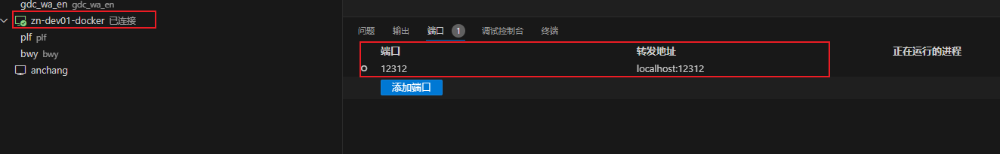

- [CMD](#cmd)
- [ssh config配置](#ssh-config配置)
  - [ssh config文件基本结构](#ssh-config文件基本结构)
  - [ssh config文件进阶使用](#ssh-config文件进阶使用)
  - [ssh config文件配置后的测试](#ssh-config文件配置后的测试)
  - [SCP服务器间拷贝文件](#scp服务器间拷贝文件)
- [ssh端口转发](#ssh端口转发)
  - [本地端口转发](#本地端口转发)
    - [本地直接运行的服务](#本地直接运行的服务)
    - [将开发机上的服务转发到本地机器](#将开发机上的服务转发到本地机器)
    - [将开发机上容器内的服务转发到本地机器](#将开发机上容器内的服务转发到本地机器)
    - [使用vscode进行本地端口转发](#使用vscode进行本地端口转发)
  - [远程端口转发](#远程端口转发)
  - [端口转发总结](#端口转发总结)
- [MobaXterm配置](#mobaxterm配置)
  - [通过跳板机](#通过跳板机)
  - [直接连接开发机](#直接连接开发机)
- [非对称加密方案的登录流程](#非对称加密方案的登录流程)
- [SSH基于公钥认证](#ssh基于公钥认证)
- [几个文件的介绍](#几个文件的介绍)
- [关于known\_hosts](#关于known_hosts)


[参考链接1](https://blog.csdn.net/wang_qiu_hao/article/details/127902007)

# CMD
1. ssh服务：
   1. 启动ssh服务：`sudo systemctl start ssh`（老版用`service ssh start`）
   2. 停止ssh服务：`sudo systemctl stop ssh`（老版用`service ssh stop`）
   3. 重启ssh服务：`sudo systemctl restart ssh`（老版用`service ssh restart`）
   4. 查看ssh服务状态：`sudo systemctl status ssh`（老版用`service ssh status`）
   5. 设置ssh开机自启：`sudo systemctl enable ssh`
   6. 取消ssh开机自启：`sudo systemctl disable ssh`
2. 已有私钥生成公钥：`ssh-keygen -y -f ${/path/to/private_key} > ${/path/to/gen_pub_key} -C <some tag such as email>`
   1. `-y`：从私钥提取公钥
3. 生成密钥对：`ssh-keygen -t rsa [-f </path/to/private_key> | -C <some tag such as email>]`
   1. `-t rsa`：生成RSA密钥对
   2. `-f </path/to/private_key>`：指定私钥或公钥文件
   3. `-C <some tag such as email>`：添加注释（例如邮箱）
4. 连接命令：
   1. 密码登录：`ssh <user_name>@<remote_ip> -p <remote_port> [-o HostKeyAlgorithms=+ssh-rsa]` 
   2. 密钥登录：`ssh <user_name>@<remote_ip> -p <remote_port> -i <private_key_path>`
   3. 密钥通过跳板机登录开发机：`ssh <user_name>@<dev_ip> -i <private_key_path> -o ProxyCommand="ssh <user_name>@<jumpserver_ip> -p <jumpserver_port> -i <private_key_path> -q -W <dev_ip>:<dev_port>"`
   4. 使用第三种有可能需要先在远程主机的`authorized_keys`中添加客户端的公钥

# ssh config配置

## ssh config文件基本结构

```bash
# 文件路径：~/.ssh/config
Host <server_name>
    HostName <域名或IP>
    User <user_name>
    Port <remote_port>
    IdentityFile <private_key_path>

# Host：指定一个SSH连接的别名，可以是多个，用空格隔开
# HostName：远程主机的域名或IP地址
# User：登录的用户名
# Port：SSH服务器的端口，默认是22
# IdentityFile：指定私钥文件的路径，默认是~/.ssh/id_rsa
```

上面的内容就等价于：`ssh <user_name>@<remote_ip> -p <remote_port> -i <private_key_path>`。

配置完之后就只要`ssh <server_name>`即可连上。

**ssh连接github**

用连接github举例：

```bash
# 1. 生成密钥对
ssh-keygen -t rsa -b 4096 -f ~/.ssh/key_for_github -C <"tag such as email">
# 2. 将 ~/.ssh/key_for_github.pub 加到github的key中
# 3. 配置 ssh config 文件，在其中添加以下内容
Host github.com
  HostName github.com
  User git
  IdentityFile ~/.ssh/key_for_github
  IdentitiesOnly yes
# 4. 测试
ssh -T git@github.com   # 显示 Hi NairongZheng! You've successfully authenticated, but GitHub does not provide shell access.
```

## ssh config文件进阶使用

**通配符匹配多个主机**

```bash
Host Server*
    User <user_name>
    Port <remote_port>
    ServerAliveInterval 180 # 表示在建立连接后，每180秒客户端会向服务器发送一个心跳，避免用户长时间没操作连接中断

Host <server_name_1>
    HostName <域名或IP_1>

Host <server_name_2>
    HostName <域名或IP_2>

Host <server_name_3>
    HostName <域名或IP_3>

# 第一段表示所有名字为Server开头的服务器，他们的用户名都是<user_name>，端口都是<remote_port>，同时都有保持连接的心跳。
# 然后下面列了3台服务器，只需要指定它们的IP地址。
```

**多文件管理**

1. 新建配置文件`~/.ssh/config-cluster-shanghai`，在其中编写ssh的配置。
2. 在`~/.ssh/config`的开头加入`Include config-cluster-shanghai`即可。
3. 也可以使用通配符，如：`Include config-*`，这样`~/.ssh/`目录下的所有`config-`开头的文件都会被引用到。


**跳板机**

需要先登录跳板机再通过跳板机访问内部机器的，可以参考以下配置（其中的私钥可以不同）：

```bash
# 跳板机配置
Host <Jumper_name>
    HostName <域名或IP>
    User <user_name>
    Port <port>
    IdentityFile <private_key_path> # 相应公钥要保存到跳板机的~/.ssh/authorized_keys中

# 开发机配置（ssh版本7.3+）
Host <server_name>
    HostName <域名或IP>
    User <user_name>
    Port <port>
    IdentityFile <private_key_path> # 相应公钥要保存到开发机的~/.ssh/authorized_keys中
    ProxyJump <Jumper_name>

# 开发机配置（ssh版本7.3以下）
Host <server_name>
    HostName <域名或IP>
    User <user_name>
    Port <port>
    IdentityFile <private_key_path> # 相应公钥要保存到开发机的~/.ssh/authorized_keys中
    ProxyCommand C:\Windows\System32\OpenSSH\ssh.exe -q -W %h:%p <Jumper_name>
```

**ssh直接访问开发机中的容器**

如果需要用ssh直接访问开发机中的容器（一般不这么做），可以在容器中的`/etc/ssh/sshd_config`添加如下内容：

```bash
# 容器中的/etc/ssh/sshd_config
# 假如容器启动命令中的端口映射有 -p 60011:60011 -p 4611:22
# 那么ssh访问容器时，若sshd_config中设置了以下两个端口，那么均可用
Port 60011 # 让容器的SSH服务器监听60011端口。
Port 22 # 让容器的SSH服务器监听22端口。可以多个，只要在创建容器时做了端口映射开放了的就可以
PermitRootLogin yes # 允许root用户通过SSH登录。
PasswordAuthentication yes
```

容器中做了以上相应添加后需**重启ssh服务**：`systemctl restart ssh`（老版用`service ssh restart`）

重启后可以查看是否真的有在设置的端口监听ssh服务：`netstat -tulnp | grep sshd`

然后只需要在本地的ssh config中添加以下内容，就可以直接通过ssh访问容器：

```bash
# 跳板机配置
Host <Jumper_name>
    HostName <域名或IP>
    User <user_name>
    Port <port>
    IdentityFile <private_key_path> # 相应公钥要保存到跳板机的~/.ssh/authorized_keys中

# 开发机配置（ssh版本7.3+）
Host <server_name>
    HostName <域名或IP>
    User <user_name>
    Port <port>
    IdentityFile <private_key_path> # 相应公钥要保存到开发机的~/.ssh/authorized_keys中
    ProxyJump <Jumper_name>

# 容器配置
Host <server_docker_name>
    HostName <域名或IP> # 就是开发机的ip
    User root # 因为容器默认都是root用户运行
    ProxyJump <Jumper_name>
    Port 4611 # 这边访问开发机的4611就会映射到容器的22，容器的22在sshd_config中被设置为监听ssh服务
    # Port 60011 # 若容器是用以上的配置，那么60011也可
```

## ssh config文件配置后的测试

**测试本地的ssh配置**

```bash
ssh -T <server_name>
# 有时候会卡住是因为`-T`选项禁用了伪终端TTY，可以选择用：
ssh -T <server_name> 'pwd'
ssh -T <server_name> 'ls'
```

**使用-v选项查看ssh连接日志**

```bash
ssh -v <server_name>
ssh -vvv <server_name> # 更详细的日志
```

**手动测试每一层连接（本地->跳板机->开发机->容器）**

```bash
# 1. 测试本地能否连接跳板机
ssh <Jumper_name>
# 2. 测试能否在本地通过跳板机连到开发机
ssh <server_name>
# 3. 测试能否直接从本地连接开发机上的容器
ssh <server_docker_name>
# 其中3也可以在开发机上运行以下命令来测试
ssh root@localhost -p <port>
```

## SCP服务器间拷贝文件

```bash
# 要求Server1可以直接访问Server2
scp <Server1>:</path/to/file_source> <Server2>:</path/to/file_destination>
# 若Server1不可直接访问Server2，用本机转发，只需要增加一个参数-3表示用本地机器当转发机
scp -3 <Server1>:</path/to/file_source> <Server2>:</path/to/file_destination>
```


# ssh端口转发

以下内容都默认配置好了ssh config文件。

假设现在的机器情况如下（跟前面ssh config介绍一样）：
1. 本地：windows
2. 远程：一台通过跳板机管理的开发机。开发机上还运行了容器。

## 本地端口转发

需要在本地访问开发机上的服务，或者容器内的服务。需要用到本地端口转发。


### 本地直接运行的服务

假设现在有一个http服务的python代码如下：

```python
from flask import Flask

app = Flask(__name__)

@app.route("/")
def home():
    return "Hello, this is a simple HTTP server running on Windows on port 8080!"

if __name__ == "__main__":
    app.run(host="0.0.0.0", port=8080)
```

在本地windows运行之后，可以在`http://localhost:8080`上查看到内容

### 将开发机上的服务转发到本地机器

假设现在**在开发机上**运行了以下代码：

```python
from flask import Flask

app = Flask(__name__)

@app.route("/")
def home():
    return "Hello, this is a simple HTTP server running on dev machine on port 60011!"

if __name__ == "__main__":
    app.run(host="0.0.0.0", port=60011)
```

想要在本地机器上访问这个服务，假如可以直接访问这个开发机的公网ip，那么使用`<dev_pub_ip>:60011`即可访问。

当然，也可以通过ssh转发端口。**在本地Windows运行**以下命令：


```bash
ssh -L <local_port>:<dev_host>:<dev_port> -J <user_name>@<Jumper_name> <user_name>@<server_name> [-N -f]
# -L：本地端口转发
# <dev_host>：这边可以用localhost代表开发机的回环地址
# -N：不执行远程命令，仅用于端口转发
# -f：后台运行

# 如下，将开发机上的60011端口转发到本地的8080端口：
ssh -L 8080:localhost:60011 -J damonzheng@jumpserver damonzheng@zn-dev01-1 # 会直接进入远程终端命令行
```

运行之后，仍然可以在`http://localhost:8080`上查看到内容，但是这个服务是运行在开发机上的，不是在本地了。

可以在本地Windows的cmd使用命令查看到转发的端口：

```bash
(base) PS C:\Users\95619> netstat -ano | findstr LISTENING | findstr :8080
  TCP    127.0.0.1:8080         0.0.0.0:0              LISTENING       20372
  TCP    [::1]:8080             [::]:0                 LISTENING       20372
# 同一个进程（PID 20371）同时监听了127.0.0.1:8080（IPv4）和 [::1]:8080（IPv6）
# Windows默认会同时监听 IPv4 和 IPv6。
```

### 将开发机上容器内的服务转发到本地机器

假设现在**在开发机上的容器内**运行了以下代码：

```python
from flask import Flask

app = Flask(__name__)

@app.route("/")
def home():
    return "Hello, this is a simple HTTP server running on dev container on port 12311!"

if __name__ == "__main__":
    app.run(host="0.0.0.0", port=12311)
```

本质上都是一样的，只不过多了一层而已。这时候需要将容器内的端口映射到开发机的端口，然后再将开发机的端口转发到本地。


有两种情况：

**情况一**

假如是容器启动的时候有做端口映射，且刚好服务运行在这个端口，那么直接在本地Windows使用上面类似的命令即可。

```bash
ssh -L <local_port>:<dev_host>:<dev_port> -J <user_name>@<Jumper_name> <user_name>@<server_name> [-N -f]
# 如下：
ssh -L 8080:localhost:12311 -J damonzheng@jumpserver damonzheng@zn-dev01-1
```

**情况二**

假如运行的端口是没有映射出来的，那么需要做两层端口转发。

```bash
# 1. 在开发机将容器内服务的端口转发出来，假设把容器的12311转发到开发机的12312
ssh -L <dev_port>:<container_host>:<container_port> root@<container_ip> [-N -f]
ssh -L 12312:localhost:12311 root@<容器ip> # 容器ip可以用docker exec -it <container_name> ifconfig查看
# 2. 再在本地Windows将开发机的12312端口转发到windows的8080
ssh -L <local_port>:<dev_host>:<dev_port> -J <user_name>@<Jumper_name> <user_name>@<server_name> [-N -f]
ssh -L 8080:localhost:12312 -J damonzheng@jumpserver damonzheng@zn-dev01-1
```

运行之后，仍然可以在`http://localhost:8080`上查看到内容，但是这个服务是运行在开发机上容器内的，不是在本地，也不是在开发机上。

### 使用vscode进行本地端口转发

其实不管是开发机还是开发机上的容器，只要ssh能连接上的，都可以通过vscode来转发。

通过vscode连接上要转发的服务所在的位置（开发机或者容器），然后在下面的`端口`选项中添加转发端口，将服务运行的端口输入即可。

比如开发机上的容器运行了一个服务在12312端口，那么转发之后，在本地访问`localhost:12312`即可。省得自己输入命令。如下图所示：



这个方法其实跟自己用命令行转发是一样的，也可以用以下命令查看正在监听的端口：

```bash
C:\Users\95619> netstat -ano | findstr LISTENING | findstr :12312
  TCP    127.0.0.1:12312        0.0.0.0:0              LISTENING       28956
```


## 远程端口转发

假如本地Windows运行了一个[服务](#本地直接运行的服务)，需要让开发机访问到，这时候需要远程端口转发（**很少用吧**）。

在windows的cmd中执行：

```bash
ssh -R <dev_port>:<local_host>:<local_port> -J <user_name>@<Jumper_name> <user_name>@<server_name> [-N -f]
ssh -R 12312:127.0.0.1:8080 -J damonzheng@jumpserver damonzheng@zn-dev01-1
```

然后在开发机上`curl -X GET localhost:12312`就可以访问到windows上的服务。

这边有一个要注意的。就是：

windows上服务的运行是在`0.0.0.0:8080`，也就是IPv4的地址。所以远程端口转发中需要用`127.0.0.1`而不是`localhost`，因为`localhost`可能会解析为IPv6的地址，那么就会导致访问失败。

服务运行起来之后在windows查看监听状态就知道了：

```bash
C:\Users\95619>netstat -ano | findstr LISTENING | findstr :8080
  TCP    0.0.0.0:8080           0.0.0.0:0              LISTENING       37156
```

可见，windows服务是运行在IPv4地址上，假如转发的时候使用`localhost`，而`localhost`被解析为IPv6的地址，那么就会导致转发失败。


## 端口转发总结

- 本地端口转发：将远程主机的某个端口转发到本地机器的某个端口。
- 远程端口转发：将本地机器的某个端口转发到远程主机的某个端口。
- 我的理解是，只要ssh能连接的上的，无论是开发机还是开发机上的容器，都可以转发成功！

要注意其中的`<*_host>`要使用`localhost`还是使用`127.0.0.1`，主要看服务监听的是IPv4还是IPv6的地址。

也跟linux或者windows有关，可能也跟防火墙规则有关系？反正意思是那么个意思吧。

有问题可以在端口转发命令中加上`-v`查看日志。

最后，还要特别关注所有例子中`localhost`代表的是什么！！！


# MobaXterm配置

## 通过跳板机

1. Remote host：`<jumpserver_ip>`
2. Specify username：自己进去new一个，就是跳板机的账户名跟密码
3. Port：`<jumpserver_port>`

## 直接连接开发机

1. （需要先在远程主机的`authorized_keys`中添加客户端的公钥）
2. Remote host：`<dev_ip>`
3. Specify username：一样
4. Port：22
5. Use private key：`<private_key_path>`
6. Network Settings：SSH gateway (jump host)
    1. Gateway host：`<jumpserver_ip>`
    2. Username：`<user_name>`
    3. Port：`<jumpserver_port>`
    4. Use SSH key：`<private_key_path>`

# 非对称加密方案的登录流程

1. Server收到Client的登录请求后，Server把自己的公钥发给Client
2. Client使用这个公钥，将密码进行加密
3. Client将加密的密码发送给Server
4. Server用自己的私钥，解密登录密码，然后验证其合法性。若验证结成功，给Client相应的响应

私钥是Server端独有，这就保证了Client的登录信息即使在网络传输过程中被窃据，也没有私钥进行解密，保证了数据的安全性，这充分利用了非对称加密的特性。

但是，存在一些问题，详见参考链接1。

# SSH基于公钥认证

1. Client将自己的公钥存放在Server上，追加在文件authorized_keys中
2. Server接收到Client的连接请求后，会在authorized_keys中匹配到Client的公钥pubKey，并生成随机数R，用Client的公钥对该随机数进行加密得到pubKey(R)，然后将加密后信息发送给Client
3. Client通过私钥进行解密得到随机数R，然后对随机数R和本次会话的SessionKey利用MD5生成摘要Digest1，发送给Server
4. Server会也会对R和SessionKey利用同样摘要算法生成Digest2
5. Server会最后比较Digest1和Digest2是否相同，完成认证过程

# 几个文件的介绍

1. id_rsa：保存私钥
2. id_rsa.pub：保存公钥
3. authorized_keys：保存已授权的客户端公钥
4. known_hosts：保存已认证的远程主机ID。

需要注意的是：一台主机可能既是Client，也是Server。所以会同时拥有authorized_keys和known_hosts。

# 关于known_hosts

1. known_hosts中存储的内容是什么？

   known_hosts中存储是已认证的远程主机host key，每个SSH Server都有一个secret, unique ID, called a host key。

2. host key何时加入known_hosts的？

   当我们第一次通过SSH登录远程主机的时候，Client端会有如下提示：

   > Host key not found from the list of known hosts.
   > Are you sure you want to continue connecting (yes/no)?

   此时，如果我们选择yes，那么该host key就会被加入到Client的known_hosts中，格式如下：

   > \# domain name+encryption algorithm+host key
   > example.hostname.com ssh-rsa AAAAB4NzaC1yc2EAAAABIwAAAQEA。。。

3. 为什么需要known_hosts？

   known_hosts主要是通过Client和Server的双向认证，从而避免中间人（man-in-the-middle attack）攻击，每次Client向Server发起连接的时候，不仅仅Server要验证Client的合法性，Client同样也需要验证Server的身份，SSH client就是通过known_hosts中的host key来验证Server的身份的。（但是也不够安全，比如第一次连接一个未知Server的时候，known_hosts还没有该Server的host key，也可能遭到中间人攻击）