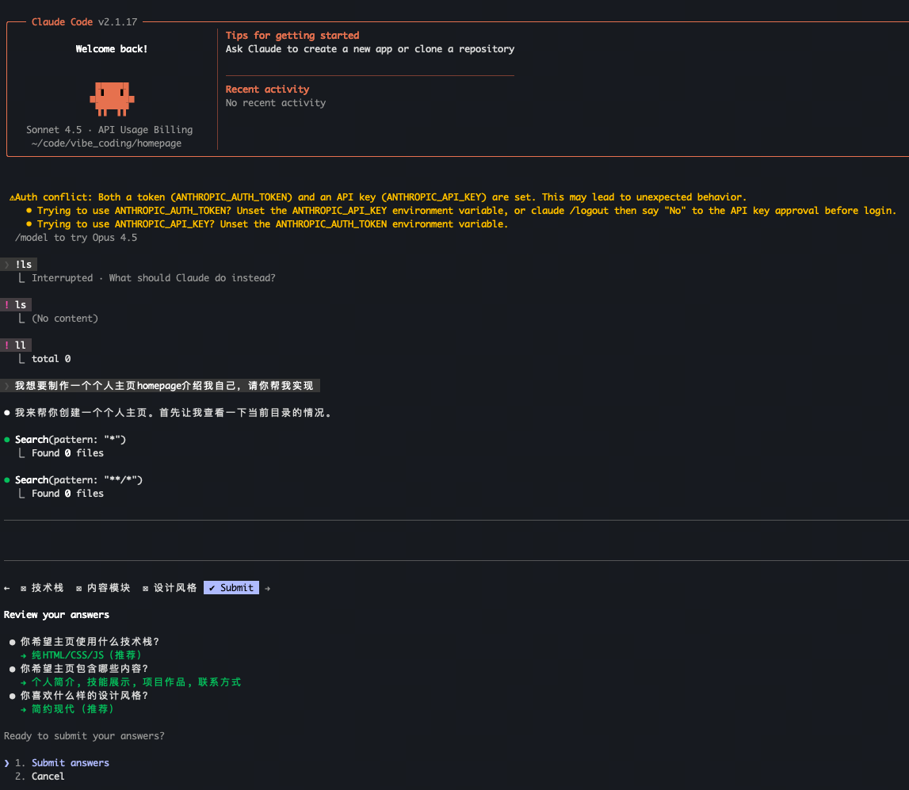

- [环境配置](#环境配置)
- [使用](#使用)
  - [终端使用](#终端使用)
  - [vscode 使用 claudecode 插件](#vscode-使用-claudecode-插件)
- [claudecode 上下文管理](#claudecode-上下文管理)


claudecode 官网：[https://code.claude.com/docs/zh-CN/overview](https://code.claude.com/docs/zh-CN/overview)

# 环境配置

**安装**

```shell
# 报错大概率是 unavailable region 网络重定向了
curl -fsSL https://claude.ai/install.sh | bash

# (dev) ➜  /Users/zhengnairong % curl -fsSL https://claude.ai/install.sh | bash
# Setting up Claude Code...
# ✔ Claude Code successfully installed!
#   Version: 2.1.31
#   Location: ~/.local/bin/claude

#   Next: Run claude --help to get started
# ✅ Installation complete!
```

**更改安装版本（若需）**

```shell
claude install 2.1.17

# (dev) ➜  /Users/zhengnairong % claude install 2.1.17
# ✔ Claude Code successfully installed!
#   Version: 2.1.17
#   Location: ~/.local/bin/claude

#   Next: Run claude --help to get started
```

**禁用自动更新（若需）**

```shell
# 在 ~/.claude.json 的 env 字段中添加如下设置：
{
  "env": {
    "DISABLE_AUTOUPDATER": "1",
    "CLAUDE_CODE_DISABLE_NONESSENTIAL_TRAFFIC": "1"
  }
}
```

**使用外部 API（若需）**

```shell
# 添加如下环境变量
export ANTHROPIC_BASE_URL="xxx"
export ANTHROPIC_AUTH_TOKEN="xxx"
export ANTHROPIC_API_KEY="xxx"

# `ANTHROPIC_AUTH_TOKEN`：面向“自建/第三方网关”的鉴权令牌
# `ANTHROPIC_API_KEY`：面向 Anthropic 官方 API 的标准密钥。直连 Anthropic 官方 API
# 有 ANTHROPIC_AUTH_TOKEN 时使用 claudecode，可能就不需要 ANTHROPIC_API_KEY，不太确定，可以看看下面图片的提示

# 请求发送是这种方式（我没有验证）：POST {ANTHROPIC_BASE_URL}/v1/messages
# claudecode 官方的 api url 是：https://api.anthropic.com
```

# 使用

## 终端使用

**进入 claudecode**

```shell
cd <your_workdir>
claude
# 会让你选择主题，并选择是否使用配置的 api_key
# 最后会问你是否给这个文件夹的权限，选择“是”之后即可开始使用
# 可以使用 /init 命令来初始化
```

**与 claudecode 交互**

下面给一个 制作 homepage 的交互过程来举例



**使用 `shift+tab` 来切换交互模式（很关键）**，先用 plan mode 来交互说清楚需求！

**退出**

```shell
exit
```


## vscode 使用 claudecode 插件

安装插件 `Claude Code for VS Code`

官方插件默认需要登陆，如果使用第三方 api 需要进行以下配置。

**修改默认授权方式**

```shell
# 编辑文件 ~/.claude/config.json，添加如下内容：
{
    "primaryApiKey": "custom"
}
```

**编辑插件的 setting.json**

```shell
# 1. 进入官方插件的“设置”
# 2. 找到 `Claude Code: Environment Variables`
# 3. 选择 `在 setting.json 中编辑`
# 4. 添加如下内容，重启后即可免登陆
"claudeCode.environmentVariables": [
    {
        "name": "ANTHROPIC_BASE_URL",
        "value": "xxx"
    },
    {
        "name": "ANTHROPIC_AUTH_TOKEN",
        "value": "xxx"
    },
    {
        "name": "ANTHROPIC_API_KEY",
        "value": "xxx"
    }
]
```

# claudecode 上下文管理

**个人全局上下文**

```shell
# 定义个人偏好、常用库和代码风格，这会全局应用
~/.claude/claude.md

# 配置好之后跟 claudecode 聊天会发现他是可以识别到的
# ❯ 请问我的代码风格是什么呢？

# ⏺ 根据您的全局配置文件（~/.claude/CLAUDE.md），您的代码风格偏好是：

#   1. 喜欢写注释解释每个函数 - 为每个函数添加说明性注释
#   2. 函数内部关键逻辑也会添加注释 - 不仅在函数层面，关键的内部逻辑也需要注释说明
#   3. 不喜欢一个代码文件太长，需要做好模块化 - 偏好将代码拆分成合理的模块，保持文件精简

#   这些偏好强调了代码的可读性和可维护性，通过充分的注释和合理的模块化来提高代码质量。
```

**项目上下文**

```shell
# 项目的核心架构、关键模块和特殊约定。推荐检入代码库。
<your_project>/claude.md

# 在 claude 中使用 /init 命令可以自动生成
```

**文档化一切**

```shell
# 将中间工作，如计划、分析、图标、笔记等传给 AI，使其与整个思维过程保持一致
plans.md, analysis.txt, etc.
```


**压缩上下文**

在交互过程中可以不断更新上面的文档，并按需使用以下命令压缩上下文：

```shell
/compact    # 压缩历史对话
/clear      # 清空历史对话
```


