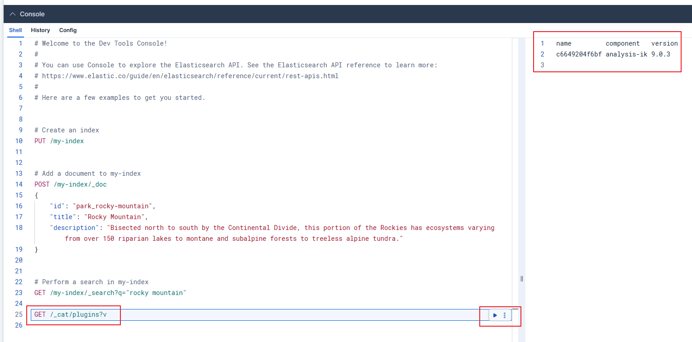
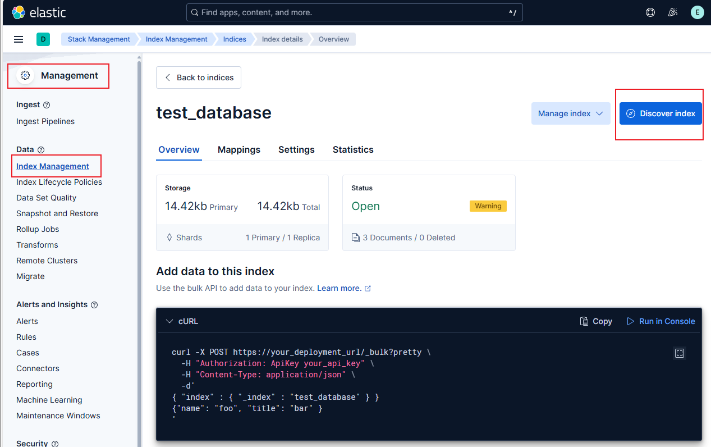
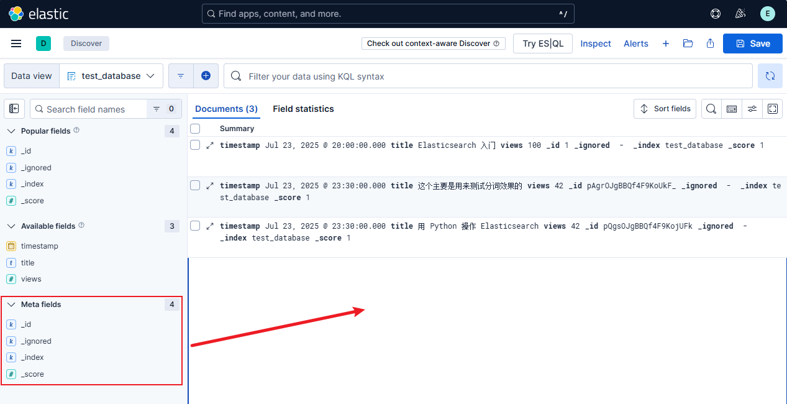

- [基本概念快速理解](#基本概念快速理解)
- [安装elasticsearch](#安装elasticsearch)
- [运行kibana](#运行kibana)
- [安装分词器](#安装分词器)
- [Elasticsearch的使用](#elasticsearch的使用)
  - [命令行使用](#命令行使用)
  - [kibana使用](#kibana使用)
- [常用查询语句](#常用查询语句)
- [详细路由介绍](#详细路由介绍)
  - [文档操作相关](#文档操作相关)
  - [索引级别相关操作](#索引级别相关操作)
  - [总结](#总结)
- [一键脚本部署](#一键脚本部署)


## 基本概念快速理解

| 概念             | 含义                                  |
| ---------------- | ------------------------------------- |
| Index（索引）    | 类似数据库中的表                      |
| Document（文档） | 类似表中的一行记录，JSON 格式         |
| Field（字段）    | 文档的每个属性                        |
| Mapping          | 类似表结构定义，规定字段类型          |
| Query DSL        | Elasticsearch 的查询语言（JSON 格式） |

## 安装elasticsearch

[参考链接](https://www.elastic.co/docs/deploy-manage/deploy/self-managed/install-elasticsearch-docker-basic)

拉镜像：

```bash
docker pull docker.elastic.co/elasticsearch/elasticsearch:9.0.3
```

验证 Elasticsearch 镜像的签名。（可选）：

```bash
# 下载并安装 Cosign
wget https://github.com/sigstore/cosign/releases/download/v2.5.3/cosign-linux-amd64
chmod +x cosign-linux-amd64
sudo mv cosign-linux-amd64 /usr/local/bin/cosign
# 验证安装
cosign version
# 验证镜像签名
wget https://artifacts.elastic.co/cosign.pub
cosign verify --key cosign.pub docker.elastic.co/elasticsearch/elasticsearch:9.0.3
```

启动 Elasticsearch 容器：

```bash
# 修改配置（不然会报错）
sudo vi /etc/sysctl.conf
# 添加一行
vm.max_map_count=262144
# 使得配置生效
sudo sysctl -p

# 创建网络
docker network create elastic
# docker启动单节点es
docker run --name es01 --net elastic -p 9200:9200 -it -m 1GB docker.elastic.co/elasticsearch/elasticsearch:9.0.3
# 正常是需要做数据卷映射之类的，将容器的 /usr/share/elasticsearch/data 映射到数据盘
# 但是一直没成功，好像是因为权限问题
# 然后因为是用-it的形式启动的要看日志，所以之后可以用 Ctrl+p+q
```

会出现以下log：

```bash
✅ Elasticsearch security features have been automatically configured!
✅ Authentication is enabled and cluster connections are encrypted.

ℹ️  Password for the elastic user (reset with `bin/elasticsearch-reset-password -u elastic`):
  rOvmWsl0=5FqMXiV01G4

ℹ️  HTTP CA certificate SHA-256 fingerprint:
  c4b97c87be4e5a1098812aebe47ae622707b0c43909064ad1c59196a705de8c8

ℹ️  Configure Kibana to use this cluster:
• Run Kibana and click the configuration link in the terminal when Kibana starts.
• Copy the following enrollment token and paste it into Kibana in your browser (valid for the next 30 minutes):
  eyJ2ZXIiOiI4LjE0LjAiLCJhZHIiOlsiMTcyLjE4LjAuMjo5MjAwIl0sImZnciI6ImM0Yjk3Yzg3YmU0ZTVhMTA5ODgxMmFlYmU0N2FlNjIyNzA3YjBjNDM5MDkwNjRhZDFjNTkxOTZhNzA1ZGU4YzgiLCJrZXkiOiJOTmFxTjVnQnAzZlM3bG5NczVuNzpJdkdmcmEwWGJZelFJU0FySTlWS0tnIn0=

ℹ️ Configure other nodes to join this cluster:
• Copy the following enrollment token and start new Elasticsearch nodes with `bin/elasticsearch --enrollment-token <token>` (valid for the next 30 minutes):
  eyJ2ZXIiOiI4LjE0LjAiLCJhZHIiOlsiMTcyLjE4LjAuMjo5MjAwIl0sImZnciI6ImM0Yjk3Yzg3YmU0ZTVhMTA5ODgxMmFlYmU0N2FlNjIyNzA3YjBjNDM5MDkwNjRhZDFjNTkxOTZhNzA1ZGU4YzgiLCJrZXkiOiJOdGFxTjVnQnAzZlM3bG5NczVuNzotdmhKRmQ2ZWUxa1lhekpuSlNYN2hBIn0=

  If you're running in Docker, copy the enrollment token and run:
  `docker run -e "ENROLLMENT_TOKEN=<token>" docker.elastic.co/elasticsearch/elasticsearch:9.0.3`
```

后续可以使用以下命令重新生成凭据：

```bash
docker exec -it es01 /usr/share/elasticsearch/bin/elasticsearch-reset-password -u elastic
docker exec -it es01 /usr/share/elasticsearch/bin/elasticsearch-create-enrollment-token -s kibana
```

可以将密码直接保存在环境变量中：

```bash
export ELASTIC_PASSWORD="your_password"
```

将 SSL 证书从容器复制到本地计算机：

```bash
docker cp es01:/usr/share/elasticsearch/config/certs/http_ca.crt .
```

对 Elasticsearch 进行 REST API 调用，以确保 Elasticsearch 容器正在运行：

```bash
curl --cacert http_ca.crt -u elastic:$ELASTIC_PASSWORD https://localhost:9200
```

## 运行kibana

拉镜像：

```bash
docker pull docker.elastic.co/kibana/kibana:9.0.3
```

验证 Kibana 映像的签名（可选）

```bash
wget https://artifacts.elastic.co/cosign.pub
cosign verify --key cosign.pub docker.elastic.co/kibana/kibana:9.0.3
```

启动kibana（用来可视化的）：

```bash
docker run --name kib01 --net elastic -p 5601:5601 docker.elastic.co/kibana/kibana:9.0.3
# 好像也可以用 apt install 的方式
```

运行成功有以下日志：

```bash
i Kibana has not been configured.

Go to http://0.0.0.0:5601/?code=511503 to get started.
```

看到这个日志之后，打开网页，会有一个配置框，需要填写令牌，令牌来源：

```bash
docker exec -it es01 /usr/share/elasticsearch/bin/elasticsearch-create-enrollment-token -s kibana
```

将生成的令牌复制到网页中，然后点击确定。

之后可能会有一个验证码认证，到终端复制粘贴过来。一定要用复制粘贴的方式，直接输入的话会卡。

通过验证之后会初始化，初始化完成后让输入：

```bash
# Username: elastic
# Password: 就是运行 Elasticsearch 容器时生成的那个密码，在这里就是 rOvmWsl0=5FqMXiV01G4
```

## 安装分词器

```bash
# 进入容器
docker exec -it es01 bash
# 安装插件
bin/elasticsearch-plugin install https://get.infini.cloud/elasticsearch/analysis-ik/9.0.3
# 退出容器后重启容器
docekr restart es01
```

在 ES Console 运行命令检查是否安装成功：

```bash
GET /_cat/plugins?v
```



## Elasticsearch的使用

### 命令行使用

**创建索引（可省略，写入时会自动创建）**
```bash
curl --cacert http_ca.crt -u elastic:$ELASTIC_PASSWORD -X PUT https://localhost:9200/test_database
# log: {"acknowledged":true,"shards_acknowledged":true,"index":"test_database"}
```

带参数创建（指定mappings、settings等）：
```bash
curl --cacert http_ca.crt -u elastic:$ELASTIC_PASSWORD \
-X PUT https://localhost:9200/test_database \
-H 'Content-Type: application/json' 
-d '
{
  "settings": {
    "analysis": {
      "analyzer": {
        "my_ik_analyzer": {
          "type": "custom",
          "tokenizer": "ik_max_word"
        }
      }
    }
  },
  "mappings": {
    "properties": {
      "title": {
        "type": "text",
        "analyzer": "my_ik_analyzer",
        "search_analyzer": "ik_smart"
      },
      "views": {
        "type": "integer"
      },
      "timestamp": {
        "type": "date"
      }
    }
  }
}'
```

**查看所有索引**

```bash
curl --cacert http_ca.crt -u elastic:$ELASTIC_PASSWORD -X GET "https://localhost:9200/_cat/indices?v"
```

**插入文档（写入数据）**

```bash
curl --cacert http_ca.crt -u elastic:$ELASTIC_PASSWORD \
-X POST https://localhost:9200/test_database/_doc/1 \
-H 'Content-Type: application/json' \
-d '{
  "title": "Elasticsearch 入门",
  "views": 100,
  "timestamp": "2025-07-23T12:00:00"
}'
# log: {"_index":"test_database","_id":"1","_version":1,"result":"created","_shards":{"total":2,"successful":1,"failed":0},"_seq_no":0,"_primary_term":1}
```

可以省略 id，让 ES 自动生成：

```bash
curl --cacert http_ca.crt -u elastic:$ELASTIC_PASSWORD \
-X POST https://localhost:9200/test_database/_doc \
-H 'Content-Type: application/json' \
-d '{
  "title": "用 Python 操作 Elasticsearch",
  "views": 42,
  "timestamp": "2025-07-23T15:30:00"
}'
# log: {"_index":"test_database","_id":"pQgsOJgBBQf4F9KojUFk","_version":1,"result":"created","_shards":{"total":2,"successful":1,"failed":0},"_seq_no":2,"_primary_term":1}
```
**查询数据（全文检索）**

**查询数据-查询所有文档**

```bash
curl --cacert http_ca.crt -u elastic:$ELASTIC_PASSWORD -X GET https://localhost:9200/test_database/_search
# log: 就是整个库
```

**查询数据-按条件搜索（match）**

```bash
curl --cacert http_ca.crt -u elastic:$ELASTIC_PASSWORD \
-X GET https://localhost:9200/test_database/_search \
-H 'Content-Type: application/json' -d '{
  "query": {
    "match": {
      "title": "Elasticsearch 入门"
    }
  }
}'
# log: 
# {
#     "took": 0,
#     "timed_out": false,
#     "_shards": {
#         "total": 1,
#         "successful": 1,
#         "skipped": 0,
#         "failed": 0
#     },
#     "hits": {
#         "total": {
#             "value": 2,
#             "relation": "eq"
#         },
#         "max_score": 1.8934596,
#         "hits": [
#             {
#                 "_index": "test_database",
#                 "_id": "1",
#                 "_score": 1.8934596,
#                 "_source": {
#                     "title": "Elasticsearch 入门",
#                     "views": 100,
#                     "timestamp": "2025-07-23T12:00:00"
#                 }
#             },
#             {
#                 "_index": "test_database",
#                 "_id": "pQgsOJgBBQf4F9KojUFk",
#                 "_score": 0.49917626,
#                 "_source": {
#                     "title": "用 Python 操作 Elasticsearch",
#                     "views": 42,
#                     "timestamp": "2025-07-23T15:30:00"
#                 }
#             }
#         ]
#     }
# }
```

**查询数据-精确匹配（term 查询）**

```bash
curl --cacert http_ca.crt -u elastic:$ELASTIC_PASSWORD \
-X GET https://localhost:9200/test_database/_search \
-H 'Content-Type: application/json' \
-d '{
  "query": {
    "term": {
      "views": 100
    }
  }
}'
# log: 
# {
#     "took": 0,
#     "timed_out": false,
#     "_shards": {
#         "total": 1,
#         "successful": 1,
#         "skipped": 0,
#         "failed": 0
#     },
#     "hits": {
#         "total": {
#             "value": 1,
#             "relation": "eq"
#         },
#         "max_score": 1.0,
#         "hits": [
#             {
#                 "_index": "test_database",
#                 "_id": "1",
#                 "_score": 1.0,
#                 "_source": {
#                     "title": "Elasticsearch 入门",
#                     "views": 100,
#                     "timestamp": "2025-07-23T12:00:00"
#                 }
#             }
#         ]
#     }
# }
```

**查询数据-范围查询（range）**

```bash
curl --cacert http_ca.crt -u elastic:$ELASTIC_PASSWORD \
-X GET https://localhost:9200/test_database/_search \
-H 'Content-Type: application/json' \
-d '{
  "query": {
    "range": {
      "views": {
        "gte": 50,
        "lte": 200
      }
    }
  }
}'
# log: 略
```

**查看分词器结果**

```bash
curl --cacert http_ca.crt -u elastic:$ELASTIC_PASSWORD \
-X GET "https://localhost:9200/test_database/_analyze" \
-H 'Content-Type: application/json' \
-d '
{
  "field": "title",
  "text": "这个主要是用来测试分词效果的"
}'
# log: 
# {
#     "tokens": [
#         {
#             "token": "这个",
#             "start_offset": 0,
#             "end_offset": 2,
#             "type": "CN_WORD",
#             "position": 0
#         },
#         {
#             "token": "主要",
#             "start_offset": 2,
#             "end_offset": 4,
#             "type": "CN_WORD",
#             "position": 1
#         },
#         {
#             "token": "要是",
#             "start_offset": 3,
#             "end_offset": 5,
#             "type": "CN_WORD",
#             "position": 2
#         },
#         {
#             "token": "用来",
#             "start_offset": 5,
#             "end_offset": 7,
#             "type": "CN_WORD",
#             "position": 3
#         },
#         {
#             "token": "测试",
#             "start_offset": 7,
#             "end_offset": 9,
#             "type": "CN_WORD",
#             "position": 4
#         },
#         {
#             "token": "分词",
#             "start_offset": 9,
#             "end_offset": 11,
#             "type": "CN_WORD",
#             "position": 5
#         },
#         {
#             "token": "效果",
#             "start_offset": 11,
#             "end_offset": 13,
#             "type": "CN_WORD",
#             "position": 6
#         },
#         {
#             "token": "的",
#             "start_offset": 13,
#             "end_offset": 14,
#             "type": "CN_CHAR",
#             "position": 7
#         }
#     ]
# }
```

### kibana使用

[参考链接](https://www.cnblogs.com/chenqionghe/p/12503181.html)，这个链接有一些超链接都可以看看

**kibana的命令行**

在web的 `management - Dev Tools`中可以打开web命令行直接操作，具体使用略。

**kibana的管理**

在web的 `management - Stack Management - Index Manegemant`中 create_index 之后，进入：



就可以看到以下页面：



## 常用查询语句

省略了证书跟密码，需要加上 `--cacert http_ca.crt -u elastic:$ELASTIC_PASSWORD`

**索引操作**

```bash
# 创建索引
curl -X PUT "https://localhost:9200/test_database"
# 删除索引
curl -X DELETE "https://localhost:9200/test_database"
# 查看所有索引
curl -X GET "https://localhost:9200/_cat/indices?v"
```

**文档操作**

```bash
# 插入文档
curl -X POST "https://localhost:9200/test_database/_doc" -H 'Content-Type: application/json' -d '{"name": "Alice", "age": 25}'
curl --cacert http_ca.crt -u elastic:$ELASTIC_PASSWORD -X POST https://localhost:9200/test_database/_doc/1 -H 'Content-Type: application/json' -d '{
  "title": "这个主要是用来测试分词效果的",
  "views": 42,
  "timestamp": "2025-07-24"
}'
# 获取文档
curl -X GET "https://localhost:9200/test_database/_doc/1"
# 更新文档
curl -X POST "https://localhost:9200/test_database/_update/1" -H 'Content-Type: application/json' -d '{"doc": {"title": "new_title"}}'
# 删除文档
curl -X DELETE "https://localhost:9200/test_database/_doc/1"
```

**查询操作**

```bash
# 查询所有文档
curl -X GET "https://localhost:9200/test_database/_search" -H 'Content-Type: application/json' -d '{"query": {"match_all": {}}}'

# 条件查询
curl -X GET "https://localhost:9200/test_database/_search" -H 'Content-Type: application/json' -d '{"query": {"match": {"name": "Alice"}}}'

# 范围查询
curl -X GET "https://localhost:9200/test_database/_search" -H 'Content-Type: application/json' -d '{"query": {"range": {"age": {"gte": 20, "lte": 30}}}}'

# 分页、排序
curl -X GET "https://localhost:9200/test_database/_search" -H 'Content-Type: application/json' -d '{"from": 0, "size": 10, "sort": [{"age": "desc"}]}'
```

## 详细路由介绍

### 文档操作相关

| 路由                        | 方法           | 用途                   | 说明                                |
| --------------------------- | -------------- | ---------------------- | ----------------------------------- |
| `/{index}/_doc/{id}`        | `PUT` / `POST` | 创建/更新文档          | 推荐使用 _doc 作为类型名（ES 7.x+） |
| `/{index}/_doc/{id}`        | `GET`          | 获取单个文档           | 按 _id 查询                         |
| `/{index}/_doc/{id}`        | `DELETE`       | 删除单个文档           | 按 _id 删除                         |
| `/{index}/_update/{id}`     | `POST`         | 局部更新文档           | 更新某些字段而不是整体替换          |
| `/{index}/_search`          | `GET` / `POST` | 搜索文档               | 用于全文搜索、筛选、排序、分页等    |
| `/{index}/_mget`            | `POST`         | 批量获取多个文档       | 多个 _id 一次查询                   |
| `/{index}/_bulk`            | `POST`         | 批量操作文档           | 批量新增、更新、删除等              |
| `/{index}/_delete_by_query` | `POST`         | 批量删除符合条件的文档 | 根据查询条件批删                    |

### 索引级别相关操作

| 路由                          | 方法     | 用途                     | 说明                                  |
| ----------------------------- | -------- | ------------------------ | ------------------------------------- |
| `/{index}`                    | `PUT`    | 创建索引                 | 带 mappings 和 settings 可定义结构    |
| `/{index}`                    | `DELETE` | 删除索引                 | 小心使用，无法恢复                    |
| `/{index}`                    | `GET`    | 查看索引基本信息         | 包含 shards、aliases 等               |
| `/{index}/_mapping`           | `GET`    | 查看字段结构             | 显示字段类型、analyzer 等             |
| `/{index}/_settings`          | `GET`    | 查看索引设置             | 包括分片、副本、analyzer 设置等       |
| `/{index}/_analyze`           | `POST`   | 查看分词效果             | 指定 analyzer 或字段进行分词分析      |
| `/_cat/indices`               | `GET`    | 查看所有索引列表         | 更直观展示（类似 SQL 的 SHOW TABLES） |
| `/_stats` / `/{index}/_stats` | `GET`    | 查看文档数量、存储使用等 |                                       |

### 总结

| 类型 | 路由               | 常用于                   |
| ---- | ------------------ | ------------------------ |
| 查询 | `_search`          | 搜索数据                 |
| 插入 | `_doc/{id}`        | 添加文档                 |
| 更新 | `_update/{id}`     | 局部更新字段             |
| 删除 | `_delete_by_query` | 批量删除                 |
| 分析 | `_analyze`         | 验证分词器效果           |
| 映射 | `_mapping`         | 定义或查看字段结构       |
| 设置 | `_settings`        | 调整 analyzer、shards 等 |


## 一键脚本部署

（随便记的）

```bash
echo "[1/9] 设置 vm.max_map_count..."
# 自动写入配置并生效（如已存在则不重复写入）
grep -q '^vm.max_map_count=262144' /etc/sysctl.conf || echo 'vm.max_map_count=262144' | sudo tee -a /etc/sysctl.conf
sudo sysctl -p

echo "[2/9] 拉取 ElasticSearch 与 Kibana 镜像..."
docker pull docker.elastic.co/elasticsearch/elasticsearch:9.0.3
# docker pull docker.elastic.co/kibana/kibana:9.0.3

echo "[3/9] 创建数据目录并设置权限..."
sudo mkdir -p /data1/damonzheng/elasticsearch_docker_single/data
sudo chown -R 1000:1000 /data1/damonzheng/elasticsearch_docker_single
sudo chown -R 1000:1000 /data1/damonzheng/elasticsearch_docker_single/data

echo "[4/9] 启动 ElasticSearch 容器..."
# docker run -d --name es01 --net host -p 9200:9200 -m 8GB docker.elastic.co/elasticsearch/elasticsearch:9.0.3
docker run -d --name es01 --net host -p 9200:9200 -m 8GB \
  -v /data1/damonzheng/elasticsearch_docker_single/data:/usr/share/elasticsearch/data \
  docker.elastic.co/elasticsearch/elasticsearch:9.0.3
echo "ElasticSearch 容器已启动 (es01)，端口: 9200"

echo "[5/9] 安装 IK 分词插件..."
docker exec es01 bin/elasticsearch-plugin install --batch https://get.infini.cloud/elasticsearch/analysis-ik/9.0.3
echo "IK 分词插件安装完成。"

echo "[6/9] 重启 ElasticSearch 容器使插件生效..."
docker restart es01
echo "ElasticSearch 容器已重启。"

echo "[7/9] 启动 Kibana 容器..."
docker run -d --name kib01 --net host -p 5601:5601 docker.elastic.co/kibana/kibana:9.0.3
echo "Kibana 容器已启动 (kib01)，端口: 5601"

echo "[8/9] 检查 ElasticSearch 状态..."
docker ps -a | grep es01

echo "[9/9] 部署完成！"
echo "访问 ElasticSearch: http://localhost:9200"
echo "访问 Kibana: http://localhost:5601"
```