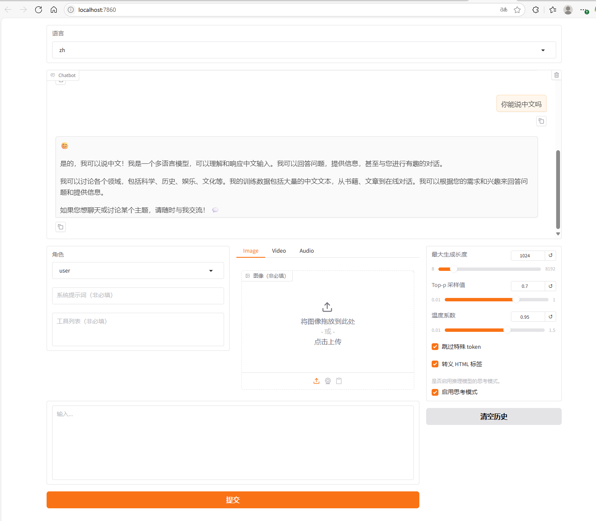

- [下载与安装](#下载与安装)
- [模型下载与验证](#模型下载与验证)


## 下载与安装

**从源码安装**

```bash
conda create -n dev python=3.10
conda activate dev
cd ~/code
git clone https://github.com/hiyouga/LLaMA-Factory.git
# git clone https://gitee.com/hiyouga/LLaMA-Factory.git
cd LLaMA-Factory
pip install -e '.[torch,metrics]'
```

**验证环境**

```bash
(dev) root@autodl-container-c8da1195fa-d0d8249f:~/code/LLaMA-Factory# python
Python 3.10.18 (main, Jun  5 2025, 13:14:17) [GCC 11.2.0] on linux
Type "help", "copyright", "credits" or "license" for more information.
>>> import torch
>>> torch.cuda.current_device()
0
>>> torch.cuda.get_device_name(0)
'Tesla V100S-PCIE-32GB'
>>> torch.__version__
'2.7.1+cu126'
>>> quit()
(dev) root@autodl-container-c8da1195fa-d0d8249f:~/code/LLaMA-Factory#
```

## 模型下载与验证

**模型下载**

```bash
cd ~/autodl-tmp/model # 数据盘
# git clone https://www.modelscope.cn/LLM-Research/Meta-Llama-3-8B-Instruct.git
# git clone https://huggingface.co/meta-llama/Meta-Llama-3-8B-Instruct
```

好像这么下载会有问题，可以用python代码下载：

```python
# 模型下载
from modelscope import snapshot_download
model_dir = snapshot_download('LLM-Research/Meta-Llama-3-8B-Instruct', cache_dir='./cache')
```

下载完大概是这样：

```bash
(dev) root@autodl-container-c8da1195fa-d0d8249f:~/autodl-tmp/model/cache/LLM-Research/Meta-Llama-3-8B-Instruct# du -sh *
8.0K    LICENSE
40K     README.md
8.0K    USE_POLICY.md
4.0K    config.json
4.0K    configuration.json
4.0K    generation_config.json
4.7G    model-00001-of-00004.safetensors
4.7G    model-00002-of-00004.safetensors
4.6G    model-00003-of-00004.safetensors
1.1G    model-00004-of-00004.safetensors
24K     model.safetensors.index.json
15G     original
4.0K    special_tokens_map.json
8.7M    tokenizer.json
52K     tokenizer_config.json
```

**验证模型文件的正确性**

```python
import transformers
import torch

# 切换为下载的模型文件目录, 这里的demo是Llama-3-8B-Instruct
# 如果是其他模型，比如qwen，chatglm，请使用其对应的官方demo
model_id = "/root/autodl-tmp/model/cache/LLM-Research/Meta-Llama-3-8B-Instruct"

pipeline = transformers.pipeline(
    "text-generation",
    model=model_id,
    model_kwargs={"torch_dtype": torch.bfloat16},
    device_map="auto",
)

messages = [
    {"role": "system", "content": "You are a Chinese chatbot who always responds in Chinese speak!"},
    {"role": "user", "content": "Who are you?"},
]

prompt = pipeline.tokenizer.apply_chat_template(
        messages,
        tokenize=False,
        add_generation_prompt=True
)

terminators = [
    pipeline.tokenizer.eos_token_id,
    pipeline.tokenizer.convert_tokens_to_ids("<|eot_id|>")
]

outputs = pipeline(
    prompt,
    max_new_tokens=256,
    eos_token_id=terminators,
    do_sample=True,
    temperature=0.6,
    top_p=0.9,
)
print(outputs[0]["generated_text"][len(prompt):])
```

结果如下：

```bash
(dev) root@autodl-container-c8da1195fa-d0d8249f:~/code# python test_model.py
Loading checkpoint shards: 100%|█████████| 4/4 [00:04<00:00,  1.22s/it]
Device set to use cuda:0
Setting `pad_token_id` to `eos_token_id`:128009 for open-end generation.
(nǐ hǎo) Wǒ jiào zhōng wén, shì yī gè zhōng guó de fēng yǔ bǎn bǎo (Nice to meet you! My name is Zhong Wen, I'm a Chinese chatbot).
```

**原始模型直接推理**

可以直接在命令行：

```bash
CUDA_VISIBLE_DEVICES=0 llamafactory-cli webchat \
    --model_name_or_path /root/autodl-tmp/model/cache/LLM-Research/Meta-Llama-3-8B-Instruct \
    --template llama3
```

也可以将其中一些参数写到配置文件中，配置文件在：`/root/code/LLaMA-Factory/examples/inference/llama3.yaml`

内容如下：

```yaml
model_name_or_path: /root/autodl-tmp/model/cache/LLM-Research/Meta-Llama-3-8B-Instruct
template: llama3
infer_backend: huggingface  # choices: [huggingface, vllm, sglang]
trust_remote_code: true
```

然后运行

```bash
llamafactory-cli webchat /root/code/LLaMA-Factory/examples/inference/llama3.yaml
```

会有以下log：

```bash
[INFO|2025-06-24 17:25:18] llamafactory.model.model_utils.attention:143 >> Using torch SDPA for faster training and inference.
[INFO|2025-06-24 17:25:18] llamafactory.model.loader:143 >> all params: 8,030,261,248
* Running on local URL:  http://0.0.0.0:7860
* To create a public link, set `share=True` in `launch()`.
```

因为我是在远程服务器跑的，所以需要做个本地端口转发才可以在windows的网页访问，结果如图：

