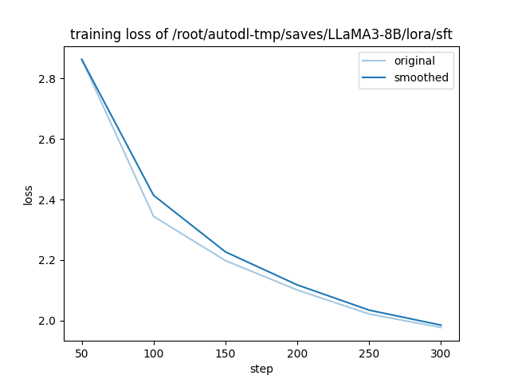
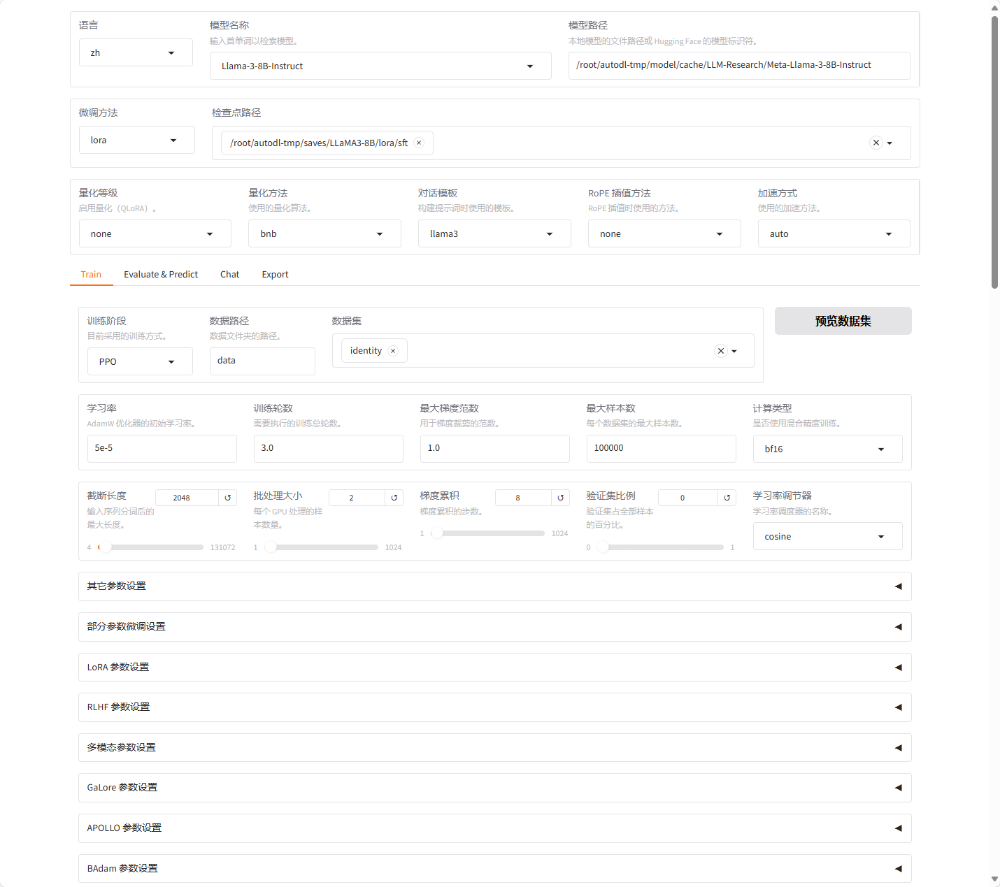

- [下载与安装](#下载与安装)
- [模型下载与验证](#模型下载与验证)
- [自定义数据集构建](#自定义数据集构建)
- [基于LoRA的sft指令微调](#基于lora的sft指令微调)
- [动态合并LoRA的推理](#动态合并lora的推理)
- [一站式webui board的使用](#一站式webui-board的使用)
- [其他](#其他)

[LLaMA-Factory](https://github.com/hiyouga/LLaMA-Factory)

[参考链接](https://zhuanlan.zhihu.com/p/695287607)

## 下载与安装

**从源码安装**

```bash
conda create -n dev python=3.10
conda activate dev
cd ~/code
git clone https://github.com/hiyouga/LLaMA-Factory.git
# git clone https://gitee.com/hiyouga/LLaMA-Factory.git
cd LLaMA-Factory
pip install -e '.[torch,metrics]'
```

**验证环境**

```bash
(dev) root@autodl-container-c8da1195fa-d0d8249f:~/code/LLaMA-Factory# python
Python 3.10.18 (main, Jun  5 2025, 13:14:17) [GCC 11.2.0] on linux
Type "help", "copyright", "credits" or "license" for more information.
>>> import torch
>>> torch.cuda.current_device()
0
>>> torch.cuda.get_device_name(0)
'Tesla V100S-PCIE-32GB'
>>> torch.__version__
'2.7.1+cu126'
>>> quit()
(dev) root@autodl-container-c8da1195fa-d0d8249f:~/code/LLaMA-Factory#
```

## 模型下载与验证

**模型下载**

```bash
cd ~/autodl-tmp/model # 数据盘
# git clone https://www.modelscope.cn/LLM-Research/Meta-Llama-3-8B-Instruct.git
# git clone https://huggingface.co/meta-llama/Meta-Llama-3-8B-Instruct
```

好像这么下载会有问题，可以用python代码下载：

```python
# 模型下载
from modelscope import snapshot_download
model_dir = snapshot_download('LLM-Research/Meta-Llama-3-8B-Instruct', cache_dir='./cache')
```

下载完大概是这样：

```bash
(dev) root@autodl-container-c8da1195fa-d0d8249f:~/autodl-tmp/model/cache/LLM-Research/Meta-Llama-3-8B-Instruct# du -sh *
8.0K    LICENSE
40K     README.md
8.0K    USE_POLICY.md
4.0K    config.json
4.0K    configuration.json
4.0K    generation_config.json
4.7G    model-00001-of-00004.safetensors
4.7G    model-00002-of-00004.safetensors
4.6G    model-00003-of-00004.safetensors
1.1G    model-00004-of-00004.safetensors
24K     model.safetensors.index.json
15G     original
4.0K    special_tokens_map.json
8.7M    tokenizer.json
52K     tokenizer_config.json
```

**验证模型文件的正确性**

```python
import transformers
import torch

# 切换为下载的模型文件目录, 这里的demo是Llama-3-8B-Instruct
# 如果是其他模型，比如qwen，chatglm，请使用其对应的官方demo
model_id = "/root/autodl-tmp/model/cache/LLM-Research/Meta-Llama-3-8B-Instruct"

pipeline = transformers.pipeline(
    "text-generation",
    model=model_id,
    model_kwargs={"torch_dtype": torch.bfloat16},
    device_map="auto",
)

messages = [
    {"role": "system", "content": "You are a Chinese chatbot who always responds in Chinese speak!"},
    {"role": "user", "content": "Who are you?"},
]

prompt = pipeline.tokenizer.apply_chat_template(
        messages,
        tokenize=False,
        add_generation_prompt=True
)

terminators = [
    pipeline.tokenizer.eos_token_id,
    pipeline.tokenizer.convert_tokens_to_ids("<|eot_id|>")
]

outputs = pipeline(
    prompt,
    max_new_tokens=256,
    eos_token_id=terminators,
    do_sample=True,
    temperature=0.6,
    top_p=0.9,
)
print(outputs[0]["generated_text"][len(prompt):])
```

结果如下：

```bash
(dev) root@autodl-container-c8da1195fa-d0d8249f:~/code# python test_model.py
Loading checkpoint shards: 100%|█████████| 4/4 [00:04<00:00,  1.22s/it]
Device set to use cuda:0
Setting `pad_token_id` to `eos_token_id`:128009 for open-end generation.
(nǐ hǎo) Wǒ jiào zhōng wén, shì yī gè zhōng guó de fēng yǔ bǎn bǎo (Nice to meet you! My name is Zhong Wen, I'm a Chinese chatbot).
```

**原始模型直接推理**

可以直接在命令行：

```bash
CUDA_VISIBLE_DEVICES=0 llamafactory-cli webchat \
    --model_name_or_path /root/autodl-tmp/model/cache/LLM-Research/Meta-Llama-3-8B-Instruct \
    --template llama3
```

也可以将其中一些参数写到配置文件中，配置文件在：`/root/code/LLaMA-Factory/examples/inference/llama3.yaml`

内容如下：

```yaml
model_name_or_path: /root/autodl-tmp/model/cache/LLM-Research/Meta-Llama-3-8B-Instruct
template: llama3
infer_backend: huggingface  # choices: [huggingface, vllm, sglang]
trust_remote_code: true
```

然后运行

```bash
llamafactory-cli webchat /root/code/LLaMA-Factory/examples/inference/llama3.yaml
```

会有以下log：

```bash
[INFO|2025-06-24 17:25:18] llamafactory.model.model_utils.attention:143 >> Using torch SDPA for faster training and inference.
[INFO|2025-06-24 17:25:18] llamafactory.model.loader:143 >> all params: 8,030,261,248
* Running on local URL:  http://0.0.0.0:7860
* To create a public link, set `share=True` in `launch()`.
```

因为我是在远程服务器跑的，所以需要做个本地端口转发才可以在windows的网页访问，结果如图：


## 自定义数据集构建

[数据集介绍](https://github.com/hiyouga/LLaMA-Factory/blob/main/data/README_zh.md)

系统目前支持 alpaca 和sharegpt两种数据格式，以alpaca为例，整个数据集是一个json对象的list，具体数据格式为：

```bash
[
  {
    "instruction": "用户指令（必填）",
    "input": "用户输入（选填）",
    "output": "模型回答（必填）",
    "system": "系统提示词（选填）",
    "history": [
      ["第一轮指令（选填）", "第一轮回答（选填）"],
      ["第二轮指令（选填）", "第二轮回答（选填）"]
    ]
  }
]
```

比如：

```bash
{
  "instruction": "谢谢",
  "input": "",
  "output": "不用谢! 很高兴我提供的信息能够帮助到你! 如果还有什么其他问题也可以向我提问。",
  "history": [
    [
      "请你给我写一个面试准备计划，我想要去面试微软的程序员岗位",
      "首先，你可以去微软官网寻找招聘信息并申请面试。\n其次，您可以在社交媒体平台寻找微软公司对程序员的面试问题，并做好准备。\n最后，您可以自己对面试过程进行模拟，熟悉话题并减少紧张感。\n我希望你能面试成功。"
    ]
  ]
}
```

> 所有数据集都在`data/dataset_info.json`中注册

**系统自带的identity数据集**

```bash
# 文件路径：data/identity.json
# 将其中的{{name}}跟{{author}}进行替换
cd ~/code/LLaMA-Factory
sed -i 's/{{name}}/DamonzhengBot/g' data/identity.json
sed -i 's/{{author}}/LLaMA Factory-damonzheng/g' data/identity.json
```

**商品文案生成数据集**

[下载链接](https://link.zhihu.com/?target=https%3A//cloud.tsinghua.edu.cn/f/b3f119a008264b1cabd1/%3Fdl%3D1)

原始格式如下，很明显，训练目标是输入content （也就是prompt）, 输出 summary （对应response）：

```bash
{
    "content": "类型#裤*版型#宽松*风格#性感*图案#线条*裤型#阔腿裤", 
    "summary": "宽松的阔腿裤这两年真的吸粉不少，明星时尚达人的心头爱。毕竟好穿时尚，谁都能穿出腿长2米的效果宽松的裤腿，当然是遮肉小能手啊。上身随性自然不拘束，面料亲肤舒适贴身体验感棒棒哒。系带部分增加设计看点，还让单品的设计感更强。腿部线条若隐若现的，性感撩人。颜色敲温柔的，与裤子本身所呈现的风格有点反差萌。"
}
```

需要：
- 复制该数据集到data目录下
- 修改 `data/dataset_info.json` 新加内容完成注册，注册内容如下：

```bash
"adgen_local": {
    "file_name": "AdvertiseGen/train.json",
    "columns": {
        "prompt": "content",
        "response": "summary"
    }
}
```

## 基于LoRA的sft指令微调

在准备好数据集之后，就可以开始准备训练了，我们的目标就是让原来的LLaMA3模型能够学会我们定义的“你是谁”，同时学会商品文案的一些生成。

```bash
CUDA_VISIBLE_DEVICES=0 llamafactory-cli train \
    --stage sft \
    --do_train \
    --model_name_or_path /root/autodl-tmp/model/cache/LLM-Research/Meta-Llama-3-8B-Instruct \
    --dataset alpaca_gpt4_zh,identity,adgen_local \
    --dataset_dir ./data \
    --template llama3 \
    --finetuning_type lora \
    --output_dir /root/autodl-tmp/saves/LLaMA3-8B/lora/sft \
    --overwrite_cache \
    --overwrite_output_dir \
    --cutoff_len 1024 \
    --preprocessing_num_workers 16 \
    --per_device_train_batch_size 2 \
    --per_device_eval_batch_size 1 \
    --gradient_accumulation_steps 8 \
    --lr_scheduler_type cosine \
    --logging_steps 50 \
    --warmup_steps 20 \
    --save_steps 100 \
    --eval_steps 50 \
    # --evaluation_strategy steps \
    # --save_strategy steps \
    # --load_best_model_at_end \
    --learning_rate 5e-5 \
    --num_train_epochs 5.0 \
    --max_samples 1000 \
    --val_size 0.1 \
    --plot_loss \
    --fp16
```

| 参数名称                    | 参数说明                                                                                                                                                                                                                                                                                      |
| --------------------------- | --------------------------------------------------------------------------------------------------------------------------------------------------------------------------------------------------------------------------------------------------------------------------------------------- |
| model_name_or_path          | 模型的名称（huggingface或者modelscope上的标准定义，如“meta-llama/Meta-Llama-3-8B-Instruct”）， 或者是本地下载的绝对路径，如/root/autodl-tmp/model/cache/LLM-Research/Meta-Llama-3-8B-Instruct                                                                                                 |
| template                    | 模型问答时所使用的prompt模板，不同模型不同，请[参考](https://github.com/hiyouga/LLaMA-Factory?tab=readme-ov-file#supported-models)获取不同模型的模板定义，否则会回答结果会很奇怪或导致重复生成等现象的出现。chat 版本的模型基本都需要指定，比如Meta-Llama-3-8B-Instruct的template 就是 llama3 |
| stage                       | 当前训练的阶段，枚举值，有“sft”,"pt","rm","ppo"等，代表了训练的不同阶段，这里我们是有监督指令微调，所以是sft                                                                                                                                                                                  |
| do_train                    | 是否是训练模式                                                                                                                                                                                                                                                                                |
| dataset                     | 使用的数据集列表，所有字段都需要按上文在data_info.json里注册，多个数据集用","分隔                                                                                                                                                                                                             |
| dataset_dir                 | 数据集所在目录，这里是 data，也就是项目自带的data目录                                                                                                                                                                                                                                         |
| finetuning_type             | 微调训练的类型，枚举值，有"lora","full","freeze"等，这里使用lora                                                                                                                                                                                                                              |
| output_dir                  | 训练结果保存的位置                                                                                                                                                                                                                                                                            |
| cutoff_len                  | 训练数据集的长度截断                                                                                                                                                                                                                                                                          |
| per_device_train_batch_size | 每个设备上的batch size，最小是1，如果GPU 显存够大，可以适当增加                                                                                                                                                                                                                               |
| fp16                        | 使用半精度混合精度训练                                                                                                                                                                                                                                                                        |
| max_samples                 | 每个数据集采样多少数据                                                                                                                                                                                                                                                                        |
| val_size                    | 随机从数据集中抽取多少比例的数据作为验证集                                                                                                                                                                                                                                                    |

训练完会保存一些内容：
- adapter开头的就是LoRA保存的结果了，后续用于模型推理融合
- training_loss和trainer_log等记录了训练的过程指标
- 其他是训练当时各种参数的备份

<details>

<summary>训练详细结果如下</summary>

<br>

训练完会在`/root/autodl-tmp/saves`保存以下内容：

```bash
.
`-- LLaMA3-8B
    `-- lora
        `-- sft
            |-- README.md
            |-- adapter_config.json
            |-- adapter_model.safetensors
            |-- all_results.json
            |-- chat_template.jinja
            |-- checkpoint-100
            |   |-- ...
            |-- checkpoint-200
            |   |-- ...
            |-- checkpoint-300
            |   |-- ...
            |-- checkpoint-310
            |   |-- README.md
            |   |-- adapter_config.json
            |   |-- adapter_model.safetensors
            |   |-- chat_template.jinja
            |   |-- optimizer.pt
            |   |-- rng_state.pth
            |   |-- scaler.pt
            |   |-- scheduler.pt
            |   |-- special_tokens_map.json
            |   |-- tokenizer.json
            |   |-- tokenizer_config.json
            |   |-- trainer_state.json
            |   `-- training_args.bin
            |-- special_tokens_map.json
            |-- tokenizer.json
            |-- tokenizer_config.json
            |-- train_results.json
            |-- trainer_log.jsonl
            |-- trainer_state.json
            |-- training_args.bin
            `-- training_loss.png
```

其中结果图像：



终端输出：

```bash
[INFO|tokenization_utils_base.py:2356] 2025-06-26 11:20:01,079 >> chat template saved in /root/autodl-tmp/saves/LLaMA3-8B/lora/sft/chat_template.jinja
[INFO|tokenization_utils_base.py:2525] 2025-06-26 11:20:01,081 >> tokenizer config file saved in /root/autodl-tmp/saves/LLaMA3-8B/lora/sft/tokenizer_config.json
[INFO|tokenization_utils_base.py:2534] 2025-06-26 11:20:01,082 >> Special tokens file saved in /root/autodl-tmp/saves/LLaMA3-8B/lora/sft/special_tokens_map.json
***** train metrics *****
  epoch                    =        5.0
  total_flos               = 38889053GF
  train_loss               =     2.2415
  train_runtime            = 0:16:08.44
  train_samples_per_second =      5.065
  train_steps_per_second   =       0.32
Figure saved at: /root/autodl-tmp/saves/LLaMA3-8B/lora/sft/training_loss.png
[WARNING|2025-06-26 11:20:01] llamafactory.extras.ploting:148 >> No metric eval_loss to plot.
[WARNING|2025-06-26 11:20:01] llamafactory.extras.ploting:148 >> No metric eval_accuracy to plot.
[INFO|modelcard.py:450] 2025-06-26 11:20:01,398 >> Dropping the following result as it does not have all the necessary fields:
{'task': {'name': 'Causal Language Modeling', 'type': 'text-generation'}}
```

`adapter_config.json`内容：

```bash
{
  "alpha_pattern": {},
  "auto_mapping": null,
  "base_model_name_or_path": "/root/autodl-tmp/model/cache/LLM-Research/Meta-Llama-3-8B-Instruct",
  "bias": "none",
  "corda_config": null,
  "eva_config": null,
  "exclude_modules": null,
  "fan_in_fan_out": false,
  "inference_mode": true,
  "init_lora_weights": true,
  "layer_replication": null,
  "layers_pattern": null,
  "layers_to_transform": null,
  "loftq_config": {},
  "lora_alpha": 16,
  "lora_bias": false,
  "lora_dropout": 0.0,
  "megatron_config": null,
  "megatron_core": "megatron.core",
  "modules_to_save": null,
  "peft_type": "LORA",
  "r": 8,
  "rank_pattern": {},
  "revision": null,
  "target_modules": [
    "down_proj",
    "q_proj",
    "v_proj",
    "k_proj",
    "o_proj",
    "up_proj",
    "gate_proj"
  ],
  "task_type": "CAUSAL_LM",
  "trainable_token_indices": null,
  "use_dora": false,
  "use_rslora": false
}
```

`trainer_log.jsonl`内容：

```bash
{"current_steps": 50, "total_steps": 310, "loss": 2.8631, "lr": 4.877641290737884e-05, "epoch": 0.814663951120163, "percentage": 16.13, "elapsed_time": "0:02:37", "remaining_time": "0:13:37"}
{"current_steps": 100, "total_steps": 310, "loss": 2.3445, "lr": 4.139011743862991e-05, "epoch": 1.6191446028513239, "percentage": 32.26, "elapsed_time": "0:05:11", "remaining_time": "0:10:54"}
{"current_steps": 150, "total_steps": 310, "loss": 2.1983, "lr": 2.9311566583660317e-05, "epoch": 2.423625254582485, "percentage": 48.39, "elapsed_time": "0:07:47", "remaining_time": "0:08:18"}
{"current_steps": 200, "total_steps": 310, "loss": 2.1012, "lr": 1.5998676096837534e-05, "epoch": 3.2281059063136457, "percentage": 64.52, "elapsed_time": "0:10:23", "remaining_time": "0:05:42"}
{"current_steps": 250, "total_steps": 310, "loss": 2.0219, "lr": 5.262735453472459e-06, "epoch": 4.032586558044806, "percentage": 80.65, "elapsed_time": "0:12:58", "remaining_time": "0:03:06"}
{"current_steps": 300, "total_steps": 310, "loss": 1.9775, "lr": 1.7729037394193793e-07, "epoch": 4.84725050916497, "percentage": 96.77, "elapsed_time": "0:15:37", "remaining_time": "0:00:31"}
{"current_steps": 310, "total_steps": 310, "epoch": 5.0, "percentage": 100.0, "elapsed_time": "0:16:08", "remaining_time": "0:00:00"}
```

`train_results.json`跟`all_results.json`内容：

```bash
{
    "epoch": 5.0,
    "total_flos": 4.175680284603187e+16,
    "train_loss": 2.2414812703286446,
    "train_runtime": 968.4429,
    "train_samples_per_second": 5.065,
    "train_steps_per_second": 0.32
}
```

`special_tokens_map.json`内容：

```bash
{
  "additional_special_tokens": [
    {
      "content": "<|eom_id|>",
      "lstrip": false,
      "normalized": false,
      "rstrip": false,
      "single_word": false
    }
  ],
  "bos_token": {
    "content": "<|begin_of_text|>",
    "lstrip": false,
    "normalized": false,
    "rstrip": false,
    "single_word": false
  },
  "eos_token": {
    "content": "<|eot_id|>",
    "lstrip": false,
    "normalized": false,
    "rstrip": false,
    "single_word": false
  },
  "pad_token": "<|eot_id|>"
}
```

</details>


## 动态合并LoRA的推理

当基于LoRA的训练进程结束后，我们如果想做一下动态验证，在网页端里与新模型对话，与原始模型直接推理相比，唯一的区别是需要通过finetuning_type参数告诉系统，我们使用了LoRA训练，然后将LoRA的模型位置通过`adapter_name_or_path`参数即可。命令如下：

```bash
CUDA_VISIBLE_DEVICES=0 llamafactory-cli webchat \
    --model_name_or_path /root/autodl-tmp/model/cache/LLM-Research/Meta-Llama-3-8B-Instruct \
    --adapter_name_or_path /root/autodl-tmp/saves/LLaMA3-8B/lora/sft  \
    --template llama3 \
    --finetuning_type lora
```

我懒得再做端口映射，然后去网页测试，所以直接用终端的方式测试：

```bash
CUDA_VISIBLE_DEVICES=0 llamafactory-cli chat \
    --model_name_or_path /root/autodl-tmp/model/cache/LLM-Research/Meta-Llama-3-8B-Instruct \
    --adapter_name_or_path /root/autodl-tmp/saves/LLaMA3-8B/lora/sft  \
    --template llama3 \
    --finetuning_type lora
```

结果如下：

```bash
[INFO|2025-06-26 11:48:51] llamafactory.model.model_utils.attention:143 >> Using torch SDPA for faster training and inference.
[INFO|2025-06-26 11:48:52] llamafactory.model.adapter:143 >> Merged 1 adapter(s).
[INFO|2025-06-26 11:48:52] llamafactory.model.adapter:143 >> Loaded adapter(s): /root/autodl-tmp/saves/LLaMA3-8B/lora/sft
[INFO|2025-06-26 11:48:52] llamafactory.model.loader:143 >> all params: 8,030,261,248
Welcome to the CLI application, use `clear` to remove the history, use `exit` to exit the application.

User: 你是谁
Assistant: 您好，我是 DamonzhengBot，是由 LLaMA Factory-damonzheng 开发的人工智能助手。我的任务是回答用户的问题并提供帮助。

User: 类型#裙*裙款式#链条
Assistant: 裙身两侧装饰有链条，带来一种摩登感。简洁的版型，搭配精致的面料，穿出优雅的气质。

User:
```

如果用原来的微调之前的大模型：

```bash
CUDA_VISIBLE_DEVICES=0 llamafactory-cli chat \
    --model_name_or_path /root/autodl-tmp/model/cache/LLM-Research/Meta-Llama-3-8B-Instruct \
    --template llama3
```

结果就是这样：

```bash
[INFO|2025-06-26 12:57:32] llamafactory.model.model_utils.attention:143 >> Using torch SDPA for faster training and inference.
[INFO|2025-06-26 12:57:32] llamafactory.model.loader:143 >> all params: 8,030,261,248
Welcome to the CLI application, use `clear` to remove the history, use `exit` to exit the application.

User: 你是谁
Assistant: 😊

I am LLaMA, an AI assistant developed by Meta AI that can understand and respond to human input in a conversational manner. I'm a large language model trained on a massive dataset of text from the internet, which allows me to generate human-like responses to a wide range of topics and questions.

I don't have a personal identity or physical existence, but I'm here to assist and communicate with you in a helpful and informative way. I can answer questions, provide information, offer suggestions, and even engage in fun conversations and games. So, feel free to ask me anything or start a conversation - I'm here to help! 💬

User: 类型#裙*裙款式#链条
Assistant: You're interested in dresses and dress styles with chain details! 💃

Here are some popular types of dresses with chain details:

1. **Chain Belt Dress**: A dress with a chain belt around the waist, adding a touch of glamour and sophistication.
2. **Chain Link Dress**: A dress with chain links as a decorative element, often used to create a statement piece or add texture to the garment.
3. **Chain Shoulder Dress**: A dress with chain details on the shoulders, adding a touch of edginess and modernity.
4. **Chain Tassel Dress**: A dress with chain tassels or fringe, adding a playful and whimsical touch.
5. **Chain Embellished Dress**: A dress with chain embellishments, such as chain sequins or chain beading, adding a touch of luxury and glamour.

Some popular dress styles with chain details include:

1. **Shift Dress**: A simple, straight-cut dress that can be elevated with chain details.
2. **Fit-and-Flare Dress**: A dress that hugs the body and flares out at the hem, perfect for showcasing chain details.
3. **Maxi Dress**: A long, flowing dress that can be dressed up or down with chain details.
4. **Bodycon Dress**: A tight-fitting dress that can be made more interesting with chain details.
5. **Asymmetrical Dress**: A dress with an asymmetrical hemline or neckline, perfect for showcasing chain details.

These are just a few examples, but I hope this helps you get started on your search for the perfect chain-detailed dress! 💃

User:
```

## 一站式webui board的使用

这个board将训练大模型主要的链路和操作都在一个页面中进行了整合，所有参数都可以可视化地编辑和操作

```bash
CUDA_VISIBLE_DEVICES=0 llamafactory-cli webui
# 如果要开启 gradio的share功能，或者修改端口号
CUDA_VISIBLE_DEVICES=0 GRADIO_SHARE=1 GRADIO_SERVER_PORT=7860 llamafactory-cli webui
```




## 其他

至于后续的 RM 跟 PPO 这边就不举例了。主要可以去看看数据集的形式。

命令的一些参数：

```bash
llamafactory-cli train -h   # 使用这个命令查看
```