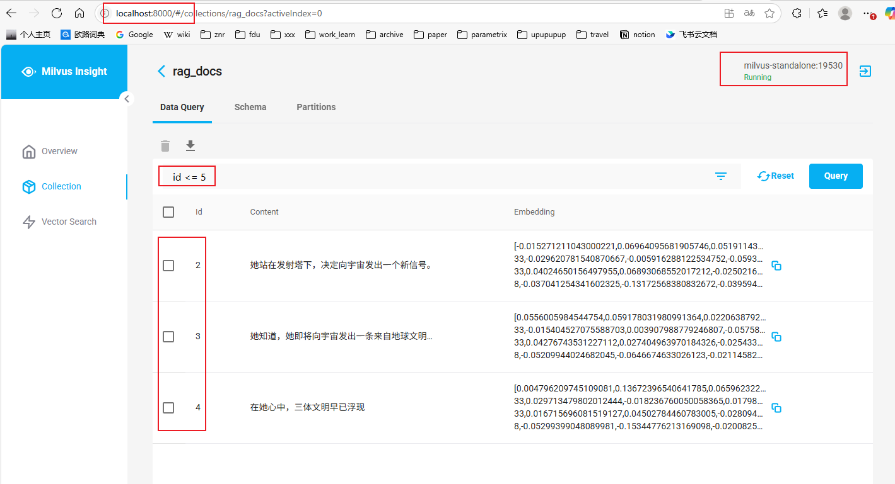

- [下载安装](#下载安装)
- [python使用milvus](#python使用milvus)
- [使用milvus insight可视化管理milvus](#使用milvus-insight可视化管理milvus)


## 下载安装

```bash
# 在milvus仓库的 deployments/docker 下找对应的版本的yml
curl -o docker-compose.yml https://raw.githubusercontent.com/milvus-io/milvus/refs/tags/v2.5.14/deployments/docker/standalone/docker-compose.yml
docker compose up -d
# docker-compose up -d      # 老版本docker-compose
```

运行起来就可以看到下面的容器：

```bash
CONTAINER ID   IMAGE                                      COMMAND                  CREATED              STATUS                        PORTS                                                                                      NAMES
ab6030078571   milvusdb/milvus:v2.5.13                    "/tini -- milvus run…"   About a minute ago   Up About a minute (healthy)   0.0.0.0:9091->9091/tcp, :::9091->9091/tcp, 0.0.0.0:19530->19530/tcp, :::19530->19530/tcp   milvus-standalone
4d1014159263   minio/minio:RELEASE.2023-03-20T20-16-18Z   "/usr/bin/docker-ent…"   About a minute ago   Up About a minute (healthy)   0.0.0.0:9000-9001->9000-9001/tcp, :::9000-9001->9000-9001/tcp                              milvus-minio
9f6773234eb7   quay.io/coreos/etcd:v3.5.18                "etcd -advertise-cli…"   About a minute ago   Up About a minute (healthy)   2379-2380/tcp                                                                              milvus-etcd
```

## python使用milvus

```python
from pymilvus import connections, utility, FieldSchema, CollectionSchema, DataType, Collection
from sentence_transformers import SentenceTransformer
import re
import time


def get_chunks():
    text = """
        红岸基地静静地伫立在山谷中。叶文洁站在信号发射塔下，遥望着星空。
        她知道，她即将向宇宙发出一条来自地球文明的第一道信号。
        在她心中，三体文明早已浮现。
    """
    sentences = re.split(r"[。！？]", text)     # 使用正则表达式分割文本
    return [s.strip() for s in sentences if s.strip()]


def main():
    # 1. 连接milvus服务
    connections.connect("default", host="localhost", port="19530")
    # 2. 创建Collection（表）
    collection_name = "rag_docs"
    if utility.has_collection(collection_name):
        Collection(name=collection_name).drop()  # 如果存在则重建
    fields = [
        FieldSchema(name="id", dtype=DataType.INT64, is_primary=True, auto_id=False),
        FieldSchema(name="content", dtype=DataType.VARCHAR, max_length=512),
        FieldSchema(name="embedding", dtype=DataType.FLOAT_VECTOR, dim=384)
    ]
    schema = CollectionSchema(fields, description="RAG 示例")
    collection = Collection(name=collection_name, schema=schema)
    # 3. 准备文本数据
    chunks = get_chunks()
    # 4. 嵌入生成
    model = SentenceTransformer("all-MiniLM-L6-v2")
    embeddings = model.encode(chunks).tolist()
    # 5. 插入数据（增）
    ids = list(range(1, len(chunks)+1))  # 从 1 开始
    collection.insert([ids, chunks, embeddings])
    collection.flush()
    # 创建索引（如果之前没创建过）
    collection.create_index(
        field_name="embedding",
        index_params={
            "index_type": "HNSW",
            "metric_type": "L2",
            "params": {"M": 8, "efConstruction": 64}
        }
)
    collection.load()
    print(f"✅ 插入完成，共 {len(chunks)} 条")
    # 6. 查询（查）
    query_text = "三体文明"
    query_vector = model.encode([query_text]).tolist()
    results = collection.search(
        data=query_vector,
        anns_field="embedding",
        param={"metric_type": "L2", "params": {"ef": 32}},
        limit=3,
        output_fields=["content"]
    )
    print("\n🔍 查询结果：")
    for hit in results[0]:
        print(f"Score={hit.distance:.4f}, 文本={hit.entity.get('content')}")
    # 7. 删除数据（删）
    print("\n🗑️ 删除 id = 1")
    collection.delete(expr="id == 1")
    collection.flush()
    # 8. 更新数据（改） = 删除后重新插入
    print("\n📝 修改 id = 2 的文本")
    modified = "她站在发射塔下，决定向宇宙发出一个新信号。"
    new_embed = model.encode([modified]).tolist()
    collection.delete(expr="id == 2")
    collection.insert([[2], [modified], new_embed])
    collection.flush()
    # 再查一次
    print("\n🔁 再次查询 '发射塔'")
    query2 = model.encode(["发射塔"]).tolist()
    res2 = collection.search(data=query2, anns_field="embedding",
                            param={"metric_type": "L2", "params": {"ef": 32}},
                            limit=3, output_fields=["content"])
    for hit in res2[0]:
        print(f"✅ Score={hit.distance:.4f}, 文本={hit.entity.get('content')}")


if __name__ == '__main__':
    main()
```

## 使用milvus insight可视化管理milvus

**运行容器**

```bash
docker pull milvusdb/milvus-insight:latest
# 一定要注意其中的网络、端口、变量等配置
docker run --name milvus-insight --network milvus -d -p 8000:3000 -e HOST_URL=http://localhost:8000 -e MILVUS_URL=milvus-standalone:19530 milvusdb/milvus-insight:latest
```

**连接 Milvus 服务**

```bash
# 打开 http://localhost:8000/
# 如果上面配置正确的话直接点击连接即可
```

**查看数据**

