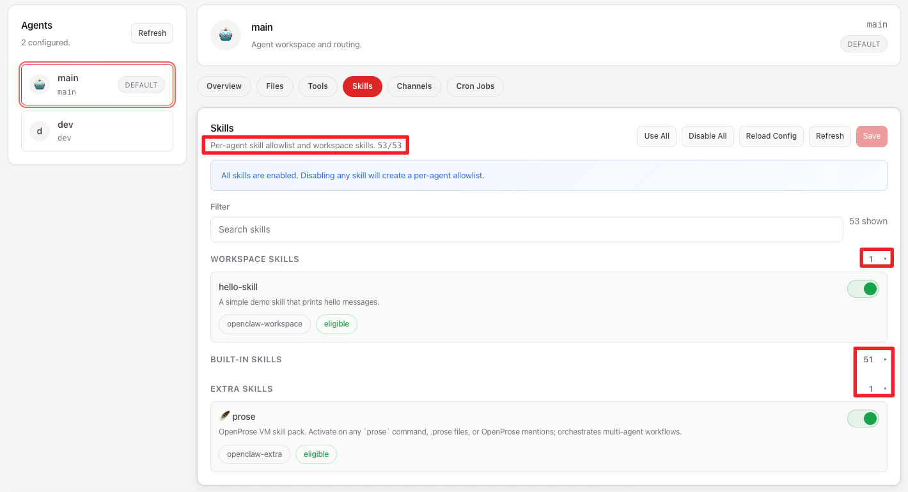
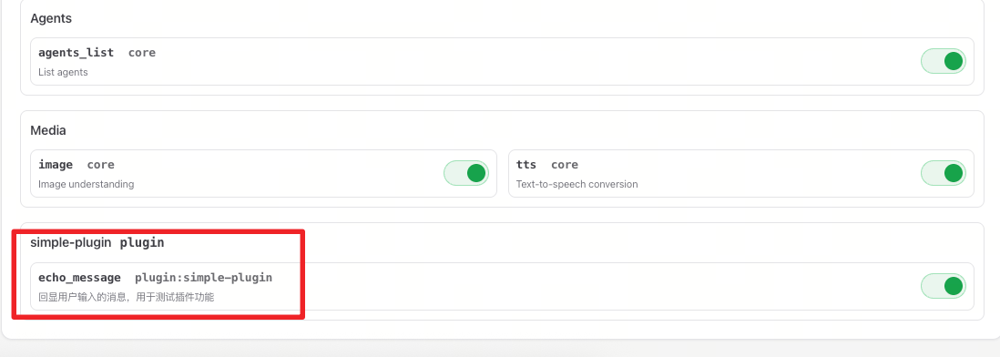

- [安装](#安装)
- [与 openclaw 交互](#与-openclaw-交互)
- [初始化设置](#初始化设置)
  - [一键设置](#一键设置)
  - [网关](#网关)
  - [模型配置](#模型配置)
  - [channels 配置](#channels-配置)
- [使用](#使用)
  - [session 管理](#session-管理)
  - [agent 管理](#agent-管理)
  - [skill 管理](#skill-管理)
  - [plugins 管理](#plugins-管理)
- [基本命令](#基本命令)
- [目录结构](#目录结构)
- [记忆系统](#记忆系统)
- [常见问题](#常见问题)
- [进阶技巧](#进阶技巧)
- [资源链接](#资源链接)
- [附录](#附录)
  - [skills](#skills)
  - [plugins](#plugins)


> 开源的个人 AI 助手平台，运行在你自己的设备上
> 
> 官网: https://openclaw.ai/
> 
> 文档: https://docs.openclaw.ai/zh-CN
> 
> 社区: https://discord.com/invite/clawd


## 安装

```bash
# macOS / Linux 一键安装
curl -fsSL https://openclaw.ai/install.sh | bash

# 重启终端或运行
source ~/.zshrc  # 或 source ~/.bashrc

# 检查版本
openclaw --version
```

## 与 openclaw 交互

与 openclaw 连接交互有以下方式（要先配好网关）：
1. terminal：`openclaw tui --url ws://127.0.0.1:<gateway_port> --token <gateway_token>`
2. browser：`http:127.0.0.1:<gateway_port>`，然后到“控制-概览”填写网关 token
3. 配置频道，使用不同 app 进行交互。

先看看下面的初始化设置

## 初始化设置

### 一键设置

```shell
# 运行安装向导（关键！！）
openclaw onboard --install-daemon
# 第一次初始化的话 Onboarding mode 可以选择 Manual 模式进行详细配置
```

### 网关

```shell
openclaw gateway --port 18789 --verbose
# 一些网关命令
openclaw gateway install   # 安装为系统服务
openclaw gateway start     # 启动
openclaw gateway status    # 查看状态
openclaw gateway stop      # 停止
openclaw gateway restart   # 重启
```

### 模型配置

```bash
openclaw configure
# 选择 `Model` -> `Custom Provider`，然后填写：
# 1. API Base URL（如 `https://api.anthropic.com/v1`）
# 2. API Key
# 3. 类型（OpenAI / Anthropic / Other）
# 4. Model ID（如 `claude-sonnet-4-5-20250929`）
# OpenClaw 对未知模型默认限制为 4096 tokens，需手动修改 `contextWindow`。

# 查看模型配置
openclaw models
```

### channels 配置

```shell
# 一些参考命令
openclaw channels list
openclaw channels status
```

**telegram 配置**

1. 找 [@BotFather](https://t.me/BotFather) 创建机器人
2. 发送 `/newbot` 并按提示操作
3. 获取 Bot Token
4. 运行 `openclaw configure` → `Channels` → `Telegram`
5. 输入 Token
6. 在 Telegram 中搜索你的机器人并发送 `/start`

**首次配对**
第一次发送消息会收到配对请求，在终端运行：
```bash
openclaw pairing approve telegram <配对码>
```

**配对管理**
```bash
openclaw pairing list                    # 查看所有配对请求
openclaw pairing approve telegram <码>   # 批准
openclaw pairing reject telegram <码>    # 拒绝
```

## 使用

```shell
# 在终端进入交互
openclaw tui
# 第一次对话会询问你是否需要给他人设等，可以花点时间设置好
```

### session 管理

**创建并切换子会话**

```shell
/session <new_session_name>
```

**切换子会话**

```shell
/session
/sessions
```

**重要特性**
- 异步执行，不阻塞主会话
- 任务完成自动通知
- 独立上下文和历史

### agent 管理

**创建 agent**

```shell
# 可以使用命令创建
openclaw agents add <agent_id> --non-interactive --workspace <workspace_dir> --json
# 也可以使用 skill 让他自己创建
```

**查看所有 agents**

```shell
openclaw agents
```

**在 tui 中切换 agent**

```shell
/agent
/agents
```

**删除 agent**

```shell
openclaw agents delete <agent_id>
```

### skill 管理

**查看 skills**

```shell
# 查看所有 skills
openclaw skills list
# 查看某个 skill
openclaw skills info <skill_name>
```

OpenClaw 有三种 skill 位置：

**1. Built-in Skills（内置）**
```shell
# linux node
~/.nvm/versions/node/<version>/lib/node_modules/openclaw/skills/
# macos homebrew
/opt/homebrew/lib/node_modules/openclaw/skills/
```
- 官方提供的 50+ 个内置 skills
- 随 OpenClaw 安装自动提供
- 例如：coding-agent, healthcheck, session-logs, skill-creator, tmux, weather 等

安装 build-in skills

```shell
# build-in skills: 已经都安装好了，只是有些依赖需要设置
# 比如 web 上的 video-frames 有一个提示“Missing: bin:ffmpeg”，安装即可
brew install ffmpeg
# 然后需要重启一下 openclaw gateway restart
```

**2. Workspace Skills（工作区）**
```
~/.openclaw/workspace/skills/
```
- 用户自定义的 skills（推荐位置）
- 例如：create-agent, cluster-analyzer, memsense 等

安装 workspace skills

```shell
# 可以直接跟 openclaw 交互完之后让它直接生成
# 也可以直接自己编辑好文件放到 ~/.openclaw/workspace/skills/xxx
# 具体格式可参考下文
```

**3. Extra Skills（扩展）**
```shell
# linux node
~/.nvm/versions/node/<version>/lib/node_modules/openclaw/extensions/*/skills/
# macos homebrew
/opt/homebrew/lib/node_modules/openclaw/extensions/*/skills
```
- 通过扩展包安装的 skills
- 例如：feishu/skills/ - 飞书集成相关 skills
- 一般都不需要自己安装，**这些本质是 plugins 里面自带的 skills**

**Skill 目录结构**

每个 skill 是一个独立的文件夹，基本结构：

```
skill-name/
├── SKILL.md           # 必需：skill 定义和使用说明
└── references/        # 可选：参考文档、示例等
    └── *.md
```

**SKILL 格式**

SKILL 文件包含两部分：

1. **Front Matter（YAML 头部）**
```yaml
---
name: skill-name                    # skill 名称
description: |                      # 描述（何时使用、功能说明）
  详细描述内容...
metadata:                           # 可选：元数据
  {
    "openclaw": {
      "emoji": "🧩",               # 显示图标
      "requires": {                 # 依赖要求
        "anyBins": ["command1"]     # 需要的命令行工具
      }
    }
  }
---
```

2. **Markdown 正文**
   - 详细的使用说明
   - 示例代码
   - 配置说明
   - 注意事项等

**示例：最小 skill**

```markdown
---
name: my-skill
description: 'Simple skill description'
---

# My Skill

Usage instructions here...
```

**注意事项**
- Workspace skills 是推荐的自定义 skill 存放位置
- SKILL.md 的 front matter 必须正确（YAML 格式）
- `name` 字段应与文件夹名称一致
- 如果 TUI 中看不到自定义 skill，检查：
  1. SKILL.md 格式是否正确（特别是 YAML front matter）
  2. 是否需要重启 OpenClaw
  3. skill 目录结构是否完整
- 例子可见：[附录 skills](#skills)

### plugins 管理

> 其实就是 tools

**查看 plugins**

```shell
# 查看所有插件
openclaw plugins list
# 查看某个插件详情
openclaw plugins info <plugin-id>
# 诊断插件问题
openclaw plugins doctor
```

OpenClaw 有两种 plugin 位置：

**1. Stock Plugins（官方内置）**
```shell
# linux node
~/.nvm/versions/node/<version>/lib/node_modules/openclaw/extensions/
# macos homebrew
/opt/homebrew/lib/node_modules/openclaw/extensions/
```
- 官方提供的扩展插件
- 随 OpenClaw 安装自动提供
- 例如：feishu（飞书集成）、open-prose（OpenProse VM）等

**2. Global Plugins（用户安装）**
```
~/.openclaw/extensions/
```
- 用户自己开发或从外部安装的插件
- 通过 `openclaw plugins install` 安装
- **OpenClaw 从这里加载插件**

**Plugin 和 Skill 的区别**

| 特性 | Plugin | Skill |
|------|--------|-------|
| **定义** | 代码模块，扩展系统功能 | Markdown 文档，定义 AI 行为 |
| **语言** | TypeScript/JavaScript | Markdown + YAML |
| **能力** | 注册工具、命令、服务、HTTP 接口 | 指导 AI 何时/如何使用工具 |
| **加载** | 在 Gateway 启动时加载 | 在 AI 推理时读取 |
| **权限** | 在 Gateway 进程中运行（可信代码） | 只影响 AI 行为，无代码执行 |

**安装插件**

```shell
# 从本地目录安装
openclaw plugins install /path/to/plugin

# 从 npm 包安装
openclaw plugins install package-name

# 从 Git 仓库安装
openclaw plugins install git+https://github.com/xxx/xxx.git
```

**管理插件**

```shell
# 卸载插件
openclaw plugins uninstall <plugin-id>

# 启用/禁用插件（通过配置文件）
# 编辑 ~/.openclaw/openclaw.json
{
  "plugins": {
    "entries": {
      "plugin-id": {
        "enabled": false  # 禁用插件
      }
    }
  }
}

# 重启 Gateway 使配置生效
openclaw gateway restart
```

**Plugin 目录结构**

每个 plugin 是一个 npm 包，基本结构：

```
simple-plugin/
├── package.json              # npm 包信息（必需）
├── openclaw.plugin.json      # 插件元数据（必需）
└── index.ts                  # 插件代码（主入口）
```

**说明**：
- `package.json` - 定义 npm 包信息和 `openclaw.extensions` 入口
- `openclaw.plugin.json` - 定义插件 ID、名称、版本、配置 schema
- `index.ts` - 导出 `register(api)` 函数，注册工具、命令等

**📁 插件开发工作流**

```
1. 开发目录（编辑代码）
   ~/.openclaw/workspace/your-plugin/
   ├── package.json
   ├── openclaw.plugin.json
   └── index.ts

2. 安装命令（复制文件）
   openclaw plugins install ~/.openclaw/workspace/your-plugin

3. 安装目录（OpenClaw 加载）
   ~/.openclaw/extensions/your-plugin/
   ├── package.json
   ├── openclaw.plugin.json
   └── index.ts
```

**注意**：
- 开发时在 `~/.openclaw/workspace/` 编辑代码
- 安装后文件被复制到 `~/.openclaw/extensions/`
- OpenClaw 从 `~/.openclaw/extensions/` 加载插件
- 修改代码后需要重新安装（或直接修改 extensions 目录下的文件）

**最小 Plugin 示例（已验证可用）**

可见[附录 plugins](#plugins)

**安装和测试**

```shell
# 1. 在开发目录创建插件
mkdir -p ~/.openclaw/workspace/simple-plugin
cd ~/.openclaw/workspace/simple-plugin
# 创建三个文件：package.json, openclaw.plugin.json, index.ts

# 2. 安装插件（复制到 extensions 目录）
openclaw plugins install ~/.openclaw/workspace/simple-plugin
# 文件会被复制到: ~/.openclaw/extensions/simple-plugin/

# 3. 检查安装状态（应显示 loaded）
openclaw plugins list | grep simple
# 输出示例：
# │ Simple Plugin │ simple-plugin │ loaded │ global:simple-plugin/index.ts │ 1.0.0 │

# 4. 验证文件位置
ls -la ~/.openclaw/extensions/simple-plugin/
# 应该看到三个文件

# 5. 重启 Gateway（让插件生效）
openclaw gateway restart

# 6. 在对话中测试
# "请使用 echo_message 工具，发送一条测试消息"
# 应返回：📢 收到消息：测试消息
```

**开发迭代流程**

方法1：修改源码后重新安装
```shell
# 1. 修改开发目录的代码
vim ~/.openclaw/workspace/simple-plugin/index.ts

# 2. 重新安装（覆盖旧版本）
openclaw plugins install ~/.openclaw/workspace/simple-plugin

# 3. 重启 Gateway
openclaw gateway restart
```

方法2：直接修改已安装的插件
```shell
# 1. 直接编辑安装目录的文件
vim ~/.openclaw/extensions/simple-plugin/index.ts

# 2. 重启 Gateway
openclaw gateway restart

# 注意：这种方法修改不会同步回开发目录
```

**验证插件是否可用**

```shell
# 方法1: 检查插件状态
openclaw plugins list | grep <plugin-name>
# 期望输出：插件状态显示 "loaded"
# 示例：│ Simple Plugin │ simple-plugin │ loaded │ global:simple-plugin/index.ts │ 1.0.0 │

# 方法2: 查看插件详细信息
openclaw plugins info <plugin-id>
# 期望输出：显示版本、描述、配置等详细信息

# 方法3: 检查加载日志
openclaw gateway logs | grep -i "<plugin-name>" | tail -10
# 期望输出：看到 "✅ Plugin loaded" 和工具注册成功的消息

# 方法4: 测试工具功能（最重要）
# 在对话中让 AI 调用插件提供的工具
# 示例：对于 simple-plugin，可以说：
#   "请使用 echo_message 工具，发送一条测试消息"
# 期望返回：📢 收到消息：测试消息

# 方法5: 检查文件位置
ls -la ~/.openclaw/extensions/<plugin-name>/
# 期望输出：看到 package.json, openclaw.plugin.json, index.ts 等文件
```

**完整验证清单**

| 验证项 | 命令 | 期望结果 |
|--------|------|---------|
| 插件状态 | `openclaw plugins list \| grep <name>` | 状态为 `loaded` |
| 插件详情 | `openclaw plugins info <id>` | 显示正确的版本和描述 |
| 加载日志 | `openclaw gateway logs \| grep <name>` | 看到成功加载的消息 |
| 文件存在 | `ls ~/.openclaw/extensions/<name>/` | 包含所需的三个文件 |
| 功能测试 | 在对话中调用工具 | 工具正常执行并返回结果 |

**⚠️ 关键点（避免错误）**

✅ **正确的 API**：
- 使用 `parameters` 而不是 `inputSchema`
- 使用 `async execute(_id, params)` 而不是 `handler`
- 返回格式：`{ content: [{ type: "text", text: "..." }] }`
- `configSchema` 必须存在（至少是空对象）

❌ **错误写法会导致系统崩溃**：
```typescript
// ❌ 不要这样写！会导致 "Cannot read properties of undefined" 错误
api.registerTool({
  inputSchema: { ... },  // 错误
  handler: async () => { ... }  // 错误
})
```

**注意事项**
- 修改插件代码后必须重启 Gateway
- 插件在 Gateway 进程中运行，视为可信代码
- 工具命名使用下划线（`echo_message`），不要用驼峰命名
- 错误的插件会导致整个 AI 系统无法响应
- 插件状态显示 `error` 时，用 `openclaw gateway logs` 查看错误


## 基本命令

```bash
openclaw tui               # 启动对话
openclaw status            # 查看状态
openclaw configure         # 修改配置
openclaw sessions          # 查看所有会话
openclaw --help            # 帮助
```

**会话中的命令**
```bash
/status      # 查看会话状态（token 使用、时间、费用）
/reasoning   # 切换推理模式
/new         # 清空历史
Ctrl+C       # 退出
```

## 目录结构

```
~/.openclaw/
├── openclaw.json          # 主配置文件
├── openclaw.json.bak*     # 配置文件备份（自动生成）
├── workspace-*/           # 其他 agent 工作区
├── workspace/             # main agent 工作区
│   ├── SOUL.md           # AI 的性格、行为准则
│   ├── IDENTITY.md       # AI 的名字、emoji
│   ├── USER.md           # 你的信息、偏好
│   ├── AGENTS.md         # 工作流程规则（系统文件）
│   ├── MEMORY.md         # 长期记忆（仅主会话加载）
│   ├── HEARTBEAT.md      # 定期检查任务
│   ├── TOOLS.md          # 本地工具配置
│   ├── BOOTSTRAP.md      # 首次运行引导
│   ├── WORKFLOW_AUTO.md  # 自动化工作流配置
│   ├── skills/           # 用户自定义 skills（推荐位置）
│   │   └── hello-skill/   # 示例 skill
│   ├── simple-plugin/     # 示例插件开发目录
│   └── memory/
│       ├── YYYY-MM-DD.md         # 每日记录
│       ├── heartbeat-state.json  # 心跳状态
│       └── main.sqlite           # 记忆数据库
├── extensions/            # 用户安装的插件（Global Plugins）
│   └── simple-plugin/     # 已安装的插件
├── agents/                # Agent 实例数据
├── ├── main/              # 主 Agent 数据
│   └── xxx/               # xxx Agent 数据
├── credentials/           # 凭证和配对信息
│   ├── telegram-pairing.json
│   └── telegram-default-allowFrom.json
├── devices/               # 配对设备信息
│   ├── paired.json
│   └── pending.json
├── identity/              # 设备身份信息
│   ├── device.json
│   └── device-auth.json
├── telegram/              # Telegram 频道数据
├── subagents/             # 子会话运行记录
│   └── runs.json
├── cron/                  # 定时任务配置
│   └── jobs.json
├── memory/                # 记忆系统数据库
│   └── main.sqlite
├── logs/                  # 日志文件
│   ├── gateway.log
│   ├── gateway.err.log
│   └── config-audit.jsonl
├── completions/           # Shell 自动补全脚本
│   ├── openclaw.bash
│   ├── openclaw.zsh
│   └── openclaw.fish
├── canvas/                # Canvas 界面资源
├── delivery-queue/        # 消息投递队列
└── exec-approvals.json    # 命令执行审批记录
```

## 记忆系统

**自动记忆**
AI 自动将重要信息写入 `memory/YYYY-MM-DD.md`

**长期记忆**
`MEMORY.md` 存储长期重要信息（仅主会话加载，不在群聊中加载）

**让 AI 记住**
```
"记住：我喜欢用 Vim 编辑器"
"把这个记下来：项目截止日期是 3 月 15 日"
```

**手动编辑**
```bash
vim ~/.openclaw/workspace/MEMORY.md
cat ~/.openclaw/workspace/memory/$(date +%Y-%m-%d).md
```

## 常见问题

**安装和配置**
- 安装后找不到命令？重启终端或运行 `source ~/.zshrc`
- 如何更新？重新运行安装脚本：`curl -fsSL https://openclaw.ai/install.sh | bash`
- 如何卸载？删除配置和可执行文件：`rm -rf ~/.openclaw && rm /usr/local/bin/openclaw`

**模型相关**
- 上下文被限制在 4096？编辑 `~/.openclaw/openclaw.json`，修改 `contextWindow` 值
- 支持哪些模型？所有兼容 OpenAI API 的模型（GPT、Claude、DeepSeek、本地模型等）

**使用相关**
- 如何让 AI 记住信息？直接说"记住这个"，或手动编辑 `MEMORY.md`
- 如何重置 AI？`mv ~/.openclaw/workspace ~/.openclaw/workspace.backup && openclaw chat`
- 如何修改 AI 风格？编辑 `~/.openclaw/workspace/SOUL.md`
- 多设备同步？用 Git 管理 `~/.openclaw/workspace` 目录

**Session 和 Agent**
- Session 和 Agent 有什么区别？Agent 是 AI 实例，Session 是对话实例
- 如何创建子会话？在对话中说"创建一个子会话来..."
- 子会话的两种模式？`run` 模式执行完自动结束，`session` 模式可持续交互
- 为什么无法"进入"子会话？子会话是异步后台任务，不是交互式终端
- 如何与子会话交互？对于持久子会话，说"向子会话 xxx 发送消息：..."
- 如何终止子会话？说"终止子会话 xxx"
- 如何创建自定义 Agent？目前不支持通过配置文件创建，可使用内置 Sub-Agent

**网关相关**
- 网关启动失败？检查端口占用 `lsof -i :3000`，或更换端口
- 忘记密码？编辑 `~/.openclaw/openclaw.json`，删除 `gateway.password` 字段

## 进阶技巧

**自定义 AI 性格**
编辑 `~/.openclaw/workspace/SOUL.md`：
```markdown
# SOUL.md

## 核心原则
- 代码优先：能写代码就不要只给建议
- 简洁高效：避免废话，直接解决问题
- 安全第一：涉及敏感操作时必须确认

## 风格
- 技术讨论：专业、精确
- 日常对话：轻松、友好
```

**工作流自动化**
编辑 `HEARTBEAT.md` 实现定期检查：
```markdown
# 每天早上 9:00 检查
- 查看未读邮件（重要的）
- 检查今天的日历事件
- 汇报天气情况
```

## 资源链接

- 官方文档: https://docs.openclaw.ai/
- 中文文档: https://openclawcn.cn/docs.html
- GitHub: https://github.com/openclaw/openclaw
- Discord 社区: https://discord.com/invite/clawd
- 技能市场: https://clawhub.com
- 本地文档: `/opt/homebrew/lib/node_modules/openclaw/docs`

## 附录

### skills

<details>
<summary>create-agent</summary>

````shell
---
name: create-agent
description: "创建新的 OpenClaw agent 会话。自动复制目录结构、配置文件，并注册到 openclaw.json。"
metadata: { "openclaw": { "emoji": "🤖" } }
---

# Create Agent Skill

创建新的 OpenClaw agent 会话的自动化流程。

## 使用场景

当用户需要创建一个新的 agent 会话时，自动完成以下操作：
1. 复制现有 agent 目录结构
2. 复制必要的配置文件
3. 在 openclaw.json 中注册新 agent

## 操作步骤

### 1. 创建 agent 目录

```bash
cp -r ~/.openclaw/agents/main ~/.openclaw/agents/<new-agent-id>
```

### 2. 复制配置文件

```bash
cp ~/.openclaw/agents/main/agent/models.json ~/.openclaw/agents/<new-agent-id>/agent/models.json
cp ~/.openclaw/agents/main/agent/auth-profiles.json ~/.openclaw/agents/<new-agent-id>/agent/auth-profiles.json
```

### 3. 注册到配置文件

编辑 `~/.openclaw/openclaw.json`，在 `agents.list` 数组中添加：

```json
{
  "id": "<new-agent-id>",
  "name": "<Agent Display Name>",
  "workspace": "/mnt/afs_toolcall/jarvis/.openclaw/workspace",
  "agentDir": "/mnt/afs_toolcall/jarvis/.openclaw/agents/<new-agent-id>/agent"
}
```

### 4. 验证

```bash
openclaw agents list
```

## 注意事项

- agent-id 使用小写字母和连字符
- 确保 agent 目录权限正确
- 配置文件必须是有效的 JSON 格式
````

图跟上面的不匹配，示例而已：



</details>

### plugins

<details>
<summary>simple-plugin</summary>

`package.json`:
```json
{
  "name": "simple-plugin",
  "version": "1.0.0",
  "description": "最简单的 OpenClaw 插件示例",
  "openclaw": {
    "extensions": ["./index.ts"]
  }
}
```

`openclaw.plugin.json`:
```json
{
  "id": "simple-plugin",
  "name": "Simple Plugin",
  "version": "1.0.0",
  "description": "最简单的插件示例 - 提供一个回显工具",
  "configSchema": {
    "type": "object",
    "properties": {}
  }
}
```

`index.ts`:
```typescript
/**
 * 最简单的 OpenClaw 插件示例
 * 按照官方文档规范编写
 */

export default function register(api) {
  console.log('✅ Simple Plugin 已加载！');

  // 工具：回显输入内容
  api.registerTool({
    name: "echo_message",
    description: "回显用户输入的消息，用于测试插件功能",
    parameters: {
      type: "object",
      properties: {
        message: {
          type: "string",
          description: "要回显的消息内容"
        }
      },
      required: ["message"]
    },
    async execute(_id, params) {
      return {
        content: [
          {
            type: "text",
            text: `📢 收到消息：${params.message}`
          }
        ]
      };
    }
  });

  console.log('✨ Simple Plugin 工具已注册：echo_message');
}
```

同理，可以在 agent 的 tools 里面看到这个 plugin



</details>