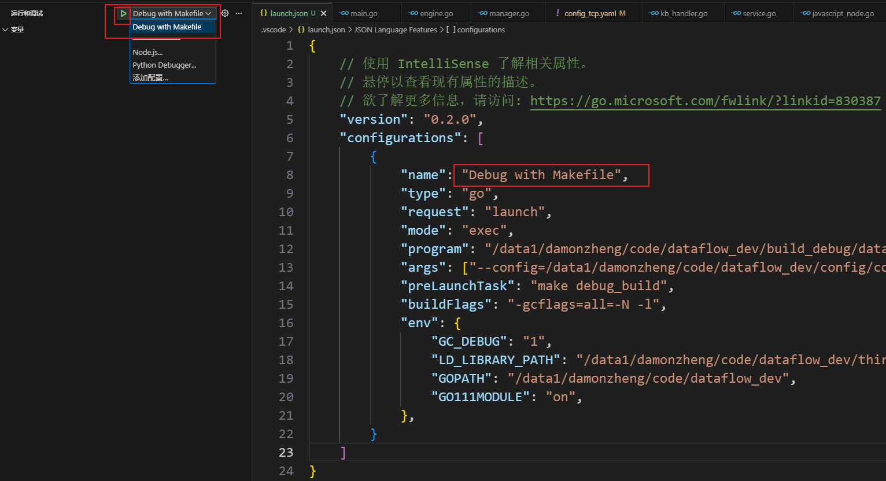

- [调试配置](#调试配置)
  - [基础说明](#基础说明)
  - [go示例](#go示例)


# 调试配置

## 基础说明

在 `.vscode` 中 需要有 `launch.json` 文件，如果需要依赖于某 task 之后再调试，还需要 `tasks.json` 文件 （下面会给例子，这边先对字段进行解释）

**tasks.json**

> | 字段             | 含义                         | 示例/说明                                                                                              |
> | ---------------- | ---------------------------- | ------------------------------------------------------------------------------------------------------ |
> | `version`        | VS Code 任务系统版本号       | 固定为 "2.0.0"                                                                                         |
> | `tasks`          | 定义任务列表的数组           | 里面每个对象是一项任务                                                                                 |
> | -                | -                            | -                                                                                                      |
> | `label`          | 任务名（唯一标识）           | "Add a task"，可被 launch.json 引用                                                                    |
> | `type`           | 任务执行类型                 | "shell"（默认，表示在系统的 shell 中执行）、"process"、"npm"、"gulp"、"make"、"python"（依赖插件）等行 |
> | `command`        | 要运行的命令                 | "python", "npm", "go", "make"                                                                          |
> | `args`           | 命令行参数数组（按顺序传入） | 等价于 python task_cli.py add ...                                                                      |
> | `problemMatcher` | 错误匹配规则（可忽略）       | 空数组即可                                                                                             |
> | `dependsOn`      | 当前任务依赖的任务列表       | "Add then list tasks" 依赖前两个任务                                                                   |
> | `dependsOrder`   | 指定依赖任务执行顺序         | "sequence" 表示按顺序执行                                                                              |

**launch.json**

> | 字段             | 含义                     | 示例/说明                                                            |
> | ---------------- | ------------------------ | -------------------------------------------------------------------- |
> | `version`        | VS Code 调试配置文件版本 | 固定为 "0.2.0"                                                       |
> | `configurations` | 调试配置数组             | **每个对象是一种调试方式**                                           |
> | -                | -                        | -                                                                    |
> | `name`           | 调试配置名               | **在 VS Code 调试面板下拉菜单中显示**                                |
> | `type`           | 调试器类型               | "debugpy", "cppdbg", "node", "go", "java", "pwa-chrome", "docker" 等 |
> | `request`        | 调试请求类型             | "launch"（启动程序） / "attach"（附加到已有进程）                    |
> | `program`        | 要运行的 Python 脚本路径 | ${workspaceFolder}/{xxx}.py                                          |
> | `args`           | 传给脚本的命令行参数     | 这里调试 list 子命令                                                 |
> | `cwd`            | 工作目录                 | "${workspaceFolder}"                                                 |
> | `env`            | 环境变量                 | { "DEBUG": "1", "PORT": "8080" }                                     |
> | `envFile`        | 从文件加载环境变量       | "${workspaceFolder}/.env"                                            |
> | `console`        | 输出控制台位置           | "internalConsole" / "integratedTerminal" / "externalTerminal"        |
> | `stopOnEntry`    | 是否在入口暂停           | true / false                                                         |
> | `justMyCode`     | 是否只调试用户代码       | true（跳过库代码）                                                   |
> | `preLaunchTask`  | **调试前自动执行的任务** | 这里引用了 "Add then list tasks"                                     |
> | `module`         | 指定以模块形式运行       | "flask"（等价于 python -m flask）                                    |
> | `python`         | 指定 Python 解释器路径   | "/usr/bin/python3"（仅 Python 调试器支持）                           |
> | `logToFile`      | 是否将调试日志写入文件   | true                                                                 |

**流程**

> 1. 选择要调试的配置名开始调试（如例子中的 `Debug: Add then List Tasks`）
> 2. 检查 preLaunchTask，若有，需要先运行依赖的 tasks，会先去 `tasks.json` 查找这个任务（如例子中的`Add then list tasks`）
> 3. 找到任务后查看该任务的 dependsOn，若有，依据指定执行顺序执行（如例子中的 `Add then list tasks` 依赖 `Add a task` 和 `List tasks`）
> 4. 执行完所有依赖的 tasks 之后，就可以诶开始执行当前的 debug 任务

`tasks.json` 例子：

```shell
{
    "version": "2.0.0",
    "tasks": [
        {
            "label": "Add a task",
            "type": "shell",
            "command": "python",
            "args": [
                "${workspaceFolder}/python_related/some_pkgs/s15_argparse.py",
                "add",
                "Learn argparse",
                "-d",
                "Practice CLI debugging",
                "-p",
                "1"
            ],
            "problemMatcher": []
        },
        {
            "label": "List tasks",
            "type": "shell",
            "command": "python",
            "args": [
                "${workspaceFolder}/python_related/some_pkgs/s15_argparse.py",
                "list"
            ],
            "problemMatcher": []
        },
        {
            "label": "Add then list tasks",
            "dependsOn": [
                "Add a task",
                "List tasks"
            ],
            "dependsOrder": "sequence",
            "problemMatcher": []
        }
    ]
}
```

launch.json 例子：

```shell
{
    // 使用 IntelliSense 了解相关属性。 
    // 悬停以查看现有属性的描述。
    // 欲了解更多信息，请访问: https://go.microsoft.com/fwlink/?linkid=830387
    "version": "0.2.0",
    "configurations": [
        {
            "name": "Python Debugger: Current File",
            "type": "debugpy",
            "request": "launch",
            "program": "${file}",
            "console": "integratedTerminal"
        },
        {
            "name": "Run CLI (no args)",
            "type": "debugpy",
            "request": "launch",
            "program": "${workspaceFolder}/python_related/some_pkgs/s15_argparse.py",
            "console": "integratedTerminal"
        },
        {
            "name": "Run CLI: add task",
            "type": "debugpy",
            "request": "launch",
            "program": "${workspaceFolder}/python_related/some_pkgs/s15_argparse.py",
            "args": [
                "add",
                "Learn argparse",
                "-d",
                "Practice CLI tools",
                "-p",
                "1"
            ],
            "console": "integratedTerminal"
        },
        {
            "name": "Run CLI: list tasks",
            "type": "debugpy",
            "request": "launch",
            "program": "${workspaceFolder}/python_related/some_pkgs/s15_argparse.py",
            "args": [
                "list"
            ],
            "console": "integratedTerminal"
        },
        {
            "name": "Debug: Add then List Tasks",
            "type": "debugpy",
            "request": "launch",
            "program": "${workspaceFolder}/python_related/some_pkgs/s15_argparse.py",
            "args": [
                "list"
            ],
            "console": "integratedTerminal",
            "preLaunchTask": "Add then list tasks"
        }
    ]
}
```

## go示例

一、在`运行和调试`打开`launch.json`，刚打开默认内容类似如下：

```bash
{
    // 使用 IntelliSense 了解相关属性。 
    // 悬停以查看现有属性的描述。
    // 欲了解更多信息，请访问: https://go.microsoft.com/fwlink/?linkid=830387
    "version": "0.2.0",
    "configurations": [
        {
            "name": "Launch Package",
            "type": "go",
            "request": "launch",
            "mode": "auto",
            "program": "${fileDirname}"
        }
    ]
}
```

二、修改`launch.json`

```bash
{
    // 使用 IntelliSense 了解相关属性。 
    // 悬停以查看现有属性的描述。
    // 欲了解更多信息，请访问: https://go.microsoft.com/fwlink/?linkid=830387
    "version": "0.2.0",
    "configurations": [
        {
            "name": "Debug with Makefile",
            "type": "go",
            "request": "launch",
            "mode": "exec",
            "program": "/data1/damonzheng/code/dataflow_dev/build_debug/dataflow_debug",
            "args": ["--config=/data1/damonzheng/code/dataflow_dev/config/config_tcp.yaml"],
            "preLaunchTask": "make debug_build",
            "buildFlags": "-gcflags=all=-N -l",
            "env": {
                "GC_DEBUG": "1",
                "LD_LIBRARY_PATH": "/data1/damonzheng/code/dataflow_dev/third_party/sentencepiece/lib:$$LD_LIBRARY_PATH",
                "GOPATH": "/data1/damonzheng/code/dataflow_dev",
                "GO111MODULE": "on",
            },
        }
    ]
}
```

其中：
- `name`：该调试配置的名字，可以在`运行和调试`的时候选择不同的配置文件（configurations是一个list，可以放很多个不同的配置的，调试的时候可以选择）
- `mode`：详见下表

| mode 值  | 说明                                                        |
| -------- | ----------------------------------------------------------- |
| "auto"   | 自动检测使用哪种模式（Go 推荐默认）                         |
| "debug"  | 编译并启动新的进程进行调试（默认模式）                      |
| "test"   | 调试测试函数（go test）                                     |
| "exec"   | 调试一个已经存在的可执行文件                                |
| "remote" | 连接到远程 dlv 调试器进行调试（端口调试）                   |
| "replay" | 使用 Delve 的 trace/replay 功能进行调试（用于可重现性分析） |

- `program`：调试目标的路径或入口点，通常是可执行文件、脚本路径、包路径（上面的示例给的就是可执行文件）
- `args`：传递给被调试程序的命令行参数（数组，每个元素代表一个独立参数）。
  - 示例：`"args": ["--config", "C:\\work\\myapp\\config.yaml", "--port", "8080"]`
  - 参数中若包含空格，建议拆成键和值两个元素：`["--name", "My App"]`，避免转义问题。
  - Windows 路径在 JSON 中需使用双反斜杠 `\\`。
- `env`：为被调试程序设置环境变量（键值对）。示例：
  ```json
  "env": {
    "GO111MODULE": "on",
    "PATH": "C:\\tools;${env:PATH}"
  }
  ```
- `preLaunchTask`：启动调试前先执行的任务，上面的配置意思就是“先执行了`make debug_build`之后才进行调试”（需在 `tasks.json` 中定义task，只能调用一个task，需要多个的话要使用`tasks.json`中的`dependsOn`来组合）。

三、添加`tasks.json`：

同样在`launch.json`相同目录，也就是该项目的`.vscode`文件夹下创建`tasks.json`，示例内容如下：

```bash
{
    "version": "2.0.0",
    "tasks": [
        {
            "label": "make debug_build",
            "type": "shell",
            "command": "make debug_build gc_debug=1",
            "group": {
                "kind": "build",
                "isDefault": true
            },
            "problemMatcher": []
        }
    ]
}
```

**tasks.json 字段解释：**


- `label`：任务名称，在 `launch.json` 的 `preLaunchTask` 中引用（可见这边的tasks也是一个list，可以定义多个task，这边的label就是标识）
- `type`：任务类型
  - `"shell"`：在终端中执行命令
  - `"process"`：直接执行程序（不通过shell）
  - `"npm"`：执行npm脚本
  - `"typescript"`：编译TypeScript
- `command`：要执行的命令
- `args`：命令参数数组（可选）
- `options`：执行选项（可选）
  - `cwd`：工作目录
  - `env`：环境变量
- `group`：任务分组
  - `"kind"`：分组类型
    - `"build"`：构建任务
    - `"test"`：测试任务
    - `"none"`：无分组
  - `"isDefault"`：是否为默认任务
- `presentation`：任务执行时的显示选项（可选）
  - `"echo"`：是否显示命令
  - `"reveal"`：是否显示终端
  - `"focus"`：是否聚焦到终端
  - `"panel"`：面板显示方式
- `problemMatcher`：问题匹配器，用于解析输出中的错误信息
- `dependsOn`：依赖的其他任务（可选，因为launch.json只能调用一个`preLaunchTask`，需要依赖多个的话就需要在这边组合）
- `dependsOrder`：依赖执行顺序（"parallel" 或 "sequence"）

**常见任务示例：**

```json
{
    "version": "2.0.0",
    "tasks": [
        {
            "label": "build",
            "type": "shell",
            "command": "go",
            "args": ["build", "-o", "app", "."],
            "group": {
                "kind": "build",
                "isDefault": true
            },
            "presentation": {
                "echo": true,
                "reveal": "always",
                "focus": false,
                "panel": "shared"
            },
            "problemMatcher": ["$go"]
        },
        {
            "label": "test",
            "type": "shell",
            "command": "go",
            "args": ["test", "./..."],
            "group": {
                "kind": "test",
                "isDefault": true
            },
            "problemMatcher": ["$go-test"]
        },
        {
            "label": "clean",
            "type": "shell",
            "command": "go",
            "args": ["clean"],
            "group": "build"
        },
        {
            "label": "build and test",
            "dependsOn": ["build", "test"],
            "dependsOrder": "sequence",
            "group": "build"
        }
    ]
}
```

**与 launch.json 的关联：**

- `launch.json` 中的 `preLaunchTask` 字段引用 `tasks.json` 中的 `label`
- 调试前会自动执行指定的任务
- 如果任务执行失败，调试不会启动

四、就可以在`运行和调试`部分选择要调试的配置进行调试了



