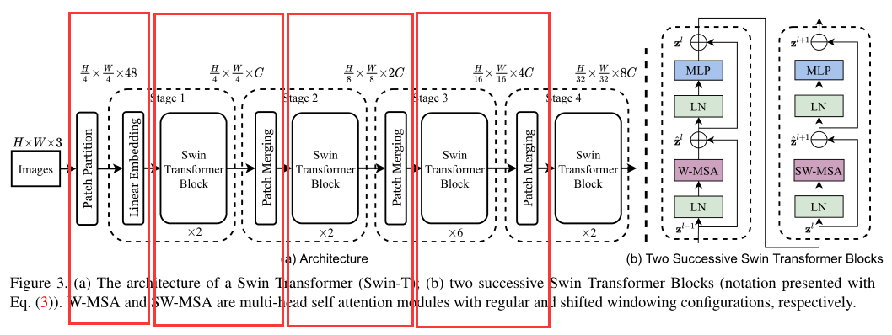
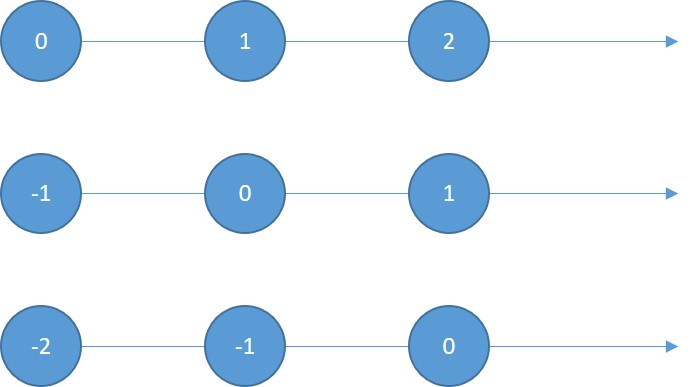

# Swin Transformer
[参考视频](https://www.bilibili.com/video/BV1bq4y1r75w?spm_id_from=333.999.0.0)
## 1. 回顾 Transformer 和 ViT
要不就不回顾了吧，怪麻烦的。注意一下：

- Transformer 中，Encoder 是有 6 块的，但是输入输出并不改变尺寸。就是输入多大，输出就多大。这也是 Swin TRM 不一样的地方之一。（对应了下面的 1）
- ViT 虽然把 patch 当作一个个 token 进行输入，但是还是会有一个问题，就是如果图片太大的话，那 patch 就会变得很多，那对复杂度还是很不友好。这也是 Swin TRM 要改进的一个点。（对应了下面的 2）

Swin Transformer ( Swin TRM ) 做到了两点：
1. 金字塔形状：在经过一个 Encoder 之后，会做一个 patch merging 的操作，也就是一个降采样的过程。增大了感受野，减小了分辨率。（不是 Encoder 让感受野变大的，是之后的 patch merging）
2. 注意力机制放在一个窗口内部。

先提一嘴，这个窗口内部的注意力是什么？（假设一张图片分成 9 个 patch）

- ViT 是把 9 个 patch 一起输进去（一个 patch 当作一个 token），这样做的不就是整张图片的注意力嘛，但是图片太大，显然不可能一起输进去。
- Swin 是把一个个 patch 单独处理（每个 patch 里面的每个像素当作 token，当然每个像素指的不是一个值，而是$[1, \  clannels]$）再输进去，这不就是 patch 内部的注意力嘛，把 9 个 patch 当作一个 batch，如果图片很多张的话，就可以把几张图片当成一个大 batch。


简单来说就是（从 TRM 到 Swin TRM）：

- TRM 用来处理语言啊文字啊之类的，所以可以每个字当作一个 token 输入。
- ViT 如果也把每个像素当作一个 token 的话，太复杂，所以采用的是 patch 的形式。但是对于图片太大的话，那么分出来的 patch 还是太多，还是太复杂。
- Swin TRM 相当于又回到了一开始简单的那个想法，就是把一个个像素当作 token 来输入，因为 patch 很小，所以把像素当作 token 没关系。但是，这样就不能把整张图所有的 patch 一起输进去了， 就要用 patch 去组成 batch。
- （是有点绕啦，但是我听懂了，哈哈哈）
- <font color='red'>时刻注意 Swin TRM 是 patch 中的一个像素是一个 token，而 ViT 中，每个 patch 是一个 token。</font>


## 2. Swin TRM
### 2.1. Swin TRM 整体架构
整体的结构如下图所示：

假设输入图像是 $224 \times 224 \times 3$，那么图中每个部分的输入输出为：

1. $224 \times 224 \times 3$ 到 $(224\ /\ 4 ) \times (224\ /\ 4 ) \times (4 \times4\times3)$
2. $(224\ /\ 4 ) \times (224\ /\ 4 ) \times (4 \times4\times3)$ 到 $(224\ /\ 4 ) \times (224\ /\ 4 ) \times 96$ （假设线性映射是映射到 96）
3. $(224\ /\ 4 ) \times (224\ /\ 4 ) \times 96$ 到 $(224\ /\ 4 ) \times (224\ /\ 4 ) \times 96$ （第三个这边下面有一个 $\times2$，说明是经过两个 block，就是上图右边的那两个 block，那两个其实是不一样的，是两个 Encoder。我们说过，TRM 的 Encoder 是不会改变形状的，所以经过这个之后形状是没有改变的。）
4. $(224\ /\ 4 ) \times (224\ /\ 4 ) \times 96$ 到 $(224\ /\ 8 ) \times (224\ /\ 8 ) \times (96\times2=128)$ （其实这边在下采样的时候是变成了 4，然后 4 再映射到 2 ，所以后面是 $96\times2=128$）


代码实现的时候，其实是下面这个图这么组装的：


### 2.2. 输入数据处理（框1）
<font color='red'>假设图像是 (224, 224, 3)，patch size 是 4，映射的维度是 96。</font>那么第一个框框的操作就是（解决数据输入的问题）：

- 先把 (224, 224, 3) 划分 patch，每个 patch 是 (4, 4, 3)，所以有 3136 个 patch
- 然后把每个 patch 展平到 48（$4 \times4\times3$）
- 然后把 48 做一个映射，映射到 96

### 2.3. 相对位置编码和注意力（框2）
Swin TRM 位置编码有两点不同：
1. 加的位置不同，放在了 attention 矩阵中。（公式如下）
2. 使用的是相对位置编码，而不是绝对位置信息

$$
Attention(Q,K,V)=SoftMax(QK^T/\sqrt{d}+B)V
\tag{1}
$$

SoftMax 里面的这个东西的本质是计算每个字符对每个字符的相似性。所以这里面的形状应该是 $[seq.len.\times seq.len.]$ 也就是说，相对位置编码的这个 B 矩阵，也是这个形状。

**在图像这里，在 Swin TRM 这里，就是计算一个 patch 里面，像素跟像素之间的相似性，假设现在一个 patch 的大小是 $7\times7$ 那么这个 B 矩阵的维度就应该是 $49\times49$，而不是 $7\times7$（因为 $7\times7$ 的 patch 里面有 49 个像素呀，计算像素之间的相似性，那这个矩阵就是 $49\times49$）。**

<font color='red'>重点哦！！！现在已经知道 B 的形状是什么了，接下来就是了解 B 里面的内容是怎么来的！</font>

#### 2.3.1. 绝对位置信息和相对位置信息

- 绝对位置信息，就是原点没有动。（下图的第一条，(0, 1, 2)）
- 相对位置信息，就是原点动了。（下图三种，(0, 1, 2), (-1, 0, 1), (-2, -1, 0)）
- 而且这里定义的是向右为正，如果规定向左为正，那又是另一种情况。





网格的情况见下：


**那么问题来了，怎么把相对位置信息融入到 Attention 中？？**

#### 2.3.2. 把相对位置信息融入 Attention 矩阵中
接下来还是用假设的方法来解释，先把 Attention 公式再拿下来看一眼：
$$
Attention(Q,K,V)=SoftMax(QK^T/\sqrt{d}+B)V
\tag{2}
$$
用2.3.1. 中的 4 个像素来举例。前面分析过了，4 个像素，（不考虑多头的情况）B 矩阵的形状就应该是 $4\times4$，$QK^T/\sqrt{d}$ 的形状跟 B 是一样的，也是 $4\times4$。我们再假设 $QK^T/\sqrt{d}$ 的值如下所示：

（多头的话就是 $4\times4\times heads$）


**现在的问题就是怎么把上面的 4 个相对位置信息融入到这个 Attention 矩阵中！**

我们把第一行看作是以1为原点，以此类推，不就可以把相对位置矩阵融入进去了吗？如下图：


梳理一下：

- 我们现在 4 个像素，有 4 个相对位置的情况
- 4 个情况的相对位置可以展平拼接成一个 $4\times4$ 的索引矩阵（**索引矩阵是不需要学习的**）
- QK 做完操作之后有一个 $4\times4$ 的 Attention 矩阵
- 会初始化一个可以学习的 $4\times4$ 位置编码矩阵
- 用索引矩阵去位置编码矩阵中取每个像素的位置编码，与 Attention 相应位置的相加
- 这样就能得到最终的 Attention 矩阵
- 然后再 SoftMax，再和 V 加权
- 这样整个 注意力操作就完成了

当然，上面这个只是举例，实际上，Swin TRM 的操作是下面这个图：


其实是一样的，只不过他用的是两个值，稍微复杂了一点而已。
那他用这两个值怎么取索引？很简单的思路就是把这两个值加起来当作索引矩阵再去取值的。（例如上面第一行就会变成 (0, 1, 1, 2)）
但是，这样会有两个问题：

1. 有负数
2. 第一行第二个跟第一行第三个，相对位置信息肯定是不一样的，但是加起来的索引是一样的，取到的值是一样的

所以要进行改进的两个点：
1. 不能有负数
2. 不同位置的相对位置信息不能相同

改进的方法（如下图）：
1. 加一个 $M-1$ ，让他没有负数
2. 在 0 维度上 $\times2M-1$ 就不一样了

下面的流程就很容易懂了：


然后这个就是相对位置信息了。也就是所谓的 positional embedding。把这玩意儿再加到 Attention 中就可以了。

问题：为什么是 $\times2M-1$？

- $x$ 的范围是 $[-m+1,m-1]$，长度就是 $m-1-(-m-1)+1=2m-1$。
- 同理，$y$ 也是
- 所以就有$(2M-1)\times(2M-1)$ 种


### 2.4. 移动窗口注意力机制（框2 & 图(b)）
由上分析可知：目前为止 (严谨吧)，Swin TRM 的注意力只是局部的，只在一个个 patch 之内，缺少交互。所以，这也是 Swin TRM 的改进之一，就是使用了移动窗口注意力。


- 假设，图片大小是 $56\times56$ ，patch 的大小是 $7\times7$ ，移动了 $3$ 个像素
- 移动的方法是把图像上面三行的像素放到最下面，左边三列的像素放到最右边。组成一张新的图像
- 这样新图像跟原来的图像在大部分位置就有 $3$ 个位置的偏差。（说的不准确，但是可以这么理解）
- 示意图可以见下面这个，方便描述。


<center class="half">
    
    
</center>

​    


- 就大概像上图这个意思。我们看第一个 patch，灰色的是原图的，绿色的是移动之后的
- **可以看到移动之后的窗口相对于原来的窗口，会跟相邻的三个窗口有重叠，这样在做注意力的时候，就会对相邻的三个窗口内的部分信息一起做注意力。就不会是原来单张图片只在自己 patch 内做注意力这么局限了。**
- 这个就是那两个 block，还记得吗，很上面的那张图，划分阶段的那个 ~

**但是，问题来了**。我们把上面三行跟左边三列的像素分别拿到下面跟右边。窗口大小为 7 的话，最下面跟最右边在对 patch 做操作的时候，就会把原本不相邻的 patch 去做操作。也就是说，本来就不相关的，没有语义联系的几个部分在这里会被计算相关性。首先是没有意义，其次就是会导致网络学习错误的东西。（如下图 1 跟 2，3 跟 6 ，4578，去做 Attention 是不是很不合理，本不相邻）

那么要怎么办呢？下面画出示意图并解释。


- 这边标索引，可以告诉模型，窗口看到的哪些是相邻的，哪些是不相邻的
- 也就是用 masked 的方法
- 往下看就知道了，直接拿右下角那个都不相邻的 $7\times7$ 窗口来举例


像素点比较多，所以下面，直接把相同的弄在一起来举例


- 如上图所示，拿来相减
- 0 的位置就代表是相邻的位置
- 非 0 的就代表本来没有相邻，但是被框到一起了
- **那么就可以把 0 的部分置 0，把非 0 的部分置为 $- \infty$，或者 $-1000$，$-100*$**
- 然后再把这个矩阵加到 Attention 矩阵中，这样，不相邻的就 $-$ 很大，那就没有影响或者说影响很小了。（记得 Attention 矩阵吧，值都不是很大）
- 当然这边只是拿的 4 个块合起来举例的，实际上，我们最后面那个是 $7\times7$ 大小的窗口，展开再相减得到的就是 $49 \times49$ 的矩阵，不就是刚好和 Attention 矩阵的维度一样嘛。（闲着没事干的，可以把上面那个 $7\times7$ 的矩阵展开看看）
- 一切如此完美 ~


### 2.5. patch merging

- 把原来的特征图，隔两行，隔两列取样
- 这样得到的就是 4 份原来特征图一半大小的新的特征图
- 然后再用一个 linear 层，把 4 映射成 2
- 所以可以看到上面那个网络结构图的 $C$ 经过一个 patch merging 都是两倍在增长的


## 3. 代码

```python
# --------------------------------------------------------
# Swin Transformer
# Copyright (c) 2021 Microsoft
# Licensed under The MIT License [see LICENSE for details]
# Written by Ze Liu
# --------------------------------------------------------
import torch
import torch.nn as nn
import torch.utils.checkpoint as checkpoint
from timm.models.layers import DropPath, to_2tuple, trunc_normal_

class Mlp(nn.Module):
    def __init__(self, in_features, hidden_features=None, out_features=None, act_layer=nn.GELU, drop=0.):
        super().__init__()
        out_features = out_features or in_features
        hidden_features = hidden_features or in_features
        self.fc1 = nn.Linear(in_features, hidden_features)
        self.act = act_layer()
        self.fc2 = nn.Linear(hidden_features, out_features)
        self.drop = nn.Dropout(drop)

    def forward(self, x):
        x = self.fc1(x)
        x = self.act(x)
        x = self.drop(x)
        x = self.fc2(x)
        x = self.drop(x)
        return x

def window_partition(x, window_size):
    """
    Args:
        x: (B, H, W, C)
        window_size (int): window size
    Returns:
        windows: (num_windows*B, window_size, window_size, C)
    """
    B, H, W, C = x.shape
    x = x.view(B, H // window_size, window_size, W // window_size, window_size, C)
    windows = x.permute(0, 1, 3, 2, 4, 5).contiguous().view(-1, window_size, window_size, C)
    return windows

def window_reverse(windows, window_size, H, W):
    """
    Args:
        windows: (num_windows*B, window_size, window_size, C)
        window_size (int): Window size
        H (int): Height of image
        W (int): Width of image
    Returns:
        x: (B, H, W, C)
    """
    B = int(windows.shape[0] / (H * W / window_size / window_size))## 输入进来wind形状是 64 7 7  96
    x = windows.view(B, H // window_size, W // window_size, window_size, window_size, -1)
    x = x.permute(0, 1, 3, 2, 4, 5).contiguous().view(B, H, W, -1)
    return x

## 2.
class WindowAttention(nn.Module):
    r""" Window based multi-head self attention (W-MSA) module with relative position bias.
    It supports both of shifted and non-shifted window.
    Args:
        dim (int): Number of input channels.
        window_size (tuple[int]): The height and width of the window.
        num_heads (int): Number of attention heads.
        qkv_bias (bool, optional):  If True, add a learnable bias to query, key, value. Default: True
        qk_scale (float | None, optional): Override default qk scale of head_dim ** -0.5 if set
        attn_drop (float, optional): Dropout ratio of attention weight. Default: 0.0
        proj_drop (float, optional): Dropout ratio of output. Default: 0.0
    """
    def __init__(self, dim, window_size, num_heads, qkv_bias=True, qk_scale=None, attn_drop=0., proj_drop=0.):

        super().__init__()
        self.dim = dim
        self.window_size = window_size  # Wh, Ww
        self.num_heads = num_heads
        head_dim = dim // num_heads
        self.scale = qk_scale or head_dim ** -0.5

        # define a parameter table of relative position bias
        self. relative_position_bias_table = nn.Parameter(
            torch.zeros((2 * window_size[0] - 1) * (2 * window_size[1] - 1), num_heads))  # 2*Wh-1 * 2*Ww-1, nH

        # get pair-wise relative position index for each token inside the window
        coords_h = torch.arange(self.window_size[0])
        coords_w = torch.arange(self.window_size[1])
        coords = torch.stack(torch.meshgrid([coords_h, coords_w]))  # 2, Wh, Ww
        coords_flatten = torch.flatten(coords, 1)  # 2, Wh*Ww
        relative_coords = coords_flatten[:, :, None] - coords_flatten[:, None, :]  # 2, Wh*Ww, Wh*Ww
        relative_coords = relative_coords.permute(1, 2, 0).contiguous()  # Wh*Ww, Wh*Ww, 2
        relative_coords[:, :, 0] += self.window_size[0] - 1  # shift to start from 0
        relative_coords[:, :, 1] += self.window_size[1] - 1
        relative_coords[:, :, 0] *= 2 * self.window_size[1] - 1
        relative_position_index = relative_coords.sum(-1)  # Wh*Ww, Wh*Ww
        self.register_buffer("relative_position_index", relative_position_index)

        self.qkv = nn.Linear(dim, dim * 3, bias=qkv_bias)
        self.attn_drop = nn.Dropout(attn_drop)
        self.proj = nn.Linear(dim, dim)
        self.proj_drop = nn.Dropout(proj_drop)

        trunc_normal_(self.relative_position_bias_table, std=.02)
        self.softmax = nn.Softmax(dim=-1)

    def forward(self, x, mask=None):
        """
        Args:
            x: input features with shape of (num_windows*B, N, C)
            mask: (0/-inf) mask with shape of (num_windows, Wh*Ww, Wh*Ww) or None
        """
        B_, N, C = x.shape## x输入形状是 64 49 96 ；对应到每个维度就是B是64，N是49，C是96
        qkv = self.qkv(x).reshape(B_, N, 3, self.num_heads, C // self.num_heads).permute(2, 0, 3, 1, 4)
        q, k, v = qkv[0], qkv[1], qkv[2]  # make torchscript happy (cannot use tensor as tuple)

        q = q * self.scale
        attn = (q @ k.transpose(-2, -1))

        relative_position_bias = self.relative_position_bias_table[self.relative_position_index.view(-1)].view(
            self.window_size[0] * self.window_size[1], self.window_size[0] * self.window_size[1], -1)  # Wh*Ww,Wh*Ww,nH
        relative_position_bias = relative_position_bias.permute(2, 0, 1).contiguous()  # nH, Wh*Ww, Wh*Ww
        attn = attn + relative_position_bias.unsqueeze(0)

        if mask is not None:
            nW = mask.shape[0]
            attn = attn.view(B_ // nW, nW, self.num_heads, N, N) + mask.unsqueeze(1).unsqueeze(0)
            attn = attn.view(-1, self.num_heads, N, N)
            attn = self.softmax(attn)
        else:
            attn = self.softmax(attn)

        attn = self.attn_drop(attn)

        x = (attn @ v).transpose(1, 2).reshape(B_, N, C)
        x = self.proj(x)
        x = self.proj_drop(x)
        return x

    def extra_repr(self) -> str:
        return f'dim={self.dim}, window_size={self.window_size}, num_heads={self.num_heads}'

    def flops(self, N):
        # calculate flops for 1 window with token length of N
        flops = 0
        # qkv = self.qkv(x)
        flops += N * self.dim * 3 * self.dim
        # attn = (q @ k.transpose(-2, -1))
        flops += self.num_heads * N * (self.dim // self.num_heads) * N
        #  x = (attn @ v)
        flops += self.num_heads * N * N * (self.dim // self.num_heads)
        # x = self.proj(x)
        flops += N * self.dim * self.dim
        return flops

class SwinTransformerBlock(nn.Module):
    r""" Swin Transformer Block.
    Args:
        dim (int): Number of input channels.
        input_resolution (tuple[int]): Input resulotion.
        num_heads (int): Number of attention heads.
        window_size (int): Window size.
        shift_size (int): Shift size for SW-MSA.
        mlp_ratio (float): Ratio of mlp hidden dim to embedding dim.
        qkv_bias (bool, optional): If True, add a learnable bias to query, key, value. Default: True
        qk_scale (float | None, optional): Override default qk scale of head_dim ** -0.5 if set.
        drop (float, optional): Dropout rate. Default: 0.0
        attn_drop (float, optional): Attention dropout rate. Default: 0.0
        drop_path (float, optional): Stochastic depth rate. Default: 0.0
        act_layer (nn.Module, optional): Activation layer. Default: nn.GELU
        norm_layer (nn.Module, optional): Normalization layer.  Default: nn.LayerNorm
    """
    def __init__(self, dim, input_resolution, num_heads, window_size=7, shift_size=0,
                 mlp_ratio=4., qkv_bias=True, qk_scale=None, drop=0., attn_drop=0., drop_path=0.,
                 act_layer=nn.GELU, norm_layer=nn.LayerNorm):
        super().__init__()
        self.dim = dim
        self.input_resolution = input_resolution
        self.num_heads = num_heads
        self.window_size = window_size
        self.shift_size = shift_size
        self.mlp_ratio = mlp_ratio
        if min(self.input_resolution) <= self.window_size:
            # if window size is larger than input resolution, we don't partition windows
            self.shift_size = 0
            self.window_size = min(self.input_resolution)
        assert 0 <= self.shift_size < self.window_size, "shift_size must in 0-window_size"

        self.norm1 = norm_layer(dim)
        self.attn = WindowAttention(
            dim, window_size=to_2tuple(self.window_size), num_heads=num_heads,
            qkv_bias=qkv_bias, qk_scale=qk_scale, attn_drop=attn_drop, proj_drop=drop)

        self.drop_path = DropPath(drop_path) if drop_path > 0. else nn.Identity()
        self.norm2 = norm_layer(dim)
        mlp_hidden_dim = int(dim * mlp_ratio)
        self.mlp = Mlp(in_features=dim, hidden_features=mlp_hidden_dim, act_layer=act_layer, drop=drop)
        ## 3.mask
        if self.shift_size > 0:
            # calculate attention mask for SW-MSA
            H, W = self.input_resolution
            img_mask = torch.zeros((1, H, W, 1))  # 1 H W 1
            h_slices = (slice(0, -self.window_size),
                        slice(-self.window_size, -self.shift_size),
                        slice(-self.shift_size, None))## 生成一个元祖，第0个元素 slice(0, -7, None) 第1个元素slice(-7, -3, None) 第2个元素slice(-3, None, None) 每个元素三个分别代表 start step stop
            w_slices = (slice(0, -self.window_size),
                        slice(-self.window_size, -self.shift_size),
                        slice(-self.shift_size, None))
            cnt = 0
            for h in h_slices:
                for w in w_slices:
                    img_mask[:, h, w, :] = cnt
                    cnt += 1

            mask_windows = window_partition(img_mask, self.window_size)  # nW, window_size, window_size, 1
            mask_windows = mask_windows.view(-1, self.window_size * self.window_size)
            attn_mask = mask_windows.unsqueeze(1) - mask_windows.unsqueeze(2)
            attn_mask = attn_mask.masked_fill(attn_mask != 0, float(-100.0)).masked_fill(attn_mask == 0, float(0.0))
        else:
            attn_mask = None

        self.register_buffer("attn_mask", attn_mask)

    def forward(self, x):
        H, W = self.input_resolution## 输入的x形状是:1 3136 96 得到H是56 W是56
        B, L, C = x.shape## 这个是B是1，L是seq_len等于3136，C是通道数为96
        assert L == H * W, "input feature has wrong size"

        shortcut = x
        x = self.norm1(x)
        x = x.view(B, H, W, C)## 从1 3136 96 转为  1 56 56 96  注意这个时候就从输入的一维那种向量转为了特征图，也就是一维3136，到了一个二维特征图 56 56 ，对应到原始图片是224 224

        # cyclic shift
        if self.shift_size > 0:
            shifted_x = torch.roll(x, shifts=(-self.shift_size, -self.shift_size), dims=(1, 2))
        else:
            shifted_x = x

        # partition windows
        x_windows = window_partition(shifted_x, self.window_size) ## 64 7 7 96  # nW*B, window_size, window_size, C
        x_windows = x_windows.view(-1, self.window_size * self.window_size, C) ## 64 49 96 ；64是bs乘以每个图片的窗口，49是一个窗口中的有多少个元素，对应到NLP中，就是有多少个单词，96是通道数，对应到NLP就是每个单词的维度  # nW*B, window_size*window_size, C

        # W-MSA/SW-MSA
        attn_windows = self.attn(x_windows, mask=self.attn_mask)## attn_windows 64 49 96，和trm没区别哈，长度49不变，toen维度96没变；  # nW*B, window_size*window_size, C

        # merge windows
        attn_windows = attn_windows.view(-1, self.window_size, self.window_size, C)
        shifted_x = window_reverse(attn_windows, self.window_size, H, W)  # B H' W' C

        # reverse cyclic shift
        if self.shift_size > 0:
            x = torch.roll(shifted_x, shifts=(self.shift_size, self.shift_size), dims=(1, 2))
        else:
            x = shifted_x
        x = x.view(B, H * W, C)

        # FFN
        x = shortcut + self.drop_path(x)
        x = x + self.drop_path(self.mlp(self.norm2(x)))

        return x

    def extra_repr(self) -> str:
        return f"dim={self.dim}, input_resolution={self.input_resolution}, num_heads={self.num_heads}, " \
               f"window_size={self.window_size}, shift_size={self.shift_size}, mlp_ratio={self.mlp_ratio}"

    def flops(self):
        flops = 0
        H, W = self.input_resolution
        # norm1
        flops += self.dim * H * W
        # W-MSA/SW-MSA
        nW = H * W / self.window_size / self.window_size
        flops += nW * self.attn.flops(self.window_size * self.window_size)
        # mlp
        flops += 2 * H * W * self.dim * self.dim * self.mlp_ratio
        # norm2
        flops += self.dim * H * W
        return flops

class PatchMerging(nn.Module):
    r""" Patch Merging Layer.
    Args:
        input_resolution (tuple[int]): Resolution of input feature.
        dim (int): Number of input channels.
        norm_layer (nn.Module, optional): Normalization layer.  Default: nn.LayerNorm
    """

    def __init__(self, input_resolution, dim, norm_layer=nn.LayerNorm):
        super().__init__()
        self.input_resolution = input_resolution
        self.dim = dim
        self.reduction = nn.Linear(4 * dim, 2 * dim, bias=False)
        self.norm = norm_layer(4 * dim)

    def forward(self, x):
        """
        x: B, H*W, C
        """
        H, W = self.input_resolution #
        B, L, C = x.shape ## 输入进来x为1 3136 96
        assert L == H * W, "input feature has wrong size"
        assert H % 2 == 0 and W % 2 == 0, f"x size ({H}*{W}) are not even."

        x = x.view(B, H, W, C) ## 这里x变为了 1 56 56  96

        x0 = x[:, 0::2, 0::2, :]  # B H/2 W/2 C ## x0形状为1 28 28 96
        x1 = x[:, 1::2, 0::2, :]  # B H/2 W/2 C ## x1形状为1 28 28 96
        x2 = x[:, 0::2, 1::2, :]  # B H/2 W/2 C## ## x2形状为1 28 28 96
        x3 = x[:, 1::2, 1::2, :]  # B H/2 W/2 C ## ## x3形状为1 28 28 96
        x = torch.cat([x0, x1, x2, x3], -1)  # B H/2 W/2 4*C  ## x为1 28 28 384
        x = x.view(B, -1, 4 * C)  # B H/2*W/2 4*C ## 1 784 384

        x = self.norm(x)
        x = self.reduction(x) # 1 784 192

        return x

    def extra_repr(self) -> str:
        return f"input_resolution={self.input_resolution}, dim={self.dim}"

    def flops(self):
        H, W = self.input_resolution
        flops = H * W * self.dim
        flops += (H // 2) * (W // 2) * 4 * self.dim * 2 * self.dim
        return flops

class BasicLayer(nn.Module):
    """ A basic Swin Transformer layer for one stage.
    Args:
        dim (int): Number of input channels.
        input_resolution (tuple[int]): Input resolution.
        depth (int): Number of blocks.
        num_heads (int): Number of attention heads.
        window_size (int): Local window size.
        mlp_ratio (float): Ratio of mlp hidden dim to embedding dim.
        qkv_bias (bool, optional): If True, add a learnable bias to query, key, value. Default: True
        qk_scale (float | None, optional): Override default qk scale of head_dim ** -0.5 if set.
        drop (float, optional): Dropout rate. Default: 0.0
        attn_drop (float, optional): Attention dropout rate. Default: 0.0
        drop_path (float | tuple[float], optional): Stochastic depth rate. Default: 0.0
        norm_layer (nn.Module, optional): Normalization layer. Default: nn.LayerNorm
        downsample (nn.Module | None, optional): Downsample layer at the end of the layer. Default: None
        use_checkpoint (bool): Whether to use checkpointing to save memory. Default: False.
    """
    def __init__(self, dim, input_resolution, depth, num_heads, window_size,
                 mlp_ratio=4., qkv_bias=True, qk_scale=None, drop=0., attn_drop=0.,
                 drop_path=0., norm_layer=nn.LayerNorm, downsample=None, use_checkpoint=False):

        super().__init__()
        self.dim = dim
        self.input_resolution = input_resolution
        self.depth = depth
        self.use_checkpoint = use_checkpoint

        # build blocks
        self.blocks = nn.ModuleList([
            SwinTransformerBlock(dim=dim, input_resolution=input_resolution,
                                 num_heads=num_heads, window_size=window_size,
                                 shift_size=0 if (i % 2 == 0) else window_size // 2,
                                 mlp_ratio=mlp_ratio,
                                 qkv_bias=qkv_bias, qk_scale=qk_scale,
                                 drop=drop, attn_drop=attn_drop,
                                 drop_path=drop_path[i] if isinstance(drop_path, list) else drop_path,
                                 norm_layer=norm_layer)
            for i in range(depth)])

        # patch merging layer
        if downsample is not None:
            self.downsample = downsample(input_resolution, dim=dim, norm_layer=norm_layer)
        else:
            self.downsample = None

    def forward(self, x):
        for blk in self.blocks:
            if self.use_checkpoint:
                x = checkpoint.checkpoint(blk, x)
            else:
                x = blk(x)
        if self.downsample is not None:
            x = self.downsample(x)
        return x

    def extra_repr(self) -> str:
        return f"dim={self.dim}, input_resolution={self.input_resolution}, depth={self.depth}"

    def flops(self):
        flops = 0
        for blk in self.blocks:
            flops += blk.flops()
        if self.downsample is not None:
            flops += self.downsample.flops()
        return flops

## 1. patchembedding的实现
class PatchEmbed(nn.Module):
    r""" Image to Patch Embedding
    Args:
        img_size (int): Image size.  Default: 224.
        patch_size (int): Patch token size. Default: 4.
        in_chans (int): Number of input image channels. Default: 3.
        embed_dim (int): Number of linear projection output channels. Default: 96.
        norm_layer (nn.Module, optional): Normalization layer. Default: None
    """
    def __init__(self, img_size=224, patch_size=4, in_chans=3, embed_dim=96, norm_layer=None):
        super().__init__()
        img_size = to_2tuple(img_size)
        patch_size = to_2tuple(patch_size)
        patches_resolution = [img_size[0] // patch_size[0], img_size[1] // patch_size[1]]
        self.img_size = img_size
        self.patch_size = patch_size
        self.patches_resolution = patches_resolution
        self.num_patches = patches_resolution[0] * patches_resolution[1]

        self.in_chans = in_chans
        self.embed_dim = embed_dim

        self.proj = nn.Conv2d(in_chans, embed_dim, kernel_size=patch_size, stride=patch_size)
        if norm_layer is not None:
            self.norm = norm_layer(embed_dim)
        else:
            self.norm = None

    def forward(self, x):
        B, C, H, W = x.shape # B是1  C3 H224  W224
        # FIXME look at relaxing size constraints
        assert H == self.img_size[0] and W == self.img_size[1], \
            f"Input image size ({H}*{W}) doesn't match model ({self.img_size[0]}*{self.img_size[1]})."
        x = self.proj(x).flatten(2).transpose(1, 2)  # B Ph*Pw C  1 3136 96  3136就是我们的56*56 压扁
        if self.norm is not None:
            x = self.norm(x)
        return x

    def flops(self):
        Ho, Wo = self.patches_resolution
        flops = Ho * Wo * self.embed_dim * self.in_chans * (self.patch_size[0] * self.patch_size[1])
        if self.norm is not None:
            flops += Ho * Wo * self.embed_dim
        return flops

class SwinTransformer(nn.Module):
    r""" Swin Transformer
        A PyTorch impl of : `Swin Transformer: Hierarchical Vision Transformer using Shifted Windows`  -
          https://arxiv.org/pdf/2103.14030
    Args:
        img_size (int | tuple(int)): Input image size. Default 224
        patch_size (int | tuple(int)): Patch size. Default: 4
        in_chans (int): Number of input image channels. Default: 3
        num_classes (int): Number of classes for classification head. Default: 1000
        embed_dim (int): Patch embedding dimension. Default: 96
        depths (tuple(int)): Depth of each Swin Transformer layer.
        num_heads (tuple(int)): Number of attention heads in different layers.
        window_size (int): Window size. Default: 7
        mlp_ratio (float): Ratio of mlp hidden dim to embedding dim. Default: 4
        qkv_bias (bool): If True, add a learnable bias to query, key, value. Default: True
        qk_scale (float): Override default qk scale of head_dim ** -0.5 if set. Default: None
        drop_rate (float): Dropout rate. Default: 0
        attn_drop_rate (float): Attention dropout rate. Default: 0
        drop_path_rate (float): Stochastic depth rate. Default: 0.1
        norm_layer (nn.Module): Normalization layer. Default: nn.LayerNorm.
        ape (bool): If True, add absolute position embedding to the patch embedding. Default: False
        patch_norm (bool): If True, add normalization after patch embedding. Default: True
        use_checkpoint (bool): Whether to use checkpointing to save memory. Default: False
    """

    def __init__(self, img_size=224, patch_size=4, in_chans=3, num_classes=1000,
                 embed_dim=96, depths=[2, 2, 6, 2], num_heads=[3, 6, 12, 24],
                 window_size=7, mlp_ratio=4., qkv_bias=True, qk_scale=None,
                 drop_rate=0., attn_drop_rate=0., drop_path_rate=0.1,
                 norm_layer=nn.LayerNorm, ape=False, patch_norm=True,
                 use_checkpoint=False, **kwargs):
        super().__init__()

        self.num_classes = num_classes
        self.num_layers = len(depths)
        self.embed_dim = embed_dim
        self.ape = ape
        self.patch_norm = patch_norm
        self.num_features = int(embed_dim * 2 ** (self.num_layers - 1))
        self.mlp_ratio = mlp_ratio

        # split image into non-overlapping patches
        self.patch_embed = PatchEmbed(
            img_size=img_size, patch_size=patch_size, in_chans=in_chans, embed_dim=embed_dim,
            norm_layer=norm_layer if self.patch_norm else None)
        num_patches = self.patch_embed.num_patches
        patches_resolution = self.patch_embed.patches_resolution
        self.patches_resolution = patches_resolution

        # absolute position embedding
        if self.ape:
            self.absolute_pos_embed = nn.Parameter(torch.zeros(1, num_patches, embed_dim))
            trunc_normal_(self.absolute_pos_embed, std=.02)

        self.pos_drop = nn.Dropout(p=drop_rate)

        # stochastic depth
        dpr = [x.item() for x in torch.linspace(0, drop_path_rate, sum(depths))]  # stochastic depth decay rule

        # build layers
        self.layers = nn.ModuleList()
        for i_layer in range(self.num_layers):
            layer = BasicLayer(dim=int(embed_dim * 2 ** i_layer),
                               input_resolution=(patches_resolution[0] // (2 ** i_layer),
                                                 patches_resolution[1] // (2 ** i_layer)),
                               depth=depths[i_layer],
                               num_heads=num_heads[i_layer],
                               window_size=window_size,
                               mlp_ratio=self.mlp_ratio,
                               qkv_bias=qkv_bias, qk_scale=qk_scale,
                               drop=drop_rate, attn_drop=attn_drop_rate,
                               drop_path=dpr[sum(depths[:i_layer]):sum(depths[:i_layer + 1])],
                               norm_layer=norm_layer,
                               downsample=PatchMerging if (i_layer < self.num_layers - 1) else None,
                               use_checkpoint=use_checkpoint)
            self.layers.append(layer)

        self.norm = norm_layer(self.num_features)
        self.avgpool = nn.AdaptiveAvgPool1d(1)
        self.head = nn.Linear(self.num_features, num_classes) if num_classes > 0 else nn.Identity()

        self.apply(self._init_weights)

    def _init_weights(self, m):
        if isinstance(m, nn.Linear):
            trunc_normal_(m.weight, std=.02)
            if isinstance(m, nn.Linear) and m.bias is not None:
                nn.init.constant_(m.bias, 0)
        elif isinstance(m, nn.LayerNorm):
            nn.init.constant_(m.bias, 0)
            nn.init.constant_(m.weight, 1.0)

    @torch.jit.ignore
    def no_weight_decay(self):
        return {'absolute_pos_embed'}

    @torch.jit.ignore
    def no_weight_decay_keywords(self):
        return {'relative_position_bias_table'}

    def forward_features(self, x):
        x = self.patch_embed(x)
        if self.ape:
            x = x + self.absolute_pos_embed
        x = self.pos_drop(x)

        for layer in self.layers:
            x = layer(x)

        x = self.norm(x)  # B L C
        x = self.avgpool(x.transpose(1, 2))  # B C 1
        x = torch.flatten(x, 1)
        return x

    def forward(self, x):
        x = self.forward_features(x)
        x = self.head(x)
        return x

    def flops(self):
        flops = 0
        flops += self.patch_embed.flops()
        for i, layer in enumerate(self.layers):
            flops += layer.flops()
        flops += self.num_features * self.patches_resolution[0] * self.patches_resolution[1] // (2 ** self.num_layers)
        flops += self.num_features * self.num_classes
        return flops

v = SwinTransformer()
img = torch.randn(1, 3, 224, 224)
preds = v(img) # (1, 1000)
print(preds)
print(preds.size())
```

