# 地物分类专题图制作

## 1. 准备工作

### 1.1. 软件安装

使用的软件为ArcGIS，安装过程可参考[链接](https://www.cnblogs.com/123zxc/p/8349746.html)

或者根据以下步骤。（[百度网盘](https://pan.baidu.com/s/16tkPCAVBsr6GRxEr1cY1fA?pwd=hfuj)，提取码：hfuj）

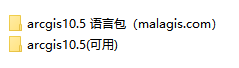

1. 只需安装 ArcGIS_Desktop_105_154030.exe，一路到底。可以自定义安装路径。
2. 破解：将 ArcGIS 10.5 CRACK 中的 Desktop10.5 与 License10.5 的所有文件都复制到安装路径中的 bin 里
3. 汉化：解压语言包，运行其中的 msi 文件即可。解压密码在文件名后面的括号中。

### 1.2. 数据准备

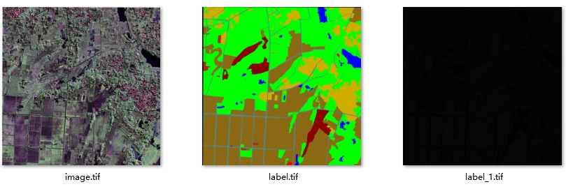

我们的数据如上图所示。其中：

1. image.tif：原始SAR图像
2. label.tif：标签图像。由 MATLAB 的 imageLabeler 标注得到。或者 ENVI 生成，或者自己算法跑出来的均可。
3. label_1.tif：标签图像。

注意，其中的两个 label，一个是三通道的，一个是单通道的。我们生成专题图需要的 label 是单通道的，里面的值是 01234...，而我自己的 label 是三通道的，所以需要进行通道的转换。如果有黑边要去掉的话，记得多给黑边一个标签。

注意！！！也就是说，我们需要的数据只有一张单通道的 label，但是！！！必须带地理信息，也就是 geo 跟 proj。后面制图时，添加标尺会需要。

后续制图会生成比较多的文件，所以建议把每个图放一个文件夹。

## 2. 制图

### 2.1. 添加数据

添加数据，将上面准备的单通道，带地理信息的 label.tif 添加进 ArcGIS：

```
文件---添加数据---添加数据  /  工具栏的“添加数据”图标
```

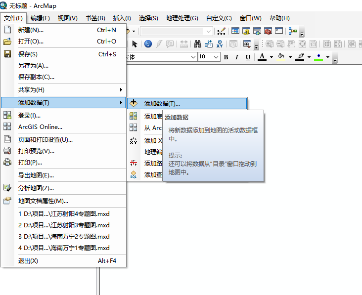

添加数据的时候，该软件默认不是读取电脑本地的所有文件夹，所以还要在弹出的窗口中添加一下数据所在的文件夹，才能读取成功。

然后选择构建金字塔

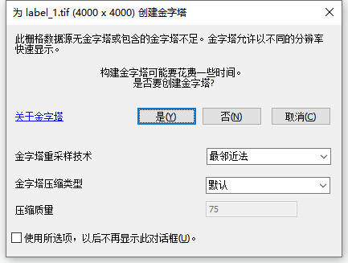

添加完之后如下所示：

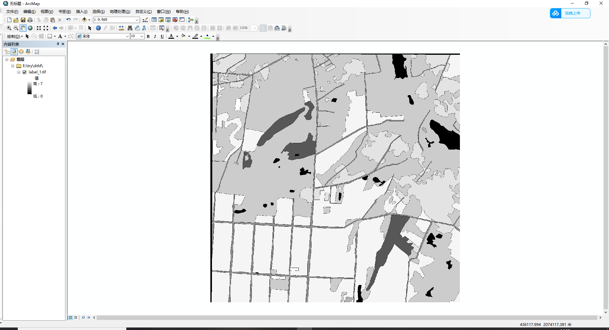

### 2.2. 添加颜色

要给每个类别添加对应的颜色。点击左边栏中的图像，选择属性。更改其中的 “唯一值”。为每个类别命名，以及添加 RGB 。注意这边保存 “色彩映射表”，这样就不需要每次都更改颜色值了。

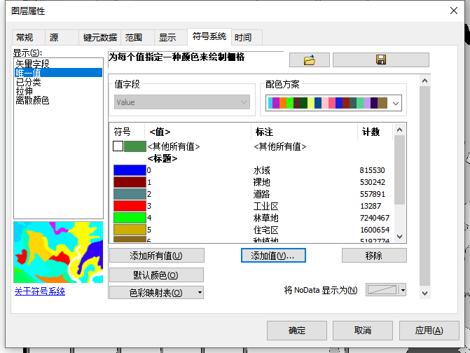

### 2.3. 页面调整

```
左下角---布局视图
```

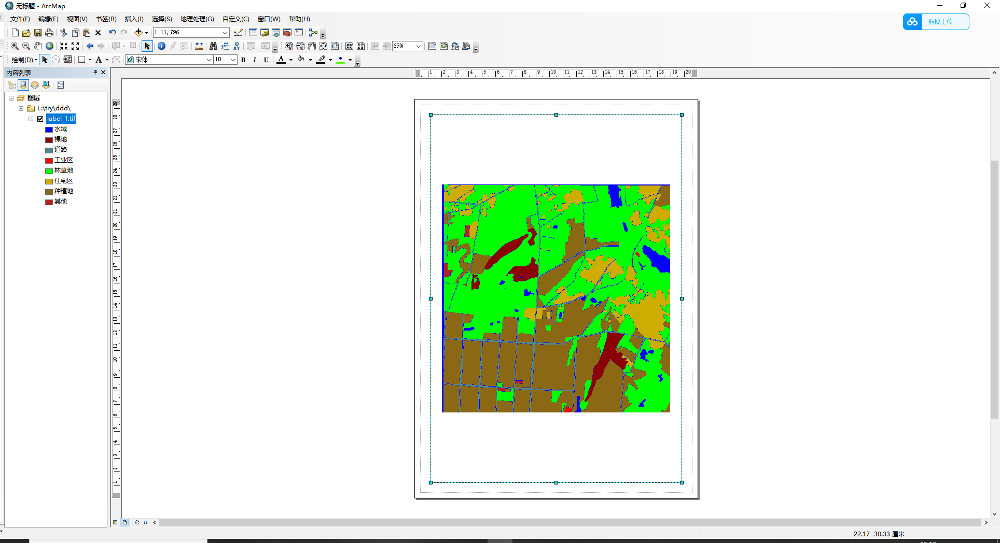

```
文件---页面和打印设置
```

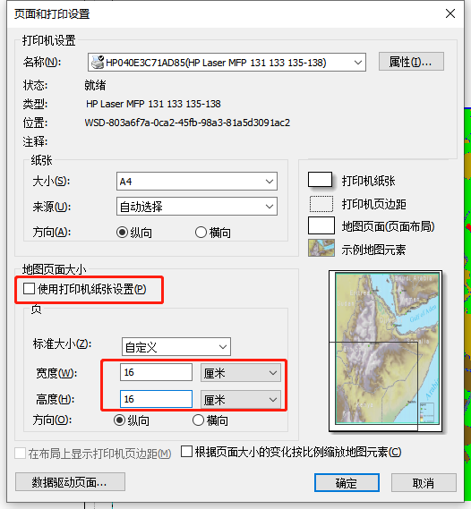

这边可以根据图片的大小自由设置。

然后再把图像拉进方框中，调整 “大小”。这边不是对图像放缩，而是调整它的边框而已。注意，一定不要放缩。

### 2.4. 插入图信息

接下来就是插入指北针、图例、图名等。

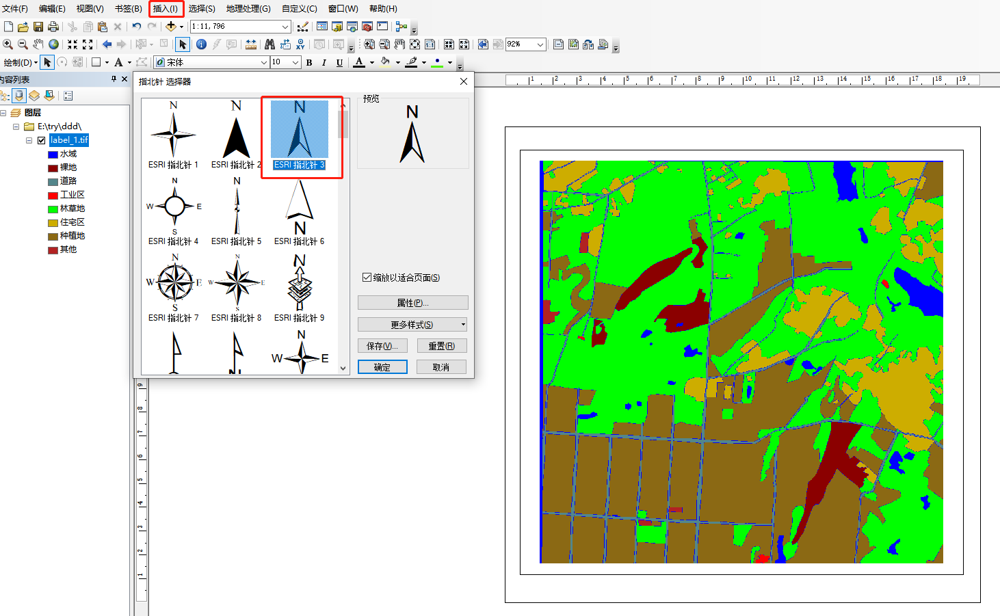

在插入图例的时候，要选择个数，根据类别的个数选，然后一直点下一页。

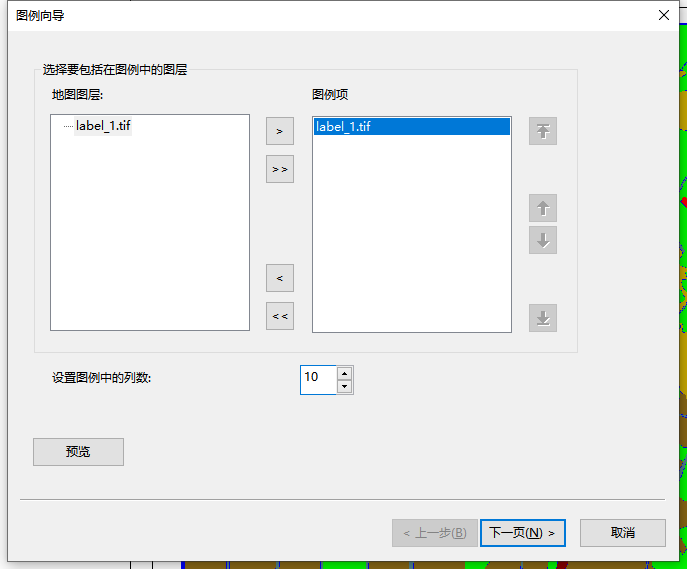

然后！！

```
右键图例---转换为图形---右键图例---取消分组
```

调整之后再全选图例进行 组 。

然后就是插入比例尺

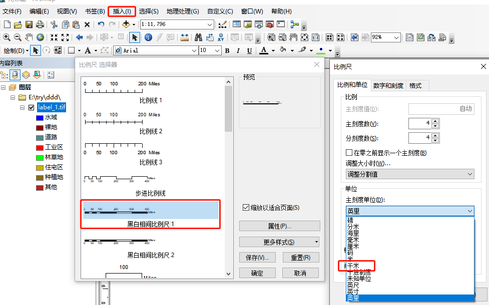

然后拉伸进行调整。这是个技术活。

再进行图像边框的去除。

```
右键图像---属性
```

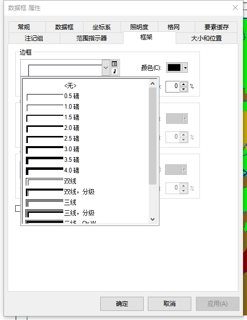

最后插入文本，添加图名，基本就做完了。

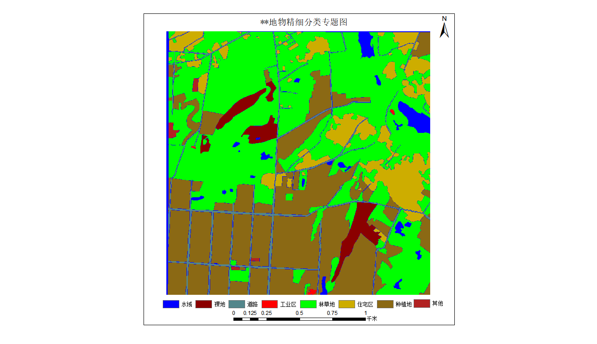

## 3. 保存信息及导出

制图过程中，有许多步骤产生的结果，建议保存。

1. 保存图层文件

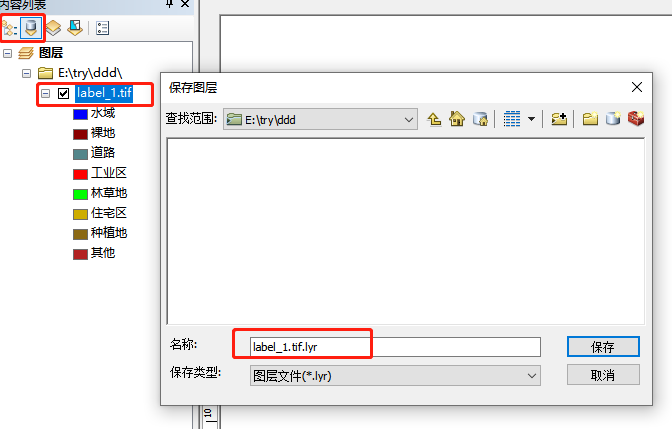

2. 保存整个文件

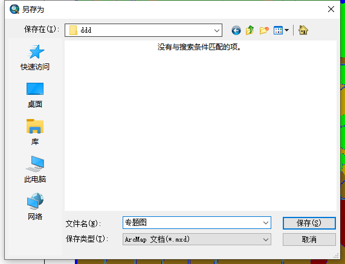

3. 保存颜色映射表：这个在前面部分说过了
4. 导出地图：

```
文件---导出地图
```

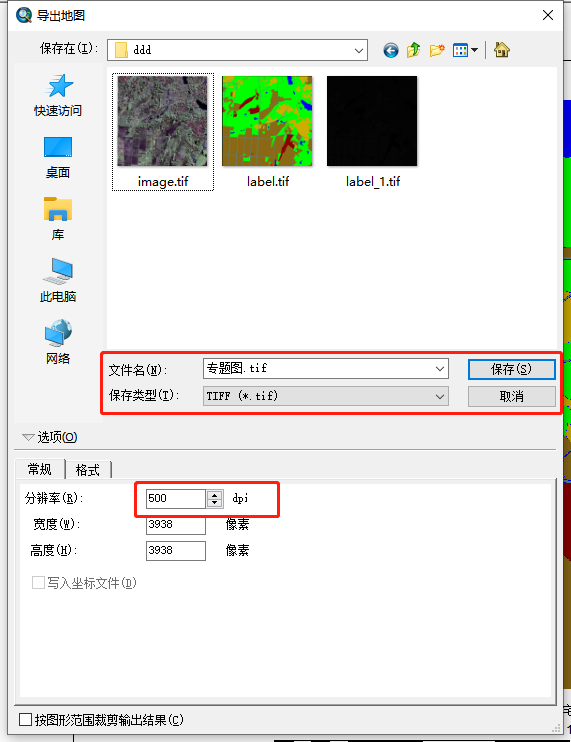

为保证清晰，分辨率可以调高一点，建议保存成 tif。