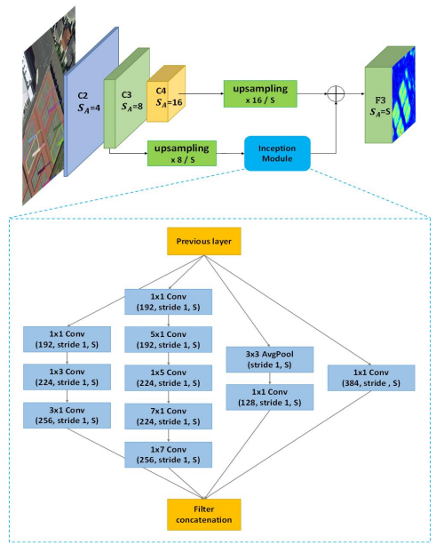

 edited by nrzheng，2022.2.22

# R2CNN

## 1. 问题定义

- （a）在ICDAR2015比赛中，场景文本检测的ground truth以顺时针方向四个点 $(x_1,y_1), (x_2,y_2), (x_3,y_3), (x_4,y_4)$表示。注意：这不是矩形框
- （b/c）可以粗略地认为被有方向的矩形包围
-    用顺时针方向的两个点$(x_1,y_1), (x_2,y_2)$表示的一条边，以及对应的$h$来表示一个倾斜的矩形

## 2. R2CNN检测过程

R2CNN可视化过程如下图所示：

- （a）输入原图，提取特征
- （b）使用RPN生成**正框**，并进行分类和精简（粗检测——只分前景和背景）
- （c）对具有不同尺寸的集合特征合并，以预测具体目标分数、正框以及与之关联的**倾斜矩形框**（细检测——具体类别）
- （d）采用非极大值抑制得到检测结果
-   正框与斜框对应，所以可以执行不同的NMS得到不同的结果（见3.3节）

R2CNN基于Faster R-CNN。RPN用于建议文本区域、Fast R-CNN模型**修改为**文本区域分类、细化和倾斜框预测。网络过程如下图所示：

## 3. 创新点

### 3.1. ROI Pooling

- 改进ROI Pooling层：从$7\times7$更改为$7\times7,\ 11\times3,\ 3\times11$

### 3.2. RPN中的anchor

- 改进anchor策略：Faster RCNN中的原始anchor尺度为$(8,16,32)$，本文研究了两种策略：
  - 改为小尺寸：$(4,8,16)$
  - 添加新的尺寸：$(4,8,16,32)$
  - 因为与一般对象相比，小场景文本较多

### 3.3. 斜框

从R2CNN检测过程可知，正框与斜框是一一对应的。所以在正框上执行NMS之后，与执行斜框的NMS得到的最终结果是不同的。见下图：

- （a）候选正框与其关联的斜框（相同颜色为一对）
- （b）基于正常NMS对正框的检测结果（绿色框为正确检测，红色虚线框表示漏检）
- （c）基于倾斜NMS的斜框检测结果
- （d）两个正框的例子【正框：$(v_x,v_y,v_w,v_h)$】
- （e）两个斜框的例子【斜框：$(u_{x1},u_{y1},u_{x2},u_{y2},u_h)$】

从上图可见，若采用正框的NMS，很容易把靠太近的目标当作是一个目标而被抑制掉。但是若采用斜框的NMS，则不会出现这个问题，因为斜框相交的不多，IoU值很低，所以不会被NMS抑制掉。

# SCRDet

[参考链接](https://zhuanlan.zhihu.com/p/107400817)

SCRDet对遥感目标检测面临的三个问题做了三个改进：

1. 小目标：通过特征融合和anchor采样角度出发设计一个特征融合结构（SF-Net模块）
2. 密集排列：设计了一个有监督的多维注意力网络以减少背景噪声的不利影响（MDA-Net）
3. 任意方向：通过添加IoU常数因子设计了一种改进的平滑L1损失，该因子专门用于解决旋转边界框回归的边界问题

## 1. SF-Net

## 2. MDA-Net

## 3. IoU-Smooth L1 Loss

首先了解旋转边界框的两种常见方式：

1. opencv表示法

2. 长边表示法

SCRDet是采用的opencv 表示法。在当前常用的旋转检测框的角度定义下，由于存在旋转角度的边界问题，会产生不必要的损失，如下图所示：

**最理想的角度回归路线是由蓝色框逆时针旋转到红色框，但由于角度的周期性，导致按照这个回归方式的损失非常大（参见长边表示法或opencv表示法的右图）。此时模型必须以更复杂的形式回归（例如蓝色框顺时针旋转，同时缩放w和h），增加了回归的难度。为了更好地解决这个问题，本文在传统的smooth L1 损失函数中引入了IoU常数因子。**

