 edited by nrzheng，2022.2.15

[参考链接](https://blog.csdn.net/yegeli/article/details/109861867)

# 目标检测简介

## 0. 图先来两张

（图片来源：Wu X, Sahoo D, Hoi S C H.Recent advances in deep learning for object detection[J]. Neurocomputing,2020, 396: 39-64.）

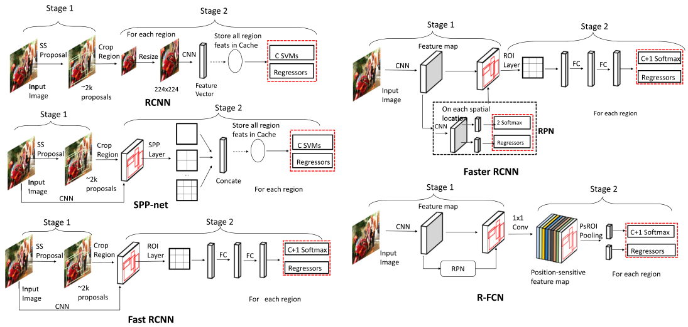

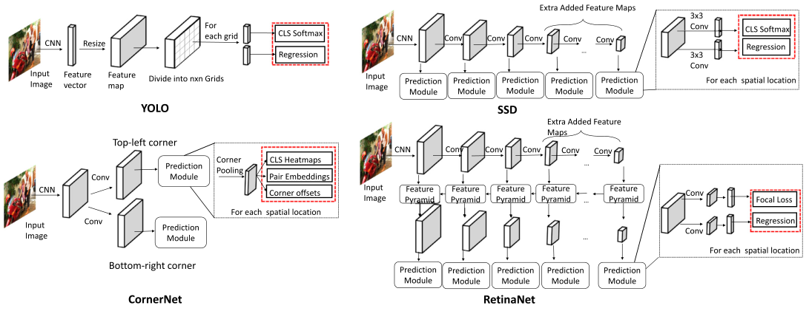

## 1. 核心问题

- 分类问题：即图片（或某个区域）中的图像属于哪个类别
- 定位问题：目标可能出现在图像的任何位置
- 大小问题：目标有各种不同的大小
- 形状问题：目标可能有各种不同的形状

## 2. 算法分类

- two stage：

  - 先进行区域生成，该区域称为region proposal（RP，一个有可能包含物体的预选框）；再通过卷积神经网络进行样本分类
  - 任务流程：特征提取---生成RP---分类/定位回归
  - 常见two stage：R-CNN、SPP-Net、Fast R-CNN、Faster R-CNN、R-FCN

- one stage：

  - 不用RP，直接在网络中提取特征来预测物体的分类和位置
  - 任务流程：特征提取---分类/定位回归
  - 常见one stage：OverFeat、YOLOv1、YOLOv2、YOLOv3、SSD、RetinaNet

## 3. 应用

- 人脸检测：智能门控、智慧超时、人脸支付、实名认证
- 行人检测：智能辅助驾驶、智能监控、区域入侵监测
- 车辆检测：自动驾驶、违章查询
- 遥感监测：大地遥感、农作物监控、军事监测

## 4. 原理

目标检测分为两大系列——RCNN系列和YOLO系列：

- RCNN系列是基于区域检测的代表性算法
- YOLO是基于区域提取的代表性算法
- 还有著名的SSD是基于前两个系列的改进

## 5. 预备知识

### 5.1. 候选区域的产生

很多目标检测技术都会涉及候选框（bounding boxes）的生成，物体候选框获取当前主要使用图像分割与区域生长技术。区域生长(合并)主要由于检测图像中存在的物体具有局部区域相似性(颜色、纹理等)。目标识别与图像分割技术的发展进一步推动有效提取图像中信息。

#### 5.1.1. 滑动窗口法

1. 通过滑窗法流程图可以很清晰理解其主要思路：首先对输入图像进行不同窗口大小的滑窗进行从左往右、从上到下的滑动。每次滑动时候对当前窗口执行分类器(分类器是事先训练好的)。如果当前窗口得到较高的分类概率，则认为检测到了物体。对每个不同窗口大小的滑窗都进行检测后，会得到不同窗口检测到的物体标记，这些窗口大小会存在重复较高的部分，最后采用非极大值抑制(Non-Maximum Suppression, NMS)的方法进行筛选。最终，经过NMS筛选后获得检测到的物体。
2. 滑窗法简单易于理解，但是不同窗口大小进行图像全局搜索导致效率低下，而且设计窗口大小时候还需要考虑物体的长宽比。所以，对于实时性要求较高的分类器，不推荐使用滑窗法。

#### 5.1.2. 选择性搜索

1. 滑窗法类似穷举进行图像子区域搜索，但是一般情况下图像中大部分子区域是没有物体的。学者们自然而然想到只对图像中最有可能包含物体的区域进行搜索以此来提高计算效率。选择搜索（selective search，简称SS）方法是当下最为熟知的图像bounding boxes提取算法，由Koen E.A于2011年提出。
2. 选择搜索算法的主要思想：图像中物体可能存在的区域应该是有某些相似性或者连续性区域的。因此，选择搜索基于上面这一想法采用子区域合并的方法进行提取bounding boxes。首先，对输入图像进行分割算法产生许多小的子区域。其次，根据这些子区域之间相似性(相似性标准主要有颜色、纹理、大小等等)进行区域合并，不断的进行区域迭代合并。每次迭代过程中对这些合并的子区域做bounding boxes(外切矩形)，这些子区域外切矩形就是通常所说的候选框。

- 选择搜索流程

  - step0：生成区域集R
  - step1：计算区域集R里每个相邻区域的相似度$S={s1, s2,…}$
  - step2：找出相似度最高的两个区域，将其合并为新集，添加进R
  - step3：从S中移除所有与step2中有关的子集
  - step4：计算新集与所有子集的相似度
  - step5：跳至step2，直至S为空

- 选择搜索优点

  - 计算效率优于滑窗法
  - 由于采用子区域合并策略，所以可以包含各种大小的疑似物体框
  - 合并区域相似的指标多样性，提高了检测物体的概率

### 5.2. 数据表示

经过标记后的样本数据如下所示：

预测输出可以表示为：
$$
y=\left[\begin{matrix}p_c\\b_x\\b_y\\b_w\\b_h\\C_1\\C_2\\C_3\end{matrix}\right],
y_{true}=\left[\begin{matrix}1\\40\\45\\80\\60\\0\\1\\0\end{matrix}\right],
y_{pred}=\left[\begin{matrix}0.88\\41\\46\\82\\59\\0.01\\0.95\\0.04\end{matrix}\right]
$$

其中，$p_c$为预测结果的置信概率，$b_x, b_y, b_w, b_h$为边框坐标，$C_1, C_2, C_3$为属于某个类别的概率。通过预测结果，实际结果，构建损失函数。损失函数包含了分类、回归两部分组成

### 5.3. 效果评估

使用IoU（Intersection over Union，交并比）来判断模型的好坏。所谓交并比，是指预测边框、实际边框交集和并集的比率，一般约定0.5为一个可以接受的值。

### 5.4. 非极大值抑制

预测结果中，可能多个预测结果间存在重叠部分，需要保留交并比最大的、去掉非最大的预测结果，这就是非极大值抑制（Non-Maximum Suppression，简写作NMS）。如下图所示，对同一个物体预测结果包含三个概率0.8/0.9/0.95，经过非极大值抑制后，仅保留概率最大的预测结果。

# 目标检测模型——RCNN系列

## 1. R-CNN

[参考链接](https://blog.csdn.net/briblue/article/details/82012575)

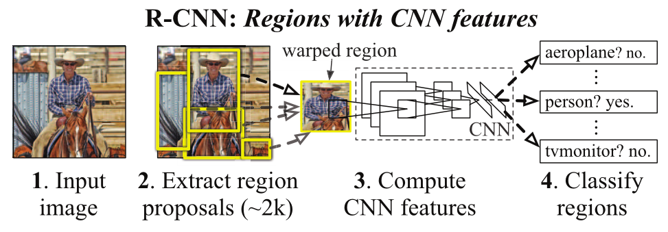

分为三个module：

- 独立类别的候选区域（category-independent region proposals），生成一组对检测器可用的检测坐标。

  - 常见的候选区生成的方法有很多（objectness、selective search、category-independent object proposals、constrained parametric min-cuts (CPMC) 、multi-scale combinatorial grouping），本文用的是选择搜索。产生了2000个候选区域（region proposal）

- 使用卷积神经网络从每个区域从提取固定的特征向量。

  - 本文每个区域提取到的固定长度的特征向量是4096，使用的网络是AlexNet
  - 需要注意的是 Alextnet 的输入图像大小是 $227\times227$，而通过 Selective Search 产生的候选区域大小不一，为了与 Alexnet 兼容，R-CNN 采用了非常暴力的手段，那就是无视候选区域的大小和形状，统一变换到 $227\times227$ 的尺寸。有一个细节，在对 Region 进行变换的时候，首先对这些区域进行膨胀处理，在其 box 周围附加了 p 个像素，也就是人为添加了边框，在这里 p=16
  - 在 ImageNet 上先进行预训练，然后利用成熟的权重参数在 PASCAL VOC 数据集上进行 fine-tune

- SVM线性分类器，对特征进行分类

  - 用SVM对每个特征向量进行评分，然后用非极大值抑制

简单说就是：

- 给定一张输入图片，从图片中提取 2000 个类别独立的候选区域。
- 对于每个区域利用 CNN 抽取一个固定长度的特征向量。
- 再对每个特征向量利用 SVM 进行目标分类。

缺点：

- 重复计算，每个region proposal，都需要经过一个AlexNet特征提取，为所有的RoI（region of interest）提取特征大约花费47秒，占用空间
- selective search方法生成region proposal，对一帧图像，需要花费2秒
- 三个模块（提取、分类、回归）是分别训练的，并且在训练时候，对于存储空间消耗较大

## 2. SPPNet

[参考链接](https://blog.csdn.net/v1_vivian/article/details/73275259)

在此之前，所有的神经网络都是需要输入固定尺寸的图片，比如224*224（ImageNet）、32*32(LenNet)、96*96等。这样对于我们希望检测各种大小的图片的时候，需要经过crop，或者warp等一系列操作，这都在一定程度上导致图片信息的丢失和变形，限制了识别精确度。

为什么要固定输入图片的大小？

卷积层的参数和输入大小无关，它仅仅是一个卷积核在图像上滑动，不管输入图像多大都没关系，只是对不同大小的图片卷积出不同大小的特征图，但是全连接层的参数就和输入图像大小有关，因为它要把输入的所有像素点连接起来，需要指定输入层神经元个数和输出层神经元个数，所以需要规定输入的feature的大小。因此，固定长度的约束仅限于全连接层。作为全连接层，如果输入的x维数不等，那么参数w肯定也会不同，因此，全连接层是必须确定输入，输出个数的。

SPP-Net是如何调整网络结构的？

SPP-Net在最后一个卷积层后，接入了金字塔池化层，使用这种方式，可以让网络输入任意的图片，而且还会生成固定大小的输出。

什么是金字塔池化？

黑色图片代表卷积之后的特征图，接着我们以不同大小的块来提取特征，分别是$4\times4，2\times2，1\times1，$将这三张网格放到下面这张特征图上，就可以得到$16+4+1=21$种不同的块(Spatial bins)，我们从这21个块中，每个块提取出一个特征，这样刚好就是我们要提取的21维特征向量。这种以不同的大小格子的组合方式来池化的过程就是空间金字塔池化（SPP）。比如，要进行空间金字塔最大池化，其实就是从这21个图片块中，分别计算每个块的最大值，从而得到一个输出单元，最终得到一个21维特征的输出。

例如上图，计算出的feature map也是任意大小的，现在经过SPP之后，就可以变成固定大小的输出了，以上图为例，一共可以输出$（16+4+1）\times256$的特征。

金字塔池化的意义是什么？

总结而言，当网络输入的是一张任意大小的图片，这个时候我们可以一直进行卷积、池化，直到网络的倒数几层的时候，也就是我们即将与全连接层连接的时候，就要使用金字塔池化，使得任意大小的特征图都能够转换成固定大小的特征向量，这就是空间金字塔池化的意义（多尺度特征提取出固定大小的特征向量）。

**对于R-CNN，整个过程是：**

- 首先通过选择性搜索，对待检测的图片进行搜索出~2000个候选窗口。 
- 把这2k个候选窗口的图片都缩放到$227\times227$，然后分别输入CNN中，每个proposal提取出一个特征向量，也就是说利用CNN对每个proposal进行提取特征向量。 
- 把上面每个候选窗口的对应特征向量，利用SVM算法进行分类识别。 

可以看出R-CNN的计算量是非常大的，因为2k个候选窗口都要输入到CNN中，分别进行特征提取。

**而对于SPP-Net，整个过程是：**

- 首先通过选择性搜索，对待检测的图片进行搜索出2000个候选窗口。这一步和R-CNN一样。
- 特征提取阶段。这一步就是和R-CNN最大的区别了，这一步骤的具体操作如下：把整张待检测的图片，输入CNN中，进行一次性特征提取，得到feature maps，**然后在feature maps中找到各个候选框的区域，再对各个候选框采用金字塔空间池化**，提取出固定长度的特征向量。而R-CNN输入的是每个候选框，然后在进入CNN，因为SPP-Net只需要一次对整张图片进行特征提取，速度会大大提升。
- 最后一步也是和R-CNN一样，采用SVM算法进行特征向量分类识别。

我们知道，在原图中的proposal，经过多层卷积之后，位置还是相对于原图不变的（如下图所示），那现在需要解决的问题就是，如何能够将原图上的proposal，映射到卷积之后得到的特征图上，因为在此之后我们要对proposal进行金字塔池化。

用一张图来完整的描述SPP-Net：

## 3. Fast R-CNN

[参考链接](https://blog.csdn.net/u014380165/article/details/72851319)

R-CNN存在一些问题：

- 训练分多步。R-CNN的训练先要fine tuning一个预训练的网络，然后针对每个类别都训练一个SVM分类器，最后还要用regressors对bounding-box进行回归，另外region proposal也要单独用selective search的方式获得，步骤比较繁琐。
- 时间和内存消耗比较大。在训练SVM和回归的时候需要用网络训练的特征作为输入，特征保存在磁盘上再读入的时间消耗还是比较大的。
- 测试的时候也比较慢，每张图片的每个region proposal都要做卷积，重复操作太多。

虽然在Fast RCNN之前有提出过SPPnet算法来解决RCNN中重复卷积的问题，但是SPPnet依然存在和RCNN一样的一些缺点比如：

- 训练步骤过多，需要训练SVM分类器，需要额外的回归器，特征也是保存在磁盘上。

因此Fast RCNN相当于全面改进了原有的这两个算法，不仅训练步骤减少了，也不需要额外将特征保存在磁盘上。

基于VGG16的Fast RCNN算法的速度：

- 在训练速度上比RCNN快了将近9倍，比SPPnet快大概3倍
- 测试速度比RCNN快了213倍，比SPPnet快了10倍
- 在VOC2012上的mAP在66%左右。

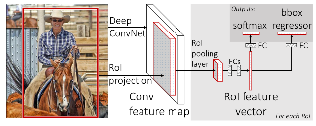

- **网络有两个输入**：图像和对应的region proposal。其中region proposal由selective search方法得到，没有表示在流程图中

- 对每个类别都训练一个回归器，且只有非背景的region proposal才需要进行回归。

- **ROI pooling**：ROI Pooling的作用是对不同大小的region proposal，从最后卷积层输出的feature map提取大小固定的feature map。简单讲可以看做是SPPNet的简化版本，因为全连接层的输入需要尺寸大小一样，所以不能直接将不同大小的region proposal映射到feature map作为输出，需要做尺寸变换。**在文章中，VGG16网络使用$H=W=7$的参数，即将一个$h\times w$的region proposal分割成$H\times W$大小的网格，然后将这个region proposal映射到最后一个卷积层输出的feature map，最后计算每个网格里的最大值作为该网格的输出，所以不管ROI pooling之前的feature map大小是多少，ROI pooling后得到的feature map大小都是$H\times W$。**

- 简单说ROI pooling就是：

  - 把图片上selective search选出的候选框映射到**特征图上对应的位置**，这个映射是根据输入图片缩小的尺寸来的；
  - 将映射后的区域划分为相同大小的sections（sections数量与输出的维度相同）
  - 对每个sections进行max pooling操作； 这样我们就可以从不同大小的方框得到固定大小的相应 的feature maps。

- 两个loss：第一个优化目标是分类，使用softmax（就不用像前面的R-CNN和SPP再用SVM了），第二个优化目标是bbox regression，使用了一个平滑的L1-loss

因此可以看出Fast RCNN主要有3个改进：

- 卷积不再是对每个region proposal进行，而是直接对整张图像，这样减少了很多重复计算。原来RCNN是对每个region proposal分别做卷积，因为一张图像中有2000左右的region proposal，肯定相互之间的重叠率很高，因此产生重复计算。
- 用ROI pooling进行特征的尺寸变换，因为全连接层的输入要求尺寸大小一样，因此不能直接把region proposal作为输入。
- 将regressor放进网络一起训练，每个类别对应一个regressor，同时用softmax代替原来的SVM分类器。

- 在实际训练中，每个mini-batch包含2张图像和128个region proposal（或者叫ROI），也就是每张图像有64个ROI。然后从这些ROI中挑选约25%的ROI，这些ROI和ground truth的IOU值都大于0.5。另外只采用随机水平翻转的方式增加数据集。
- 测试的时候则每张图像大约2000个ROI。

**总结：**

Fast RCNN将RCNN众多步骤整合在一起，不仅大大提高了检测速度，也提高了检测准确率。其中，对整张图像卷积而不是对每个region proposal卷积，ROI Pooling，分类和回归都放在网络一起训练的multi-task loss是算法的三个核心。另外还有SVD分解等是加速的小贡献，数据集的增加时mAP提高的小贡献。

当然Fast RCNN的主要缺点在于region proposal的提取使用selective search，目标检测时间大多消耗在这上面（提region proposal 2~3s，而提特征分类只需0.32s），这也是后续Faster RCNN的改进方向之一。

缺点：

- 依旧采用selective search提取region proposal（耗时2~3秒，特征提取耗时0.32秒）
- 无法满足实时应用，没有真正实现端到端训练测试
- 利用了GPU，但是region proposal方法是在CPU上实现的

## 4. Faster R-CNN

[参考1](https://www.cnblogs.com/dudumiaomiao/p/6560841.html)，[参考2](https://blog.csdn.net/weixin_43198141/article/details/90178512)

主要就是多了一个RPN（region proposal network），就是在卷积提取特征之后，多出一条路来进行候选框的提取。

- 文中用$3\times3$的卷积在特征图上滑动来选取候选框
- 每个点可能的proposals数量定义为k，文中k=9。（3个不同大小，每个不同大小有三种长宽比$（1:2,\  2:1,\  1:1）$）
- 例如，一张$800\times600$的原始图片，经过VGG下采样后(生成特征矩阵)16倍大小，大小变为$50\times38$，每个点设置9个anchor，则总数为：$(800/16)\times(600/16)\times9=17100$
- 然后每个位置选了k个anchors后再进入cls layer和reg layer
- 其中reg layer会有4k个输出，就是x，y，h，w
- 其中cls layer会有2k个输出，就是目标的概率和背景的概率

后面就差不多了。

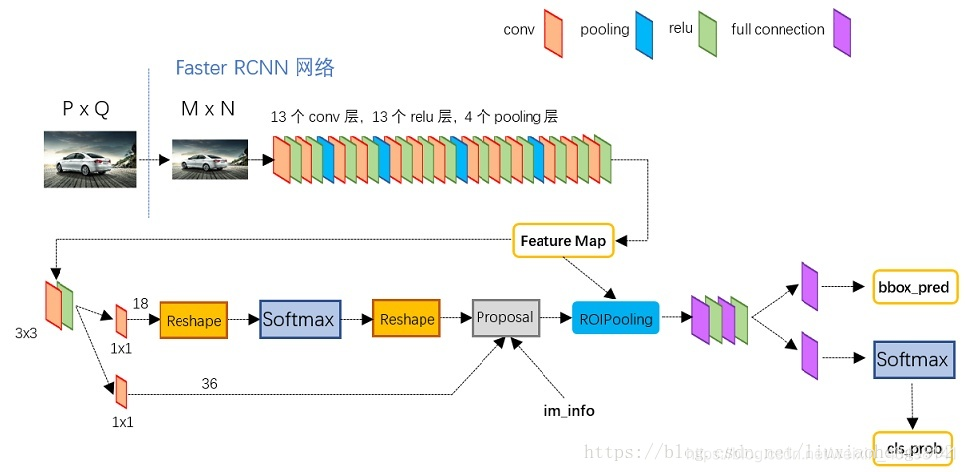

# RCNN系列总结

## 1. R-CNN

- 输入测试图像；
- 利用selective search 算法在图像中从上到下提取2000个左右的Region Proposal；
- 将每个Region Proposal缩放(warp)成$227\times227$的大小并输入到CNN，将CNN的fc7层的输出作为特征；
- 将每个Region Proposal提取的CNN特征输入到SVM进行分类；
- 对于SVM分好类的Region Proposal做边框回归，用Bounding box回归值校正原来的建议窗口，生成预测窗口坐标

缺陷：

- 训练分为多个阶段，步骤繁琐：微调网络+训练SVM+训练边框回归器；
- 训练耗时，占用磁盘空间大；5000张图像产生几百G的特征文件；
- 速度慢：使用GPU，VGG16模型处理一张图像需要47s；
- 测试速度慢：每个候选区域需要运行整个前向CNN计算；
- SVM和回归是事后操作，在SVM和回归过程中CNN特征没有被学习更新

## 2. Fast R-CNN

- 输入测试图像；
- 利用selective search 算法在图像中从上到下提取2000个左右的建议窗口(Region Proposal)；
- 将整张图片输入CNN，进行特征提取；
- 把建议窗口映射到CNN的最后一层卷积feature map上；
- 通过RoI pooling层使每个建议窗口生成固定尺寸的feature map；
- 利用Softmax Loss(探测分类概率) 和Smooth L1 Loss(探测边框回归)对分类概率和边框回归(Bounding box regression)联合训练

相比R-CNN，主要两处不同：

- 最后一层卷积层后加了一个ROI pooling layer；
- 损失函数使用了多任务损失函数(multi-task loss)，将边框回归直接加入到CNN网络中训练

改进：

1. 测试时速度慢：R-CNN把一张图像分解成大量的建议框，每个建议框拉伸形成的图像都会单独通过CNN提取特征。实际上这些建议框之间大量重叠，特征值之间完全可以共享，造成了运算能力的浪费。Fast R-CNN将整张图像归一化后直接送入CNN，在最后的卷积层输出的feature map上，加入建议框信息，使得在此之前的CNN运算得以共享
2. 训练时速度慢：R-CNN在训练时，是在采用SVM分类之前，把通过CNN提取的特征存储在硬盘上，这种方法造成了训练性能低下，因为在硬盘上大量的读写数据会造成训练速度缓慢。Fast R-CNN在训练时，只需要将一张图像送入网络，每张图像一次性地提取CNN特征和建议区域，训练数据在GPU内存里直接进Loss层，这样候选区域的前几层特征不需要再重复计算且不再需要把大量数据存储在硬盘上
3. 训练所需空间大：R-CNN中独立的SVM分类器和回归器需要大量特征作为训练样本，需要大量的硬盘空间，Fast R-CNN把类别判断和位置回归统一用深度网络实现，不再需要额外存储

## 3. Faster R-CNN

- 输入测试图像；
- 将整张图片输入CNN，进行特征提取；
- 用RPN生成建议窗口(proposals)，每张图片生成300个建议窗口；
- 把建议窗口映射到CNN的最后一层卷积feature map上；
- 通过RoI pooling层使每个RoI生成固定尺寸的feature map；
- 利用Softmax Loss(探测分类概率) 和Smooth L1 Loss(探测边框回归)对分类概率和边框回归(Bounding box regression)联合训练

相比Fast R-CNN，主要两处不同：

- 使用RPN(Region Proposal Network)代替原来的Selective Search方法产生建议窗口；
- 产生建议窗口的CNN和目标检测的CNN共享

改进：

（1）如何高效快速产生建议框？

Faster R-CNN创造性地采用卷积网络自行产生建议框，并且和目标检测网络共享卷积网络，使得建议框数目从原有的约2000个减少为300个，且建议框的质量也有本质的提高

# 目标检测模型——YOLO系列

之前的物体检测方法首先需要产生大量可能包含待检测物体的先验框, 然后用分类器判断每个先验框对应的边界框里是否包含待检测物体，以及物体所属类别的概率或者置信度，同时需要后处理修正边界框，最后基于一些准则过滤掉置信度不高和重叠度较高的边界框，进而得到检测结果。这种基于先产生候选区再检测的方法虽然有相对较高的检测准确率，但运行速度较慢。

YOLO创造性的将物体检测任务直接当作回归问题（regression problem）来处理，将候选区和检测两个阶段合二为一。只需一眼就能知道每张图像中有哪些物体以及物体的位置。下图展示了各物体检测系统的流程图。

[参考链接](https://blog.csdn.net/weixin_39561673/article/details/111136989)

## 1. YOLOv1

[参考1](https://blog.csdn.net/shuiyixin/article/details/82533849)，[参考2](https://zhuanlan.zhihu.com/p/70387154)

本文将检测变为一个 regression problem（回归问题），YOLO从输入的图像，仅仅经过一个 neural network，直接得到 bounding boxes 以及每个 bounding box 所属类别的概率。正因为整个的检测过程仅仅有一个网络，所以它可以直接进行end-to-end （端对端：指的是输入原始数据，输出的是最后结果，应用在特征学习融入算法，无需单独处理）的优化。

YOLO之前的物体检测系统使用分类器来完成物体检测任务。为了检测一个物体，这些物体检测系统要在一张测试图的不同位置和不同尺寸的bounding box上使用该物体的分类器去评估是否有该物体。如DPM系统，要使用一个sliding window（滑窗）在整张图像上均匀滑动，用分类器评估是否有物体。

在DPM之后提出的其他方法，如R-CNN方法使用region proposal（区域建议）来生成整张图像中可能包含待检测物体的可能的 bounding boxes，然后用分类器来评估这些boxes，接着通过post-processing来改善bounding boxes，消除重复的检测目标，并基于整个场景中的其他物体重新对boxes进行打分。整个流程执行下来很慢，而且因为这些环节都是分开训练的，检测性能很难进行优化。

YOLO优点：

- Yolo很快，因为用回归的方法，并且不用复杂的框架。
- Yolo会基于整张图片信息进行预测，而其他滑窗式的检测框架，只能基于局部图片信息进行推理。
- Yolo学到的图片特征更为通用。作者尝试了用自然图片数据集进行训练，用艺术画作品进行预测，Yolo的检测效果更佳。

**算法原理：**

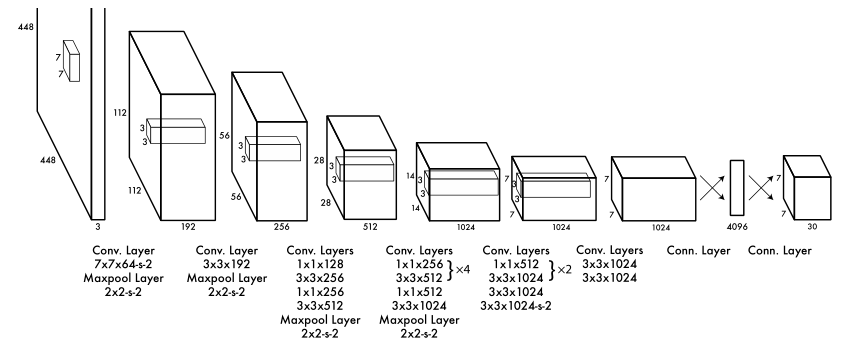

YOLO 检测系统，先将输入图像分成 $S\times S$个 grid（栅格），如果一个物体的中心掉落在一个 grid cell （网格单元）内，那么这个 grid cell （网格单元）就负责检测这个物体。

每一个 grid cell 预测 B 个 bounding boxes，以及这些 bounding boxes 的得分：score。这个 score 反应了模型对于这个 grid cell 中预测是否含有物体，以及是这个物体的可能性是多少。我们把confidence（可信度）正式定义为
$$
Pr(Object)*IOU_{pred}^{truth}
$$
如果这个 cell 中不存在一个 object，则 score 应该为0 ；否则的话，score 则为 predicted box 与 ground truth 之间的 IoU（intersection over union：一种测量在特定数据集中检测相应物体准确度的一个标准）。

换句话说：若bounding box包含物体，则$P(object) = 1$；否则$P(object) = 0$。IOU(intersection over union)为预测bounding box与物体真实区域的交集面积（以像素为单位，用真实区域的像素面积归一化到$[0,1]$区间）。

每个边框由五个预测值组成：$x,y,w,h,confidence$。坐标$(x,y)$代表了 bounding box 的中心与 grid cell 边界的相对值。width、height 则是相对于整幅图像的预测值(边框的宽和高)。confidence 就是 IoU 值。

注意：实际训练过程中，w和h的值使用图像的宽度和高度进行归一化到[0,1]区间内；x，y是bounding box中心位置相对于当前格子位置的偏移值，并且被归一化到[0,1]。

每一个栅格还要预测C个 conditional class probability（条件类别概率）：Pr(Classi|Object)。即在一个栅格包含一个Object的前提下，它属于某个类的概率。我们只为每个栅格预测一组（C个）类概率，而不考虑框B的数量。

注意：

- **conditional class probability信息是针对每个网格的。**
- **confidence信息是针对每个bounding box的。**

在测试阶段，将每个栅格的conditional class probabilities与每个 bounding box的 confidence相乘：
$$
Pr(class_i|Object)*Pr(Object)*IOU_{pred}^{truth}=Pr(class_i)*IOU_{pred}^{truth}
$$

等式左边第一项就是每个网格预测的类别信息，第二三项就是每个bounding box 预测的confidence。这个乘积即encode了预测的box属于某一类的概率，也有该box准确度的消息。

这样既可得到每个bounding box的具体类别的confidence score。这乘积既包含了bounding box中预测的class的 probability信息，也反映了bounding box是否含有Object和bounding box坐标的准确度。

将YOLO用于PASCAL VOC数据集时：论文使用的$S=7$，即将一张图像分为$7×7=49$个栅格每一个栅格预测$B=2$个boxes（每个box有$x,y,w,h,confidence$，5个预测值），同时$C=20$（PASCAL数据集中有20个类别）。因此，最后的prediction是$7×7×30 ${ 即$S\times{S\times(B\times5+C)}$}的Tensor（张量）。

**简单的概括就是**

- 给一个输入图像，首先将图像划分为$7\times7$网格
- 对于每个网格，我们都预测两个边框（包括每个边框是目标的置信度以及每个边框区域在多个类别上的概率）
- 根据上一步可以预测出$7\times7\times2$个目标窗口，然后根据阈值去除可能性比较低的目标窗口，最后NMS去除冗余窗口即可

注意：

- 由于输出层为全连接层，因此在检测时，YOLO训练模型只支持与训练图像相同的输入分辨率。
- 虽然每个格子可以预测B个bounding box，但是最终只选择IOU最高的bounding box作为物体检测输出，即每个格子最多只预测出一个物体。当物体占画面比例较小，如图像中包含畜群或鸟群时，每个格子包含多个物体，但却只能检测出其中一个。这是YOLO方法的一个缺陷。

### 1.1. 张量举例解释

#### 1.1.1. $7×7×30$ {即$S\times{S\times(B\times5+C)}$}

#### 1.1.2. 7×7的含义

$7\times7$是指图片被分成了$7\times7$个格子，如上图所示

在YOLO中，如果一个物体的中心点，落在了某个格子中，那么这个格子将负责预测这个物体。这句话怎么理解，用上图举例，设左下角格子假设坐标为 （1，1），小狗所在的最小包围矩形框的中心，落在了 （2，3） 这个格子中。那么$7\times7$个格子中，（2，3）这个格子负责预测小狗，而那些没有物体中心点落进来的格子，则不负责预测任何物体。这个设定就好比该网络在一开始，就将整个图片上的预测任务进行了分工，一共设定$7\times7$个按照方阵列队的检测人员，每个人员负责检测一个物体，大家的分工界线，就是看被检测物体的中心点落在谁的格子里。当然，是$7\times7$还是$9\times9$，是上图中的参数S，可以自己修改，精度和性能会随之有些变化。

#### 1.1.3. 30的含义

刚才设定了49个检测人员，那么每个人员负责检测的内容，就是这里的30（注意，30是张量最后一维的长度）。30怎么来的见上文

这里有几点需要注意：

- 每个方格（grid） 产生2个预测框，2也是参数，可以调，但是一旦设定为2以后，那么每个方格只产生两个矩形框，最后选定置信度更大的矩形框作为输出，也就是最终每个方格只输出一个预测矩形框。
- 每个方格只能预测一个物体。虽然可以通过调整参数，产生不同的矩形框，但这只能提高矩形框的精度。所以当有很多个物体的中心点落在了同一个格子里，该格子只能预测一个物体。也就是格子数为$7\times7$时，该网络最多预测49个物体。

### 1.2. Loss函数

#### 1.2.1. 预测框的中心点（x，y）

造成的损失是图中的第一行。其中 $1^{obj}_{ij}$，为控制函数，在标签中包含物体的那些格点处，该值为 1 ；若格点不含有物体，该值为 0。也就是只对那些有真实物体所属的格点进行损失计算，若该格点不包含物体，那么预测数值不对损失函数造成影响。（x，y）数值与标签用简单的平方和误差。

#### 1.2.2. 预测框的宽高（w，h）

造成的损失是图中的第二行。$1^{obj}_{ij}$，的含义一样，也是使得只有真实物体所属的格点才会造成损失。这里对 （w，h）在损失函数中的处理分别取了根号，原因在于，如果不取根号，损失函数往往更倾向于调整尺寸比较大的预测框。例如，20个像素点的偏差，对于$800\times600$的预测框几乎没有影响，此时的IOU数值还是很大，但是对于$30\times40$的预测框影响就很大。取根号是为了尽可能的消除大尺寸框与小尺寸框之间的差异。

#### 1.2.3. 预测框的置信度C

造成的损失是图中的第三行与第四行。当该格点不含有物体时，该置信度的标签为0；若含有物体时，该置信度的标签为预测框与真实物体框的IOU数值（IOU计算公式为：两个框交集的面积除以并集的面积）。

#### 1.2.4. 物体类别概率P

对应的类别位置，该标签数值为1，其余位置为0，与分类网络相同。

此时再来看 $λ_{coord}$和$λ_{noobj}$，Yolo面临的物体检测问题，是一个典型的类别数目不均衡的问题。其中49个格点，含有物体的格点往往只有3、4个，其余全是不含有物体的格点。此时如果不采取点措施，那么物体检测的mAP不会太高，因为模型更倾向于不含有物体的格点。 $λ_{coord}$和$λ_{noobj}$的作用，就是让含有物体的格点，在损失函数中的权重更大，让模型更加“重视”含有物体的格点所造成的损失。在论文中， $λ_{coord}$和$λ_{noobj}$ 的取值分别为5与0.5。

## 2. YOLOv2

[参考1](https://blog.csdn.net/wfei101/article/details/78944891)，[参考2](https://zhuanlan.zhihu.com/p/74540100)

YOLOv1使用了end-to-end的回归方法，没有region proposal步骤，直接回归便完成了位置和类别的判定。种种原因使得YOLOv1在目标定位上不那么精准，直接导致YOLO的检测精度并不是很高。

### 2.1. better

1. **batch normalization**：CNN在训练过程中网络每层输入的分布一直在改变, 会使训练过程难度加大，但可以通过normalize每层的输入解决这个问题。新的YOLO网络在每一个卷积层后添加batch normalization，通过这一方法，mAP获得了2%的提升。batch normalization 也有助于规范化模型，可以在舍弃dropout优化后依然不会过拟合。

2. **high resolution classifier**：目前的目标检测方法中，基本上都会使用ImageNet预训练过的模型（classifier）来提取特征，如果用的是AlexNet网络，那么输入图片会被resize到不足$256\times256$，导致分辨率不够高，给检测带来困难。为此，新的YOLO网络把分辨率直接提升到了$448\times448$，这也意味着原有的网络模型必须进行某种调整以适应新的分辨率输入。

   对于YOLOv2，作者首先对分类网络（自定义的darknet）进行了fine tune，分辨率改成$448\times448$，在ImageNet数据集上训练10轮（10 epochs），训练后的网络就可以适应高分辨率的输入了。然后，作者对检测网络部分（也就是后半部分）也进行fine tune。这样通过提升输入的分辨率，mAP获得了4%的提升。

3. **convolutional with anchor boxes**：之前的YOLO利用全连接层的数据完成边框的预测，导致丢失较多的空间信息，定位不准。作者在这一版本中借鉴了Faster R-CNN中的anchor思想，回顾一下，anchor是RNP网络中的一个关键步骤，说的是在卷积特征图上进行滑窗操作，每一个中心可以预测9种不同大小的建议框。

   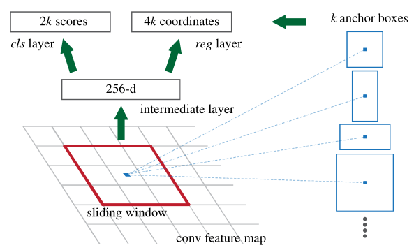

   为了引入anchor boxes来预测bounding boxes，作者在网络中果断去掉了全连接层。剩下的具体怎么操作呢？首先，作者去掉了后面的一个池化层以确保输出的卷积特征图有更高的分辨率。然后，通过缩减网络，让图片输入分辨率为$416\times416$，这一步的目的是为了让后面产生的卷积特征图宽高都为奇数，这样就可以产生一个center cell。作者观察到，大物体通常占据了图像的中间位置， 就可以只用中心的一个cell来预测这些物体的位置，否则就要用中间的4个cell来进行预测，这个技巧可稍稍提升效率。最后，YOLOv2使用了卷积层降采样（factor为32），使得输入卷积网络的$416\times416$图片最终得到$13\times13$的卷积特征图（$416/32=13$）。

   加入了anchor boxes后，可以预料到的结果是召回率上升，准确率下降。我们来计算一下，假设每个cell预测9个建议框，那么总共会预测$13\times13\times9 = 1521$个boxes，而之前的网络仅仅预测$7\times7\times2 = 98$个boxes。具体数据为：没有anchor boxes，模型recall为81%，mAP为69.5%；加入anchor boxes，模型recall为88%，mAP为69.2%。这样看来，准确率只有小幅度的下降，而召回率则提升了7%，说明可以通过进一步的工作来加强准确率，的确有改进空间。

4. **dimension clusters**：这里算是作者的一个创新点。Faster R-CNN中的九个Anchor Box的宽高是事先设定好的比例大小，一共设定三个面积大小的矩形框，每个矩形框有三个宽高比：$1:1，2:1，1:2$，总共九个框。而在v2中，Anchor Box的宽高不经过人为获得，而是将训练数据集中的矩形框全部拿出来，用kmeans聚类得到先验框的宽和高。例如使用5个Anchor Box，那么kmeans聚类的类别中心个数设置为5。加入了聚类操作之后，引入Anchor Box之后，mAP上升。

   需要强调的是，聚类必须要定义聚类点（矩形框 （w，h））之间的距离函数，文中使用如下函数：
   $$
   d(box,centroid)=1-IOU(box,centroid)
   $$
   作者通过改进的K-means对训练集中的boxes进行了聚类，判别标准是平均IOU得分，聚类结果如下图：

   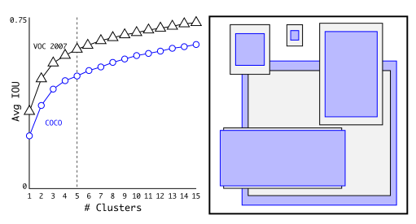

5. **direct location prediction**：略

6. **fine-grained features（细粒度特征）**：上述网络上的修改使YOLO最终在$13\times13$的特征图上进行预测，虽然这足以胜任大尺度物体的检测，但是用上细粒度特征的话，这可能对小尺度的物体检测有帮助。Faser R-CNN和SSD都在不同层次的特征图上产生区域建议（SSD直接就可看得出来这一点），获得了多尺度的适应性。这里使用了一种不同的方法，简单添加了一个转移层（ passthrough layer），这一层要把浅层特征图（分辨率为$26\times26$，是底层分辨率4倍）连接到深层特征图。 

   这个转移层也就是把高低两种分辨率的特征图做了一次连结，连接方式是叠加特征到不同的通道而不是空间位置，类似于Resnet中的identity mappings。这个方法把$26\times26\times12$的特征图连接到了$13\times13\times2048$的特征图，这个特征图与原来的特征相连接。YOLO的检测器使用的就是经过扩张的特征图，它可以拥有更好的细粒度特征，使得模型的性能获得了1%的提升。（这段理解的也不是很好，要看到网络结构图才能清楚）

### 2.2. stronger

如果说整个Yolov2的Better部分，都没有什么大的创新点，这里的分类与检测联合训练，就是Yolov2的一大亮点，因为这一个技巧，Yolov2才成为了Yolo9000。

如之前所说，物体分类，是对整张图片打标签，比如这张图片中含有人，另一张图片中的物体为狗；而物体检测不仅对物体的类别进行预测，同时需要框出物体在图片中的位置。物体分类的数据集，最著名的ImageNet，物体类别有上万个，而物体检测数据集，例如coco，只有80个类别，因为物体检测、分割的打标签成本比物体分类打标签成本要高很多。所以在这里，作者提出了分类、检测训练集联合训练的方案。

联合训练方法思路简单清晰，Yolo v2中物体矩形框生成，不依赖于物理类别预测，二者同时独立进行。当输入是检测数据集时，标注信息有类别、有位置，那么对整个loss函数计算loss，进行反向传播；当输入图片只包含分类信息时，loss函数只计算分类loss，其余部分loss为零。当然，一般的训练策略为，先在检测数据集上训练一定的epoch，待预测框的loss基本稳定后，再联合分类数据集、检测数据集进行交替训练，同时为了分类、检测数据量平衡，作者对coco数据集进行了上采样，使得coco数据总数和ImageNet大致相同。

联合分类与检测数据集，这里不同于将网络的backbone在ImageNet上进行预训练，预训练只能提高卷积核的鲁棒性，而分类检测数据集联合，可以扩充识别物体种类。例如，在检测物体数据集中，有类别人，当网络有了一定的找出人的位置的能力后，可以通过分类数据集，添加细分类别：男人、女人、小孩、成人、运动员等等。这里会遇到一个问题，类别之间并不一定是互斥关系，可能是包含（例如人与男人）、相交（运动员与男人），那么在网络中，该怎么对类别进行预测和训练呢？

具体见参考链接

最后的结果是，Yolo v2可以识别超过9000个物体，作者美其名曰Yolo9000。当然原文中也提到，只有当父节点在检测集中出现过，子节点的预测才会有效。如果子节点是裤子、T恤、裙子等，而父节点衣服在检测集中没有出现过，那么整条预测类别支路几乎都是检测失效的状态。这也合理，给神经网络看的都是狗，让它去预测猫，目前神经网络还没有这么智能。

## 3. YOLOv3

[参考链接](https://zhuanlan.zhihu.com/p/76802514)

### 3.1. 编码

- Yolov3中，只有卷积层，通过调节卷积步长控制输出特征图的尺寸。所以对于输入图片尺寸没有特别限制。流程图中，输入图片以$256\times256$作为样例。
- Yolov3借鉴了金字塔特征图思想，小尺寸特征图用于检测大尺寸物体，而大尺寸特征图检测小尺寸物体。特征图的输出维度为$N\times N\times[3\times(4+1+80)]$，$N\times N$为输出特征图格点数，一共3个Anchor框，每个框有4维预测框数值$t_x，t_y，t_w，t_h，1$维预测框置信度，80维物体类别数。所以第一层特征图的输出维度为 8*8*255。（这个好像跟v1的不一样）
- Yolov3总共输出3个特征图，第一个特征图下采样32倍，第二个特征图下采样16倍，第三个下采样8倍。输入图像经过Darknet-53（无全连接层），再经过Yoloblock生成的特征图被当作两用，第一用为经过$3\times3$卷积层、$1\times1$卷积之后生成特征图一，第二用为经过$1\times1$卷积层加上采样层，与Darnet-53网络的中间层输出结果进行拼接，产生特征图二。同样的循环之后产生特征图三。

Yolo的整个网络，吸取了Resnet、Densenet、FPN的精髓，可以说是融合了目标检测当前业界最有效的全部技巧。

### 3.2. 解码（前向过程）

根据不同的输入尺寸，会得到不同大小的输出特征图，以图二中输入图片$256 × 256 × 3$为例，输出的特征图为$8 × 8 × 255$、$16 × 16 × 255$、$32 × 32 × 255$。在Yolov3的设计中，每个特征图的每个格子中，都配置3个不同的先验框，所以最后三个特征图，这里暂且reshape为$8 × 8 × 3 × 85$、$16 × 16 × 3 × 85$、$32 × 32 × 3 × 85$，这样更容易理解，在代码中也是reshape成这样之后更容易操作。

三张特征图就是整个Yolo输出的检测结果，检测框位置（4维）、检测置信度（1维）、类别（80维）都在其中，加起来正好是85维。特征图最后的维度85，代表的就是这些信息，而特征图其他维度$N × N × 3$，$N × N$代表了检测框的参考位置信息，3是3个不同尺度的先验框。下面详细描述怎么将检测信息解码出来：

#### 3.2.1. 先验框

在Yolov1中，网络直接回归检测框的宽、高，这样效果有限。所以在Yolov2中，改为了回归基于先验框的变化值，这样网络的学习难度降低，整体精度提升不小。Yolov3沿用了Yolov2中关于先验框的技巧，并且使用k-means对数据集中的标签框进行聚类，得到类别中心点的9个框，作为先验框。在COCO数据集中（原始图片全部resize为$416 × 416$），九个框分别是 $(10×13)，(16×30)，(33×23)，(30×61)，(62×45)，(59× 119)， (116 × 90)， (156 × 198)，(373 × 326) ，$顺序为$w × h$。

注：先验框只与检测框的w、h有关，与x、y无关。

#### 3.2.2 检测框解码

有了先验框与输出特征图，就可以解码检测框 x，y，w，h。
$$
b_x=\sigma(t_x)+c_x\\
b_y=\sigma(t_y)+c_y\\
b_w=p_we^{t_w}\\
b_h=p_he^{t_h}
$$
如下图所示， $σ(t_x)$，$σ(t_y)$是基于矩形框中心点左上角格点坐标的偏移量， σ是激活函数，论文中作者使用sigmoid。 $p_w，p_h$是先验框的宽、高，通过上述公式，计算出实际预测框的宽、高 $（b_w，b_h）$。

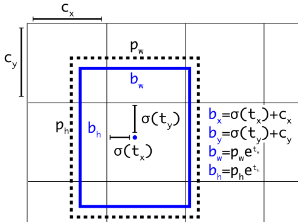

举个具体的例子，假设对于第二个特征图$16 × 16 × 3 × 85$中的第$[5，4，2]$维，上图中的$c_y$为5， $c_x$为4，第二个特征图对应的先验框为$(30×61)，(62×45)，(59× 119)$，prior_box的index为2，那么取最后一个59，119作为先验w、先验h。这样计算之后的$b_x，b_y$还需要乘以特征图二的采样率16，得到真实的检测框x，y。

#### 3.2.3. 检测置信度解码

置信度在输出85维中占固定一位，由sigmoid函数解码即可，解码之后数值区间在$[0，1]$中。

#### 3.2.4. 类别解码

COCO数据集有80个类别，所以类别数在85维输出中占了80维，每一维独立代表一个类别的置信度。使用sigmoid激活函数替代了Yolov2中的softmax，取消了类别之间的互斥，可以使网络更加灵活。

三个特征图一共可以解码出$8\times8 × 3 + 16 × 16 × 3 + 32 × 32 × 3 = 4032$个box以及相应的类别、置信度。这4032个box，在训练和推理时，使用方法不一样：

- 训练时4032个box全部送入打标签函数，进行后一步的标签以及损失函数的计算
- 推理时，选取一个置信度阈值，过滤掉低阈值box，再经过nms（非极大值抑制），就可以输出整个网络的预测结果了

### 3.3. 训练策略与损失函数（反向过程）

#### 3.3.1. 训练策略

预测框一共分为三种情况：正例（positive）、负例（negative）、忽略样例（ignore）。

- 正例：任取一个ground truth，与4032个框全部计算IOU，IOU最大的预测框，即为正例。并且一个预测框，只能分配给一个ground truth。例如第一个ground truth已经匹配了一个正例检测框，那么下一个ground truth，就在余下的4031个检测框中，寻找IOU最大的检测框作为正例。ground truth的先后顺序可忽略。正例产生置信度loss、检测框loss、类别loss。预测框为对应的ground truth box标签（需要反向编码，使用真实的x、y、w、h计算出 $t_x，t_y，t_w，t_h$）​；类别标签对应类别为1，其余为0；置信度标签为1。
- 忽略样例：正例除外，与任意一个ground truth的IOU大于阈值（论文中使用0.5），则为忽略样例。忽略样例不产生任何loss。
- 负例：正例除外（与ground truth计算后IOU最大的检测框，但是IOU小于阈值，仍为正例），与全部ground truth的IOU都小于阈值（0.5），则为负例。负例只有置信度产生loss，置信度标签为0。

#### 3.3.2. 损失函数

特征图1的Yolov3的损失函数抽象表达式如下：

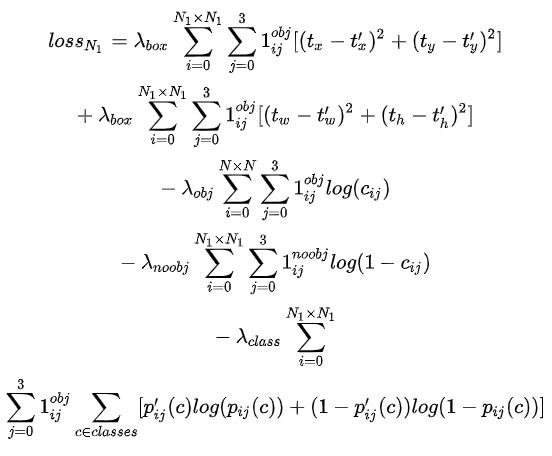

Yolov3 Loss为三个特征图Loss之和：
$$
Loss=loss_{N_1}+loss_{N_2}+loss_{N_3}
$$

- λ为权重常数，控制检测框Loss、obj置信度Loss、noobj置信度Loss之间的比例，通常负例的个数是正例的几十倍以上，可以通过权重超参控制检测效果。

- $1_{ij}^{obj}$若是正例则输出1，否则为0；$1_{ij}^{noobj}$ 若是负例则输出1，否则为0；忽略样例都输出0。

- x、y、w、h使用MSE作为损失函数，也可以使用smooth L1 loss（出自Faster R-CNN）作为损失函数。smooth L1可以使训练更加平滑。置信度、类别标签由于是0，1二分类，所以使用交叉熵作为损失函数。

  

#### 3.3.3. 训练策略解释

1. ground truth为什么不按照中心点分配对应的预测box？

   在Yolov3的训练策略中，不再像Yolov1那样，每个cell负责中心落在该cell中的ground truth。原因是Yolov3一共产生3个特征图，3个特征图上的cell，中心是有重合的。训练时，可能最契合的是特征图1的第3个box，但是推理的时候特征图2的第1个box置信度最高。所以Yolov3的训练，不再按照ground truth中心点，严格分配指定cell，而是根据预测值寻找IOU最大的预测框作为正例。

2. Yolov1中的置信度标签，就是预测框与真实框的IOU，Yolov3为什么是1？

   置信度意味着该预测框是或者不是一个真实物体，是一个二分类，所以标签是1、0更加合理。

3. 为什么有忽略样例？

   忽略样例是Yolov3中的点睛之笔。由于Yolov3使用了多尺度特征图，不同尺度的特征图之间会有重合检测部分。比如有一个真实物体，在训练时被分配到的检测框是特征图1的第三个box，IOU达0.98，此时恰好特征图2的第一个box与该ground truth的IOU达0.95，也检测到了该ground truth，如果此时给其置信度强行打0的标签，网络学习效果会不理想。

## 4. YOLOv5

[参考链接](https://blog.csdn.net/weixin_51917840/article/details/114416273)

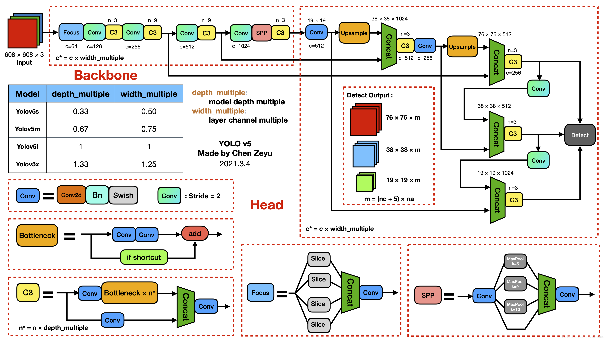
