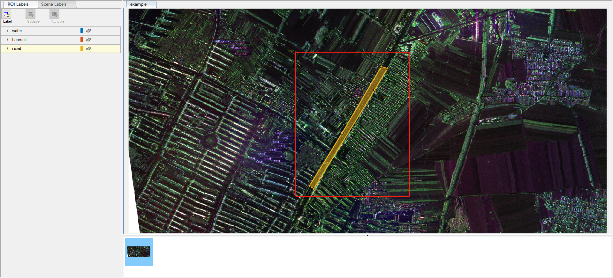

<font color='green' size=4> edited by nrzheng，2022.2.12</font>

# 前言

遥感图像地物分类可以通过深度学习语义分割的方法来解决。这种有监督的方法需要标签当作真值进行训练。标签的生成可以采用MATLAB的标注工具imageLabeler完成。

# 第一次标注的流程

以下是第一次标注的标注流程，就是只有原始图像的情况下。

## imageLabeler

在MATLAB的命令行窗口输入imageLabeler，即可自动打开该工具，或者在MATLAB菜单的“APP”中也可以找到。imageLabeler界面如下所示：


## 加载图片


## 添加标签

根据你的任务划分类别，然后进行添加。语义分割的标签格式要选择Pixel label


添加之后，左边的工具栏就会出现添加的类别及对应的颜色。标注的时候可以选择切换。

## 标注

根据类别定义进行标注。这边标注不能留空白，不然导出的时候会自动补0，而且很不规范。

解决类别间隙的问题，需要重复的去叠加修改标签，标多了就会找到诀窍。但问题是遥感图像一景都很大，就会很卡。所以修起来比较繁琐，不仅细小还卡。

解决这个问题可以将图像切割成小图标注，再拼接，或者下采样等方法。



## 标签导出

这是很关键的一步，标注过程中要记得及时保存，需要保存的有两个地方：

- Save-->Session：保存imageLabelingSession.mat文件
- Export Labels-->To File：保存gTruth.mat文件和PixelLabelData标签文件，里面是一张肉眼看着的黑图，因为像素值都是0，1，2等很小的值
- 最好都保存到同一个文件夹里


保存后的文件夹目录如下：

```
try
  │  example.jpg
  │  
  └─example_label
      │  gTruth.mat
      │  imageLabelingSession.mat
      │  
      └─PixelLabelData
              Label_1.png
```

## 输出文件解释

### imageLabelingSession.mat

这里面语义分割我就注意到了两个字段：

- ImageFilenames：imageLabelingSession.ImageFilenames就是图像的绝对路径
- FileName：这个imageLabelingSession.mat的绝对路径


### gTruth.mat和PixelLabelData文件夹

PixelLabelData文件夹里存放的就是标签图像。是png格式。命名是“Label_1.png”、“Label_2.png”这种。

不过肉眼看起来是黑色的，因为像素值都是0，1，2等的类别，灰度值低，自然就是黑色的。若有需要，可以转成三通道的RGB图像可视化查看。

<font color='red'>gTruth.mat</font>文件可以加载到MATLAB工作区查看，加载进去之后是**groundTruth对象**，有三个字段（如下图）：

- DataSource：gTruth.DataSource.Source中存储的就是原始图像的绝对路径，这是一个$N\times1$的cell数组，每个元素表示一个图像路径
- LabelDefinitions：gTruth.LabelDefinitions存储的是定义的类别的名字及对应的标签值
- LabelData：gTruth.LabelData.PixelLabelData中存储的就是标签图像的绝对路径，同样也是一个$N\times1$的cell数组，刚好和上面的PixelLabelData文件夹里的一一对应
- （这里只用一张图做示例，所以每个字段里面只有一个）


# 第二次标注的流程

第二次标注直接Load--->Session，选择保存了的imageLabelSession.mat文件。


# 更换路径之后的继续标注

有时候，需要换电脑标注，或者移动了路径，或者更改了原来的名字，都会导致加载Session的时候报错。


这是因为Session文件中的FileName存储了自己的位置，现在位置变了，自己都找不到了，所以没办法加载。可以将imageLabelingSession中的FileName改成这个session新的位置，直接将.mat加载到MATLAB的工作区，就可以直接改，图见《输出文件解释---imageLabelingSession.mat》。

改完后再次在imageLabeler中加载Session还是会出现以下错误：


这是因为imageLabelingSession.mat中的ImageFilenames中存储的是原图的位置，这个位置也是原来的位置，没有更新，所以找不到。

那么理论上，更新完这个路径之后，就可以加载出图像，但是问题是，这个量是只读的，没办法修改。（我没找到修改的方法）


所以换电脑或者换路径怎么标注这个问题卡了我很久。。。

后来发现，其实gTruth.mat这个文件才是关键！！！（上面都是废话了）

所以！怎么解决呢？就是把gTruth.mat中的几个路径改了就可以读到标签了。（先把gTruth.mat加载到MATLAB工作区）

## 修改DataSource

gTruth中的DataSource存放的是原图的所有路径。这是第一个要改的，就是告诉imageLabeler，你的这个标签对应的图像是哪一张，代码如下：

```matlab
% 更改gTruth的DataSource，也就是原图路径
currentPathDataSource = "E:\try\try";
newPathDataSource = "E:\try\new";
alternativePaths = {[currentPathDataSource newPathDataSource]};
unresolvedPaths = changeFilePaths(gTruth,alternativePaths);
```


## 修改LabelData

gTruth中的LabelData存放的是标签（就是那个“黑”图）的路径。这也是要改的，就是告诉imageLabeler，你的标签存在哪里，代码如下：

```matlab
% 更改gTruth的DataSource的LabelData，也就是标签路径
currentPathPixels = "E:\matlab_code\play_play\PixelLabelData";
newPathPixels = "E:\try\new\example_label\PixelLabelData";
alternativePaths = {[currentPathPixels newPathPixels]};
unresolvedPaths = changeFilePaths(gTruth,alternativePaths);
```


## 保存修改后的文件

只要修改这两个就可以了，gTruth中的LabelDefinitions存储的是标签的类别啥的，没有路径，所以无需修改。

然后要把工作区的gTruth另存为，替换掉原来的gTruth。


## 加载图像和标签

经过上面的步骤，我们的gTruth就可以用了。

然后步骤还是跟第一次标注一样。先添加图片。但是就不需要添加标签啥的了。

只要将gTruth.mat导入就可以显示：


如果加载的gTruth是原来的没修改的，就会出现以下错误：


所以说，修改完之后，记得要另存为，把原来的替换掉。那如果不替换的话，Import Labels的时候可以选择直接从工作区载入。


这样就可以把别的电脑标注一半的，拿过来继续标注；或者解决自己改了原来的路径之后，打不开的问题。
