 edited by nrzheng，2022.2.12

参考链接：[1](https://blog.csdn.net/zhangxiaohua18/article/details/107705993)，[2](https://blog.csdn.net/yanchuan23/article/details/81083906)，[3](http://www.kosmos-image.com/?m=wap&a=show&catid=73&typeid=4&id=2101)，[4](http://sshy3s.com/newsitem/278323550)，[5](https://pubmed.ncbi.nlm.nih.gov/28862658/)，[6](https://catalyst.earth/catalyst-system-files/help/references/gdb_r/Gaofen-3.html)

# GF3介绍

高分三号卫星是我国首颗分辨率达到1米的雷达卫星，高分三号卫星数据是C频段多极化合成孔径雷达数据（SAR数据），发射于2016年8月，卫星具有多个拍摄模式。

## 1. 分辨率

高分三号卫星提供的SAR图像可以提供1米至500米分辨率、10公里至650公里幅宽的微波遥感数据，用于服务于海洋环境监测与权益维护、灾害监测与评估、水利设施监测与水资源评价管理、气象研究及其他多个领域。

## 2. C波段的好处

根据功能和使命的不同，地球微波遥感探测卫星可以划分为L、 S、C、X等频段，频率依次由低到高。频率越低，穿透力越强，越高则穿透力越差。打个比方，假如用这四种频段看一棵树，X频段只能看到树梢，L、 S频段只能看到树根，C频段则介于两者之间，既能看到地表，也能看到树干。因此，在对海洋、气象、减灾等环境和目标进行探测时，C频段的优势更为突出。

（补充）

在雷达行业，雷达工作频率划分成为若干波段，由低到高的顺序依次是高频（HF），甚高频（VHF）、超高频（UHF，也称作P）、L波段、S波段、C波段、X波段，Ku波段、K波段、Ka波段、U波段、V波段和W波段。

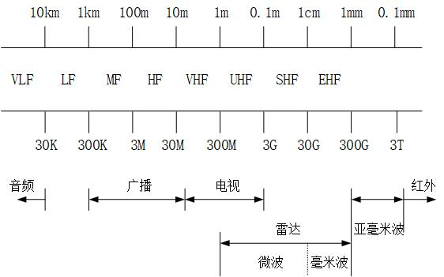

| 标志字符 |                        全程/名称来源                         |  频率范围   | 中心频率 | 中心频率对应波长 |
| :------: | :----------------------------------------------------------: | :---------: | :------: | :--------------: |
|    HF    |                     高频：high frequency                     |   3~30MHz   |    ——    |        ——        |
|   VHF    |                 甚高频：very high frequency                  |  30~300MHz  |    ——    |        ——        |
|  UHF/P   |                 特高频：ultra high frequency                 | 300~1000MHz |    ——    |        ——        |
|          |                                                              |             |          |                  |
|    L     |                       长波：long wave                        |   1~2GHz    |  1.5GHz  |       20cm       |
|    S     |                       短波：short wave                       |   2~4GHz    |   3GHz   |       10cm       |
|    C     |                    S和X的折中：compromise                    |   4~8GHz    |   6GHz   |       5cm        |
|    X     |             用于火控雷达，X来自于瞄准镜的“准心”              |   8~12GHz   |  10GHz   |       3cm        |
|    Ku    |                          kurz-under                          |  12~18GHz   |  15GHz   |       2cm        |
|    K     | kurz，德语“短”（容易被水蒸气吸收，不能再雨雾天气使用，所以有Ka、Ku） |  18~27GHz   |    ——    |        ——        |
|    Ka    |                          kurz-above                          |  27~40GHz   |  35GHz   |       8mm        |
|    U     |                                                              |  40~60GHz   |  50GHz   |       6mm        |
|    V     |                                                              |  60~80GHz   |  70GHz   |       4mm        |
|    W     |                                                              |  80~110GHz  |  100GHz  |       3mm        |

各波段雷达功能：

- 波长短，分辨率高，穿透性差，容易被吸收
- 波长长，分辨率低，穿透性强

- 搜索雷达，工作频段（VHF、UHF、L）
- 搜索跟踪雷达，工作波段（L、S、C）
- 火控、成像雷达，工作波段（C、X、Ku）
- 弹载雷达，工作频段（X、Ku、K、Ka、V、U、W）

## 3. 极化方式

高分三号多极化包含单极化、双极化及全极化

## 4. 成像模式

共包括6种条带成像模式、1种滑块聚束成像模式、3种扫描成像模式、1种波成像模式、2种扩展入射角成像模式。

高分三号卫星是迄今为止成像模式（12种）最多的SAR卫星，它不仅涵盖了传统的条带、扫描成像模式，而且可在聚束、条带、扫描、波浪、全球观测、高低入射角等多种成像模式下实现自由切换，既可以探地，又可以观海，达到“一星多用”的效果。

（我们数据的成像模式是UFS/SL/QPS1）

<table>
    <tr align='center'>
        <th rowspan ='2'>序号</th>
        <th colspan="3">成像模式</th>
        <th rowspan ='2'>入射角 (°)</th>
        <th rowspan ='2'>视数A*E</th>
        <th colspan="3">分辨率 (m)</th>
        <th colspan="2">成像带宽 (km)</th>
        <th rowspan ='2'>极化方式</th>
    </tr>
    <tr align='center'>
        <th colspan="2">中文名</th>
        <th>英文名</th>
        <th>标称</th>
        <th>方位向</th>
        <th>距离向</th>
        <th>标称</th>
        <th>范围</th>
    </tr>
    <tr  align='center'>
        <td>1</td><td colspan="2">滑块聚束</td><td>Spotslight (SL)</td><td>20~50</td><td>1*1</td><td>1</td>
        <td>1.0~1.5</td><td>0.9~2.5</td><td>10*10</td><td>10*10</td><td>可选单极化</td>
    </tr>
    <tr  align='center'>
        <td>2</td><td colspan="2">超精细条带</td><td>Ultra-fine stripmap (UFS)</td><td>20~50</td><td>1*1</td><td>3</td>
        <td>3</td><td>2.5~5</td><td>30</td><td>30</td><td>可选单极化</td>
    </tr>
    <tr  align='center'>
        <td>3</td><td colspan="2">精细条带1</td><td>Fine stripmap (FSI)</td><td>19~50</td><td>1*1</td><td>5</td>
        <td>5</td><td>4~6</td><td>50</td><td>50</td><td>可选双极化</td>
    </tr>
    <tr  align='center'>
        <td>4</td><td colspan="2">精细条带2</td><td>Wide fine stripmap (FSII)</td><td>19~50</td><td>1*2</td><td>10</td>
        <td>10</td><td>8~12</td><td>100</td><td>95~110</td><td>可选双极化</td>
    </tr>
    <tr  align='center'>
        <td>5</td><td colspan="2">标准条带</td><td>Standard stripmap (SS)</td><td>17~50</td><td>3*2</td><td>25</td>
        <td>25</td><td>15~30</td><td>130</td><td>95~150</td><td>可选双极化</td>
    </tr>
    <tr  align='center'>
        <td>6</td><td colspan="2">窄幅扫描</td><td>Narrow ScanSAR (NSC)</td><td>17~50</td><td>1*6</td><td>50</td>
        <td>50~60</td><td>30~60</td><td>300</td><td>300</td><td>可选双极化</td>
	</tr>
	<tr  align='center'>
        <td>7</td><td colspan="2">宽幅扫描</td><td>Wide ScanSAR (WSC)</td><td>17~50</td><td>1*8</td><td>100</td>
        <td>100</td><td>50~110</td><td>500</td><td>500</td><td>可选双极化</td>
	</tr>
	<tr  align='center'>
        <td>8</td><td colspan="2">全球观测模式</td><td>Global observation (GLO)</td><td>17~53</td><td>2* (2~4)</td><td>500</td>
        <td>500</td><td>350~700</td><td>650</td><td>650</td><td>可选双极化</td>
	</tr>
    <tr  align='center'>
        <td>9</td><td colspan="2">全极化条带1</td><td>Quad-pol stripmap (QPSI)</td><td>20~41</td><td>1*1</td><td>8</td>
        <td>8</td><td>6~9</td><td>30</td><td>20~35</td><td>全极化</td>
    </tr>
    <tr  align='center'>
        <td>10</td><td colspan="2">全极化条带2</td><td>Wide quad-pol stripmap (QPSII)</td><td>20~38</td><td>3*2</td><td>25</td>
        <td>25</td><td>15~30</td><td>40</td><td>35~50</td><td>全极化</td>
    </tr>
    <tr  align='center'>
        <td>11</td><td colspan="2">波成像模式</td><td>Wave (WAV)</td><td>20~41</td><td>1*2</td><td>10</td>
        <td>10</td><td>8~12</td><td>5*5</td><td>5*5</td><td>全极化</td>
    </tr>
    <tr  align='center'>
        <td rowspan ='2'>12</td>
        <td rowspan ='2'>扩展入射角</td>
        <td>低入射角</td>
        <td rowspan ='2'>Extended incidence angle (EXT)</td>
        <td>10~20</td>
        <td rowspan ='2'>3*2</td>
        <td rowspan ='2'>25</td>
        <td rowspan ='2'>25</td>
        <td>15~30</td>
        <td>130</td>
        <td>120~150</td>
        <td>可选双极化</td>
    </tr>
    <tr  align='center'>
        <td>高入射角</td>
        <td>50~60</td>
        <td>20~30</td>
        <td>80</td>
        <td>70~90</td>
        <td>可选双极化</td>
    </tr>
</table>

## 5. 产品分级

（不确定，我们的数据是L1A级）

<table>
    <tr align='center'>
        <th>产品级别</th>
        <th>产品形式</th>
        <th>定义</th>
    </tr>
    <tr  align='center'>
        <td>L1A</td>
		<td>复数据产品（SLC）</td>
        <td>根据卫星参数，进行成像处理、相对辐射校正后获得的斜距复数据产品，提供斜地转换系数；复数据产品保留幅度、相位、极化信息。</td>
    </tr>
    <tr  align='center'>
        <td rowspan ='2'>L1B</td>
		<td>单视图像产品（SLP）</td>
        <td>根据卫星参数，进行成像处理、相对辐射校正的图像数据斜距产品。</td>
    </tr>
    <tr  align='center'>
		<td>多视图像产品（MLP）</td>
        <td>根据卫星参数，进行成像处理、多视处理、相对辐射校正、拼接后获得的图像数据产品。</td>
    </tr>
    <tr  align='center'>
        <td>L2</td>
		<td>系统几何校正产品（SGC）</td>
        <td>根据卫星下传的姿轨数据，进行几何定位、地图投影、重采样后获得的系统级几何校正产品。</td>
    </tr>
</table>

## 6. 单幅产品组成

<table>
    <tr align='center'>
        <th>序号</th>
        <th>名称</th>
        <th>文件格式</th>
        <th>文件命名</th>
        <th>简单介绍</th>
        <th>说明</th>
    </tr>
    <tr  align='center'>
        <td>1</td>
		<td>SAR1级影像数据</td>
        <td>Tiff</td>
        <td>sar.tif</td>
        <td>位深度16，用gdal读没有地理信息</td>
        <td rowspan ='6'>影像数据、RPC参数文件、影像元信息文件、浏览图、和拇指图以景号为唯一标识。详细介绍见下面的“各个文件介绍”</td>
    </tr>
    <tr  align='center'>
        <td>2</td>
		<td>RPC参数文件</td>
        <td>.RPB/.RPC</td>
        <td>sar.rpc</td>
        <td>保存的坐标信息，应该就是用来对图像进行地理编码的</td>
    </tr>
    <tr  align='center'>
        <td>3</td>
		<td>影像元信息文件</td>
        <td>XML</td>
        <td>sar.meta.xml</td>
        <td>存放平台、传感器、GPS、影像、采集过程等信息</td>
    </tr>
    <tr  align='center'>
        <td>4</td>
		<td>入射角文件</td>
        <td>XML</td>
        <td>sar.incidence.xml</td>
        <td>存放拍摄时的入射角</td>
    </tr>
    <tr  align='center'>
        <td>5</td>
		<td>浏览图文件</td>
        <td>JPEG</td>
        <td>sar.jpg</td>
        <td></td>
    </tr>
    <tr  align='center'>
        <td>6</td>
		<td>入射角文件</td>
        <td>JPEG</td>
        <td>sar.shumb.jpg</td>
        <td></td>
    </tr>
</table>

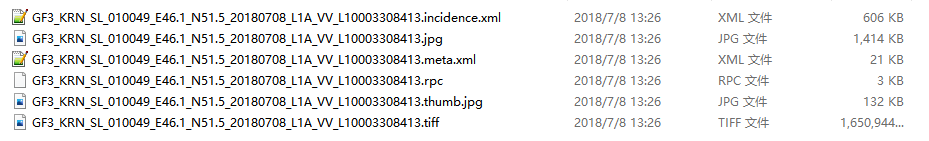

各个文件介绍：

- rpc文件：用于几何校正的RPC模型。简单来说，RPC模型就是有理函数纠正函数，是将地面点大地坐标与其对应的像点坐标用比值多项式关联起来，这就像数字摄影测量学上在外场用单反相机拍张照片，并求出其内外方位元素、已知对应像点坐标的大地坐标值（一般三对以上）将相片的所有像点坐标转换为大地坐标的求解过程。举个简单例子，用ENVI打开无法支持对应影像RPC文件的数据（比如GF-2）就会显示无参考坐标系统，即没有对应的坐标信息，软件需要自动链接RPC文件才得以显示影像的坐标信息；或者进行RPC校正后的影像就带有坐标信息了，之后影像需要根据问题本身、精度要求、用途等考虑是否需要进行GCPs控制点校正以及是否需要生产数字正射影像产品（DOM）。

## 7. GF3数据应用

<table>
    <tr align='center'>
        <th>行业</th>
        <th>应用领域</th>
        <th>监测内容</th>
    </tr>
    <tr align='center'>
        <td rowspan ='11'>海洋</td>
        <td rowspan ='5'>海岛海岸带动态监测</td>
        <td>海岸线变迁监测</td>
    </tr>
    <tr align='center'>
        <td>海岸带滨海湿地监测</td>
    </tr>
    <tr align='center'>
        <td>海岛监测</td>
    </tr>
    <tr align='center'>
        <td>围填海监测</td>
    </tr>
    <tr align='center'>
        <td>浮筏养殖区监测</td>
    </tr>
    <tr align='center'>
        <td rowspan ='3'>海洋环境灾害监测</td>
        <td>海面风场</td>
    </tr>
    <tr align='center'>
        <td>海浪</td>
    </tr>
    <tr align='center'>
        <td>北极海冰分布</td>
    </tr>
    <tr align='center'>
        <td rowspan ='3'>海洋权益维护信息服务</td>
        <td>船舶态势监测</td>
    </tr>
    <tr align='center'>
        <td>船舶识别</td>
    </tr>
    <tr align='center'>
        <td>海上油气平台监测</td>
    </tr>
    <tr align='center'>
        <td rowspan ='3'>减灾</td>
        <td rowspan ='3'>专题应用</td>
        <td>水体提取</td>
    </tr>
    <tr align='center'>
        <td>建筑物群倒塌信息提取</td>
    </tr>
    <tr align='center'>
        <td>道路损毁提取</td>
    </tr>
    <tr align='center'>
        <td rowspan ='5'>水利</td>
        <td rowspan ='5'>专题应用</td>
        <td>地表水体监测</td>
    </tr>
    <tr align='center'>
        <td>地表土壤含水量监测</td>
    </tr>
    <tr align='center'>
        <td>洪涝灾害监测</td>
    </tr>
    <tr align='center'>
        <td>干旱灾害监测</td>
    </tr>
    <tr align='center'>
        <td>水利工程监测</td>
    </tr>
    <tr align='center'>
        <td>气象</td>
        <td></td>
        <td>降水量监测</td>
    </tr>
</table>

# GF3数据使用——PIE地理编码

[PIE官网](https://www.piesat.cn/product/PIE-SAR/index.html)（软件下载，注册码都有）（下载的里面有用户手册，还是好用的）

## 1. 最原始数据展示

原始的sar.tiff（展示的是HH极化）

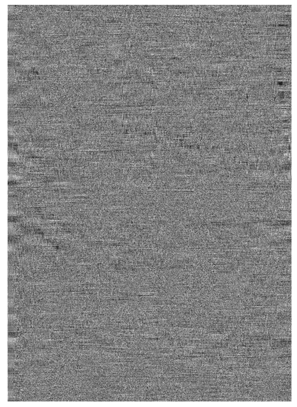

- 位深度为16（window显示）
- matlab读出来是（w, h, 2）的 int16的图像，无法show，单独一个通道show出来没东西。
- python不能用PIL读出来。
- python能用gdal读出来，但是 没有地理信息，可以show单独一个通道
- 二者读出来数值一样，都是有正有负有零的矩阵

## 2. 数据导入

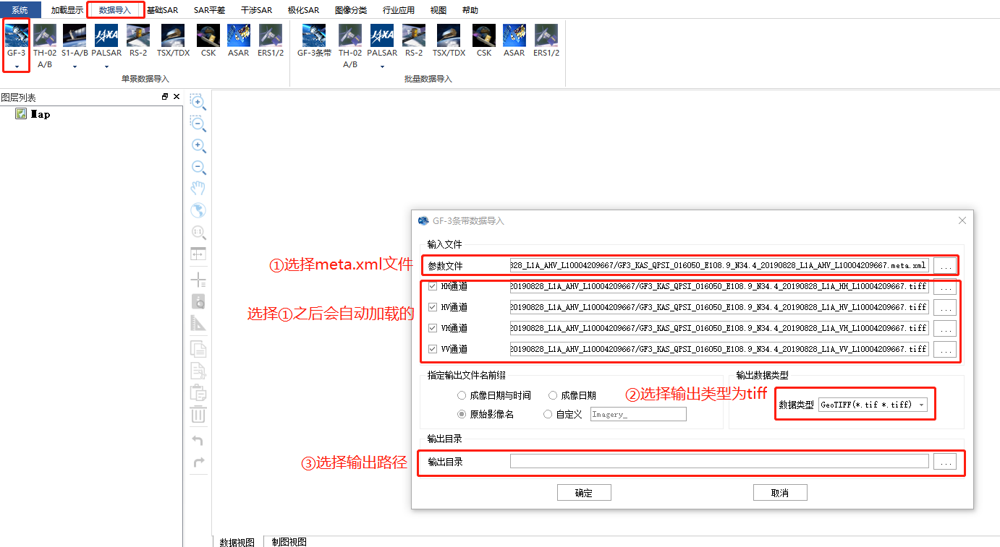

导入成功：

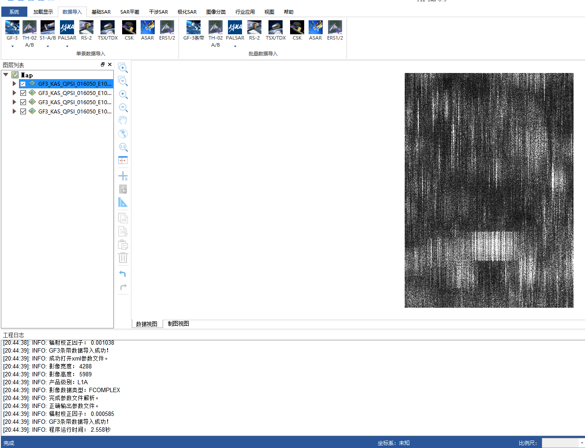

这个时候输出路径底下的文件就会有：

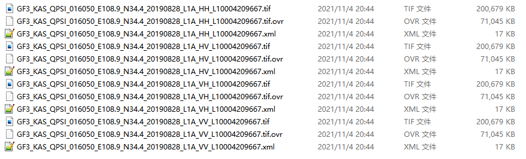

- 用matlab读不出来
- 用python的PIL读不出来
- 只能用gdal读出来，但是 没有地理信息，没法show，因为是复数
- 是（h, w）的数据，数据类型是complex64

## 3. 复数数据转换

选择转换的数据，选上一步的输出

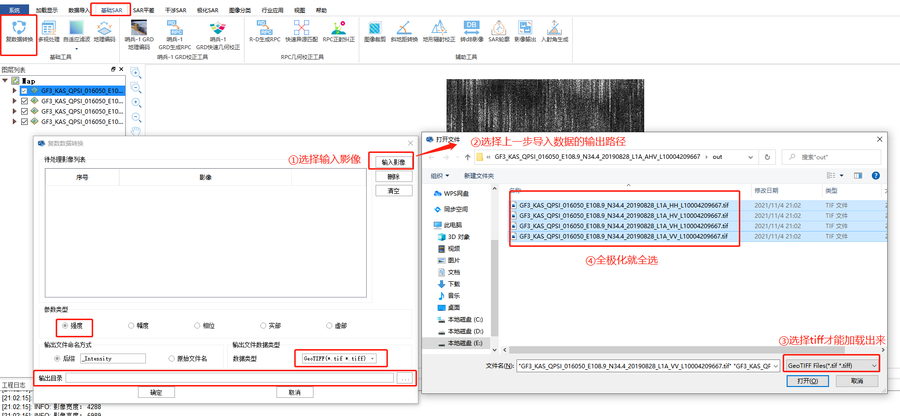

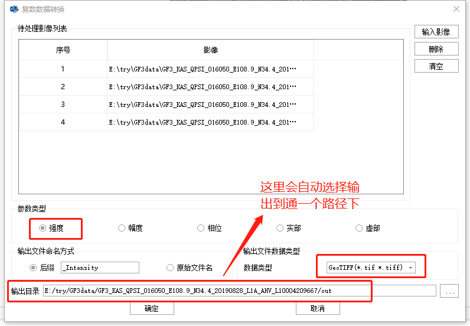

然后就会自己加载进来了，这时候：

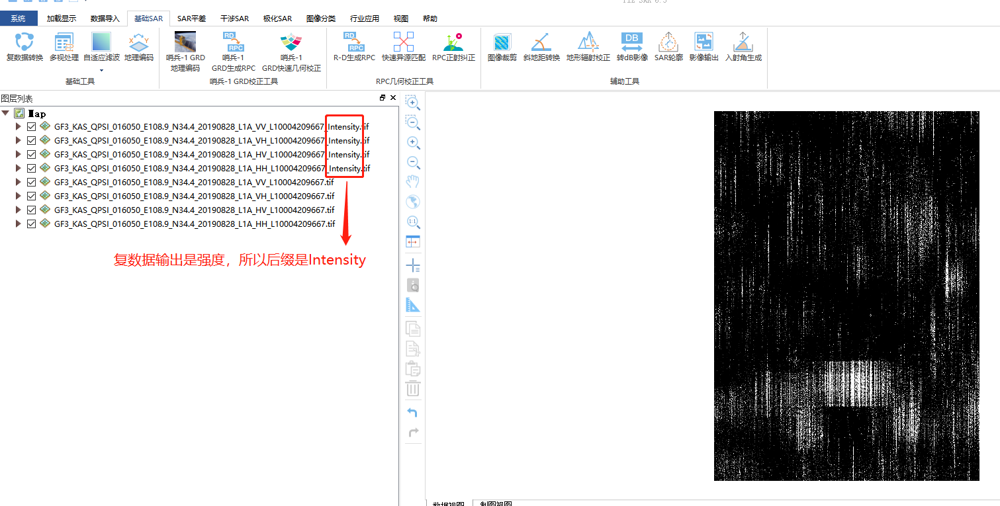

输出文件夹变成：

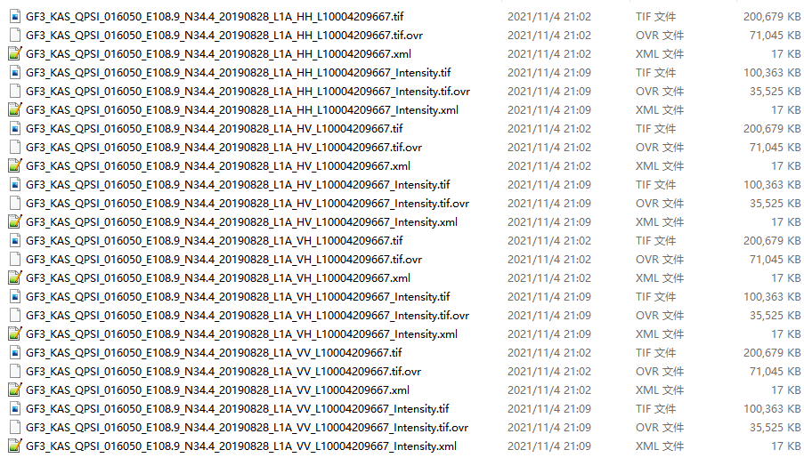

- matlab读完是（h, w）的 single数据（数值都很小）
- python用PIL可以读
- python用gdal可以读， 没有地理信息。读出来是跟matlab一样的，python的show出来很黑，因为数值小
- matlab的show如下跟window的有些许不一样，因为是single，各自的处理不一样：

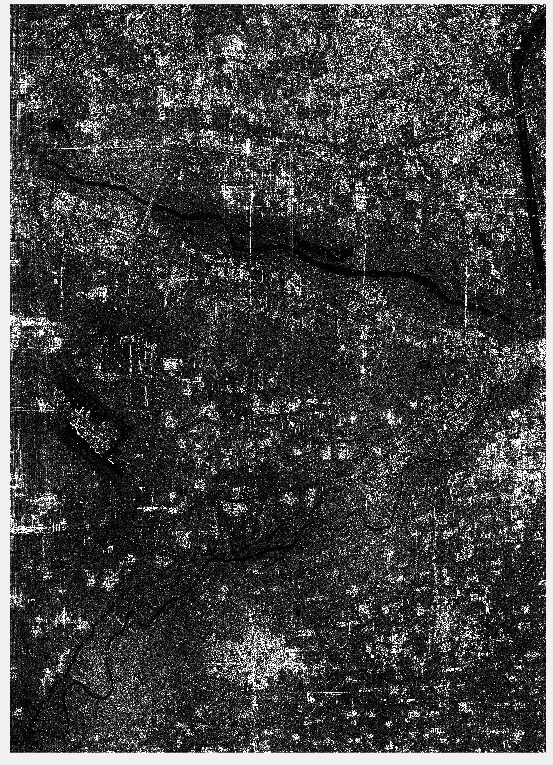

## 4. 地理编码

选择上一步输出的复数据影像，全极化就四张都选

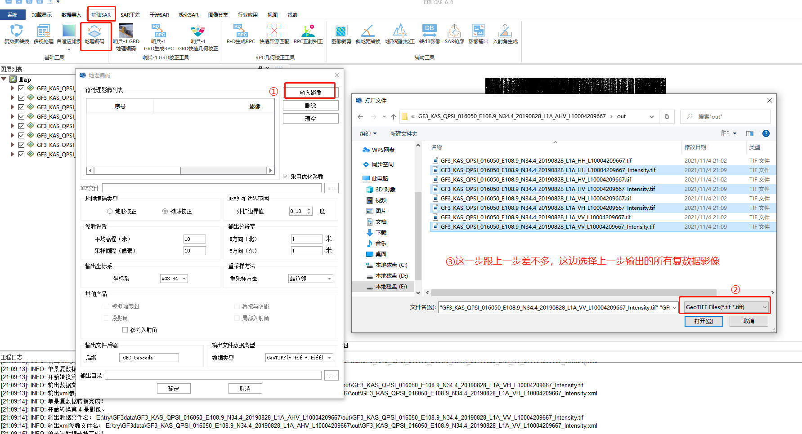

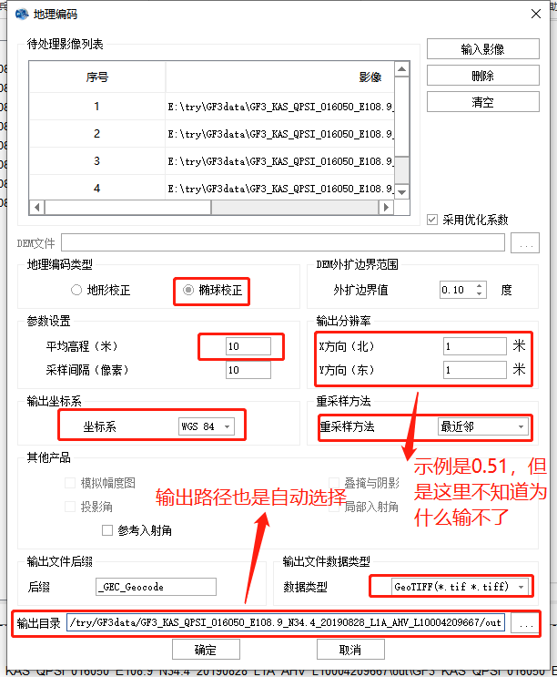

地理编码结束后如下：

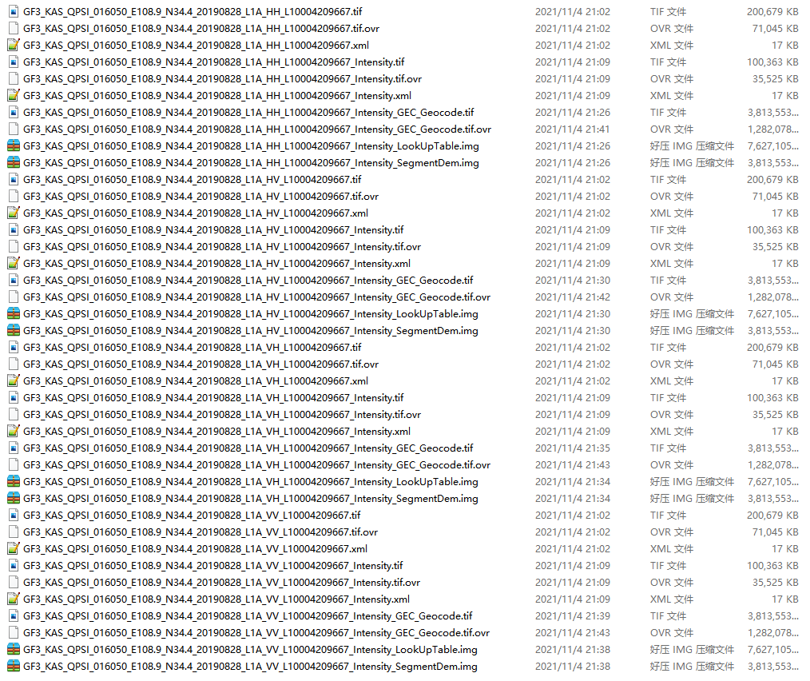

- 地理编码之后图片变大了？？h和w都变大了好多
- matlab读出来是（h\*, w\*）single 数据，show出来如下，数值很小
- python的PIL和gdal都可以读， 有地理信息

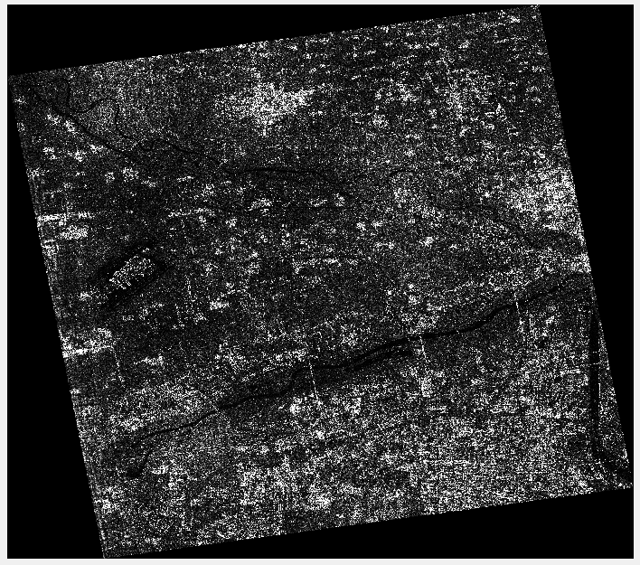

# 对应电子地图下载

使用bigemap
